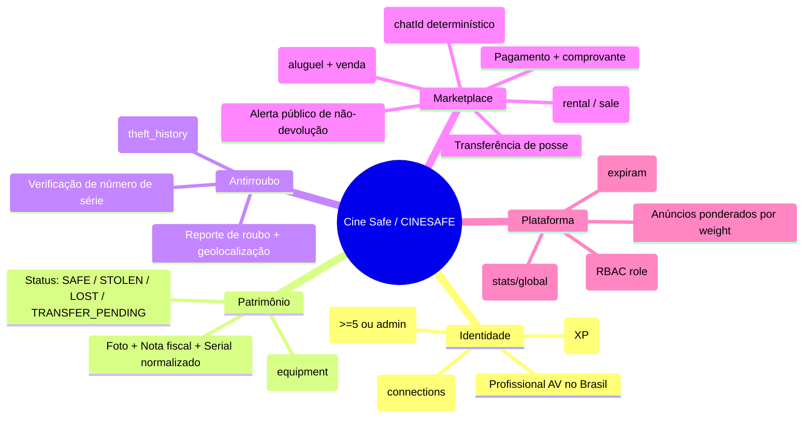
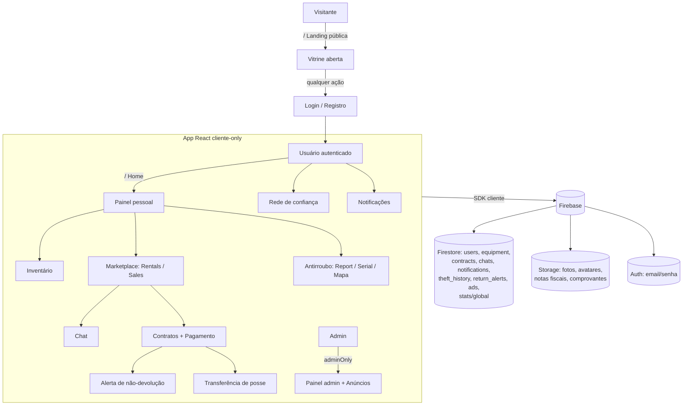

# Visão Geral do CINESAFE

> Plataforma web/PWA em pt-BR para profissionais do audiovisual no Brasil protegerem, alugarem e venderem equipamentos com verificação antirroubo, contratos e rede de confiança.

Este documento é o ponto de entrada da documentação técnica. Ele descreve o produto, as personas, o catálogo completo de funcionalidades, o glossário de domínio e um mapa mental do sistema. Cada afirmação aqui está ancorada no código-fonte (ver [Fontes no código](#fontes-no-código)).

---

## 1. Visão de produto

O **Cine Safe** (identificador interno `CINESAFE`, projeto Firebase `cine-guard`) é uma plataforma para profissionais do audiovisual gerenciarem o próprio patrimônio de equipamentos e transacioná-lo com segurança. O produto resolve três dores concretas do mercado brasileiro de câmeras, lentes, drones, áudio e iluminação:

1. **Roubo e perda de equipamento caro.** O usuário cadastra cada item com foto, nota fiscal e número de série; ao ser roubado, reporta com geolocalização e alimenta um mapa público de ocorrências. Antes de comprar um usado, qualquer pessoa pode **verificar o número de série** para checar se o item foi reportado como roubado/perdido.
2. **Falta de um canal confiável para aluguel e venda entre pares.** Um marketplace interno (a "Vitrine") conecta donos verificados a locatários e compradores sem intermediário, com chat, contratos e comprovantes de pagamento dentro do próprio app.
3. **Ausência de confiança verificável entre desconhecidos.** Uma rede de confiança, reputação calculada, transferência formal de posse e alertas públicos de não-devolução dão lastro reputacional às negociações.

A página inicial é **aberta a visitantes** (`pages/Landing.tsx`): a Vitrine e os destaques ficam visíveis publicamente como a fachada de uma loja, mas **toda ação real** (ver detalhes, demonstrar interesse, anunciar, verificar serial, conversar) exige login/cadastro. Usuários autenticados veem, na mesma rota `/`, um painel pessoal (`pages/Home.tsx`) com reputação, saúde do inventário, progresso de indicações e o "Impacto global" agregado da plataforma.

Detalhes de arquitetura em [`02-architecture.md`](./02-architecture.md); design visual em [`../DESIGN_SYSTEM.md`](../DESIGN_SYSTEM.md).

### Natureza técnica em uma frase

Aplicação **cliente-only** (sem backend próprio nem Cloud Functions): React 18 + TypeScript + Vite consumindo diretamente o Firebase (Auth, Firestore, Storage). Regras de negócio e limites de plano são aplicados **no cliente**; as Firestore Rules fazem defesa por-campo. Ver [`04-security.md`](./04-security.md) e [`../FIREBASE_RULES.md`](../FIREBASE_RULES.md).

---

## 2. Personas

| Persona | Quem é | O que faz na plataforma | Páginas/áreas principais |
|---|---|---|---|
| **Dono de equipamento (profissional AV)** | Fotógrafo, cinegrafista, operador de drone que possui equipamento e quer protegê-lo e rentabilizá-lo. | Monta inventário, reporta roubo, anuncia itens para aluguel/venda, propõe contratos, aciona alerta de não-devolução, constrói reputação. | `/inventory`, `/report-theft`, `/contracts`, `/network` |
| **Locatário / Comprador** | Profissional que precisa alugar ou comprar equipamento, ou verificar um usado antes de fechar. | Navega a Vitrine, verifica número de série, demonstra interesse, conversa, aceita contratos, envia comprovante de pagamento, recebe posse na transferência. | `/rentals`, `/sales`, `/check-serial`, `/chat`, `/contracts` |
| **Admin** | Operador da plataforma com `role: 'admin'`. | Gerencia usuários (bloquear, promover/rebaixar, excluir), administra anúncios/banners, acompanha métricas e histórico de transações. Premium implícito e +500 de reputação. | `/admin` (`adminOnly`) |

As personas não são exclusivas: um mesmo usuário costuma ser dono **e** locatário/comprador. O papel `admin` é um campo RBAC em `users` (`types.ts:81`), verificado na rota protegida `/admin` em `App.tsx:143`.

---

## 3. Catálogo de funcionalidades

Uma linha por funcionalidade, com o ponto de entrada no código e o link para a documentação detalhada.

| Funcionalidade | O que faz | Rota / entrada | Doc detalhada |
|---|---|---|---|
| **Inventário** | Cadastro de equipamentos com foto, nota fiscal, valor, número de série normalizado e status (`SAFE`/`STOLEN`/`LOST`/`TRANSFER_PENDING`). Limite gratuito de 5 itens. | `/inventory`, `services/equipmentService.ts` | [`features/inventory.md`](./features/inventory.md) |
| **Marketplace (Vitrine)** | Anúncio e busca de itens para aluguel (preço/dia) e venda (preço), com filtros por categoria/UF/cidade e paginação. | `/rentals`, `/sales`, Landing | [`features/marketplace.md`](./features/marketplace.md) |
| **Reporte de roubo + Mapa de segurança** | Marca item como roubado com geolocalização e endereço (geocódigo reverso Nominatim); alimenta o mapa comunitário. | `/report-theft`, `/safety` | [`features/theft-and-safety.md`](./features/theft-and-safety.md) |
| **Verificação de número de série** | Consulta antirroubo por serial (normalizado, com fallback para legado) antes de comprar usado. Limite gratuito de 5/mês. | `/check-serial`, `services/equipmentService.ts` | [`features/theft-and-safety.md`](./features/theft-and-safety.md) |
| **Contratos e pagamentos** | Ciclo `rental`/`sale` (`proposed → active/completed/declined/cancelled`) com comprovante de pagamento e fluxo de atraso. | `/contracts`, `services/contractService.ts` | [`features/contracts-and-payments.md`](./features/contracts-and-payments.md) |
| **Rede de confiança e transferência de posse** | Conexões mútuas (atômicas) entre usuários e transferência formal de posse de equipamento. | `/network`, `services/userService.ts` | [`features/network-and-transfers.md`](./features/network-and-transfers.md) |
| **Chat interno** | Conversa privada entre dois usuários com `chatId` determinístico; toda negociação fica dentro do app. | `/chat`, `services/chatService.ts` | [`features/chat.md`](./features/chat.md) |
| **Notificações** | Avisos privados ao destinatário (interesse, conexão, transferência, atraso) com auto-exclusão por `expiresAt`. | `/notifications`, `services/notificationService.ts` | [`features/notifications.md`](./features/notifications.md) |
| **Reputação e rankings** | Pontuação calculada no cliente (perfil, itens, conexões, checagens) e ranking da comunidade. | `/rankings`, `calculateReputation` em `services/userService.ts` | [`features/reputation-and-rankings.md`](./features/reputation-and-rankings.md) |
| **Indicações (referral) e freemium** | Código de indicação; Premium = ≥ 5 indicações ou admin. Desbloqueia uso ilimitado. | Home + `ReferralModal`, `services/userService.ts` | [`features/referral-and-freemium.md`](./features/referral-and-freemium.md) |
| **Anúncios / banners** | Banners de marketing com seleção aleatória ponderada por `weight` e contagem de impressões/cliques. | `AdBanner`, `services/adService.ts` | [`features/advertising.md`](./features/advertising.md) |
| **Painel administrativo** | Gestão de usuários, anúncios e métricas; histórico de transações com busca por nome/email. | `/admin`, `pages/AdminDashboard.tsx` | [`features/admin.md`](./features/admin.md) |
| **Alerta público de não-devolução** | Quando um aluguel não é devolvido, o dono escala um alerta público "grounded" (validado contra o contrato real). | `services/contractService.ts` → coleção `return_alerts` | [`features/contracts-and-payments.md`](./features/contracts-and-payments.md) |
| **Impacto global** | Contadores agregados da plataforma (equipamentos, transações, valor movimentado, recuperados). | Home, `getGlobalDetailedStats` / `stats/global` | [`03-data-model.md`](./03-data-model.md) |

Referência de código por camada: [`reference/services.md`](./reference/services.md), [`reference/hooks.md`](./reference/hooks.md), [`reference/components.md`](./reference/components.md), [`reference/pages.md`](./reference/pages.md), [`reference/utils.md`](./reference/utils.md), [`reference/configuration.md`](./reference/configuration.md).

---

## 4. Glossário de domínio

| Termo | Definição no contexto do CINESAFE | Ancoragem no código |
|---|---|---|
| **Equipamento** | Item de inventário do usuário (câmera, lente, áudio, iluminação, drone, acessório). Documento da coleção `equipment` com dono, valor, imagem e status. | `interface Equipment`, `types.ts:27`; `EquipmentCategory`, `types.ts:13` |
| **Serial (número de série)** | Identificador do item usado na verificação antirroubo. **Normalizado** com `trim().toUpperCase()` na gravação; a checagem tenta o valor normalizado e faz fallback para o cru (docs legados). | `services/equipmentService.ts:27,44,85-88` |
| **Status do equipamento** | `SAFE` (em posse/normal), `STOLEN` (roubado), `LOST` (perdido), `TRANSFER_PENDING` (venda proposta, aguardando aceite do comprador). | `enum EquipmentStatus`, `types.ts:6` |
| **Marketplace / Vitrine** | Catálogo público de itens com `isForRent` e/ou `isForSale`. O mesmo item pode estar para aluguel **e** venda (duas etiquetas). | `pages/Landing.tsx:188-205`; `types.ts:39,43` |
| **`ownerProfile` (denormalização)** | Cópia de `{name, avatarUrl, location}` do dono gravada no próprio item, para exibir a Vitrine sem ler o perfil. **Telefone nunca é denormalizado** (a Vitrine é pública). | `types.ts:54`; `services/equipmentService.ts:21-28` |
| **Contrato** | Acordo formal de `rental` (aluguel) ou `sale` (venda) entre `owner` e `counterparty`. Status: `proposed → active → completed`, ou `declined`/`cancelled`. | `interface Contract`, `types.ts:146`; `services/contractService.ts` |
| **Transferência de posse** | Fluxo em que a posse do equipamento muda de dono. Na **venda**: dono propõe → item vira `TRANSFER_PENDING` → comprador aceita → posse transferida (com atualização do `ownerProfile` denormalizado). Notificação `ITEM_TRANSFER`. | `services/contractService.ts:23-57`; `services/equipmentService.ts:244` |
| **Rede de confiança** | Conjunto de conexões mútuas entre usuários (`connections[]`). Adicionar/remover é **atômico** (batch nos dois lados) para evitar conexão unilateral. | `types.ts:88`; `addConnection` em `services/userService.ts:188-198` |
| **Reputação** | Pontuação (XP) **calculada no cliente** a partir de perfil completo, itens `SAFE`, ofertas ativas, valor, checagens, reports e conexões. Não é autoritativa. | `calculateReputation`, `services/userService.ts:21-44` |
| **Referral / Premium (freemium)** | `referralCode` de indicação; cada indicação incrementa `referralCount`. **Premium** = `referralCount ≥ 5` **ou** `role === 'admin'`; libera limites do plano gratuito. | `PREMIUM_REFERRALS`, `FREE_LIMITS`, `isPremium` em `services/userService.ts:12-17,79-81` |
| **Alerta público de não-devolução** | Registro público (`return_alerts`) criado quando um aluguel não é devolvido. É "grounded": só é válido se casar com o contrato real; resolve-se ao encerrar o contrato. | `services/contractService.ts:183-187,132-133`; `interface ReturnAlert`, `types.ts:178` |
| **Impacto global** | Contadores agregados e **anônimos** da plataforma (`stats/global`: `transactions`, `transactedValue`) somados a agregações `count()/sum()` sobre `equipment` e `theft_history`. Sem dados individuais. | `getGlobalDetailedStats`, `services/userService.ts:249-282`; `contractService.ts:91-95` |
| **Notificação** | Aviso privado ao `toUserId` (interesse de aluguel/venda, item encontrado, conexão, transferência, atraso). Expira via `expiresAt` (faxina no subscribe). | `NotificationType`, `types.ts:102`; `services/notificationService.ts:19-20` |
| **Chat determinístico** | Conversa 1:1 cujo id é `[a, b].sort().join('__')`, garantindo o mesmo `chatId` para o par independentemente de quem inicia. | `chatIdFor`, `services/chatService.ts:30` |
| **Plano gratuito (FREE_LIMITS)** | Limites do usuário não-Premium: 5 itens de inventário, 5 verificações de serial/mês, 3 revelações de contato/mês. | `FREE_LIMITS`, `services/userService.ts:13-17` |

---

## 5. Mapa mental do sistema

Fluxo de alto nível entre visitante, app e Firebase:

---

## 6. Público e como navegar a documentação

Esta documentação tem **público duplo**: desenvolvedores humanos e agentes de IA que precisam operar sobre o código com precisão. O texto prioriza fatos verificáveis no código a descrições genéricas.

Comece pelo índice em [`README.md`](./README.md), que mapeia toda a documentação. Rotas recomendadas:

- **Entender o produto**: este documento → [`features/`](./features/inventory.md) (uma feature por vez).
- **Entender a estrutura técnica**: [`02-architecture.md`](./02-architecture.md) → [`03-data-model.md`](./03-data-model.md) → [`04-security.md`](./04-security.md) → [`05-frontend.md`](./05-frontend.md).
- **Referência de código**: [`reference/services.md`](./reference/services.md), [`reference/hooks.md`](./reference/hooks.md), [`reference/components.md`](./reference/components.md), [`reference/pages.md`](./reference/pages.md), [`reference/utils.md`](./reference/utils.md), [`reference/configuration.md`](./reference/configuration.md).
- **Rodar e publicar**: [`guides/getting-started.md`](./guides/getting-started.md), [`guides/deployment.md`](./guides/deployment.md), [`guides/conventions.md`](./guides/conventions.md).
- **Decisões de arquitetura**: [`decisions/README.md`](./decisions/README.md).

Contexto de projeto na raiz do repositório: [`../README.md`](../README.md), [`../DESIGN_SYSTEM.md`](../DESIGN_SYSTEM.md), [`../FIREBASE_RULES.md`](../FIREBASE_RULES.md).

### Limitações e pontos pendentes (honestidade técnica)

- **Validação no cliente.** Limites de plano (`checkLimit`) e várias escritas cruzadas são validados no cliente; as Firestore Rules fazem defesa por-campo, mas mover a lógica sensível para Cloud Functions consta como pendente em [`../FIREBASE_RULES.md`](../FIREBASE_RULES.md).
- **Reputação não-autoritativa.** `reputationPoints` é recalculado no cliente a cada leitura de perfil (`services/userService.ts:58`); o valor persistido não é fonte de verdade.
- **Busca textual limitada.** A busca do marketplace cobre apenas os **primeiros ~120 itens** do filtro (`services/equipmentService.ts:185,196-197`); a busca de usuários no admin baixa todos os usuários e filtra no cliente, retornando até 20 (`searchUsers`, `services/userService.ts:179-186`).
- **Paginação por `orderBy('id')`.** A paginação de inventário/marketplace ordena por `id` (`services/equipmentService.ts:127`), não por data ou relevância.
- **Sem backend próprio.** Não há Cloud Functions; toda a lógica roda no cliente contra o Firebase.

---

## Fontes no código

- `README.md` — descrição e stack do produto.
- `metadata.json` — nome, descrição e permissão de `geolocation`.
- `package.json` — dependências e scripts.
- `types.ts` — modelos de domínio (`Equipment`, `User`, `Notification`, `Contract`, `ReturnAlert`, `Ad`, enums e stats).
- `App.tsx` — roteamento (`HashRouter`), rotas públicas/protegidas/admin, lazy loading com auto-reload de chunk.
- `pages/Landing.tsx` — página pública/Vitrine e portas de entrada (login/registro).
- `pages/Home.tsx` — painel pessoal autenticado, patrimônio e impacto global.
- `services/userService.ts` — `FREE_LIMITS`, `PREMIUM_REFERRALS`, `isPremium`, `calculateReputation`, conexões, stats.
- `services/equipmentService.ts` — normalização de serial, paginação, busca (~120 itens), transferência.
- `services/contractService.ts` — ciclo de contratos, `stats/global`, `return_alerts`.
- `services/chatService.ts` — `chatId` determinístico.
- `services/adService.ts` — seleção ponderada por `weight`, impressões/cliques.
- `services/notificationService.ts` — auto-exclusão por `expiresAt`.
- `services/firebase.ts` — projeto Firebase `cine-guard`.
- `pages/TheftReport.tsx` — geolocalização e geocódigo reverso (Nominatim/OpenStreetMap).
