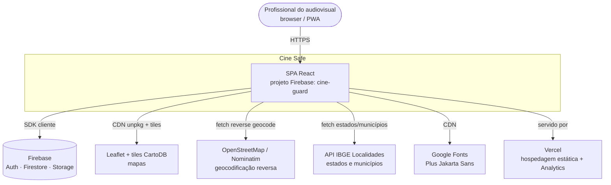
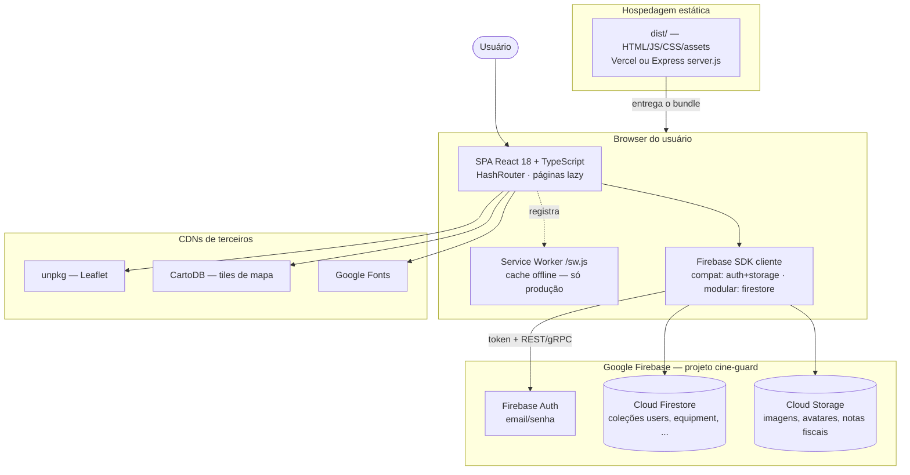
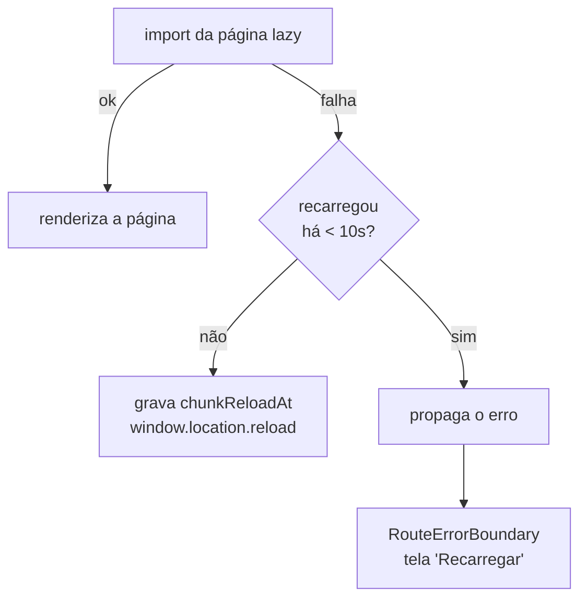

# Arquitetura Técnica

> Como o Cine Safe está montado: uma SPA React que roda inteiramente no browser e fala direto com o Firebase, sem backend próprio — e as consequências disso.

Este documento descreve a arquitetura de execução do Cine Safe: os limites do sistema (C4 nível 1), os containers em runtime (C4 nível 2), a stack com versões, o modelo client-only, o fluxo de dados de uma ação típica e as decisões de resiliência de carregamento (code-splitting, recuperação de _chunk_ obsoleto). Para o modelo de dados por coleção veja [03-data-model.md](./03-data-model.md); para segurança e regras do Firestore veja [04-security.md](./04-security.md) e [../FIREBASE_RULES.md](../FIREBASE_RULES.md); para a camada de UI veja [05-frontend.md](./05-frontend.md).

---

## 1. Modelo de execução em uma frase

O Cine Safe é uma **Single Page Application (SPA)** React compilada por Vite em arquivos estáticos (`dist/`). Todo o código de negócio roda **no browser do usuário**. Não existe backend de aplicação próprio: o browser conversa **diretamente** com o Firebase (Auth, Firestore, Storage) usando o SDK cliente e a `apiKey` pública embutida no bundle (`services/firebase.ts`). O `server.js` (Express) e a Vercel apenas **servem arquivos estáticos** — não executam lógica de domínio.

**Consequência central:** como não há camada de servidor entre o cliente e o banco, a **única fronteira de segurança real** são as **Firestore Security Rules** (`firestore.rules`) e as **Storage Rules** (`storage.rules`). Validações feitas em TypeScript no browser (limites de plano, cálculo de reputação, checagens cruzadas) são **conveniência de UX e podem ser burladas** por um cliente hostil; o que realmente protege os dados são as _rules_. Veja [04-security.md](./04-security.md).

---

## 2. C4 Nível 1 — Contexto

Quem usa o sistema e com quais sistemas externos ele fala.



Sistemas externos e onde são usados no código:

| Sistema externo | Papel | Grounding no código |
| --- | --- | --- |
| Firebase (Auth/Firestore/Storage) | Identidade, banco de dados e arquivos | `services/firebase.ts` |
| Leaflet 1.9.4 + tiles CartoDB | Renderização de mapas (mapa de furtos, seleção de local) | `index.html:27-30`; `pages/SafetyMap.tsx:98`, `pages/TheftReport.tsx:58` |
| OpenStreetMap / Nominatim | Geocodificação reversa (lat/lng → endereço) | `pages/TheftReport.tsx:124` |
| API IBGE (Localidades) | Lista de estados (UF) e municípios | `services/ibge.ts:16,28` |
| Google Fonts | Fonte `Plus Jakarta Sans` | `index.html:23-24` |
| Vercel | Hospedagem dos estáticos + `@vercel/analytics` | `vercel.json`, `App.tsx:4,148` |

---

## 3. C4 Nível 2 — Containers

O que existe em tempo de execução. Note que quase tudo é browser-side; o Firebase é o único "servidor" com estado.



Observações de container:

- **Não há Cloud Functions** e nenhum outro serviço de compute próprio. Toda regra de negócio vive no bundle da SPA (pastas `services/`, `hooks/`, `pages/`).
- O **Service Worker** (`public/sw.js`) só é registrado em produção — `index.tsx:18` verifica `!window.location.hostname.includes('localhost')` — e fornece cache offline (PWA).
- O bucket de Storage é `cine-guard.firebasestorage.app` (`services/firebase.ts:13`).

---

## 4. Stack e versões

Versões conforme `package.json` (dependências com `^`, ou seja, faixa compatível) e `index.html` (dependências via CDN, versão fixada).

| Camada | Tecnologia | Versão | Origem |
| --- | --- | --- | --- |
| UI | React + React DOM | ^18.2.0 | `package.json` |
| Linguagem | TypeScript | ^5.2.2 | `package.json` |
| Build/Dev server | Vite | ^5.2.0 | `package.json` / `vite.config.ts` |
| Plugin de build | @vitejs/plugin-react | ^4.2.1 | `package.json` |
| Roteamento | react-router-dom (`HashRouter`) | ^6.22.3 | `package.json` / `App.tsx` |
| Backend-as-a-Service | firebase (SDK cliente) | ^10.8.0 | `package.json` / `services/firebase.ts` |
| CSS | Tailwind CSS (via PostCSS) | ^3.4.3 | `package.json` / `postcss.config.js` |
| CSS toolchain | postcss / autoprefixer | ^8.4.38 / ^10.4.19 | `package.json` |
| Ícones | lucide-react | ^0.554.0 | `package.json` |
| Crop de avatar | react-easy-crop | ^5.0.0 | `package.json` |
| Métricas | @vercel/analytics | ^1.6.1 | `package.json` / `App.tsx` |
| Servidor estático (opcional) | express | ^4.19.2 | `package.json` / `server.js` |
| Runtime Node | Node.js | >= 18.0.0 | `package.json` (`engines`) |
| Mapas | Leaflet + tiles CartoDB | 1.9.4 (CDN unpkg) | `index.html:27-30` |
| Fonte | Plus Jakarta Sans (Google Fonts) | — | `index.html:23-24` |

### 4.1. Firebase: compat + modular na mesma base

`services/firebase.ts` mistura deliberadamente dois estilos do SDK v10 para maximizar compatibilidade entre ambientes de build/CDN:

```ts
import firebase from 'firebase/compat/app';
import 'firebase/compat/auth';
import { getFirestore } from 'firebase/firestore';
import 'firebase/compat/storage';

const app = firebase.apps.length > 0 ? firebase.app() : firebase.initializeApp(firebaseConfig);

export const auth = app.auth();          // API compat (namespaced)
export const db = getFirestore(app as unknown as any); // API modular
export const storage = app.storage();    // API compat (namespaced)
```

Impacto prático: **Auth e Storage** usam a API _namespaced_ (`auth.signInWithEmailAndPassword(...)`, `storage.ref(...).put(...)` — ver `services/auth.ts` e `utils/imageProcessor.ts`), enquanto o **Firestore** usa a API modular tree-shakeable (`collection`, `doc`, `getDocs`, `writeBatch`, `increment` — ver `services/equipmentService.ts:3-7`). A `apiKey` e demais chaves do `firebaseConfig` são **públicas por design** (embutidas no bundle); a proteção vem das _rules_, não do sigilo dessas chaves.

---

## 5. Fluxo de dados de uma ação típica

Exemplo: **adicionar um equipamento ao inventário** (com imagem). O fluxo abaixo é orquestrado por `hooks/useInventory.ts` e `services/equipmentService.ts`; todos os passos rodam no browser e chamam o Firebase diretamente.

```mermaid
sequenceDiagram
    actor U as Usuário
    participant H as useInventory (hook)
    participant ES as equipmentService
    participant US as userService
    participant IMG as Canvas do browser<br/>(imageProcessor)
    participant FS as Firestore
    participant ST as Storage

    U->>H: clica "Adicionar"
    H->>US: checkLimit(uid, 'inventory')
    US->>FS: lê users/{uid} (contagem vs FREE_LIMITS)
    FS-->>US: dados de uso
    US-->>H: pode adicionar? (senão, modal de indicação)

    U->>H: preenche formulário + envia (handleSubmit)
    H->>ES: checkSerial(serialNumber)
    ES->>FS: query equipment where serialNumber == NORMALIZADO
    FS-->>ES: item existente? 
    ES-->>H: duplicado -> bloqueia; senão segue

    opt tem imagem selecionada
        H->>ES: uploadEquipmentImage(file, uid)
        ES->>IMG: processImageForWebP (redimensiona 480px, WebP 0.85)
        IMG-->>ES: Blob WebP
        ES->>ST: resilientUpload -> ref.put(blob)
        ST-->>ES: downloadURL (ou erro CORS_CONFIG_ERROR)
        ES-->>H: URL da imagem
    end

    H->>ES: addEquipment(item)
    ES->>US: getUserProfile(ownerId) (para denormalizar ownerProfile)
    US->>FS: lê users/{ownerId}
    FS-->>US: name, avatarUrl, location
    ES->>FS: setDoc(equipment/{id}) com serial normalizado + ownerProfile
    FS-->>ES: ok
    H->>ES: getUserEquipment(uid) (refresh)
    ES->>FS: query equipment where ownerId == uid
    FS-->>H: lista atualizada -> re-render
```

Pontos importantes deste fluxo (todos verificáveis no código):

- **Checagem de limite no cliente** — `useInventory.handleAddNewClick` chama `userService.checkLimit(user.id, 'inventory')` (`hooks/useInventory.ts:95`). É uma barreira de UX; a defesa real fica nas _rules_.
- **Serial normalizado** — o número de série é gravado com `trim().toUpperCase()` em `addEquipment` e `updateEquipment` (`services/equipmentService.ts:27,44`), mantendo consistência com `checkSerial`.
- **Denormalização de `ownerProfile`** — `addEquipment` busca o perfil do dono e copia `{ name, avatarUrl, location }` no documento do equipamento (`services/equipmentService.ts:22-35`). O **telefone nunca é denormalizado** porque a vitrine é pública; o contato ocorre por notificação.
- **Pipeline de imagem** — `processImageForWebP` desenha a imagem num `<canvas>` redimensionado para 480px de largura e exporta WebP a 0.85 de qualidade (`utils/imageProcessor.ts:3-26`). O crop de avatar usa 0.95 (`cropImageHelper`, mesmo arquivo).
- **Upload resiliente** — `resilientUpload` escuta o evento `state_changed` do `put()` e converte falhas de CORS em um erro tipado `CORS_CONFIG_ERROR` (`utils/imageProcessor.ts:37-38`), que a UI trata com um modal específico (`useInventory.handleCorsError`).

---

## 6. Carregamento resiliente: code-splitting, lazy e recuperação de _chunk_ obsoleto

Todas as páginas são carregadas via **code-splitting** (`React.lazy` + `Suspense`) para reduzir o bundle inicial (`App.tsx:26-43`). Como o app é uma SPA de longa duração e cada deploy troca os _hashes_ dos arquivos, existe o risco clássico do **_stale chunk_**: um cliente com o `index.html` antigo tenta buscar um `.js` cujo _hash_ não existe mais no host, e a importação falha.

O `App.tsx` mitiga isso em duas camadas:

### 6.1. `lazyWithReload` — recarrega uma vez ao falhar o import

```ts
const lazyWithReload = (factory) =>
  lazy(() =>
    factory().catch((err) => {
      const now = Date.now();
      const last = Number(sessionStorage.getItem('chunkReloadAt') || '0');
      if (now - last > 10000) {              // debounce de 10s
        sessionStorage.setItem('chunkReloadAt', String(now));
        window.location.reload();            // recarrega para pegar index.html + chunks atuais
        return new Promise(() => {});        // trava o import enquanto recarrega
      }
      throw err;                             // já recarregou há pouco -> propaga p/ o boundary
    })
  );
```

Se o import de um _chunk_ falha, a página recarrega **uma única vez** (protegida por um _debounce_ de 10s em `sessionStorage`, chave `chunkReloadAt`), buscando o `index.html` novo e, com ele, os _hashes_ atuais. Se falhar de novo em menos de 10s, o erro é propagado em vez de entrar em loop de reload (`App.tsx:12-24`).

### 6.2. `RouteErrorBoundary` — tela amigável em vez de tela preta

Um _Error Boundary_ de classe (`App.tsx:84-112`) envolve todas as rotas. Se qualquer rota estourar (inclusive um _chunk_ que segue falhando após o reload), ele mostra uma tela com botão **"Recarregar"** — que limpa `chunkReloadAt` e recarrega — em vez de deixar o app numa tela preta.



A hierarquia de composição em `App.tsx` é: `AuthProvider` → `HashRouter` → `RouteErrorBoundary` → `Suspense(fallback=PageLoader)` → `Routes` (e o `<Analytics/>` da Vercel fora do Router).

### 6.3. `manualChunks` do Vite

`vite.config.ts` agrupa as dependências pesadas em _vendor chunks_ estáveis, para que o código de terceiros seja cacheado separadamente do código da aplicação e não invalide todo o cache a cada release:

```ts
build: {
  outDir: 'dist',
  chunkSizeWarningLimit: 1000,
  rollupOptions: {
    output: {
      manualChunks: {
        'vendor-react':    ['react', 'react-dom', 'react-router-dom'],
        'vendor-firebase': ['firebase/app', 'firebase/auth', 'firebase/firestore', 'firebase/storage'],
        'vendor-ui':       ['lucide-react', 'react-easy-crop'],
      }
    }
  }
}
```

O caching de longo prazo desses _assets_ é reforçado no host: `vercel.json` serve `/assets/(.*)` com `Cache-Control: public, max-age=31536000, immutable`, enquanto `/index.html` e `/sw.js` usam `max-age=0, must-revalidate` para que uma nova versão seja sempre detectada.

---

## 7. Roteamento

`App.tsx` usa **`HashRouter`** (rotas com `#`, ex.: `/#/inventory`), o que evita a necessidade de _rewrites_ server-side para _deep links_ — embora os _rewrites_ para SPA também estejam configurados no host (`vercel.json` reescreve tudo para `/index.html`; `server.js` devolve `index.html` em `app.get('*')`).

| Rota | Acesso | Componente |
| --- | --- | --- |
| `/` | Pública (visitante) / dashboard (logado) | `RootRoute` → `Landing` ou `Home` |
| `/login`, `/register` | Pública | `Login`, `Register` |
| `/inventory`, `/report-theft`, `/rentals`, `/sales`, `/check-serial`, `/safety`, `/rankings`, `/profile`, `/notifications`, `/network`, `/chat`, `/contracts` | Protegida (exige login) | via `ProtectedRoute` |
| `/admin` | Protegida + `role === 'admin'` | `ProtectedRoute adminOnly` → `AdminDashboard` |

O guard `ProtectedRoute` (`App.tsx:53-67`) redireciona para `/login` sem usuário e para `/` quando `adminOnly` e o usuário não é admin. Enquanto `AuthContext` resolve a sessão (`loading === true`), renderiza `PageLoader`. A sessão é hidratada por `AuthProvider` a partir de `AuthService.getSession()` (`onAuthStateChanged` → `userService.getUserProfile`), e usuários com `isBlocked` são deslogados na inicialização e no login (`context/AuthContext.tsx:26-33,41-46`).

---

## 8. Deploy (resumo)

Dois caminhos suportados, ambos servindo o mesmo `dist/` estático:

- **Vercel** (`vercel.json`): `buildCommand: npm run build`, `outputDirectory: dist`, framework `vite`, _rewrites_ SPA e _headers_ de cache/segurança (`X-Content-Type-Options`, `X-Frame-Options`, `X-XSS-Protection`).
- **Express / container** (`server.js`): `npm run build` gera `dist/`, `npm start` roda `node server.js`, que serve os estáticos e faz _fallback_ de SPA para `index.html`, na porta `process.env.PORT || 8080` — adequado para Cloud Run e afins.

O detalhamento (build, variáveis, publicação das _rules_, CORS do Storage) está em **[guias/deployment.md](./guides/deployment.md)**. Para colocar o projeto para rodar localmente, veja **[guias/getting-started.md](./guides/getting-started.md)**.

---

## 9. Limitações e pontos em aberto (honestidade técnica)

- **Sem backend / validação no cliente.** Limites de plano (`FREE_LIMITS`), cálculo de reputação e diversas escritas cruzadas são validados em TypeScript no browser. As _rules_ fazem defesa por campo, mas mover a lógica sensível para Cloud Functions segue **pendente** — registrado em [../FIREBASE_RULES.md](../FIREBASE_RULES.md).
- **Busca textual em memória.** A busca do marketplace filtra no cliente sobre um lote de até 120 itens já carregado (`equipmentService.searchMarketplace`, `services/equipmentService.ts:187-214`), não é uma busca full-text no servidor; escala mal para grandes volumes.
- **`reputationPoints` não é autoritativo.** É recalculado no cliente (`userService.calculateReputation`) e pode divergir do que estiver persistido.
- **Chaves do Firebase no bundle.** Por design do SDK web, `apiKey`/`projectId` são públicos; qualquer segurança depende exclusivamente das _rules_.

---

## Fontes no código

- `App.tsx` — composição raiz, `HashRouter`, rotas, `ProtectedRoute`/`RootRoute`, `lazyWithReload`, `RouteErrorBoundary`.
- `index.tsx` — bootstrap React (`createRoot`, `StrictMode`) e registro do Service Worker (produção).
- `index.html` — shell HTML, preconnect/dns-prefetch, CDN Leaflet, Google Fonts, estilos glass.
- `vite.config.ts` — build, `outDir`, `manualChunks`.
- `services/firebase.ts` — inicialização do Firebase (compat + modular), `firebaseConfig`, exports `auth`/`db`/`storage`.
- `context/AuthContext.tsx` — provedor de sessão, `useAuth`, tratamento de `isBlocked`.
- `services/auth.ts` — login/registro/logout/sessão sobre o Firebase Auth.
- `services/equipmentService.ts` — CRUD de equipamento, denormalização, upload, busca.
- `hooks/useInventory.ts` — orquestração do formulário de inventário (fluxo de adicionar equipamento).
- `utils/imageProcessor.ts` — `processImageForWebP`, `resilientUpload`, `cropImageHelper`.
- `services/ibge.ts` — integração com a API de Localidades do IBGE.
- `server.js` — servidor Express estático para container/Cloud Run.
- `vercel.json` — configuração de build, rewrites e headers de cache/segurança.
- `package.json` — versões e scripts.
