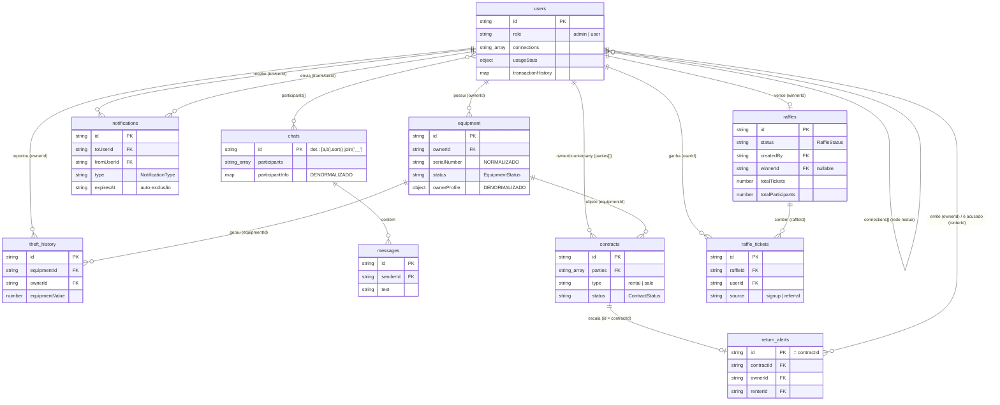

# Modelo de Dados

> Referência canônica de todas as coleções Firestore do Cine Safe: campos, tipos, chaves, relacionamentos, enums e a estratégia de denormalização/normalização usada no cliente.

Toda persistência do Cine Safe vive no **Cloud Firestore** do projeto Firebase `cine-guard`. Não há backend próprio nem Cloud Functions: o app é **somente cliente** (ver [02-architecture.md](02-architecture.md)). Todos os tipos abaixo são declarados em [`types.ts`](../types.ts) e manipulados pelos serviços em [`services/`](../services) (ver [reference/services.md](reference/services.md)). As regras de acesso estão em [`firestore.rules`](../firestore.rules) e são detalhadas em [04-security.md](04-security.md).

## Visão geral das coleções

| Coleção | Documento (ID) | Propósito | Leitura pública? |
| --- | --- | --- | --- |
| `users` | `uid` (do Firebase Auth) | Perfil, RBAC, rede de confiança, referral, limites de uso | Não (só autenticados) |
| `equipment` | `id` (gerado no cliente) | Inventário de equipamentos + vitrine de marketplace | Parcial (só itens SAFE anunciados) |
| `notifications` | `id` (UUID) | Notificações privadas ao destinatário | Não (só o destinatário) |
| `theft_history` | ID automático | Registro imutável de recuperação (alimenta o Mapa) | Não (só autenticados) |
| `ads` | `id` | Banners de marketing (seleção ponderada) | Sim (leitura livre) |
| `chats` | ID determinístico | Metadados da conversa entre dois usuários | Não (só participantes) |
| `chats/{id}/messages` | ID automático | Mensagens da conversa | Não (só participantes) |
| `contracts` | `id` (UUID) | Ciclo de aluguel/venda entre duas partes | Não (só partes + admin) |
| `return_alerts` | `id` = `contractId` | Alerta público de não-devolução | Sim (leitura livre) |
| `stats/global` | doc fixo `global` | Contadores agregados de impacto | Não (só autenticados) |
| `raffles` | `id` (UUID) | Sorteios de equipamentos para a comunidade | Não (só autenticados) |
| `raffle_tickets` | `id` (UUID) | Tickets individuais de participação em sorteios | Não (só autenticados) |

## Diagrama ER



---

## `users`

Perfil do usuário. O documento é criado no cadastro (o próprio dono, `allow create: if isOwner(userId)`), e a chave é o **UID do Firebase Auth**. RBAC via `role`; controle de acesso via `isBlocked`. Interface `User` em [`types.ts`](../types.ts).

| Campo | Tipo | Descrição |
| --- | --- | --- |
| `id` | `string` | UID do Firebase Auth (também é o ID do documento). |
| `name` | `string` | Nome de exibição. |
| `email` | `string` | E-mail de login. Usado na busca de usuários. |
| `avatarUrl` | `string` | URL do avatar (Storage) ou fallback `ui-avatars`. |
| `location` | `string` | Localização textual (ex.: cidade/UF). Denormalizada no `ownerProfile` do item. |
| `reputationPoints` | `number` | **Calculado no cliente** por `calculateReputation` a cada leitura de perfil; **não é autoritativo** (ver abaixo). |
| `isVerified` | `boolean` | Flag de verificação de perfil. |
| `contactPhone?` | `string` | Telefone de contato público. **Nunca denormalizado no item** (ver Denormalização). |
| `role` | `'admin' \| 'user'` | Campo RBAC. Protegido contra auto-escalonamento nas regras. |
| `isBlocked?` | `boolean` | Bloqueio de acesso (painel admin). O dono não pode alterar. |
| `checksCount?` | `number` | Total vitalício de seriais verificados. |
| `reportsCount?` | `number` | Total vitalício de roubos reportados. |
| `inventoryCount?` | `number` | Auxiliar de UI para listas (preenchido em `getAllUsers`, não persistido de forma confiável). |
| `connections?` | `string[]` | IDs de usuários na rede de confiança (mútua). |
| `transactionHistory?` | `{ [partnerId: string]: number }` | Valor total transacionado por parceiro (mapa `partnerId → valor`). |
| `referralCode?` | `string` | Código de indicação próprio. |
| `referredBy?` | `string` | Código de quem indicou este usuário. |
| `referralCount?` | `number` | Nº de indicações concretizadas. `>= 5` → Premium. O dono não pode alterar. |
| `usageStats?` | `UsageStats` | Uso mensal (verificações de serial e revelações de contato). |
| `notificationStats?` | `NotificationStats` | Contadores vitalícios de mensagens recebidas (persistem após exclusão da notificação). |

**Subtipos** (em [`types.ts`](../types.ts)):

```ts
interface UsageStats {
  serialChecks: { count: number, month: string };   // month = "YYYY-MM"
  contactReveals: { count: number, month: string };
}
interface NotificationStats {
  rentalInterest: number;
  saleInterest: number;
  stolenAlerts: number;
}
```

**Relacionamentos:** `id` é referenciado por `equipment.ownerId`, `notifications.toUserId`/`fromUserId`, `contracts.parties`/`ownerId`/`counterpartyId`, `return_alerts.ownerId`/`renterId`, `chats.participants` e `connections[]` (auto-referência mútua).

**Reputação não autoritativa:** `reputationPoints` é recomputado em [`services/userService.ts`](../services/userService.ts) por `calculateReputation` (perfil completo + itens SAFE + conexões + contadores) sempre que o perfil é lido; o valor persistido é sobrescrito na memória. Não é fonte de verdade — é uma métrica derivada calculada no cliente. Ver [features/reputation-and-rankings.md](features/reputation-and-rankings.md).

**Escritas cruzadas (defesa por-campo):** outro usuário autenticado só pode tocar `connections`, `notificationStats`, `transactionHistory` e `referralCount` de um perfil alheio (regra `hasOnly([...])` em [`firestore.rules`](../firestore.rules)). O dono não pode alterar `role`, `isBlocked` nem `referralCount`. Detalhes em [04-security.md](04-security.md).

---

## `equipment`

Item de inventário e, quando anunciado, item de marketplace. A chave é `item.id` (gerado no cliente). Interface `Equipment` em [`types.ts`](../types.ts). Serviço: [`services/equipmentService.ts`](../services/equipmentService.ts).

| Campo | Tipo | Descrição |
| --- | --- | --- |
| `id` | `string` | ID do documento (gerado no cliente). Usado como chave de ordenação/paginação. |
| `ownerId` | `string` | UID do dono. FK para `users`. |
| `name` | `string` | Nome do item. |
| `brand` | `string` | Marca. |
| `model` | `string` | Modelo. |
| `serialNumber` | `string` | Número de série **normalizado** (`trim` + `UPPERCASE`) na escrita. |
| `category` | `EquipmentCategory` | Categoria (enum, valores em pt-BR). |
| `status` | `EquipmentStatus` | `SAFE` \| `STOLEN` \| `LOST` \| `TRANSFER_PENDING`. |
| `value?` | `number` | Valor estimado do item. |
| `isForRent` | `boolean` | Anunciado para aluguel. |
| `rentalPricePerDay?` | `number` | Preço/dia de aluguel. |
| `isForSale` | `boolean` | Anunciado para venda. |
| `salePrice?` | `number` | Preço de venda. |
| `imageUrl?` | `string` | URL da foto (Storage, WebP). |
| `invoiceUrl?` | `string` | URL da nota fiscal (Storage; imagem ou PDF). |
| `description?` | `string` | Descrição livre. |
| `purchaseDate` | `string` | Data de compra (ISO). |
| `theftLocation?` | `Coordinates` | `{ lat, lng }` do roubo. Limpo ao recuperar. |
| `theftDate?` | `string` | Data do roubo (ISO). Limpo ao recuperar. |
| `theftAddress?` | `string` | Endereço do roubo via geocódigo reverso (OpenStreetMap/Nominatim). |
| `pendingTransferTo?` | `string` | UID do destinatário de uma transferência pendente. |
| `ownerProfile?` | `{ name, avatarUrl, location }` | **Denormalizado** do dono (ver abaixo). |

`Coordinates`: `{ lat: number; lng: number }`.

**Relacionamentos:** `ownerId` → `users`. `equipmentId` é referenciado por `theft_history` e `contracts`. `pendingTransferTo` → `users` (destinatário de transferência).

**Leitura pública parcial:** as regras liberam leitura sem login **apenas** para itens `status == 'SAFE'` **e** (`isForRent == true` **ou** `isForSale == true`) — é a vitrine da landing. Usuários autenticados leem tudo (inventário próprio e verificação de serial). Por isso o telefone não é denormalizado aqui.

**Sem `createdAt`:** a interface `Equipment` **não** possui campo de data de criação. A paginação do marketplace usa `orderBy('id')` como chave estável — ver Índices e paginação.

---

## `notifications`

Notificações privadas ao destinatário (`toUserId`). Qualquer autenticado pode criar (interesse, convite, transferência, alerta), desde que assine como remetente (`fromUserId == request.auth.uid`). Interface `Notification` em [`types.ts`](../types.ts). Serviço: [`services/notificationService.ts`](../services/notificationService.ts).

| Campo | Tipo | Descrição |
| --- | --- | --- |
| `id` | `string` | ID do documento (UUID via `crypto.randomUUID()`). |
| `toUserId` | `string` | Destinatário. FK para `users`. Base da regra de leitura. |
| `fromUserId` | `string` | Remetente. FK para `users`. |
| `fromUserName` | `string` | Nome do remetente (denormalizado na notificação). |
| `fromUserPhone?` | `string` | Telefone do remetente. Canal de contato (não vaza pela vitrine). |
| `fromUserAvatar?` | `string` | Avatar do remetente. |
| `fromUserReputation?` | `number` | Reputação do remetente (snapshot). |
| `fromUserConnectionsCount?` | `number` | Nº de conexões do remetente (snapshot). |
| `itemId?` | `string` | Item relacionado. |
| `itemName?` | `string` | Nome do item (snapshot). |
| `itemImage?` | `string` | Imagem do item (snapshot). |
| `type` | `NotificationType` | Ver enum abaixo. |
| `createdAt` | `string` | ISO. Usado para ordenação (decrescente, no cliente). |
| `read` | `boolean` | Lida ou não. |
| `message?` | `string` | Texto livre. |
| `expiresAt?` | `string` | ISO. Quando `<= agora`, o doc é **auto-excluído** na leitura em tempo real. |
| `actionPayload?` | `{ equipmentId?, requesterId?, transactionValue? }` | Dados de ação (ex.: transferência com valor). |

**Auto-exclusão (faxina):** `subscribeUserNotifications` percorre o snapshot e, para cada notificação com `expiresAt <= agora`, dispara `deleteDoc` e a omite da lista. `scheduleNotificationExpiry` marca `read: true` + `expiresAt = agora + 24h`. Não há TTL do Firestore nem Cloud Function: a expiração efetiva depende do destinatário abrir o app.

**Efeito colateral de contagem:** `createNotification` incrementa `notificationStats.{rentalInterest|saleInterest|stolenAlerts}` no doc do destinatário conforme o `type` (`RENTAL_INTEREST`/`SALE_INTEREST`/`STOLEN_FOUND`). Esses contadores persistem mesmo após a notificação ser excluída.

**Relacionamentos:** `toUserId`, `fromUserId` → `users`; `itemId`/`actionPayload.equipmentId` → `equipment`.

---

## `theft_history`

Registro de recuperação, **imutável após criado** (`allow update, delete: if false`). Alimenta o Mapa de Segurança. Criado por `equipmentService.recoverEquipment` com **ID automático** (`doc(collection(db, 'theft_history'))`). Não há interface dedicada em `types.ts`; a forma é definida pelo objeto gravado em [`services/equipmentService.ts`](../services/equipmentService.ts).

| Campo | Tipo | Descrição |
| --- | --- | --- |
| `equipmentId` | `string` | Item recuperado. FK para `equipment`. |
| `ownerId` | `string` | Dono que reportou/recuperou. FK para `users`. Base da regra de criação. |
| `theftDate` | `string` | Data do roubo original (ISO). |
| `theftLat` | `number` | Latitude do roubo (para o mapa). |
| `theftLng` | `number` | Longitude do roubo. |
| `theftAddress` | `string` | Endereço do roubo (geocódigo reverso). |
| `equipmentValue` | `number` | Valor do item (`item.value || 0`). Somado em estatísticas. |
| `recoveryDate` | `string` | ISO da recuperação. |
| `recoveredViaApp` | `boolean` | Se a recuperação ocorreu via app. |

**Consumo:** `getCommunitySafetyData` lê `theftLat`/`theftLng`/`theftAddress`/`theftDate` para o mapa; `getGlobalDetailedStats` usa `count()` + `sum('equipmentValue')`; `getUserDetailedStats` filtra por `ownerId` e soma `equipmentValue`. Ver [features/theft-and-safety.md](features/theft-and-safety.md).

**Relacionamentos:** `equipmentId` → `equipment`; `ownerId` → `users`.

---

## `ads`

Banners de marketing com seleção aleatória **ponderada por `weight`**. Leitura livre; métricas por qualquer autenticado; criação/edição/remoção só admin. Interface `Ad` em [`types.ts`](../types.ts). Serviço: [`services/adService.ts`](../services/adService.ts).

| Campo | Tipo | Descrição |
| --- | --- | --- |
| `id` | `string` | ID do documento. |
| `advertiserName` | `string` | Marca / nome interno. |
| `tagline?` | `string` | Chamada do banner composto. |
| `title` | `string` | Título do banner. |
| `priceOld?` | `string` | Preço "de" (riscado). |
| `priceNew?` | `string` | Preço "por". |
| `buttonText` | `string` | Texto do CTA. |
| `imageUrl` | `string` | PNG do produto (fundo transparente). |
| `linkUrl?` | `string` | Destino do clique. |
| `startDate` | `string` | ISO. Início da veiculação. |
| `endDate` | `string` | ISO. Fim da veiculação. |
| `weight` | `number` | 1 a 10. Peso na seleção aleatória. |
| `active` | `boolean` | Ativo ou não. |
| `impressions` | `number` | Contador de exibições (`increment`). |
| `clicks` | `number` | Contador de cliques (`increment`). |

**Seleção ponderada:** `getActiveAd` filtra `active == true` e `startDate <= hoje <= endDate` (comparação de string ISO por data), soma os pesos, sorteia `random * totalWeight` e percorre subtraindo cada peso — probabilidade proporcional a `weight`. Ver [features/advertising.md](features/advertising.md).

**Relacionamentos:** nenhum (coleção independente).

---

## `chats` + subcoleção `messages`

Mensageria interna 1:1. O ID do chat é **determinístico**: `chatIdFor(a, b) = [a, b].sort().join('__')` — abrir conversa com a mesma pessoa sempre cai no mesmo documento (idempotente). Acesso restrito aos participantes. Tipos em [`services/chatService.ts`](../services/chatService.ts) (`ChatSummary`, `ChatMessage`).

### `chats/{chatId}`

| Campo | Tipo | Descrição |
| --- | --- | --- |
| `id` | `string` | ID determinístico (também o ID do documento). |
| `participants` | `string[]` | `[me.id, other.id]`. Base das regras (`request.auth.uid in participants`). |
| `participantInfo` | `{ [uid: string]: { name, avatarUrl } }` | **Denormalizado**: nome/avatar de cada participante para render sem lookup. |
| `lastMessage` | `string` | Prévia da última mensagem. |
| `lastMessageAt` | `string` | ISO. Ordenação por recência (no cliente). |
| `lastSenderId` | `string` | Autor da última mensagem. |
| `createdAt` | `string` | ISO da criação (gravado em `openChat`; não faz parte da interface `ChatSummary`). |

### `chats/{chatId}/messages/{msgId}`

Documento com **ID automático** (`addDoc`). Imutável (`allow update, delete: if false`).

| Campo | Tipo | Descrição |
| --- | --- | --- |
| `id` | `string` | ID automático do Firestore (adicionado ao ler). |
| `senderId` | `string` | Autor. Deve igualar `request.auth.uid` na criação. |
| `text` | `string` | Conteúdo (trim; vazio é rejeitado no cliente). |
| `createdAt` | `string` | ISO. `orderBy('createdAt', 'asc')` na leitura. |

**Relacionamentos:** `participants[]` → `users`; `messages` é subcoleção de `chats`; `senderId` → `users`. Ver [features/chat.md](features/chat.md).

---

## `contracts`

Ciclo de aluguel/venda entre **duas partes**. O dono do equipamento cria a proposta; o counterparty aceita/recusa. Chave `id` (UUID). Leitura pelas partes e pelo admin. Interface `Contract` em [`types.ts`](../types.ts). Serviço: [`services/contractService.ts`](../services/contractService.ts).

| Campo | Tipo | Descrição |
| --- | --- | --- |
| `id` | `string` | UUID (`crypto.randomUUID()`), também ID do documento. |
| `type` | `ContractType` | `'rental'` \| `'sale'`. |
| `status` | `ContractStatus` | `'proposed'` \| `'active'` \| `'completed'` \| `'declined'` \| `'cancelled'`. |
| `parties` | `string[]` | `[ownerId, counterpartyId]`. Alvo de `array-contains` e das regras. |
| `ownerId` | `string` | Dono do equipamento (locador/vendedor); cria o contrato. |
| `ownerName` | `string` | Nome do dono (snapshot). |
| `ownerAvatar` | `string` | Avatar do dono (snapshot). |
| `counterpartyId` | `string` | Locatário/comprador; aceita. |
| `counterpartyName` | `string` | Nome do counterparty (snapshot). |
| `counterpartyAvatar` | `string` | Avatar do counterparty (snapshot). |
| `equipmentId` | `string` | Item objeto do contrato. FK para `equipment`. |
| `equipmentName` | `string` | Nome do item (snapshot). |
| `equipmentImage?` | `string` | Imagem do item (snapshot). |
| `value` | `number` | Aluguel: valor total do período; venda: preço. |
| `pickupDate?` | `string` | Aluguel: dia de retirada (ISO date). |
| `pickupTime?` | `string` | Aluguel: hora de retirada (`HH:MM`). |
| `returnDate?` | `string` | Aluguel: dia de devolução (ISO date). |
| `returnTime?` | `string` | Aluguel: hora de devolução (`HH:MM`). |
| `paymentTiming?` | `PaymentTiming` | Aluguel: `'antecipado' \| 'na_retirada' \| 'na_devolucao' \| 'data'`. |
| `paymentDueDate?` | `string` | Aluguel: data-limite do pagamento (ISO date), quando `paymentTiming === 'data'`. |
| `pixKey?` | `string` | Chave PIX do recebedor (locador/vendedor) para o pagamento. |
| `pickupPhotos?` | `InspectionPhoto[]` | Vistoria na retirada: `[{url,by,at}]` (jsonb). As duas partes podem registrar. |
| `returnPhotos?` | `InspectionPhoto[]` | Vistoria na devolução: `[{url,by,at}]` (jsonb). As duas partes podem registrar. |
| `chatId?` | `string` | Liga o contrato à conversa. |
| `paymentStatus?` | `'submitted' \| 'confirmed'` | Sem valor = pendente (só sai de pendente quando o pagador anexa o comprovante). |
| `paymentProofUrl?` | `string` | Comprovante (imagem/PDF) no Storage. |
| `paymentSubmittedBy?` | `string` | Quem anexou o comprovante. |
| `paymentAt?` | `string` | ISO do envio do comprovante. |
| `overdueNoticeAt?` | `string` | ISO — quando o dono notificou o atraso (inicia o prazo). |
| `publicAlert?` | `boolean` | Dono escalou para alerta público. |
| `publicAlertAt?` | `string` | ISO da escalada. |
| `createdAt` | `string` | ISO. |
| `updatedAt` | `string` | ISO. |

**Fluxo (resumo):**

- **Venda:** dono cria proposta → item vira `TRANSFER_PENDING` (`pendingTransferTo = comprador`, sai do marketplace) → comprador aceita → `transferEquipmentOwnership` troca a posse (`ownerId`, reseta `status = SAFE`, limpa `pendingTransferTo`, zera anúncios) → contrato `completed`. Recusa/cancelamento → `cancelTransfer` devolve o item ao `SAFE`, contrato `declined`/`cancelled`.
- **Aluguel:** aceite → `active`; devolução → `completed`. Atraso: `sendOverdueNotice` (`overdueNoticeAt`) → `raisePublicAlert` cria o `return_alerts` e marca `publicAlert`.
- **Impacto global:** `acceptContract` faz `setDoc(stats/global, { transactions/rentals/sales/transactedValue: increment(...) }, { merge:true })`.

**Undefined removido:** `createContract` filtra chaves `undefined` antes de gravar (o Firestore rejeita o documento inteiro se houver `undefined`). Ver [features/contracts-and-payments.md](features/contracts-and-payments.md) e [features/network-and-transfers.md](features/network-and-transfers.md).

**Relacionamentos:** `parties`/`ownerId`/`counterpartyId` → `users`; `equipmentId` → `equipment`; `chatId` → `chats`; `id` = `return_alerts.id`/`contractId`.

---

## `return_alerts`

Alerta **público** de não-devolução (visível à comunidade e no perfil do locatário). O ID é **igual ao `contractId`** (determinístico, 1:1 com o contrato). Interface `ReturnAlert` em [`types.ts`](../types.ts). Serviço: [`services/contractService.ts`](../services/contractService.ts).

| Campo | Tipo | Descrição |
| --- | --- | --- |
| `id` | `string` | = `contractId`. Também ID do documento. |
| `contractId` | `string` | Contrato de origem. FK para `contracts`. |
| `renterId` | `string` | Quem não devolveu. FK para `users`. |
| `renterName` | `string` | Nome do locatário (snapshot). |
| `renterAvatar` | `string` | Avatar do locatário (snapshot). |
| `ownerId` | `string` | Quem emitiu o alerta. FK para `users`. |
| `ownerName` | `string` | Nome do emissor (snapshot). |
| `equipmentName` | `string` | Nome do item (snapshot). |
| `equipmentImage?` | `string` | Imagem do item (snapshot). |
| `agreedReturnDate` | `string` | Data de devolução combinada (`contract.returnDate`). |
| `raisedAt` | `string` | ISO da emissão. |
| `status` | `'active' \| 'resolved'` | Ativo até a devolução. |
| `resolvedAt?` | `string` | ISO da resolução. |

**"Grounded" (anti-fabricação):** a regra de criação em [`firestore.rules`](../firestore.rules) valida contra o contrato **real** — só o `ownerId` de um contrato pode emitir, e apenas quando `contractData(contractId).ownerId == auth.uid` **e** `contractData(contractId).counterpartyId == renterId`. Só o emissor atualiza (para resolver). Nunca é excluído (`delete: if false`). `completeRental` marca o alerta como `resolved` quando o aluguel é concluído.

**Relacionamentos:** `contractId` → `contracts` (1:1); `ownerId`/`renterId` → `users`.

---

## `stats/global`

Documento único (`stats/global`) com contadores **agregados** de impacto — apenas números, sem dados individuais. Escrito por `acceptContract` (`setDoc ... { merge:true }`) e lido por `getGlobalDetailedStats`. Não há interface dedicada; os campos são definidos pelo uso.

| Campo | Tipo | Descrição |
| --- | --- | --- |
| `transactions` | `number` | Total de contratos aceitos (aluguel + venda). |
| `rentals` | `number` | Aluguéis aceitos. |
| `sales` | `number` | Vendas aceitas. |
| `transactedValue` | `number` | Soma do `value` dos contratos aceitos. |

Em `getGlobalDetailedStats`, apenas `transactions` e `transactedValue` são lidos (mapeados para `transactionsCount`/`transactedValue` de `DetailedStats`); as demais estatísticas globais (itens, roubos, recuperações) vêm de queries de **agregação** (`getCountFromServer`/`getAggregateFromServer`) sobre `equipment` e `theft_history`, não deste documento.

**Relacionamentos:** nenhum (singleton agregado).

---

## Enums e tipos-união

Declarados em [`types.ts`](../types.ts).

### `EquipmentStatus` (enum)

| Valor | Significado |
| --- | --- |
| `SAFE` | Seguro / disponível (elegível ao marketplace). |
| `STOLEN` | Roubado (aparece no Mapa de Segurança). |
| `LOST` | Perdido. |
| `TRANSFER_PENDING` | Transferência pendente (venda proposta; fora do marketplace). |

### `EquipmentCategory` (enum, valores em pt-BR)

| Chave | Valor |
| --- | --- |
| `CAMERA` | `Câmera` |
| `LENS` | `Lente` |
| `AUDIO` | `Áudio` |
| `LIGHTING` | `Iluminação` |
| `DRONE` | `Drone` |
| `ACCESSORY` | `Acessório` |

Os valores são strings em pt-BR — persistidos assim no campo `equipment.category` e comparados diretamente nos filtros de marketplace (`where('category', '==', ...)`).

### `NotificationType` (tipo-união de string)

`'RENTAL_INTEREST'` | `'SALE_INTEREST'` | `'STOLEN_FOUND'` | `'CONNECTION_REQUEST'` | `'CONNECTION_ACCEPTED'` | `'ITEM_TRANSFER'` | `'RENTAL_OVERDUE'`.

Não é um `enum` — é um union type. Apenas `RENTAL_INTEREST`, `SALE_INTEREST` e `STOLEN_FOUND` alimentam `notificationStats`.

### `ContractType` e `ContractStatus` (tipos-união)

- `ContractType`: `'rental'` | `'sale'`.
- `ContractStatus`: `'proposed'` | `'active'` | `'completed'` | `'declined'` | `'cancelled'`.

---

## Estratégia de denormalização

O app é somente cliente e evita lookups em cascata (e leituras extras que a regra pública não permitiria). Três decisões concretas:

### 1. `ownerProfile` no item (`equipment.ownerProfile`)

`addEquipment`/`updateEquipment`/`transferEquipmentOwnership` copiam `{ name, avatarUrl, location }` do dono para dentro do documento do item. Assim a **vitrine pública** (landing/marketplace) renderiza nome, avatar e localização do dono **sem ler a coleção `users`** — o que as regras nem permitiriam a um visitante anônimo. `_getMarketplaceItems` inclusive filtra localização (`filters.uf`/`city`) sobre `ownerProfile.location`. O dado é atualizado na próxima escrita do item (não há propagação automática se o perfil mudar).

### 2. `participantInfo` no chat (`chats.participantInfo`)

`openChat` grava `{ [uid]: { name, avatarUrl } }` de ambos os participantes no documento do chat. A lista de conversas (`subscribeUserChats`) mostra nome/avatar do interlocutor sem buscar o perfil dele — reduz leituras e simplifica a UI.

### 3. Telefone **não** é denormalizado

`contactPhone` fica **só** em `users` e é copiado, quando necessário, para `notifications.fromUserPhone` (canal privado ao destinatário). O item **nunca** carrega o telefone porque a leitura de `equipment` é **pública** para itens anunciados (ver regra em [`firestore.rules`](../firestore.rules)); denormalizar o telefone no item o exporia a qualquer visitante anônimo. O contato acontece via notificação de interesse, não pela vitrine. Comentário explícito em [`services/equipmentService.ts`](../services/equipmentService.ts) (`addEquipment`).

Outros campos são "snapshots" denormalizados no momento da criação (nome/avatar/item em `notifications`, `contracts`, `return_alerts`) — não se atualizam retroativamente.

## Normalização do número de série

`serialNumber` é normalizado para `trim()` + `toUpperCase()` em **`addEquipment`** e **`updateEquipment`**, garantindo consistência na verificação. `checkSerial` normaliza a entrada e consulta primeiro o valor normalizado; se não encontrar e a entrada crua diferir da normalizada, tenta também o valor **cru** — fallback para documentos legados ainda não normalizados, evitando regressão na verificação de serial. Ver [features/theft-and-safety.md](features/theft-and-safety.md).

## Índices e paginação

- **Paginação por `orderBy('id')`:** o marketplace (`_getMarketplaceItems`) ordena por `id` porque `Equipment` **não tem `createdAt`**. `id` é uma chave estável e presente em todos os documentos, viável com `startAfter`. Os comentários no código registram que, em produção, o ideal seria adicionar `createdAt` e ordenar por ele.
- **`hasMore` sem count extra:** busca `limit + 1` documentos; se vier o excedente, há mais páginas (o extra é descartado do resultado).
- **Filtros server-side vs. cliente:** `category` é filtrada no servidor (`where`); **localização** (`uf`/`city`) é filtro "soft" no cliente, aplicado só sobre a página já baixada (`ownerProfile.location.includes(...)`). Consequência: uma página pode voltar com **menos** itens que `limit`.
- **Busca textual limitada (~120 itens):** `searchMarketplace` baixa no máximo `limit(120)` itens do filtro e faz `includes` case-insensitive sobre `name/brand/model` no cliente. Não há full-text no Firestore; acima de ~120 itens seria necessário um serviço externo (Algolia/Typesense).
- **Ordenação no cliente para evitar índice composto:** `subscribeUserChats`, `subscribeUserContracts`, `subscribeCommunityAlerts` e `getUserNotifications` filtram por igualdade/`array-contains` e **ordenam por data no cliente**, evitando índices compostos no Firestore.
- **Agregação server-side:** `getGlobalDetailedStats` usa `getCountFromServer`/`getAggregateFromServer` (`count`/`sum`) em vez de baixar as coleções inteiras; `checkLimit('inventory')` usa `getCountFromServer`.

## Fontes no código

- [`types.ts`](../types.ts) — todas as interfaces e enums (`Equipment`, `User`, `Notification`, `Contract`, `ReturnAlert`, `Ad`, `EquipmentStatus`, `EquipmentCategory`, `NotificationType`, `ContractType`, `ContractStatus`, `UsageStats`, `NotificationStats`, `DetailedStats`, `Coordinates`).
- [`services/userService.ts`](../services/userService.ts) — `users`, `calculateReputation`, `FREE_LIMITS`/`PREMIUM_REFERRALS`, agregações globais, `theft_history` (consumo).
- [`services/equipmentService.ts`](../services/equipmentService.ts) — `equipment`, denormalização de `ownerProfile`, normalização de serial, paginação/busca, `theft_history` (criação), transferência de posse.
- [`services/contractService.ts`](../services/contractService.ts) — `contracts`, `return_alerts`, `stats/global`, fluxo de pagamento e não-devolução.
- [`services/notificationService.ts`](../services/notificationService.ts) — `notifications`, auto-exclusão/expiração, `notificationStats`.
- [`services/chatService.ts`](../services/chatService.ts) — `chats` + `messages`, ID determinístico, `participantInfo`.
- [`services/adService.ts`](../services/adService.ts) — `ads`, seleção ponderada, métricas.
- [`services/raffleService.ts`](../services/raffleService.ts) — `raffles`, `raffle_tickets`, CRUD, tickets, sorteio, leaderboard.
- [`firestore.rules`](../firestore.rules) — regras de acesso por coleção, leitura pública parcial, defesa por-campo, "grounded" de `return_alerts`.

---

## `raffles`

Sorteios de equipamentos para a comunidade. Criados e gerenciados pelo admin. Interface `Raffle` em [`types.ts`](../types.ts). Serviço: [`services/raffleService.ts`](../services/raffleService.ts).

| Campo | Tipo | Descrição |
| --- | --- | --- |
| `id` | `string` | UUID (`crypto.randomUUID()`). |
| `title` | `string` | Nome do prêmio. |
| `description` | `string` | Descrição do prêmio e regras. |
| `prizeImageUrl?` | `string` | URL da foto do prêmio (Storage, WebP). |
| `status` | `RaffleStatus` | `'draft'` \| `'active'` \| `'completed'` \| `'cancelled'`. |
| `createdBy` | `string` | Admin que criou. FK para `users`. |
| `startDate` | `string` | ISO — início do período de participação. |
| `endDate` | `string` | ISO — fim / data do sorteio. |
| `createdAt` | `string` | ISO da criação. |
| `updatedAt` | `string` | ISO da última atualização. |
| `winnerId?` | `string` | userId do vencedor (após sorteio). FK para `users`. |
| `winnerName?` | `string` | Nome do vencedor (snapshot). |
| `winnerAvatar?` | `string` | Avatar do vencedor (snapshot). |
| `drawnAt?` | `string` | ISO da realização do sorteio. |
| `totalTickets` | `number` | Soma de todos os tickets (denormalizado, via `increment`). |
| `totalParticipants` | `number` | Participantes distintos (denormalizado, via `increment`). |

**Restrição de negócio:** apenas um sorteio ativo por vez (validado no formulário do admin, não nas rules).

**Relacionamentos:** `createdBy` → `users`; `winnerId` → `users`; 1:N para `raffle_tickets`.

---

## `raffle_tickets`

Tickets individuais de participação em sorteios. Cada ticket representa uma entrada no sorteio. Interface `RaffleTicket` em [`types.ts`](../types.ts). Serviço: [`services/raffleService.ts`](../services/raffleService.ts).

| Campo | Tipo | Descrição |
| --- | --- | --- |
| `id` | `string` | UUID (`crypto.randomUUID()`). |
| `raffleId` | `string` | Sorteio ao qual pertence. FK para `raffles`. |
| `userId` | `string` | Dono do ticket. FK para `users`. |
| `userName` | `string` | Nome do dono (snapshot). |
| `userAvatar` | `string` | Avatar do dono (snapshot). |
| `source` | `'signup'` \| `'referral'` | Origem: cadastro na plataforma ou convite de amigo. |
| `referredUserId?` | `string` | Se `source='referral'`, quem se cadastrou. FK para `users`. |
| `referredUserName?` | `string` | Nome do cadastrado (snapshot). |
| `createdAt` | `string` | ISO. |

**Relacionamentos:** `raffleId` → `raffles`; `userId` → `users`; `referredUserId` → `users`.

Ver [features/raffles.md](features/raffles.md).
