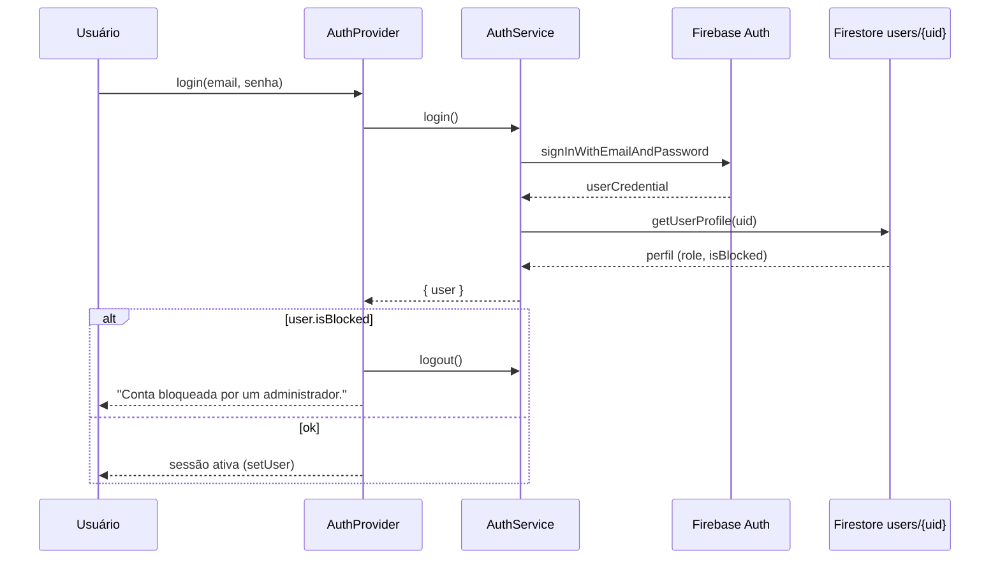

# Segurança e Controle de Acesso

> Como o Cine Safe autentica usuários, aplica RBAC e defende os dados no Firestore/Storage — e onde estão as fronteiras conhecidas dessa defesa.

Este documento descreve o modelo de segurança **real** do Cine Safe, fiel ao
código-fonte. O produto é uma SPA/PWA que fala **direto com o Firebase** (Auth,
Firestore, Storage) a partir do cliente — **não há backend próprio nem Cloud
Functions** (ver [`services/firebase.ts`](../services/firebase.ts)). Portanto, a
superfície de segurança são: o fluxo de autenticação no cliente, as
**Firestore Security Rules** ([`firestore.rules`](../firestore.rules)), as
**Storage Rules** ([`storage.rules`](../storage.rules)) e os headers HTTP do
deploy ([`vercel.json`](../vercel.json)).

Documento-irmão de referência rápida: [`../FIREBASE_RULES.md`](../FIREBASE_RULES.md).
Modelo de dados por coleção: [`03-data-model.md`](./03-data-model.md).
Serviços que executam as escritas: [`reference/services.md`](./reference/services.md).

---

## 1. Fluxo de autenticação

A autenticação usa **Firebase Auth com e-mail/senha** (SDK `compat`, ver
[`services/firebase.ts`](../services/firebase.ts)). Toda a lógica de sessão está
em [`services/auth.ts`](../services/auth.ts) e é orquestrada pelo
[`context/AuthContext.tsx`](../context/AuthContext.tsx).

### 1.1 Peças

| Função | Arquivo | Papel |
| --- | --- | --- |
| `AuthService.getSession()` | `services/auth.ts:10` | Resolve o usuário atual via `onAuthStateChanged` (promessa de uma leitura) e busca o perfil no Firestore. |
| `AuthService.login()` | `services/auth.ts:26` | `signInWithEmailAndPassword` + carrega o perfil `users/{uid}`. |
| `AuthService.register()` | `services/auth.ts:39` | `createUserWithEmailAndPassword`, gera `referralCode`, grava o perfil público e processa indicação. |
| `AuthService.logout()` | `services/auth.ts:82` | `auth.signOut()`. |
| `AuthProvider` | `context/AuthContext.tsx:17` | Estado global `{ user, loading }`, hidrata a sessão no boot e aplica o bloqueio de conta. |

### 1.2 `getSession` — leitura única, não listener contínuo

`getSession` embrulha `onAuthStateChanged` numa `Promise` e **cancela a inscrição
imediatamente** (`unsubscribe()`), resolvendo apenas o primeiro evento. Ou seja,
o app lê a sessão uma vez no boot — não mantém um listener reativo. Se há usuário
Firebase, carrega o perfil de `users/{uid}` via `userService.getUserProfile`; caso
contrário resolve `null`.

```ts
// services/auth.ts:10
getSession: async (): Promise<User | null> => {
  return new Promise((resolve) => {
    const unsubscribe = auth.onAuthStateChanged(async (firebaseUser) => {
      if (firebaseUser) {
        const profile = await userService.getUserProfile(firebaseUser.uid);
        resolve(profile);
      } else {
        resolve(null);
      }
      unsubscribe();
    });
  });
},
```

> Nota: a identidade (uid, existência de sessão) vem do **Firebase Auth**, mas o
> **perfil** (com `role`, `isBlocked`) vem do documento Firestore `users/{uid}`.
> Os dois são carregados juntos em `getUserProfile`.

### 1.3 Bloqueio de conta (`isBlocked`)

O campo `isBlocked?: boolean` (ver [`types.ts`](../types.ts) — "Access control")
é o mecanismo de banimento **no cliente**. É aplicado em dois pontos do
`AuthProvider`:

- **No boot** (`context/AuthContext.tsx:26`): se a sessão restaurada tem
  `isBlocked`, faz `logout()` e zera o usuário.
- **No login** (`context/AuthContext.tsx:41`): se o perfil retornado tem
  `isBlocked`, faz `logout()`, zera o usuário e devolve a mensagem
  `"Esta conta foi bloqueada por um administrador."`.



> **Limitação (importante):** `isBlocked` é reforçado **apenas no cliente**. Nas
> Firestore Rules, um usuário bloqueado que ainda tenha token válido **continua
> autenticado** (`isSignedIn()` é verdadeiro) — as rules **não** consultam
> `isBlocked`. O bloqueio efetivo depende de o app fazer logoff; ele impede o uso
> da UI, não o acesso direto à API do Firestore. O próprio usuário também não pode
> se desbloquear editando o perfil (as rules travam `isBlocked` — ver §3.2).

### 1.4 Registro — o que é gravado

`register` cria o usuário no Auth e grava o perfil público em `users/{uid}` com
`role: 'user'`, `referralCount: 0`, `reputationPoints: 0`, `usageStats` zerado e
um `referralCode` derivado do primeiro nome + sufixo aleatório
(`services/auth.ts:46-48`). `referredBy` só é incluído se houver código de
indicação (evita gravar `undefined` no Firestore). Ver
[`referral-and-freemium.md`](./features/referral-and-freemium.md) para o fluxo
de indicação.

---

## 2. RBAC — papéis e rotas protegidas

O controle de acesso baseado em papel usa **um único campo**: `role: 'admin' | 'user'`
em `users/{uid}` ([`types.ts:81`](../types.ts) — "RBAC field"). Não há papéis
intermediários. "Premium" **não** é um papel: é derivado em runtime
(`userService.isPremium`, §5), não um nível de acesso.

### 2.1 `ProtectedRoute` (cliente)

Em [`App.tsx:53`](../App.tsx), o wrapper de rota decide o acesso:

```tsx
const ProtectedRoute = ({ children, adminOnly = false }) => {
  const { user, loading } = useAuth();
  if (loading) return <PageLoader />;
  if (!user) return <Navigate to="/login" replace />;          // exige login
  if (adminOnly && user.role !== 'admin') return <Navigate to="/" replace />; // exige admin
  return <Layout>{children}</Layout>;
};
```

- Todas as rotas de feature (`/inventory`, `/rentals`, `/sales`, `/contracts`,
  `/chat`, `/network`, etc.) ficam atrás de `<ProtectedRoute>` e exigem login.
- Apenas `/admin` usa `adminOnly={true}` ([`App.tsx:143`](../App.tsx)):
  não-admins são redirecionados para `/`.
- A raiz `/` é **aberta**: `RootRoute` mostra a `Landing` pública para visitantes
  e o `Home` (dashboard) para logados ([`App.tsx:72`](../App.tsx)). A vitrine da
  landing é pública por design (ver §3.3 e §4).

> `ProtectedRoute` é **defesa de UI**, não de dados. A autorização real de cada
> operação está nas Firestore/Storage Rules (§3, §4). O painel admin, por exemplo,
> só funciona de verdade porque as rules concedem privilégios a `role == 'admin'`.

---

## 3. Firestore Security Rules

Fonte: [`firestore.rules`](../firestore.rules) (`rules_version = '2'`). As regras
saíram do `allow all` do MVP mantendo o app funcional e liberando **leitura
pública apenas da vitrine do marketplace**.

### 3.1 Funções auxiliares

```
function isSignedIn()      → request.auth != null
function isOwner(uid)      → isSignedIn() && request.auth.uid == uid
function isAdmin()         → isSignedIn() && get(users/{uid}).data.role == 'admin'
function contractData(cid) → get(contracts/{cid}).data
```

- `isAdmin()` faz um `get()` no próprio documento `users/{uid}` para checar
  `role == 'admin'`. Isso ancora o papel no dado autoritativo do Firestore (e as
  próprias rules impedem o usuário de se auto-promover — §3.2), custando 1 leitura
  de documento por avaliação.
- `contractData(cid)` é usada nas `return_alerts` para **aterrar** (grounded) o
  alerta contra o contrato real (§3.9).

### 3.2 `users` — validação por campo (anti-escalonamento)

O ponto mais delicado das rules. Leitura é liberada a **qualquer autenticado**
(rede, ranking, admin) — perfis **não** são públicos; a página pública usa o
`ownerProfile` já denormalizado no item de equipamento.

```
match /users/{userId} {
  allow read:   if isSignedIn();
  allow create: if isOwner(userId);
  allow delete: if isOwner(userId) || isAdmin();
  allow update: if isAdmin()
    || (isOwner(userId)
        && request.resource.data.role == resource.data.role
        && request.resource.data.get('isBlocked', false) == resource.data.get('isBlocked', false)
        && request.resource.data.get('referralCount', 0) == resource.data.get('referralCount', 0))
    || (isSignedIn() && request.auth.uid != userId
        && request.resource.data.diff(resource.data).affectedKeys()
             .hasOnly(['connections', 'notificationStats', 'transactionHistory', 'referralCount']));
}
```

O `update` tem **três ramos**:

1. **Admin** (`isAdmin()`): pode tudo — promover/rebaixar `role`, alternar
   `isBlocked`, excluir. É o que sustenta o painel admin
   ([`userService.toggleUserRole`](../services/userService.ts), `toggleUserBlock`,
   `deleteUser`).
2. **Dono** (`isOwner(userId)`): edita o próprio perfil, **exceto** três campos
   travados por igualdade explícita:
   - `role` — não pode virar admin;
   - `isBlocked` — não pode se desbloquear sozinho;
   - `referralCount` — não pode inflar contagem para virar Premium (§5).
3. **Outro usuário** (autenticado, `uid != userId`): só pode tocar o conjunto
   fechado `['connections', 'notificationStats', 'transactionHistory', 'referralCount']`
   via `diff().affectedKeys().hasOnly(...)` — as **escritas cruzadas legítimas**
   (conexão mútua, contadores de notificação, histórico de transação, incremento
   de indicação). Não consegue sobrescrever nome, avatar nem qualquer outro campo
   alheio.

> **Assimetria conhecida:** o ramo 3 permite que um usuário incremente
> `referralCount` **de outro** (usado por `processReferral`,
> [`services/userService.ts:125`](../services/userService.ts)), enquanto o ramo 2
> proíbe o dono de mexer no próprio `referralCount`. Como `referralCount` governa
> o status Premium, isso é uma escrita cruzada confiada ao cliente — registrada
> como pendência para Cloud Functions (§6).

### 3.3 `equipment` — vitrine pública controlada

```
allow read: if isSignedIn()
            || (resource.data.status == 'SAFE'
                && (resource.data.isForRent == true || resource.data.isForSale == true));
```

- **Autenticados leem tudo** (inventário próprio, verificação de serial de
  qualquer item).
- **Anônimos** só leem itens **`SAFE` e (`isForRent` ou `isForSale`)** — ou seja,
  a vitrine do marketplace. Inventário privado e itens `STOLEN`/`LOST`/
  `TRANSFER_PENDING` ficam invisíveis ao público.
- `create`: só o dono declarado (`isOwner(request.resource.data.ownerId)`).
- `delete`: dono ou admin.

**`update` — transferência de posse protegida.** Este é o buraco que as rules
fecham: sem elas, aceitar uma transferência exigiria confiar no cliente. São
quatro ramos:

1. Dono do item (`isOwner(resource.data.ownerId)`);
2. Admin;
3. **Destinatário assume a posse:** o item está `TRANSFER_PENDING`,
   `pendingTransferTo == request.auth.uid` **e** o novo `ownerId` passa a ser o
   próprio requisitante (`request.resource.data.ownerId == request.auth.uid`).
   Só o destinatário nomeado consegue virar dono.
4. **Destinatário recusa:** mesmo `TRANSFER_PENDING` + `pendingTransferTo == uid`,
   mas devolve o item ao `SAFE` **sem trocar de dono**
   (`request.resource.data.ownerId == resource.data.ownerId`) e limpa
   `pendingTransferTo` (`== null`).

Ver o fluxo completo em [`network-and-transfers.md`](./features/network-and-transfers.md).

### 3.4 `notifications` — privadas ao destinatário

> **Supabase/Postgres:** este app foi migrado de Firestore para Supabase; a
> tabela `public.notifications` usa **RLS** (não `firestore.rules`). SQL fonte:
> [`supabase/migrations/20260709_notifications_rls_realtime.sql`](../supabase/migrations/20260709_notifications_rls_realtime.sql).

```sql
-- select / update / delete: só o destinatário
for select using (to_user_id = auth.uid());
for update using (to_user_id = auth.uid()) with check (to_user_id = auth.uid());
for delete using (to_user_id = auth.uid());
-- insert: remetente assinado
for insert with check (from_user_id = auth.uid());
```

- **Só o destinatário** (`to_user_id`) lê, atualiza e apaga.
- Qualquer autenticado **cria**, desde que **assine como remetente**
  (`from_user_id = auth.uid()`) — impede forjar notificação em nome de terceiro.
- **Importante:** com a RLS ligada e a policy de `insert` **ausente**, todo envio
  do cliente é negado por _default deny_ — foi essa a causa de "enviei interesse
  e o dono não recebeu". A migração acima (re)cria a policy `insert`.
- Inserts feitos por funções `SECURITY DEFINER` de sorteio **ignoram** a RLS.
- A auto-exclusão por `expires_at` acontece no cliente durante o `subscribe`
  (faxina), não na RLS. Ver [`notifications.md`](./features/notifications.md).

### 3.5 `theft_history` — imutável

```
allow read:            if isSignedIn();
allow create:          if isSignedIn() && request.resource.data.ownerId == request.auth.uid;
allow update, delete:  if false;
```

Registro de recuperação que alimenta o **Mapa de Segurança**. Qualquer
autenticado lê; o dono cria assinando como `ownerId`; **ninguém** atualiza ou
apaga (`if false`). É append-only por design — a história de recuperação não pode
ser reescrita. Ver [`theft-and-safety.md`](./features/theft-and-safety.md).

### 3.6 `ads` — leitura livre, escrita admin, métrica aberta

```
allow read:           if true;              // banners aparecem para todos
allow update:         if isSignedIn();      // impressions/clicks
allow create, delete: if isAdmin();         // só admin gerencia o inventário de anúncios
```

Leitura pública (a vitrine mostra banners a visitantes). Qualquer autenticado
pode `update` — necessário para incrementar `impressions`/`clicks`. Criar e
apagar banners é exclusivo do admin.

> **Limitação:** como `update` é aberto a autenticados, um cliente malicioso pode
> escrever campos arbitrários de um `ad` (não só métricas). A confiança aqui é na
> forma como o app usa a regra, não numa validação por campo. Ver
> [`advertising.md`](./features/advertising.md).

### 3.7 `chats` + `chats/{id}/messages` — restrito aos participantes

```
match /chats/{chatId} {
  allow read:   if isSignedIn() && (resource == null || request.auth.uid in resource.data.participants);
  allow create: if isSignedIn() && request.auth.uid in request.resource.data.participants;
  allow update: if isSignedIn() && request.auth.uid in resource.data.participants;

  match /messages/{msgId} {
    allow read:   if isSignedIn() && request.auth.uid in get(chats/{chatId}).data.participants;
    allow create: if isSignedIn()
                  && request.auth.uid == request.resource.data.senderId
                  && request.auth.uid in get(chats/{chatId}).data.participants;
    allow update, delete: if false;
  }
}
```

- Só **participantes** leem/escrevem o chat e suas mensagens.
- `resource == null` no `read` permite o `getDoc` de uma conversa **que ainda não
  existe** (ao abrir o chat pela primeira vez) sem vazar dados de outra.
- Ao criar mensagem, o remetente **assina** (`senderId == uid`) e precisa estar
  entre os `participants` do chat pai (`get()`).
- Mensagens são **imutáveis** (`update, delete: if false`).
- O `chatId` é determinístico (`[a,b].sort().join("__")`) — ver
  [`chat.md`](./features/chat.md).

### 3.8 `contracts` — só as partes (e admin lê)

```
allow read:   if isSignedIn() && (request.auth.uid in resource.data.parties || isAdmin());
allow create: if isSignedIn()
              && request.auth.uid == request.resource.data.ownerId
              && request.auth.uid in request.resource.data.parties;
allow update: if isSignedIn() && request.auth.uid in resource.data.parties;
allow delete: if false;
```

- Leitura pelas **duas partes** (`parties`); admin lê tudo para histórico.
- Quem cria a proposta é o **dono do equipamento** (`ownerId == uid`) e precisa
  estar entre as partes.
- Atualização por qualquer uma das partes (aceitar, recusar, marcar pago,
  concluir).
- Contratos **nunca** são apagados (`delete: if false`) — trilha permanente. Ver
  [`contracts-and-payments.md`](./features/contracts-and-payments.md).

### 3.9 `return_alerts` — alerta público "grounded"

```
allow read:   if true;   // público: comunidade e perfil do locatário
allow create: if isSignedIn()
              && request.auth.uid == request.resource.data.ownerId
              && contractData(request.resource.data.contractId).ownerId == request.auth.uid
              && contractData(request.resource.data.contractId).counterpartyId == request.resource.data.renterId;
allow update: if isSignedIn() && request.auth.uid == resource.data.ownerId;
allow delete: if false;
```

Alerta **público** de não-devolução de aluguel. A criação é a regra mais
"aterrada" do sistema: só o **dono de um contrato de aluguel real** pode emitir,
e apenas **contra o locatário real daquele contrato**. As rules cruzam o alerta
com o contrato via `contractData()`:

- `ownerId` do alerta == `request.auth.uid` (o emissor);
- `contractData(contractId).ownerId == request.auth.uid` (é dono daquele contrato);
- `contractData(contractId).counterpartyId == renterId` (o acusado é mesmo o
  locatário daquele contrato).

Isso **impede acusação fabricada**: não dá para emitir alerta público contra
alguém sem um contrato real que os ligue. Só o emissor resolve o alerta
(`update`); ninguém apaga. Ver [`contracts-and-payments.md`](./features/contracts-and-payments.md).

### 3.10 `stats` — contadores agregados

```
allow read:  if isSignedIn();
allow write: if isSignedIn();
```

`stats/global` guarda **apenas números** de impacto agregado (`transactions`,
`transactedValue`, etc.), sem dados individuais. Leitura e escrita liberadas a
qualquer autenticado (o app incrementa esses contadores no cliente ao concluir
transações). Contadores de notificação **não** entram no global — são privados
(ver `getGlobalDetailedStats`, [`services/userService.ts:249`](../services/userService.ts)).

> **Limitação:** `stats/global` é escrevível por qualquer autenticado sem
> validação de delta — um cliente pode inflar ou zerar os agregados. Aceitável
> por serem números de vitrine, sem PII; candidato a Cloud Function (§6).

### 3.11 Resumo das rules do Firestore

| Coleção | read | create | update | delete |
| --- | --- | --- | --- | --- |
| `users` | autenticado | dono | admin / dono (sem `role`,`isBlocked`,`referralCount`) / outro só campos cruzados | dono ou admin |
| `equipment` | autenticado **ou** vitrine pública (`SAFE`+venda/aluguel) | dono declarado | dono / admin / destinatário de transferência (assume ou recusa) | dono ou admin |
| `notifications` | destinatário | remetente assinado | destinatário | destinatário |
| `theft_history` | autenticado | dono assinado | **nunca** | **nunca** |
| `ads` | público | admin | autenticado | admin |
| `chats` | participante (ou inexistente) | participante | participante | — |
| `chats/*/messages` | participante | remetente assinado + participante | **nunca** | **nunca** |
| `contracts` | partes ou admin | dono nas partes | partes | **nunca** |
| `stats` | autenticado | — (write) | autenticado (write) | — |
| `return_alerts` | público | dono do contrato real vs. locatário real | emissor | **nunca** |
| `raffles` | autenticado | admin | admin | admin |
| `raffle_tickets` | autenticado | auto-atribuição (`userId == auth.uid`) | admin | admin |

---

## 4. Storage Security Rules

Fonte: [`storage.rules`](../storage.rules) (`rules_version = '2'`).

| Path | read | write |
| --- | --- | --- |
| `users/{userId}/equipment/**` | **público** (`if true`) | dono da pasta (`uid == userId`) |
| `ads/{filename}` | **público** | admin (`firestore.get(users/{uid}).data.role == 'admin'`) |
| `users/{userId}/**` (avatar, notas fiscais) | autenticado | dono da pasta |
| `contracts/{contractId}/**` (comprovantes) | autenticado | autenticado |

Pontos-chave:

- **Fotos de equipamento são públicas** — a vitrine aberta precisa exibi-las sem
  login. Coerente com a leitura pública de `equipment` (§3.3).
- **Avatares e notas fiscais** (`users/{uid}/**` genérico) só são lidos por
  autenticados; só o **dono** escreve. As notas fiscais nunca ficam públicas.
- **Anúncios**: escrita restrita a admin, validada cruzando com o papel no
  Firestore (`firestore.get`).
- **Comprovantes de pagamento** (`contracts/**`): leitura/escrita por qualquer
  autenticado. A privacidade real vem da **URL com token** (download token do
  Storage), conhecida só pelas duas partes via o documento do contrato — não de
  uma regra por-usuário. Ver [`contracts-and-payments.md`](./features/contracts-and-payments.md).
- Uploads passam por processamento WebP (`utils/imageProcessor.ts`) com
  `resilientUpload` (detecta erro CORS) — ver
  [`reference/utils.md`](./reference/utils.md).

> **Limitação:** `contracts/{id}/**` confia no segredo da URL/token, não numa ACL
> por participante. Qualquer autenticado que descubra o path+token acessa o
> comprovante. `ads` valida o papel via `firestore.get`, custando 1 leitura por
> escrita.

---

## 5. Limites freemium e reputação — confiados ao cliente

As regras de negócio de plano vivem em
[`services/userService.ts`](../services/userService.ts) e são aplicadas **no
cliente**:

```ts
export const PREMIUM_REFERRALS = 5;
export const FREE_LIMITS = { inventory: 5, serialChecks: 5, contactReveals: 3 };
```

- `isPremium(user)` → `referralCount >= 5` **ou** `role === 'admin'`
  ([`userService.ts:79`](../services/userService.ts)). Premium **não** é papel RBAC.
- `checkLimit(userId, type)` valida no cliente antes de agir: inventário (≤5
  itens via `getCountFromServer`), verificações de serial (≤5/mês) e
  interesses/contatos (≤3/mês), com janela mensal em `usageStats`.
- `reputationPoints` é **calculado no cliente** (`calculateReputation`,
  [`userService.ts:21`](../services/userService.ts)) a cada `getUserProfile` e
  **não é autoritativo** — não deve ser tratado como dado de confiança. Ver
  [`reputation-and-rankings.md`](./features/reputation-and-rankings.md).

> Nenhum desses limites é imposto pelas Firestore Rules. Um cliente adulterado
> pode exceder os limites do plano gratuito escrevendo direto na API. As rules só
> protegem o que realmente importa para integridade: papel, bloqueio, posse,
> privacidade e autenticidade de alertas.

---

## 6. Modelo de ameaças e limitações conhecidas

O que as rules **garantem** hoje:

- Não é possível se **auto-promover a admin** nem se **auto-desbloquear**
  (`users.update`, §3.2).
- Não é possível **sobrescrever o perfil de outro usuário** além dos campos de
  fluxo (§3.2).
- Não é possível **assumir a posse** de um item sem ser o destinatário nomeado de
  uma transferência pendente (§3.3).
- Não é possível **forjar notificação** em nome de terceiro nem **ler
  notificação/inventário/contrato/chat alheio** (§3.4, §3.7, §3.8).
- Não é possível **reescrever histórico de roubo, mensagens ou contratos**
  (imutabilidade, §3.5, §3.7, §3.8).
- Não é possível emitir **alerta público de não-devolução fabricado** — ele é
  aterrado no contrato real (§3.9).
- Inventário privado, avatares e notas fiscais **não vazam** para anônimos (§3.3,
  §4).

O que **ainda não** está protegido (superfície aceita conscientemente):

| Limitação | Onde | Impacto | Mitigação atual |
| --- | --- | --- | --- |
| `isBlocked` só no cliente | `AuthContext` (§1.3) | Conta banida com token válido ainda acessa a API do Firestore direto | Rules travam auto-desbloqueio; app faz logoff |
| Limites freemium no cliente | `userService` (§5) | Cliente adulterado excede 5 itens / 5 checks / 3 contatos | Nenhuma no servidor |
| `reputationPoints` calculado no cliente | `calculateReputation` (§5) | Pontuação não é autoritativa | Recalculado a cada leitura; não é usado para autorização |
| Escrita cruzada de `referralCount` | `users.update` ramo 3 (§3.2) | Um usuário pode incrementar `referralCount` de outro (afeta Premium) | Conjunto de campos restrito por `hasOnly` |
| `ads.update` aberto | rule `ads` (§3.6) | Autenticado pode escrever campos além de métricas | Só admin cria/apaga |
| `stats/global` escrevível | rule `stats` (§3.10) | Autenticado pode inflar agregados | Só números, sem PII |
| Comprovantes por token | `storage.rules` contracts (§4) | Path+token vaza dá acesso | URL só compartilhada via contrato |
| `apiKey` do Firebase no bundle | `services/firebase.ts` | Exposta no cliente (esperado no Firebase Web) — **não** é segredo; a segurança vem das rules | — |

**Plano registrado (defesa em profundidade pendente).** O
[`../FIREBASE_RULES.md`](../FIREBASE_RULES.md) documenta explicitamente a intenção
de **mover as escritas cruzadas para Cloud Functions** (para que nem os campos de
fluxo possam ser adulterados entre usuários) e de **validar os limites de uso no
servidor**. Isso exige um ambiente de teste (emulador do Firebase com Java, ou
staging) para não arriscar os fluxos de autenticação em produção — está marcado
como próximo passo, não implementado.

---

## 7. Headers de segurança (deploy Vercel)

Fonte: [`vercel.json`](../vercel.json). Além das regras de cache por rota, a
Vercel injeta headers de segurança em **todas** as respostas (`source: "/(.*)"`):

| Header | Valor | Efeito |
| --- | --- | --- |
| `X-Content-Type-Options` | `nosniff` | Impede o navegador de "adivinhar" o MIME type (bloqueia sniffing malicioso). |
| `X-Frame-Options` | `DENY` | Proíbe embutir o app em `<iframe>` — mitiga clickjacking. |
| `X-XSS-Protection` | `1; mode=block` | Liga o filtro XSS legado do navegador. |

Notas de cache relevantes à segurança/atualização:

- `/index.html` e `/sw.js`: `max-age=0, must-revalidate` — o HTML e o service
  worker nunca são servidos "velhos", garantindo que correções cheguem no próximo
  load (relevante para o auto-reload de chunk stale, ver
  [`02-architecture.md`](./02-architecture.md)).
- `/assets/*` e `/favicon.svg`: `max-age=31536000, immutable` — assets versionados
  por hash, cacheáveis para sempre.
- `rewrites`: todo path cai em `/index.html` (SPA com `HashRouter`).

> **Observação:** não há `Content-Security-Policy` nem `Strict-Transport-Security`
> definidos em `vercel.json`. O app depende de CDNs (Leaflet/unpkg, tiles CartoDB,
> Nominatim, Google Fonts, `ui-avatars.com`), o que tornaria uma CSP restritiva
> mais trabalhosa de calibrar — ponto em aberto para endurecimento futuro. O
> deploy alternativo via Express ([`server.js`](../server.js)) **não** replica
> esses headers; eles são específicos da Vercel.

---

## Fontes no código

- [`firestore.rules`](../firestore.rules) — regras de acesso do Firestore por coleção.
- [`storage.rules`](../storage.rules) — regras de acesso do Cloud Storage por path.
- [`../FIREBASE_RULES.md`](../FIREBASE_RULES.md) — visão geral e plano de Cloud Functions.
- [`services/auth.ts`](../services/auth.ts) — `getSession`, `login`, `register`, `logout`.
- [`context/AuthContext.tsx`](../context/AuthContext.tsx) — provider de sessão e bloqueio `isBlocked`.
- [`services/userService.ts`](../services/userService.ts) — RBAC helpers, freemium, reputação, escritas.
- [`services/firebase.ts`](../services/firebase.ts) — init do Firebase (Auth compat, Firestore modular, Storage).
- [`App.tsx`](../App.tsx) — `ProtectedRoute` / `adminOnly` e `RootRoute`.
- [`types.ts`](../types.ts) — campos `role`, `isBlocked`, `referralCount`, `connections`.
- [`vercel.json`](../vercel.json) — headers de segurança e cache do deploy.
