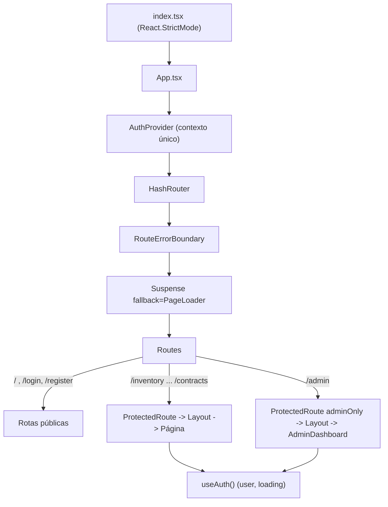
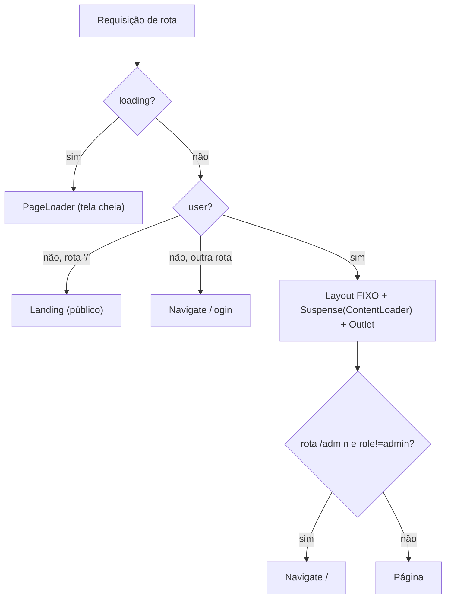
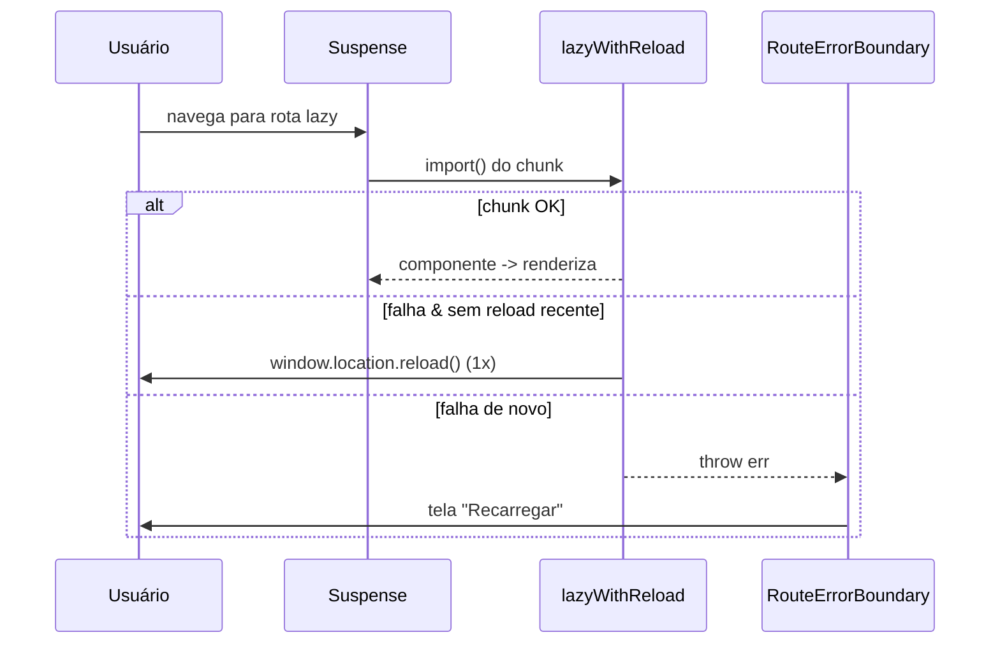

# Front-end (React SPA)

> Arquitetura da camada de interface do Cine Safe: roteamento por hash, rota protegida via único contexto de autenticação, páginas em lazy-loading resilientes a deploy, layout glassmorphism e convenções de UI pt-BR.

O Cine Safe é uma SPA React 18 + TypeScript, empacotada por Vite. Não há framework de servidor renderizando páginas: todo o app é cliente (`index.tsx` monta `<App/>` em `#root`), consumindo Firebase diretamente. Este documento cobre a espinha dorsal de front-end — roteamento, estado global, layout e padrões de UI. Para o catálogo detalhado de páginas, componentes, hooks e serviços, veja `reference/` (links no fim de cada seção).

---

## 1. Arquitetura de front-end

Composição de topo, em `App.tsx`:

```tsx
<AuthProvider>          // estado global de usuário (context/AuthContext.tsx)
  <HashRouter>          // roteamento por # (sem reescrita de servidor)
    <RouteErrorBoundary> // rede de segurança: nunca tela preta
      <Suspense fallback={<PageLoader />}> // enquanto o chunk lazy carrega
        <Routes> ... </Routes>
      </Suspense>
    </RouteErrorBoundary>
  </HashRouter>
  <Analytics />         // @vercel/analytics/react
</AuthProvider>
```



Pontos-chave:

- **`HashRouter`** (`App.tsx:117`): as rotas vivem no fragmento (`/#/inventory`). Isso dispensa reescrita de rota no servidor/CDN e simplifica o deploy estático (Vercel/`server.js` servindo `dist/`).
- **`AuthProvider` no topo** de tudo: qualquer rota (inclusive `PageLoader`/erro) pode ler o estado de sessão via `useAuth()`.
- **Code-splitting**: cada página é um chunk separado carregado sob demanda (seção 4), reduzindo o bundle inicial.
- **`<Analytics />`** fica fora do `HashRouter` mas dentro do provider, coletando métricas de página do Vercel.
- **PWA**: `index.tsx` registra `sw.js` em produção (`!hostname.includes('localhost')`) para cache offline.

Referências: `02-architecture.md` (visão macro do sistema), `reference/configuration.md` (Vite/Tailwind/deploy).

---

## 2. Tabela de rotas

Todas as rotas são declaradas em `App.tsx` (`<Routes>`, linhas 120-144). Cada página é um componente `lazy` exportado nomeadamente de `pages/`.

| Path | Página (componente) | Arquivo | Acesso |
| :--- | :--- | :--- | :--- |
| `/` | `RootRoute` → `Landing` (visitante) ou `Home` (logado) | `pages/Landing.tsx`, `pages/Home.tsx` | **Pública** (aberta); dashboard exige login |
| `/login` | `Login` | `pages/Login.tsx` | **Pública** |
| `/register` | `Register` | `pages/Register.tsx` | **Pública** |
| `/inventory` | `Inventory` | `pages/Inventory.tsx` | Protegida |
| `/report-theft` | `TheftReport` | `pages/TheftReport.tsx` | Protegida |
| `/rentals` | `Rentals` | `pages/Rentals.tsx` | Protegida |
| `/sales` | `Sales` | `pages/Sales.tsx` | Protegida |
| `/check-serial` | `SerialCheck` | `pages/SerialCheck.tsx` | Protegida |
| `/safety` | `SafetyMap` | `pages/SafetyMap.tsx` | Protegida |
| `/rankings` | `Rankings` | `pages/Rankings.tsx` | Protegida |
| `/profile` | `Profile` | `pages/Profile.tsx` | Protegida |
| `/notifications` | `Notifications` | `pages/Notifications.tsx` | Protegida |
| `/network` | `Network` | `pages/Network.tsx` | Protegida |
| `/chat` | `Chat` | `pages/Chat.tsx` | Protegida |
| `/contracts` | `Contracts` | `pages/Contracts.tsx` | Protegida |
| `/admin` | `AdminDashboard` | `pages/AdminDashboard.tsx` | **Admin** (`adminOnly`) |

Notas de precisão:

- Não há `path="*"` (catch-all). Um hash desconhecido não bate nenhuma `<Route>` e renderiza vazio; a `RouteErrorBoundary` cobre erros de carregamento, não 404 de rota.
- `/profile` e `/report-theft` **não** aparecem na navegação lateral (seção 5): `/profile` é acessado pelo avatar no rodapé e `/report-theft` pelo botão vermelho "REPORTAR".

Detalhamento de cada página em `reference/pages.md` e por feature em `features/`.

---

## 3. Shell persistente + rotas protegidas

O roteamento usa uma **rota de layout** (React Router v6) para manter o `Layout` (menu/sidebar) **montado de forma persistente** entre navegações. Só o conteúdo interno (`<Outlet/>`) troca ao mudar de página, e o `<Suspense>` vive **dentro** do `Layout` — então o menu nunca "pisca" durante o carregamento de um chunk. Ver ADR [`0010-shell-persistente-de-layout`](decisions/0010-shell-persistente-de-layout.md).

### `AppShell` (rota de layout, `App.tsx`)

```tsx
const AppShell: React.FC = () => {
  const { user, loading } = useAuth();
  const location = useLocation();
  if (loading) return <PageLoader />;                        // sessão resolvendo
  if (!user) {                                               // visitante:
    return location.pathname === '/'
      ? <Suspense fallback={<PageLoader />}><Landing /></Suspense>  // "/" = vitrine pública
      : <Navigate to="/login" replace />;                    // resto exige login
  }
  return (
    <Layout>                                                 {/* montado UMA vez */}
      <Suspense fallback={<ContentLoader />}>                {/* só o miolo carrega */}
        <Outlet />                                           {/* a página troca aqui */}
      </Suspense>
    </Layout>
  );
};
```

As rotas autenticadas são **filhas** dessa rota de layout (`<Route element={<AppShell/>}>` com `index` = `Home` e `path="inventory"`, `chat`, …). Regras codificadas:

1. Enquanto `loading`, `PageLoader` (tela cheia) — evita piscar a tela de login antes de saber se há sessão.
2. Visitante em `/` vê a `Landing`; em qualquer outra rota é mandado a `/login` (`replace`).
3. Autenticado: `Layout` fixo + `Outlet`. **Navegar entre páginas não remonta o `Layout`** — o menu permanece.
4. `/login`, `/register` ficam **fora** do shell (sem chrome), cada uma com seu próprio `<Suspense>`.

### `AdminOnly` (`App.tsx`)

Guarda a rota `/admin`: `if (user?.role !== 'admin') return <Navigate to="/" replace />`. O `AppShell` já garantiu autenticação, então aqui só resta a checagem de papel.

> Segurança: `AppShell`/`AdminOnly` são apenas guardas de UI. A autorização real é imposta pelo **Supabase** (Auth + RLS/permissões). Ver `04-security.md`.



---

## 4. Páginas lazy + `PageLoader` + `ErrorBoundary`

### `lazyWithReload` (`App.tsx:12-24`)

Todas as páginas são carregadas por `lazyWithReload`, um wrapper sobre `React.lazy` que trata o problema clássico de SPA após deploy: os hashes dos chunks mudam, mas um cliente antigo (ou service worker/CDN com HTML velho) tenta baixar um chunk que não existe mais.

```tsx
const lazyWithReload = (factory) =>
  lazy(() => factory().catch((err) => {
    const now = Date.now();
    const last = Number(sessionStorage.getItem('chunkReloadAt') || '0');
    if (now - last > 10000) {                 // no máximo 1 reload a cada 10s
      sessionStorage.setItem('chunkReloadAt', String(now));
      window.location.reload();               // pega index.html + chunks atuais
      return new Promise(() => {});           // suspende para sempre; o reload assume
    }
    throw err;                                // falhou de novo -> deixa o ErrorBoundary
  }));
```

Comportamento:

- Falha ao importar um chunk → recarrega a página **uma vez** (janela de 10s guardada em `sessionStorage['chunkReloadAt']`).
- Se falhar de novo logo em seguida, `throw err` propaga para a `RouteErrorBoundary`, que mostra tela amigável — **nunca uma tela preta**.

As 17 páginas são declaradas assim (`App.tsx:27-43`), ex.: `const Inventory = lazyWithReload(() => import('./pages/Inventory').then(m => ({ default: m.Inventory })))`. O `.then` reexporta o nome porque as páginas usam export nomeado, não default.

### `PageLoader` e `ContentLoader` (`App.tsx`)

- **`PageLoader`** — tela cheia `bg-brand-950` com spinner. Usado no estado `loading` da sessão e no `<Suspense>` das rotas **sem** chrome (`/login`, `/register`, `Landing`).
- **`ContentLoader`** — spinner **só na área de conteúdo** (`py-32`, sem tela cheia). É o fallback do `<Suspense>` que vive **dentro** do `Layout` no `AppShell`. Enquanto o chunk de uma página carrega, o menu permanece visível e só o miolo mostra o spinner — é o que elimina o "flash" de navegação.

### `RouteErrorBoundary` (`App.tsx`)

Class component (único jeito de capturar erros de render em React) que envolve o `<Routes>`:

- `getDerivedStateFromError` → `hasError = true`; `componentDidCatch` loga no console.
- Em erro, renderiza um cartão centralizado: "Não foi possível carregar esta página." + botão **Recarregar** que limpa `sessionStorage['chunkReloadAt']` e chama `window.location.reload()`, permitindo nova tentativa de reload automático.



---

## 5. Layout e navegação

`components/Layout.tsx` (`memo`) é o chrome aplicado a toda rota autenticada. Lê `user` e `logout` de `useAuth()` e monta duas navegações responsivas a partir de uma lista única `navItems` (`Layout.tsx:21-33`).

### Itens de navegação

| Ordem | Label | Rota | Ícone (`Icons.*`) |
| :--- | :--- | :--- | :--- |
| 1 | Início | `/` | `Home` |
| 2 | Notificações | `/notifications` | `MessageCircle` |
| 3 | Mensagens | `/chat` | `Mail` |
| 4 | Contratos | `/contracts` | `FileText` |
| 5 | Minha Rede | `/network` | `Users` |
| 6 | Inventário | `/inventory` | `Camera` |
| 7 | Alugar | `/rentals` | `ShoppingBag` |
| 8 | Comprar | `/sales` | `Tag` |
| 9 | Segurança | `/safety` | `Siren` |
| 10 | Verificar | `/check-serial` | `Search` |
| 11 | Ranking | `/rankings` | `Trophy` |

Além disso: link **Admin** (`/admin`) renderizado só se `user?.role === 'admin'` (`Layout.tsx:82`), com borda tracejada âmbar (`accent-warning`).

### Desktop — sidebar flutuante de vidro (`Layout.tsx:47-134`)

- `<aside>` `hidden md:flex`, largura fixa `w-[280px]`, com cartão `.glass` `rounded-[2rem]` e glow ciano no topo.
- `NavLink` marca o item ativo (barra lateral `bg-accent-primary`, ícone ciano, `bg-white/5`).
- Rodapé fixo: botão **REPORTAR** (gradiente vermelho → `/report-theft`) e cartão de perfil com avatar (link para `/profile`), primeiro nome, `reputationPoints` como "XP" e botão de logout.

### Mobile — header fixo + overlay (`Layout.tsx:137-185`)

- Header fixo no topo (`md:hidden`, `bg-brand-950/90 backdrop-blur-xl`) com logo e botão hambúrguer (`Icons.Menu`/`Icons.X`) controlado por `isMobileMenuOpen`.
- Menu overlay em tela cheia (`fixed inset-0`, `animate-fade-in`) com os mesmos `navItems`; cada clique chama `closeMobileMenu()`.

### Logout

`handleLogout` (`Layout.tsx:16-19`) chama `logout()` e navega para `/` — **não** para `/login`. Assim o usuário deslogado cai na Landing pública, não numa tela de acesso.

Conteúdo da página entra em `<main>` (`Layout.tsx:195`) com `max-w-7xl mx-auto`, scroll próprio (`overflow-y-auto`) e orbs de fundo decorativos. Catálogo de componentes reutilizáveis em `reference/components.md`.

O `Layout` também monta `<LocationGateModal />` (React Portal) ao final — o **gate obrigatório de localização** que bloqueia todas as telas autenticadas até o usuário informar cidade/estado (ver §6, "Onboarding").

---

## 6. Estado global: `AuthContext` (o único contexto)

`context/AuthContext.tsx` é o **único** React Context da aplicação. Toda outra "memória" é estado local de componente/hook ou vem direto do Firebase via serviços. A decisão é deliberada: só a identidade do usuário é verdadeiramente global e atravessa todas as rotas; dados de domínio (inventário, contratos, chat) são carregados sob demanda pelos hooks/serviços da própria página, evitando um store global e o acoplamento que ele traria.

### Formato do contexto (`AuthContext.tsx:6-13`)

```ts
interface AuthContextType {
  user: User | null;
  loading: boolean;
  login:   (e: string, p: string) => Promise<string | undefined>;
  register:(e: string, p: string, n: string, l: string, r?: string) => Promise<string | undefined>;
  logout:  () => Promise<void>;
  refreshUser: () => Promise<void>;
  loginWithGoogle: () => Promise<string | undefined>;
}
```

| Membro | Papel |
| :--- | :--- |
| `user` | Perfil autenticado (`User` de `types.ts`) ou `null`. Inclui `role`, `reputationPoints`, `avatarUrl`, `isBlocked` etc. |
| `loading` | `true` durante a resolução inicial da sessão e durante `login`/`register`. Guarda de UI em `ProtectedRoute`/`RootRoute`. |
| `login` | Autentica; resolve para `string` de erro (ou mensagem de bloqueio) ou `undefined` em sucesso. |
| `register` | Cadastra (email, senha, nome, localização, e `referralCode` opcional). Mesmo contrato de retorno. |
| `logout` | Encerra sessão no Firebase e zera `user`. |
| `refreshUser` | Recarrega o perfil via `userService.getUserProfile(user.id)`, disparando o **recálculo de reputação no cliente**. |
| `loginWithGoogle` | Dispara o OAuth do Google (`AuthService.loginWithGoogle` → `supabase.auth.signInWithOAuth`). Em sucesso o navegador é **redirecionado** para o Google (a Promise normalmente não resolve); em falha resolve para uma `string` de erro para a página exibir. |

### Ciclo de vida (`AuthContext.tsx:17-72`)

- **Boot** (`useEffect` de montagem): `AuthService.getSession()` recupera a sessão. Se o usuário estiver `isBlocked`, faz `logout()` e mantém `user = null`. Ao fim, `loading = false`.
- **`login`**: seta `loading`, chama `AuthService.login`. Se a conta voltar `isBlocked`, desloga e retorna a mensagem `"Esta conta foi bloqueada por um administrador."`. Caso contrário, define `user` e retorna o `error` do serviço.
- **`register`**: chama `AuthService.register`; em sucesso define `user`.
- **`refreshUser`**: usado após ações que mudam pontuação/estado do próprio usuário; não recria a sessão, apenas rebusca o perfil. Como `reputationPoints` é calculado no cliente (`calculateReputation` em `services/userService.ts`), este é o gancho que atualiza o "XP" exibido no `Layout`.

`useAuth()` (`AuthContext.tsx:81`) é o hook de acesso: `const { user } = useAuth()`.

Serviços consumidos: `reference/services.md` (`auth.ts`, `userService.ts`). Modelo do `User`: `03-data-model.md`.

### Onboarding: feedback, cadastro e localização

- **Feedback de clique** (`pages/Login.tsx`, `pages/Register.tsx`): todo botão que dispara uma ação assíncrona — `Entrar`/`Criar Conta` (submit) e `Google` — usa estado local (`submitting`, `googleLoading`) para ficar **desabilitado e exibir spinner + rótulo** ("Entrando…", "Criando conta…", "Conectando…") enquanto a requisição/redirect acontece. Isso evita a "tela morta" em que o usuário não sabe se o clique funcionou. O handler do Google (`handleGoogle`) aguarda `loginWithGoogle()`; como o sucesso redireciona o navegador, o loading só é revertido quando há **erro** (mensagem exibida no bloco de erro da página).
- **Cadastro sem rolagem** (`pages/Register.tsx`): o card é condensado (paddings/spacings menores, inputs `py-3`, logo reduzida) para caber inteiro na viewport — sem `overflow`/scroll interno. Todos os campos (nome, estado/cidade em grade 2 colunas, e-mail, senha) + botões ficam visíveis de uma vez em telas de laptop.
- **Localização no OAuth — gate obrigatório**: o cadastro por e-mail exige **estado + cidade** (via `IBGEService`, gravados como `"Cidade - UF"`). Já o login com Google **não coleta** localização — `AuthService.getSession` cria o perfil com o placeholder `location: 'Brasil'`. Para fechar essa lacuna há um **modal bloqueante** (`components/LocationGateModal.tsx`):
  - Renderizado via **React Portal** (`createPortal` para `document.body`, `z-[2000]`) e **montado uma vez no `Layout`** — logo cobre **todas** as telas autenticadas (tanto `RootRoute`/`Home` quanto qualquer `ProtectedRoute`).
  - **Auto-gate**: o próprio componente decide se aparece via `isLocationMissing` (`location` ausente, `=== 'Brasil'`, ou sem `" - "`); retorna `null` quando a localização é válida.
  - **Não-dispensável**: sem botão de fechar, sem clique-no-backdrop, sem `Esc`, e trava o scroll do `body`. Só o botão **"Finalizar acesso"** o encerra. Coleta Estado → Cidade (selects IBGE encadeados), grava via `userService.updateUserProfile(user.id, { location })` e chama `refreshUser()` — o `user.location` atualiza, `isLocationMissing` vira `false` e o modal desmonta.
  - **`Profile`** (`pages/Profile.tsx`) também tem os selects de Estado/Cidade (IBGE) para editar depois; o placeholder `'Brasil'` **não** é pré-carregado no campo de cidade, forçando uma seleção válida antes de salvar.

---

## 7. Design system (resumo)

O sistema visual completo — filosofia "Cyberpunk Clean", tabelas de cor por uso, especificação de botões/inputs/cards, banners de anúncio e mapas Leaflet — está em **`../DESIGN_SYSTEM.md`**. Aqui, apenas o essencial que amarra o código.

- **Paleta** (`tailwind.config.js:12-35`): escala `brand-950 → brand-50` (fundos e texto, de `#020410` a `#F8FAFC`) e acentos neon `accent-primary #22d3ee` (ciano) e `accent-secondary #a78bfa` (violeta), mais `success/danger/warning/blue/gold`.
- **Fonte**: `Plus Jakarta Sans` (Google Fonts CDN em `index.html:23`), registrada como `font-sans` no Tailwind e no `body` (`index.css:19`).
- **Glassmorphism** (`index.css:40-68`): utilitários `.glass`, `.glass-card` e `.glass-input` (fundo translúcido + `backdrop-filter: blur(...)` + borda `rgba(255,255,255,0.05)`). A sidebar usa `.glass`; inputs focam em borda ciano (`#22d3ee`) com glow.
- **Fundo global** (`index.css:13-22`): `#020410` com dois `radial-gradient` (orbs azul/violeta) `background-attachment: fixed`.
- **Animações** (`tailwind.config.js:48-61`): `animate-float` (flutuação) e `animate-fade-in` (entrada suave), usadas no `Layout` e nos overlays.

> Nota de duplicação: os utilitários glass e o CSS de `body`/scrollbar/`.line` existem **duas vezes** — inline em `index.html` (`<style>`, para pintar antes do CSS carregar) e em `index.css`. Mantenha os dois em sincronia ao alterar.

---

## 8. Hooks de domínio

A lógica de página é extraída para hooks em `hooks/`, mantendo os componentes de `pages/` focados em render. Presentes hoje:

| Hook | Responsabilidade |
| :--- | :--- |
| `useInventory` (`hooks/useInventory.ts`) | Estado completo da tela de inventário: CRUD de equipamento, upload de imagem/nota, checagem de serial, transferência de posse, modais e validação de formulário. Aplica `userService.checkLimit(...)` antes de adicionar (freemium). |
| `useUserStats` (`hooks/useUserStats.ts`) | Carrega em paralelo estatísticas do usuário e globais (`userService.getUserDetailedStats` / `getGlobalDetailedStats`). |
| `useAd` (`hooks/useAd.ts`) | Busca o anúncio ativo (`adService.getActiveAd`) e registra impressão. |

Catálogo detalhado (parâmetros, retorno, efeitos): **`reference/hooks.md`**. Regras de negócio subjacentes (limites freemium, reputação): `features/referral-and-freemium.md` e `features/reputation-and-rankings.md`.

---

## 9. Convenções de UI

Padrões transversais aplicados em toda a interface.

### Moeda e datas (`utils/formatters.ts`)

Todo valor monetário é BRL e toda data é pt-BR — sempre via os helpers, nunca formatação ad-hoc:

```ts
formatCurrency(1200)        // "R$ 1.200,00"   (style: currency, currency: BRL)
formatCompactCurrency(1200) // "R$ 1,2 mil"    (notation: compact)
formatDate('2026-07-08')    // "08/07/2026"    (toLocaleDateString('pt-BR'))
toTitleCase('sony a7')      // "Sony A7"
```

`formatDate` retorna `''` para entrada vazia. Alguns componentes formatam inline com a mesma locale/opções (ex.: `components/ContractModal.tsx:58`); o padrão canônico continua sendo `utils/formatters.ts`.

> **Exibição de preço sempre via helper.** Todo valor monetário renderizado passa por `formatCurrency` (ou `formatCompactCurrency` em badges) — nunca `toLocaleString('pt-BR')` cru, que mostra o milhar mas **descarta os centavos** ("R$ 16.900" em vez de "R$ 16.900,00"). Os cards de vitrine (`Sales`, `Rentals`, `Landing`) e o badge "transacionados" (`Network`) foram padronizados nesse formato; preços de anúncio usam `formatAdPrice` (§ acima).

### Entrada de moeda — máscara única (`CurrencyInput` + `utils/formatters.ts`)

Todo campo em que o usuário **digita** um preço/valor usa a mesma máscara: **ponto separa milhar, vírgula separa centavos** (`"16.900,00"`). A máscara é do tipo **"centavos"** — cada dígito digitado é um centavo, então o valor cresce da direita para a esquerda (digitar `1690000` → `16.900,00`).

```ts
maskCurrencyBRL('1690000')   // "16.900,00"  (texto livre → mascarado, sem símbolo)
parseCurrencyBRL('16.900,00')// 16900         (mascarado → número de reais)
numberToCurrencyMask(16900)  // "16.900,00"   (número salvo → texto do input; '' se ≤ 0)
formatAdPrice('16900')       // "R$ 16.900,00" (preço de anúncio legado/mascarado → BRL)
```

- **Campos numéricos** (valor estimado, diária, venda, valor de transação, valor de contrato) usam o componente **`components/CurrencyInput.tsx`** — controlado por um `number` (reais) via `value`/`onValueChange`. Substitui os antigos `<input type="number">`.
- **Campos string** (preço antigo/novo do anúncio em `AdminDashboard`) aplicam `maskCurrencyBRL` inline no `onChange`, guardando a string mascarada; o `AdBanner` **exibe** via `formatAdPrice`, que normaliza qualquer valor (legado `"16900"`, mascarado `"16.900,00"` ou com `R$` digitado) para `R$ 16.900,00` — sempre com milhar e centavos.

Pontos de entrada cobertos: `pages/Inventory.tsx` (×4), `components/ContractModal.tsx` (×1), `pages/AdminDashboard.tsx` (×2). Catálogo do componente em `reference/components.md`.

### Avatares (`components/UserAvatar.tsx`)

Regra de conteúdo: imagem de usuário sempre circular, `object-cover`. Quando não há foto real — `avatarUrl` ausente ou contendo `ui-avatars.com` (o placeholder gerado no cadastro em `services/auth.ts:56`) — o componente renderiza **iniciais** sobre um fundo de cor **determinística pelo nome** (`charCodeSum % COLORS.length`, 6 cores). Iniciais = primeira letra do primeiro e do último nome, senão os 2 primeiros caracteres.

O mesmo teste `avatarUrl.includes('ui-avatars')` é usado como sinal de "perfil incompleto" em `pages/Home.tsx:54`, na pontuação de reputação (`services/userService.ts:23`) e em `pages/Rankings.tsx:46`.

### Ícones

Todos via `components/Icons.tsx` (wrapper sobre `lucide-react`), referenciados como `Icons.Home`, `Icons.Trophy`, etc. — nunca importados soltos nas páginas.

Convenções completas de projeto (nomenclatura, layout de grid, responsividade) em `guides/conventions.md` e `../DESIGN_SYSTEM.md` (seções 8-9).

---

## Fontes no código

Arquivos-fonte lidos e documentados neste arquivo (rastreabilidade):

- `App.tsx` — roteamento, `lazyWithReload`, `PageLoader`, `ProtectedRoute`, `RootRoute`, `RouteErrorBoundary`.
- `components/Layout.tsx` — sidebar desktop, header/overlay mobile, `navItems`, logout.
- `context/AuthContext.tsx` — contexto único de autenticação.
- `index.css` e `index.html` — CSS global, glassmorphism, fontes/Leaflet via CDN, montagem.
- `index.tsx` — bootstrap do React e registro do service worker (PWA).
- `tailwind.config.js` — paleta `brand`/`accent`, fonte, animações.
- `utils/formatters.ts` — formatação BRL e datas pt-BR.
- `components/UserAvatar.tsx` — fallback de avatar por iniciais.
- `hooks/useInventory.ts`, `hooks/useUserStats.ts`, `hooks/useAd.ts` — hooks de domínio.
- `types.ts` — enums e interfaces (`Equipment`, `User`).
- `DESIGN_SYSTEM.md` — sistema visual (referência, não duplicado aqui).
