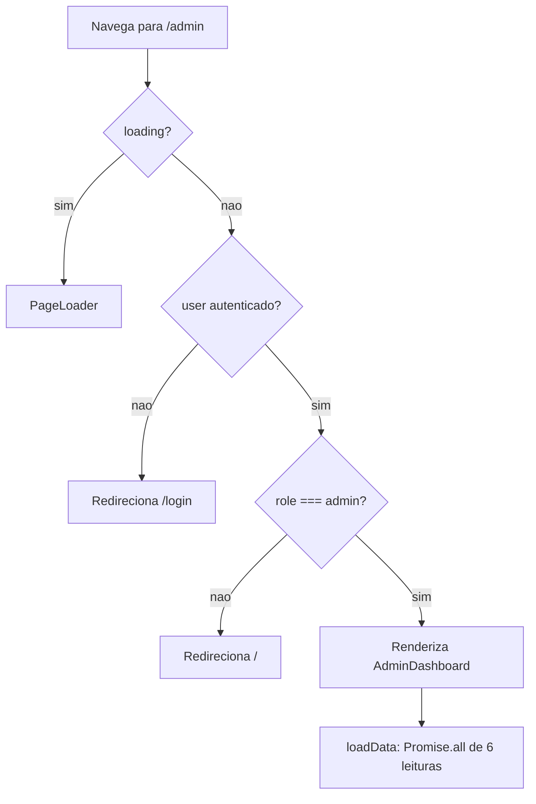
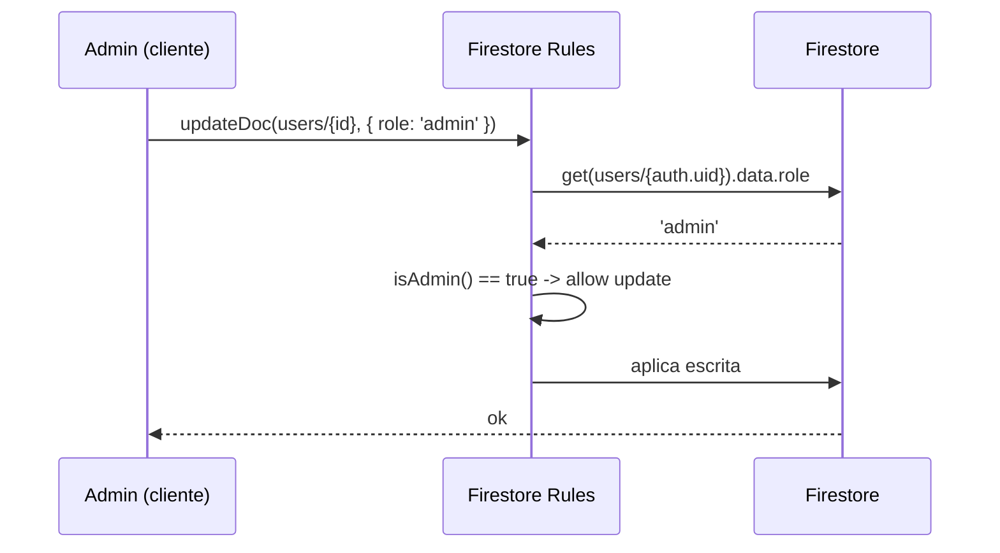

# Painel Administrativo

> Console de operação interno (`/admin`) onde usuários com `role === 'admin'` gerenciam usuários, anúncios, o histórico de transações e monitoram métricas globais — tudo client-side, apoiado por regras Firestore que concedem poderes de admin via `isAdmin()`.

O painel vive em [`pages/AdminDashboard.tsx`](../../pages/AdminDashboard.tsx) e consome três serviços: [`services/userService.ts`](../../services/userService.ts), [`services/adService.ts`](../../services/adService.ts) e [`services/contractService.ts`](../../services/contractService.ts). Não há backend próprio nem Cloud Functions — a autorização real é feita pelas [Firestore rules](../../firestore.rules).

---

## Acesso e proteção de rota

A rota é registrada em [`App.tsx`](../../App.tsx) com a flag `adminOnly`:

```tsx
// App.tsx:143
<Route path="/admin" element={<ProtectedRoute adminOnly={true}><AdminDashboard /></ProtectedRoute>} />
```

O `ProtectedRoute` (`App.tsx:53-67`) aplica duas barreiras em cascata:

| Condição | Comportamento |
| --- | --- |
| `loading` (auth ainda resolvendo) | Renderiza `<PageLoader />` |
| `!user` (não autenticado) | `<Navigate to="/login" replace />` |
| `adminOnly && user.role !== 'admin'` | `<Navigate to="/" replace />` |
| autenticado + admin | Renderiza `<Layout>{children}</Layout>` |

O link do painel na navegação lateral também é condicional a `user?.role === 'admin'` ([`components/Layout.tsx:82`](../../components/Layout.tsx)). O componente `AdminDashboard` é carregado com `lazyWithReload` (auto-reload em chunk stale após deploy).

> **Importante (segurança):** a checagem de rota é apenas de UX. Ela impede a renderização do painel para não-admins, mas quem for autoridade real é a Firestore rule `isAdmin()` — qualquer chamada de escrita/leitura privilegiada é validada no servidor de regras, não no cliente. Ver [Riscos](#riscos-admin-no-cliente).



---

## Carregamento de dados (`loadData`)

Ao montar, o painel dispara `loadData()` (`AdminDashboard.tsx:54-74`), que executa em paralelo (`Promise.all`):

| Fonte | Chamada | Retorno usado |
| --- | --- | --- |
| Usuários | `userService.getAllUsers()` | lista de `User` com reputação + `inventoryCount` calculados no cliente |
| Anúncios | `adService.getAllAds()` | lista de `Ad` ordenada por `startDate` desc |
| Métricas globais | `userService.getGlobalDetailedStats()` | agregações `count`/`sum` + `stats/global` |
| Transações | `contractService.getAllContracts()` | todos os `Contract`, ordenados por `createdAt` desc |
| Itens roubados | `getDocs(query(equipment, where('status','==','STOLEN')))` | `Equipment[]` |
| Recuperações | `getDocs(collection('theft_history'))` | histórico ordenado por `recoveryDate` desc |

Depois do `Promise.all`, ainda há uma leitura extra sequencial para a contagem de usuários:

```ts
// AdminDashboard.tsx:65
const usersCount = (await getDocs(collection(db, 'users'))).size;
```

> A coleção `users` é lida duas vezes por carregamento (uma em `getAllUsers`, outra para `usersCount`). Detalhe de eficiência registrado em [Riscos](#riscos-admin-no-cliente).

---

## Abas / seções reais

O estado `activeTab` é `'users' | 'ads' | 'transactions' | 'incidents'` (`AdminDashboard.tsx:25`). A barra de navegação renderiza quatro abas (`AdminDashboard.tsx:138-155`), nesta ordem visual:

| Aba (rótulo UI) | `activeTab` | Conteúdo |
| --- | --- | --- |
| Usuários | `users` | Grid de cards de usuário + busca por nome/email |
| Transações | `transactions` | Histórico de contratos + busca + filtro de datas |
| Roubos & Recuperações | `incidents` | Duas colunas: itens `STOLEN` ativos e `theft_history` |
| Anúncios | `ads` | CRUD de campanhas de banner + upload de imagem |

Acima das abas, uma faixa de cinco `StatCard` (`AdminDashboard.tsx:130-136`) exibe métricas globais.

---

## Métricas globais (topo)

Os cinco cartões consomem `globalStats` (`AdminDashboard.tsx:27,68`):

| Cartão | Campo | Origem |
| --- | --- | --- |
| Usuários Totais | `globalStats.users` | `getDocs(collection('users')).size` |
| Equipamentos | `globalStats.equipment` | `getGlobalDetailedStats().totalItems` (`getCountFromServer`) |
| Transações | `globalStats.transactions` | `getGlobalDetailedStats().transactionsCount` — campo `transactions` de `stats/global` |
| Itens Roubados | `globalStats.stolen` | `getGlobalDetailedStats().stolenItems` (`count` de `status == STOLEN`) |
| Valor Protegido | `globalStats.value` | `getGlobalDetailedStats().totalValue` (`sum('value')`), formato `compact` BRL |

`getGlobalDetailedStats` ([`services/userService.ts:249-282`](../../services/userService.ts)) usa **queries de agregação** (`getCountFromServer`, `getAggregateFromServer` com `sum`/`count`) em vez de baixar as coleções inteiras, e lê o doc agregado `stats/global` para `transactions`/`transactedValue`. Os contadores de notificação (`rentalOffers`/`saleOffers`) são zerados de propósito no global — são dados privados por destinatário.

O contador `stats/global.transactions` é incrementado em `contractService.acceptContract` (`contractService.ts:91-96`) a cada aceite de contrato, com `increment(1)` e `transactedValue: increment(value)`. Ver [contratos e pagamentos](./contracts-and-payments.md).

---

## Gestão de usuários (aba `users`)

### Listagem e reputação

`userService.getAllUsers()` ([`services/userService.ts:142-153`](../../services/userService.ts)) baixa **todos** os docs de `users` **e todos** os de `equipment`, e para cada usuário:

- filtra o equipamento por `ownerId`;
- calcula `reputationPoints` via `calculateReputation` (client-side, não autoritativo — `userService.ts:21-44`);
- preenche `inventoryCount = userEq.length`.

No componente, `sortedUsers` (`AdminDashboard.tsx:108`) aplica o filtro textual e ordena por `reputationPoints` desc:

```ts
const sortedUsers = [...users]
  .filter(u => u.name.toLowerCase().includes(userFilter.toLowerCase())
            || u.email.toLowerCase().includes(userFilter.toLowerCase()))
  .sort((a, b) => (b.reputationPoints || 0) - (a.reputationPoints || 0));
```

> **Busca por nome/email:** é um filtro **client-side** sobre a lista já carregada (`userFilter`, `AdminDashboard.tsx:161`), não a função `userService.searchUsers`. Só encontra usuários que já vieram no `getAllUsers`.

Cada card mostra avatar, nome, email, badge de `role`, `isVerified`, e os números `reputationPoints` (XP), `inventoryCount` (Itens) e `reportsCount` (Reports). Clicar no card abre o modal de detalhes via `handleUserClick`, que chama `userService.getStats(user.id)` (`userService.ts:298-304`) para `{ total, value, stolen, forRent, forSale }` do patrimônio do usuário.

### Ações administrativas

Todas passam por `ConfirmModal` (confirmação explícita) antes de executar. As ações destrutivas usam `isDestructive: true`.

| Ação (UI) | Handler | Serviço | Efeito Firestore |
| --- | --- | --- | --- |
| Tornar/Remover Admin | `handleToggleRole` (`:85`) | `userService.toggleUserRole(id, newRole)` | `updateDoc(users/{id}, { role })` alterna `admin`⇄`user` |
| Bloquear/Desbloquear | `handleBlockUser` (`:86`) | `userService.toggleUserBlock(id, current)` | `updateDoc(users/{id}, { isBlocked: !current })` |
| Excluir Usuário | `handleDeleteUser` (`:84`) | `userService.deleteUser(id)` | cascade (ver abaixo) |

Após cada ação, o painel chama `loadData()` de novo para revalidar a UI.

### `deleteUser` e o cascade de equipamento

`userService.deleteUser` ([`services/userService.ts:162-170`](../../services/userService.ts)) faz:

```ts
const q = query(collection(db, 'equipment'), where('ownerId', '==', userId));
const snapshot = await getDocs(q);
snapshot.forEach(async (d) => await deleteDoc(d.ref)); // exclui cada equipamento do dono
await deleteDoc(doc(db, 'users', userId));              // exclui o perfil
```

Ou seja: exclui em cascata os documentos de `equipment` cujo `ownerId` é o usuário e, em seguida, o próprio doc `users/{id}`.

> **Limitações reais do cascade:**
> - As exclusões de equipamento estão dentro de `forEach(async …)` **sem `await`/`Promise.all`** — são disparadas em paralelo e **não são aguardadas** antes do `deleteDoc` do usuário. Se alguma falhar, pode deixar equipamento órfão sem sinalizar erro (a função retorna `true` de qualquer forma).
> - **Não há limpeza de Storage:** avatares (`users/{uid}/avatar/**`) e imagens de equipamento (`users/{uid}/equipment/**`) permanecem no bucket.
> - **Não há cascade** para `contracts`, `notifications`, `chats`, `theft_history` ou `connections` de terceiros que referenciem o usuário excluído.

---

## Histórico de transações (aba `transactions`)

Fonte: `contractService.getAllContracts()` ([`services/contractService.ts:105-110`](../../services/contractService.ts)) — lê **toda** a coleção `contracts` e ordena por `createdAt` desc. Só admins conseguem essa leitura ampla (regra `contracts`: `read if … isAdmin()`).

### Busca por nome/email + filtro de datas

Adicionado nos commits recentes (`feat: busca por nome/email nas transações do admin`). A lógica de filtro é toda client-side (`AdminDashboard.tsx:109-119`):

1. Um índice `emailById` é montado a partir da lista `users` já carregada (`AdminDashboard.tsx:109-110`), mapeando `userId → email`.
2. `filteredTx` aplica, em ordem:
   - **filtro de data inicial** `txFrom`: descarta se `c.createdAt.slice(0,10) < txFrom`;
   - **filtro de data final** `txTo`: descarta se `c.createdAt.slice(0,10) > txTo`;
   - **busca textual** `txSearch`: casa contra `ownerName`, `counterpartyName`, e os emails resolvidos via `emailById[ownerId]` / `emailById[counterpartyId]`.

```ts
return [c.ownerName, c.counterpartyName, emailById[c.ownerId], emailById[c.counterpartyId]]
  .some(v => (v || '').toLowerCase().includes(txQuery));
```

3. `filteredTxTotal` soma `value` das transações filtradas para o rodapé ("X transações / R$ Y movimentados").

> A busca por **email** só funciona para partes cujo perfil está na lista `users` carregada (o `emailById` deriva dela). Nomes vêm denormalizados no próprio contrato (`ownerName`/`counterpartyName`), então a busca por nome é mais robusta que a por email.

### Renderização das linhas

Cada linha mostra: badge de tipo (`Venda`/`Aluguel`, de `c.type`), `equipmentName`, `ownerName → counterpartyName`, valor em BRL, data (`createdAt`, `pt-BR`) e um badge de status mapeado por `TX_STATUS` (`AdminDashboard.tsx:15-21`):

| `status` | Rótulo |
| --- | --- |
| `proposed` | Proposta |
| `active` | Ativo |
| `completed` | Concluído |
| `declined` | Recusado |
| `cancelled` | Cancelado |

---

## Roubos & Recuperações (aba `incidents`)

Duas colunas lado a lado (`AdminDashboard.tsx:343-385`):

- **Itens Roubados** — `stolen`, alimentado por `equipment` com `status == 'STOLEN'`; mostra imagem, nome, `theftAddress`, `value` e `theftDate`.
- **Itens Recuperados** — `recovered`, da coleção `theft_history` ordenada por `recoveryDate` desc; mostra se foi `recoveredViaApp` ("pelo app" vs "outros meios"), `theftAddress`, `equipmentValue` e `recoveryDate`.

Essa aba é leitura pura (nenhuma escrita). `theft_history` é imutável por regra (`allow update, delete: if false`). Ver [roubo e segurança](./theft-and-safety.md).

---

## Gestão de anúncios (aba `ads`)

CRUD completo de banners de marketing via [`services/adService.ts`](../../services/adService.ts). O `Ad` (tipo em [`types.ts:194-213`](../../types.ts)) inclui `tagline`, `title`, `priceOld`/`priceNew`, `buttonText`, `imageUrl` (PNG de produto), `linkUrl`, `startDate`/`endDate`, `weight` (1–10), `active`, `impressions`, `clicks`.

| Operação | Handler | Serviço | Firestore |
| --- | --- | --- | --- |
| Listar | `loadData` | `adService.getAllAds()` | `getDocs(query(ads, orderBy('startDate','desc')))` |
| Criar | `handleSaveAd` (sem `editingAdId`) | `adService.createAd(ad)` | `setDoc(ads/{id})` com `id = crypto.randomUUID()` |
| Editar | `handleSaveAd` (com `editingAdId`) | `adService.updateAd(ad)` | `updateDoc(ads/{id})` |
| Excluir | `handleDeleteAd` | `adService.deleteAd(id)` | `deleteDoc(ads/{id})` |

### Formulário e validação

`adForm` é `Partial<Ad>` com defaults (`AdminDashboard.tsx:42`). A validação (`AdminDashboard.tsx:52`) exige `title`, `buttonText`, `startDate`, `endDate` **e** uma imagem (`adImagePreview`) para habilitar o botão "Salvar Campanha" (`isAdFormValid`). Campos opcionais (`linkUrl`, `tagline`, `priceOld`, `priceNew`) só entram no `dataToSave` se preenchidos (`AdminDashboard.tsx:97`), para não gravar `undefined`.

### Upload de imagem

`adService.uploadAdImage(file)` ([`services/adService.ts:69-74`](../../services/adService.ts)) processa a imagem para WebP (`processImageForWebP`) e envia via `resilientUpload` para `ads/{Date.now()}.webp` no Storage (leitura pública, escrita admin). No handler `handleSaveAd` (`AdminDashboard.tsx:90-103`):

- se o upload lançar `CORS_CONFIG_ERROR`, chama `handleCorsError()` — modal explicando que a política CORS do bucket precisa ser ajustada no Google Cloud;
- se não houver `imageUrl`, aborta com alerta "A imagem do produto é obrigatória".

> A seleção do banner exibido ao usuário final (`adService.getActiveAd`) é **aleatória ponderada por `weight`** e filtrada por janela `startDate`/`endDate` e `active`. Métricas `impressions`/`clicks` são incrementadas por qualquer autenticado (`trackAdImpression`/`trackAdClick`). Detalhes em [publicidade](./advertising.md).

---

## Como as rules concedem poderes de admin

A função central em [`firestore.rules`](../../firestore.rules) é `isAdmin()` (linhas 15-18):

```js
function isAdmin() {
  return isSignedIn() &&
    get(/databases/$(database)/documents/users/$(request.auth.uid)).data.role == 'admin';
}
```

Ela faz um **`get` no próprio documento do chamador** (`users/{auth.uid}`) e verifica `role == 'admin'`. Não confia em custom claims nem em nada do cliente — a fonte de verdade do papel é o campo `role` do perfil, que por sua vez só pode ser alterado por um admin (ou pela própria regra de `update` de `users`).

Onde `isAdmin()` é usada:

| Coleção | Poder concedido ao admin | Regra |
| --- | --- | --- |
| `users` | `update` (promover/bloquear/editar qualquer campo) e `delete` | `firestore.rules:37,46` |
| `equipment` | `update` e `delete` de qualquer item | `firestore.rules:61,76` |
| `ads` | `create` e `delete` (banners) | `firestore.rules:102` |
| `contracts` | `read` de **todos** os contratos (histórico) | `firestore.rules:125` |

Na regra de `users` (`firestore.rules:37-44`), a validação por campo é o mecanismo anti-escalonamento: um dono comum pode editar o próprio perfil **exceto** `role`, `isBlocked` e `referralCount` (que precisam ficar iguais ao valor atual); somente `isAdmin()` pode mudar esses campos. É isso que permite ao painel promover, bloquear e excluir usuários sem que um usuário comum consiga fazer o mesmo em si mesmo.



> Nota de leitura extra: cada avaliação de `isAdmin()` faz um `get` (contabilizado como leitura). Em `contracts.read`, a expressão `request.auth.uid in resource.data.parties || isAdmin()` só chega ao `get` quando o chamador não é parte — para as partes do contrato, o `get` é curto-circuitado.

---

## Riscos (admin no cliente)

Registro honesto de limitações reais do modelo atual (sem backend próprio):

1. **Autorização de UI vs. dados.** O `ProtectedRoute adminOnly` só esconde a tela; a autoridade é a rule `isAdmin()`. Correto em princípio, mas todo o poder de admin depende de `role` no doc `users` — quem consegue escrever `role` (outro admin) pode promover qualquer conta. Não há segunda barreira (2FA, allowlist de UIDs, custom claims).

2. **`deleteUser` não-transacional.** Cascade de equipamento em `forEach(async …)` sem aguardar (`userService.ts:166`): falhas silenciosas → equipamento órfão; retorno sempre `true`. Sem limpeza de Storage nem de `contracts`/`notifications`/`chats`/`theft_history` relacionados.

3. **Sem paginação.** `getAllUsers` baixa **users inteira + equipment inteira**; `getAllContracts` baixa **contracts inteira**; `getAllAds` baixa **ads inteira**. Não escala; a busca textual (usuários e transações) opera só sobre o conjunto já carregado em memória. A coleção `users` ainda é lida duas vezes por `loadData` (`getAllUsers` + `usersCount`).

4. **Reputação não autoritativa.** `reputationPoints` e `inventoryCount` são calculados no cliente em `getAllUsers`/`calculateReputation`; não são persistidos de forma confiável nem verificáveis pelas rules.

5. **Contadores globais graváveis por qualquer autenticado.** A regra de `stats` é `allow write: if isSignedIn()` (`firestore.rules:137`). Os números de impacto (`transactions`, `transactedValue`) exibidos no topo do painel não são à prova de adulteração.

6. **Sem trilha de auditoria.** Ações de admin (bloquear, excluir, promover) não geram log/registro imutável de quem fez o quê e quando.

> Estas pendências alinham com o registrado em [`FIREBASE_RULES.md`](../../FIREBASE_RULES.md) e no modelo de [segurança](../04-security.md): a mitigação definitiva (mover validações e cascades para Cloud Functions / camada server) está pendente.

---

## Referências cruzadas

- [Modelo de dados](../03-data-model.md) — coleções `users`, `equipment`, `ads`, `contracts`, `stats/global`, `theft_history`.
- [Segurança](../04-security.md) — modelo de regras e validação por campo.
- [Serviços](../reference/services.md) — assinaturas de `userService`, `adService`, `contractService`.
- [Publicidade](./advertising.md) — seleção ponderada de banners e métricas.
- [Contratos e pagamentos](./contracts-and-payments.md) — ciclo de vida dos contratos que alimentam o histórico.
- [Roubo e segurança](./theft-and-safety.md) — `theft_history` e itens `STOLEN`.

---

## Fontes no código

- [`pages/AdminDashboard.tsx`](../../pages/AdminDashboard.tsx) — componente do painel, abas, filtros e handlers.
- [`services/userService.ts`](../../services/userService.ts) — `getAllUsers`, `toggleUserBlock`, `toggleUserRole`, `deleteUser`, `getGlobalDetailedStats`, `getStats`.
- [`services/adService.ts`](../../services/adService.ts) — `createAd`, `updateAd`, `deleteAd`, `getAllAds`, `uploadAdImage`.
- [`services/contractService.ts`](../../services/contractService.ts) — `getAllContracts`, `acceptContract` (incremento de `stats/global`).
- [`firestore.rules`](../../firestore.rules) — `isAdmin()` e concessões de admin em `users`, `equipment`, `ads`, `contracts`.
- [`App.tsx`](../../App.tsx) — `ProtectedRoute` com `adminOnly` e a rota `/admin`.
- [`components/Layout.tsx`](../../components/Layout.tsx) — link de navegação condicional a `role === 'admin'`.
- [`types.ts`](../../types.ts) — interfaces `Ad`, `Contract`, `DetailedStats`.
