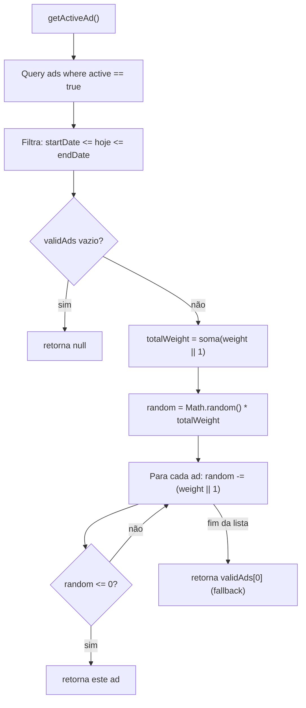

# Anúncios (Advertising)

> Banners de marketing rotativos, com seleção aleatória ponderada por peso e contabilização de impressões/cliques, geridos pelo painel administrativo.

A feature de Anúncios exibe um banner promocional composto (o `AdBanner`) em algumas telas internas do app. Cada carregamento de tela escolhe **um** anúncio ativo dentro da janela de datas, usando **sorteio aleatório ponderado** pelo campo `weight`, registra a impressão e — no clique — abre o link de destino e registra o clique. Toda a criação/edição/exclusão de campanhas e o upload de imagem são restritos ao administrador.

- Coleção Firestore: `ads`
- Storage: `ads/{filename}` (imagens WebP)
- Serviço: [`services/adService.ts`](../../services/adService.ts)
- Hook: [`hooks/useAd.ts`](../../hooks/useAd.ts)
- Componente: [`components/AdBanner.tsx`](../../components/AdBanner.tsx)
- Admin: [`pages/AdminDashboard.tsx`](../../pages/AdminDashboard.tsx) (aba `ads`)

---

## Modelo de dados: `Ad`

Definido em [`types.ts`](../../types.ts) (`interface Ad`). O documento é um banner composto: os campos textuais/numéricos alimentam as camadas do `AdBanner` e a imagem é um **PNG de produto com fundo transparente**.

| Campo | Tipo | Obrigatório | Descrição |
| --- | --- | --- | --- |
| `id` | `string` | sim | ID do documento. Novos anúncios usam `generateUUID()` (AdminDashboard). |
| `advertiserName` | `string` | sim | Nome da marca / rótulo interno. Não é exibido no banner; serve de referência no admin. Default do formulário: `'Cine Safe'`. |
| `tagline` | `string?` | não | Selo curto (badge) no topo do banner. Ex.: `OFERTA ESPECIAL`, `BLACK MONTH`. |
| `title` | `string` | sim | Título principal (`h3`). |
| `priceOld` | `string?` | não | Preço "de" (riscado). Texto livre (ex.: `R$ 16.990`). |
| `priceNew` | `string?` | não | Preço "por" (destaque). Texto livre (ex.: `R$ 13.997`). |
| `buttonText` | `string` | sim | Rótulo do botão de CTA (ex.: `Conferir`). |
| `imageUrl` | `string` | sim | URL da imagem do produto (PNG transparente, processado para WebP no upload). |
| `linkUrl` | `string?` | não | URL de destino. Sem ela, o banner **não** é clicável (não abre nada nem registra clique). |
| `startDate` | `string` | sim | Data de início. Preenchida por `<input type="date">` → formato `YYYY-MM-DD`. |
| `endDate` | `string` | sim | Data de fim (inclusive). Mesmo formato. |
| `weight` | `number` | sim | Peso do sorteio, `1`–`10` no formulário. Quanto maior, maior a probabilidade de ser escolhido. |
| `active` | `boolean` | sim | Liga/desliga a campanha. `getActiveAd` filtra por `active == true`. |
| `impressions` | `number` | sim | Contador de exibições (incrementado por `trackAdImpression`). |
| `clicks` | `number` | sim | Contador de cliques (incrementado por `trackAdClick`). |

> Precisão: preços (`priceOld`/`priceNew`) são **strings livres**, não números — a formatação (`R$`, separadores) é responsabilidade de quem cadastra. Os campos são opcionais e o bloco de preço só renderiza se ao menos um existir.

---

## Serviço: `adService`

Objeto exportado por [`services/adService.ts`](../../services/adService.ts). Cliente-only (Firestore modular + Storage compat), sem backend próprio.

| Método | Assinatura | Comportamento |
| --- | --- | --- |
| `createAd` | `(ad: Ad) => Promise<boolean>` | `setDoc(doc(db,'ads',ad.id), ad)`. Retorna `false` em erro (catch silencioso). |
| `updateAd` | `(ad: Ad) => Promise<boolean>` | `updateDoc(doc(db,'ads',ad.id), {...ad})`. Retorna `false` em erro. |
| `deleteAd` | `(id: string) => Promise<boolean>` | `deleteDoc(doc(db,'ads',id))`. Retorna `false` em erro. |
| `getAllAds` | `() => Promise<Ad[]>` | Query em `ads` ordenada por `startDate` desc. Usado no admin. |
| `getActiveAd` | `() => Promise<Ad \| null>` | Filtra ativos na janela de datas e faz **sorteio ponderado** (ver abaixo). |
| `trackAdImpression` | `(id: string) => Promise<void>` | `updateDoc(..., { impressions: increment(1) })`. Erros logados, não propagam. |
| `trackAdClick` | `(id: string) => Promise<void>` | `updateDoc(..., { clicks: increment(1) })`. Erros logados, não propagam. |
| `uploadAdImage` | `(file: File) => Promise<string \| null>` | Processa para WebP e sobe em `ads/{timestamp}.webp` (ver [Upload de imagem](#upload-de-imagem)). |

### `getActiveAd`: seleção aleatória ponderada

Código-fonte: [`services/adService.ts:39-55`](../../services/adService.ts).

```ts
getActiveAd: async (): Promise<Ad | null> => {
  const now = new Date().toISOString().split('T')[0]; // 'YYYY-MM-DD'
  const q = query(collection(db, 'ads'), where('active', '==', true));
  const snap = await getDocs(q);
  const validAds = snap.docs
    .map(d => d.data() as Ad)
    .filter(ad => ad.startDate <= now && ad.endDate >= now);

  if (validAds.length === 0) return null;

  const totalWeight = validAds.reduce((sum, ad) => sum + (ad.weight || 1), 0);
  let random = Math.random() * totalWeight;

  for (const ad of validAds) {
    random -= (ad.weight || 1);
    if (random <= 0) return ad;
  }
  return validAds[0]; // fallback
}
```

Passos:

1. **Filtro de janela** — só documentos com `active == true` e `startDate <= hoje <= endDate`. A comparação de datas é **lexicográfica sobre strings**; funciona porque o formato `YYYY-MM-DD` (gerado pelo `<input type="date">` e por `toISOString().split('T')[0]`) é ordenável cronologicamente. O fim é **inclusive** (`endDate >= now`).
2. **Peso total** — soma de `weight` de todos os válidos; ausência/zero cai para `1` via `ad.weight || 1`.
3. **Sorteio** — `random = Math.random() * totalWeight` e, percorrendo a lista, subtrai o peso de cada anúncio até `random <= 0`, retornando o anúncio "sob o ponteiro". A probabilidade de cada anúncio é `weight / totalWeight`.
4. **Fallback** — se o loop não retornar (borda de ponto flutuante), retorna o primeiro válido.



**Exemplo.** Três anúncios ativos e vigentes, pesos `A=6`, `B=3`, `C=1` → `totalWeight = 10`. Probabilidades: A = 60%, B = 30%, C = 10%. Se `Math.random()*10` = `7.4`: `7.4-6=1.4` (>0), `1.4-3=-1.6` (≤0) → retorna **B**.

> A seleção é feita **por carregamento** (uma vez por montagem de tela via `useAd`), não em intervalo/rotação automática. "Rotação" acontece a cada nova visita/navegação para uma tela que use o hook.

---

## Hook: `useAd`

Código-fonte: [`hooks/useAd.ts`](../../hooks/useAd.ts).

```ts
export const useAd = () => {
  const [ad, setAd] = useState<Ad | null>(null);
  const [loading, setLoading] = useState(true);

  useEffect(() => {
    const fetchAd = async () => {
      setLoading(true);
      const activeAd = await adService.getActiveAd();
      setAd(activeAd);
      if (activeAd) {
        await adService.trackAdImpression(activeAd.id);
      }
      setLoading(false);
    };
    fetchAd();
  }, []);

  return { ad, loading };
};
```

- Busca **um** anúncio no mount (`useEffect` com deps `[]`) e registra **uma impressão** se houver anúncio.
- Retorna `{ ad, loading }`. As páginas renderizam `{ad && <AdBanner ad={ad} />}` — se `ad` for `null` (nenhum ativo/vigente), nada é exibido.
- A impressão é contabilizada no **carregamento**, independente de o banner entrar no viewport ou de o usuário interagir.

---

## Componente: `AdBanner`

Código-fonte: [`components/AdBanner.tsx`](../../components/AdBanner.tsx). Componente `memo`-izado; recebe `ad: Ad` como única prop.

### Camadas (empilhamento por z-index)

| Camada | z-index | Conteúdo |
| --- | --- | --- |
| Fundo de linhas concêntricas | `z-0` | 30 `div.line` posicionadas no canto superior direito. |
| Imagem do produto | `z-10` | PNG à direita, com fade-in e hover-scale. |
| Gradiente de legibilidade | `z-20` | `bg-gradient-to-r from-black/60 ... to-transparent` cobrindo a esquerda (largura `4/5` mobile, `3/4` em `md`). |
| Conteúdo textual | `z-30` | Tagline (badge), título, preços e botão de CTA. |

### Linhas concêntricas

O banner mapeia `Array.from({ length: 30 })` para 30 `<div className="line" />`. A geometria vem do CSS global [`index.css:78-125`](../../index.css): cada `.line` é um círculo (`border-radius: 50%`) com raio crescente (`200px` → `3100px`) ancorado no canto superior direito, formando um padrão de ondas/curvas de nível. A opacidade da borda decai em três faixas (mais visível nas 10 primeiras, mais tênue a partir da 21ª). É puramente decorativo (`pointer-events-none`).

### Renderização condicional dos elementos

- `tagline` → badge com gradiente laranja→amarelo (só se presente).
- `title` → sempre renderizado (`h3`, `text-3xl`).
- Bloco de preço → só se `priceOld || priceNew`. `priceOld` aparece riscado (`line-through`); `priceNew` em destaque.
- `buttonText` → botão branco com ícone `ArrowRight` (só se presente).
- `imageUrl` → imagem à direita (só se presente).

### Fade-in da imagem e "rotation reset"

```tsx
const [isImageLoaded, setIsImageLoaded] = useState(false);
useEffect(() => { setIsImageLoaded(false); }, [ad.imageUrl]);
```

A imagem começa `opacity-0 translate-y-4` e transita para `opacity-100 translate-y-0` no `onLoad` (`transition-all duration-700`). O `useEffect` **reseta** `isImageLoaded` sempre que `ad.imageUrl` muda, garantindo o efeito de entrada quando um novo anúncio ocupa o mesmo componente montado (rotação). Carregamento é `loading="eager"`.

### Clique e rastreio

```tsx
const handleClick = async () => {
  if (!ad || !ad.linkUrl) return;
  await adService.trackAdClick(ad.id);
  window.open(ad.linkUrl, '_blank');
};
```

O card inteiro é clicável apenas quando há `linkUrl` (a classe `cursor-pointer` é condicional). O clique registra o clique e abre o destino em nova aba.

### Responsividade

Card com altura fixa `h-64` e `w-full`; texto ocupa `w-full` no mobile e `md:w-2/3`; a imagem ocupa `w-1/2` no mobile e `md:w-3/5`. Bordas arredondadas `rounded-[2.5rem]`, `border-white/10` e leve `hover:scale-[1.01]`.

---

## Onde o banner aparece

`useAd` + `AdBanner` são usados nestas telas (protegidas por login):

| Página | Arquivo | Contexto |
| --- | --- | --- |
| Home | [`pages/Home.tsx:66`](../../pages/Home.tsx) | Em grid de 2 colunas ao lado do card de boas-vindas quando há anúncio (`grid-cols-1 lg:grid-cols-2`); 1 coluna quando não há. |
| Verificação de série | [`pages/SerialCheck.tsx:70`](../../pages/SerialCheck.tsx) | Acima do formulário/resultado de checagem. |
| Notificações | [`pages/Notifications.tsx:142`](../../pages/Notifications.tsx) | Bloco acima da lista de notificações. |

> Correção factual: o banner **não** é renderizado nas telas de marketplace (Aluguéis/Vendas). Sua presença atual é Home, Verificação de Série e Notificações. Cada uma dessas telas chama `useAd()` de forma independente, então cada visita/navegação dispara nova seleção e nova impressão.

---

## Administração: CRUD e upload (somente admin)

Todo o gerenciamento vive na aba **`ads`** de [`pages/AdminDashboard.tsx`](../../pages/AdminDashboard.tsx), rota `/admin` (adminOnly).

### Formulário

- **Imagem**: `<input type="file" accept="image/png">` — a UI orienta enviar PNG (~600px de altura). Preview local via `FileReader` (data URL).
- Campos: Tag (`tagline`), Anunciante interno (`advertiserName`), Título (`title`), Preço Antigo (`priceOld`), Preço Novo (`priceNew`), Texto do Botão (`buttonText`), Link de Destino (`linkUrl`), Peso 1–10 (`weight`), Início (`startDate`), Fim (`endDate`).
- **Validação** (`isAdFormValid`): exige `title`, `buttonText`, `startDate`, `endDate` **e** imagem presente. Campos opcionais só são gravados quando preenchidos.
- Ao salvar (`handleSaveAd`): se há arquivo novo, faz upload (`uploadAdImage`); monta `dataToSave` com `id` (`editingAdId` ou `generateUUID()`), defaults (`advertiserName='Cine Safe'`, `weight||1`, `active` default `true`, `impressions`/`clicks` preservados ou `0`) e chama `updateAd` (edição) ou `createAd` (novo).

### Cartão de listagem (por anúncio)

Cada campanha listada mostra imagem, selo `ATIVO`/`INATIVO`, `title`, e as métricas **Impressões / Cliques / Peso**, além do intervalo `startDate` → `endDate` formatado. Ações: editar (`handleEditAd`, repopula o form) e excluir (`handleDeleteAd`, com modal de confirmação).

### Upload de imagem

Fluxo em `adService.uploadAdImage` + [`utils/imageProcessor.ts`](../../utils/imageProcessor.ts):

1. `processImageForWebP(file)` — desenha em canvas redimensionando para **largura 480px** (mantendo proporção) e exporta **WebP com qualidade 0.85**. A transparência do PNG é preservada no WebP.
2. Caminho de destino: `ads/${Date.now()}.webp` (nome baseado em timestamp).
3. `resilientUpload` — usa `storageRef.put(blob)` e detecta erro de CORS: quando `error.code === 'storage/unauthorized'` e a mensagem contém `CORS`, rejeita com `Error('CORS_CONFIG_ERROR')`. O admin trata esse caso mostrando um modal explicativo (`handleCorsError`); outros erros exibem alerta genérico.

> Nota: a UI sugere "600px de altura", mas o processamento **sempre reduz para 480px de largura** (proporção preservada). Não há verificação de que o fundo seja transparente — isso é convenção operacional de quem cadastra.

---

## Segurança e permissões

### Firestore rules — coleção `ads`

[`firestore.rules:99-103`](../../firestore.rules):

```
match /ads/{adId} {
  allow read: if true;                 // leitura pública
  allow update: if isSignedIn();       // qualquer autenticado
  allow create, delete: if isAdmin();  // só admin
}
```

- **Leitura pública**: qualquer visitante lê os anúncios (a vitrine é aberta).
- **Criar/excluir**: apenas `role == 'admin'`.
- **Atualizar**: **qualquer usuário autenticado**. Isso é necessário porque `trackAdImpression`/`trackAdClick` incrementam contadores a partir de leitores comuns (não-admins) nas telas logadas. O cliente só usa `update` para incrementar `impressions`/`clicks` (ou editar via admin), mas a regra por si não restringe *quais* campos podem mudar.

> Honestidade técnica: como `allow update: if isSignedIn()`, um usuário autenticado poderia, em tese, alterar campos do anúncio (não só os contadores) fora do fluxo da UI. É a mesma classe de limitação registrada em [`../../FIREBASE_RULES.md`](../../FIREBASE_RULES.md) — validações de escopo/valor idealmente migrariam para Cloud Functions. Não há defesa por-campo específica para `ads` nas rules atuais.

### Storage rules — `ads/`

[`storage.rules:17-21`](../../storage.rules):

```
match /ads/{filename} {
  allow read: if true;   // imagens públicas
  allow write: if request.auth != null &&
    firestore.get(.../users/$(request.auth.uid)).data.role == 'admin';
}
```

- Imagens de anúncio têm **leitura pública** e **escrita só para admin** (checada via `role` no Firestore).
- A regra casa um **único segmento** (`{filename}`), coerente com o caminho de upload `ads/<timestamp>.webp`.

---

## Limitações e pontos de atenção

- **Impressão = carregamento**, não visibilidade real: `useAd` conta impressão no mount, mesmo que o banner não entre no viewport. Métricas de `impressions` são otimistas.
- **Um anúncio por tela por montagem**: não há carrossel nem troca temporizada; a "rotação" depende de re-montagem (navegação).
- **Comparação de datas por string**: correta apenas enquanto `startDate`/`endDate` permanecerem em `YYYY-MM-DD` (garantido pelo `<input type="date">`). Valores com hora/timezone quebrariam a comparação lexicográfica.
- **`update` aberto a qualquer autenticado** (ver Segurança): contadores e campos não têm defesa por-campo nas rules.
- **Falhas silenciosas**: `create/update/deleteAd` retornam `false` em erro sem detalhar; `track*` apenas logam no console.

---

## Cross-links

- Modelo de dados geral: [`../03-data-model.md`](../03-data-model.md)
- Segurança/regras: [`../04-security.md`](../04-security.md) · [`../../FIREBASE_RULES.md`](../../FIREBASE_RULES.md)
- Painel administrativo: [`admin.md`](admin.md)
- Referências: [`../reference/services.md`](../reference/services.md) · [`../reference/hooks.md`](../reference/hooks.md) · [`../reference/components.md`](../reference/components.md) · [`../reference/pages.md`](../reference/pages.md) · [`../reference/utils.md`](../reference/utils.md)

---

## Fontes no código

- [`services/adService.ts`](../../services/adService.ts) — CRUD, `getActiveAd` (sorteio ponderado), `trackAdImpression`/`trackAdClick`, `uploadAdImage`.
- [`components/AdBanner.tsx`](../../components/AdBanner.tsx) — banner composto, camadas, fade-in, clique.
- [`hooks/useAd.ts`](../../hooks/useAd.ts) — busca de 1 anúncio + registro de impressão.
- [`pages/AdminDashboard.tsx`](../../pages/AdminDashboard.tsx) — aba `ads`: formulário, validação, listagem, métricas.
- [`types.ts`](../../types.ts) — `interface Ad`.
- [`utils/imageProcessor.ts`](../../utils/imageProcessor.ts) — `processImageForWebP`, `resilientUpload` (CORS).
- [`index.css`](../../index.css) — classe `.line` (linhas concêntricas).
- [`firestore.rules`](../../firestore.rules) — regras da coleção `ads`.
- [`storage.rules`](../../storage.rules) — regras de `ads/{filename}`.
- Telas de uso: [`pages/Home.tsx`](../../pages/Home.tsx), [`pages/SerialCheck.tsx`](../../pages/SerialCheck.tsx), [`pages/Notifications.tsx`](../../pages/Notifications.tsx).
