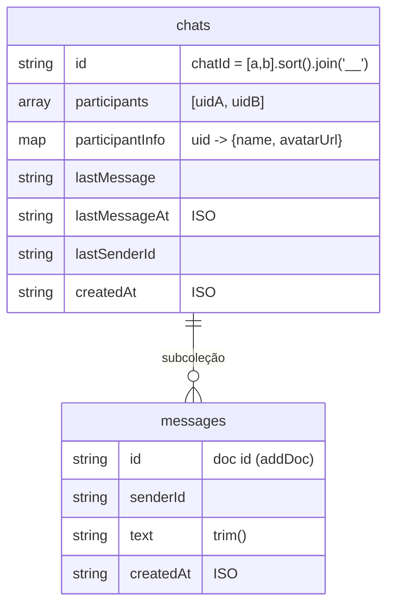
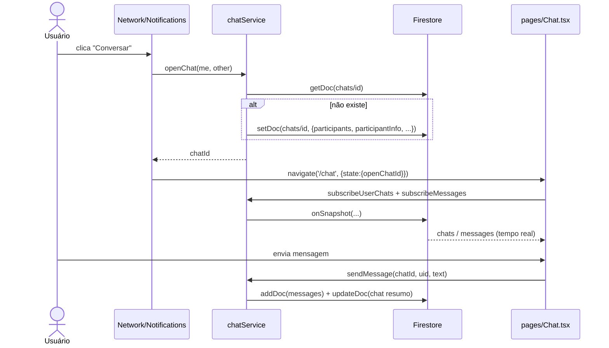

# Chat interno

> Mensageria 1‑a‑1 em tempo real entre profissionais do audiovisual, com `chatId` determinístico e escrita imutável de mensagens — toda negociação acontece dentro do app.

O Chat é o único canal de conversa do Cine Safe. Desde a remoção do WhatsApp
(commit `971c78a`, `refactor: remove WhatsApp — toda conversa fica dentro do app`),
não existe fluxo `wa.me` nem compartilhamento externo: a proposta de proteção do
produto exige que "nada de negociação saia da plataforma". Toda a lógica vive em
`services/chatService.ts` (sem backend próprio — apenas Firestore no cliente) e a UI
em `pages/Chat.tsx`.

## Visão geral

- **Conversas** são documentos na coleção `chats`, com id determinístico derivado
  dos dois participantes.
- **Mensagens** ficam na subcoleção `chats/{chatId}/messages`.
- **Tempo real** via `onSnapshot` do Firestore, tanto para a lista de conversas do
  usuário quanto para as mensagens de uma conversa aberta.
- **Segurança** por participantes (`firestore.rules`): só quem está em
  `participants` lê/escreve; mensagens são imutáveis após criadas.
- **Integração com contratos**: o botão "Fechar negócio" abre o `ContractModal`
  dentro da conversa (ver [Contratos e pagamentos](./contracts-and-payments.md)).

## `chatId` determinístico

A conversa entre dois usuários sempre resolve para o mesmo documento, independente
de quem a abre primeiro. O id é a concatenação ordenada dos dois uids:

```ts
// services/chatService.ts:30
const chatIdFor = (a: string, b: string) => [a, b].sort().join('__');
```

Como `[a, b].sort()` é comutativo em relação à ordem dos argumentos, `chatIdFor(x, y)`
e `chatIdFor(y, x)` produzem a mesma string `"<menor>__<maior>"`. Isso elimina a
necessidade de "procurar" uma conversa existente: basta calcular o id e acessar o doc
diretamente. A função é exposta no objeto `chatService` (`chatService.chatIdFor`).

> Consequência de design: o modelo suporta apenas conversas **1‑a‑1**. Não há grupo,
> pois o id só codifica dois participantes.

## API do serviço (`chatService`)

| Método | Assinatura | Efeito |
| --- | --- | --- |
| `chatIdFor` | `(a: string, b: string) => string` | Id determinístico `[a,b].sort().join('__')`. |
| `openChat` | `(me: User, other: { id; name; avatarUrl }) => Promise<string>` | Garante que a conversa existe (idempotente) e devolve o `chatId`. |
| `sendMessage` | `(chatId, senderId, text) => Promise<boolean>` | Cria mensagem na subcoleção e atualiza o resumo. Retorna `false` se texto vazio ou em erro. |
| `subscribeMessages` | `(chatId, cb) => Unsubscribe` | Escuta as mensagens ordenadas por `createdAt asc` em tempo real. |
| `subscribeUserChats` | `(userId, cb) => Unsubscribe` | Escuta as conversas do usuário; ordena por recência **no cliente**. |

### `openChat` — criação idempotente com `participantInfo` denormalizado

```ts
// services/chatService.ts:36-56 (resumo)
const id = chatIdFor(me.id, other.id);
const ref = doc(db, 'chats', id);
const snap = await getDoc(ref);
if (!snap.exists()) {
  const now = new Date().toISOString();
  await setDoc(ref, {
    id,
    participants: [me.id, other.id],
    participantInfo: {
      [me.id]:    { name: me.name || 'Usuário',    avatarUrl: me.avatarUrl || '' },
      [other.id]: { name: other.name || 'Usuário', avatarUrl: other.avatarUrl || '' },
    },
    lastMessage: '',
    lastMessageAt: now,
    lastSenderId: '',
    createdAt: now,
  });
}
return id;
```

Pontos relevantes:

- **Idempotência**: faz `getDoc` antes de escrever. Se o doc já existe, não sobrescreve
  nada — apenas retorna o id. Chamar `openChat` várias vezes é seguro e não reseta o
  histórico nem o `participantInfo`.
- **Denormalização de `participantInfo`**: nome e avatar de cada participante são
  copiados para dentro do doc de chat. Assim a lista de conversas renderiza avatar +
  nome do "outro" sem precisar ler a coleção `users` (que exige autenticação e um
  `getDoc` por conversa). O trade‑off é o de sempre: se o usuário troca nome/avatar
  depois, o `participantInfo` **não** é atualizado retroativamente por este serviço.
- **Fallbacks**: `name` cai para `'Usuário'` e `avatarUrl` para `''` quando ausentes,
  evitando gravar `undefined`.

O `getDoc` inicial em uma conversa que ainda não existe é permitido pela regra de
leitura (`resource == null`, ver [Segurança](#segurança-firestorerules)).

### `sendMessage` — mensagem + atualização do resumo

```ts
// services/chatService.ts:58-70 (resumo)
const clean = text.trim();
if (!clean) return false;
try {
  const now = new Date().toISOString();
  await addDoc(collection(db, 'chats', chatId, 'messages'),
              { senderId, text: clean, createdAt: now });
  await updateDoc(doc(db, 'chats', chatId),
              { lastMessage: clean, lastMessageAt: now, lastSenderId: senderId });
  return true;
} catch (e) {
  console.error('sendMessage error:', e);
  return false;
}
```

- Faz `trim()` e recusa mensagem vazia (`return false` sem tocar no Firestore).
- Duas escritas **não transacionais**: (1) `addDoc` na subcoleção `messages`;
  (2) `updateDoc` no doc de chat gravando `lastMessage`, `lastMessageAt` e
  `lastSenderId`. Não há batch/transaction — se a segunda escrita falhar após a
  primeira, a mensagem existe mas o resumo fica desatualizado.
- O documento de mensagem grava exatamente `{ senderId, text, createdAt }`. O `id` do
  `ChatMessage` vem do id do documento gerado pelo `addDoc`, não do payload.
- Erros são capturados e logados; a função nunca lança — retorna `false`.

### `subscribeMessages` — thread em tempo real

```ts
// services/chatService.ts:72-77
const q = query(collection(db, 'chats', chatId, 'messages'), orderBy('createdAt', 'asc'));
return onSnapshot(q, snap => {
  cb(snap.docs.map(d => ({ id: d.id, ...(d.data() as Omit<ChatMessage, 'id'>) })));
}, () => cb([]));
```

- Ordena por `createdAt asc` **no servidor** (índice de campo único, não composto —
  a subcoleção só filtra por ordenação, sem `where`).
- O segundo argumento de `onSnapshot` é o handler de erro: em falha (ex.: permissão
  revogada), chama `cb([])` esvaziando a lista em vez de deixar a UI travada.
- Retorna a função `Unsubscribe` do Firestore, que o componente usa no cleanup do
  `useEffect`.

### `subscribeUserChats` — lista com ordenação no cliente

```ts
// services/chatService.ts:80-88
const q = query(collection(db, 'chats'), where('participants', 'array-contains', userId));
return onSnapshot(q, snap => {
  const list = snap.docs
    .map(d => d.data() as ChatSummary)
    .sort((a, b) => new Date(b.lastMessageAt).getTime() - new Date(a.lastMessageAt).getTime());
  cb(list);
}, () => cb([]));
```

- Filtra por `where('participants', 'array-contains', userId)` — traz apenas as
  conversas em que o usuário participa.
- **Ordenação por recência é feita no cliente** (`sort` por `lastMessageAt` desc),
  deliberadamente. Combinar `array-contains` com `orderBy('lastMessageAt')` no Firestore
  exigiria um **índice composto**; ordenar em memória evita essa dependência de
  infraestrutura. O custo é aceitável porque o número de conversas por usuário é
  pequeno. Mesmo padrão usado em outras assinaturas do app (ex.: notificações).
- Também trata erro com `cb([])`.

## Interfaces (tipos)

Definidas em `services/chatService.ts`:

```ts
export interface ChatParticipant {
  name: string;
  avatarUrl: string;
}

export interface ChatSummary {
  id: string;                                        // == chatId determinístico
  participants: string[];                            // [uidA, uidB]
  participantInfo: { [uid: string]: ChatParticipant }; // denormalizado por uid
  lastMessage: string;
  lastMessageAt: string;                             // ISO 8601 (toISOString)
  lastSenderId: string;
}

export interface ChatMessage {
  id: string;         // id do doc na subcoleção messages
  senderId: string;
  text: string;
  createdAt: string;  // ISO 8601
}
```

Observações:

- Todos os timestamps são **strings ISO 8601** geradas com `new Date().toISOString()`
  — não são `Timestamp` do Firestore. Por isso a ordenação/formatação usa
  `new Date(...).getTime()` / `toLocaleTimeString`.
- `ChatParticipant` guarda apenas `name` e `avatarUrl` — **nunca telefone** (coerente
  com a política do produto de não expor contato fora da plataforma).

### Modelo de dados



## UI — `pages/Chat.tsx`

Layout de duas colunas (lista de conversas + thread), responsivo: no mobile a lista e
a thread se alternam via classes `hidden md:flex` conforme `selectedId`.

Estado e efeitos:

- `selectedId` inicializa a partir de `location.state.openChatId` — é assim que
  `openChat` em outra página "entrega" a conversa já aberta (ver
  [Pontos de entrada](#pontos-de-entrada)).
- `useEffect` 1: `chatService.subscribeUserChats(user.id, setChats)`; cleanup
  cancela a assinatura.
- `useEffect` 2: quando há `selectedId`, `chatService.subscribeMessages(selectedId, setMessages)`;
  sem seleção, limpa `messages`.
- `useEffect` 3: rola para `endRef` a cada nova lista de mensagens (auto‑scroll).

Renderização:

- `otherOf(chat)` resolve o "outro" participante: `participants.find(p => p !== user.id)`
  e busca seu `participantInfo`, com fallback `{ name: 'Contato', avatarUrl: '' }`.
- Indicador de **não lido** heurístico: `unread = lastSenderId && lastSenderId !== user.id`
  — destaca a última mensagem se o remetente foi o outro. Não há campo de "lido" por
  mensagem/usuário; é uma pista visual, não um contador preciso.
- `handleSend` limpa o input **otimisticamente** (`setText('')` antes do `await`) e
  chama `sendMessage`; a nova mensagem aparece pela assinatura em tempo real, não por
  mutação local do array.
- Bolhas de mensagem: `mine = m.senderId === user.id` decide alinhamento/cores; hora
  formatada com `toLocaleTimeString('pt-BR', { hour: '2-digit', minute: '2-digit' })`.

### "Fechar negócio" → contrato

No cabeçalho da thread, o botão "Fechar negócio" abre o `ContractModal` passando
`owner={user}`, `counterparty` (o outro participante) e `chatId={selectedChat.id}`.
Ao criar o contrato, o callback `onCreated(summary)` envia esse resumo como mensagem
na própria conversa:

```tsx
// pages/Chat.tsx:143-151 (resumo)
<ContractModal
  isOpen={contractOpen}
  onClose={() => setContractOpen(false)}
  owner={user}
  counterparty={{ id: otherOf(selectedChat).uid, name, avatarUrl }}
  chatId={selectedChat.id}
  onCreated={(summary) => { chatService.sendMessage(selectedChat.id, user.id, summary); }}
/>
```

## Pontos de entrada

`openChat` é chamado fora da página de Chat; após obter o `chatId`, navega para
`/chat` passando o id via `state`:

| Origem | Trecho | Como abre |
| --- | --- | --- |
| `pages/Network.tsx:77-78` | Rede de Confiança | `openChat(user, targetUser)` → `navigate('/chat', { state: { openChatId } })` |
| `pages/Notifications.tsx:64-66` | "Conversar no app" | `openChat(user, { id: notif.fromUserId, ... })` → navega para `/chat` |
| `pages/Contracts.tsx:114` | Botão "Conversa" no contrato | `navigate('/chat', { state: { openChatId: c.chatId } })` (usa o `chatId` já salvo no contrato; não chama `openChat`) |



## Segurança (`firestore.rules`)

Bloco `match /chats/{chatId}` e a subcoleção `messages` (`firestore.rules:105-121`):

```
match /chats/{chatId} {
  allow read:   if isSignedIn() && (resource == null || request.auth.uid in resource.data.participants);
  allow create: if isSignedIn() && request.auth.uid in request.resource.data.participants;
  allow update: if isSignedIn() && request.auth.uid in resource.data.participants;

  match /messages/{msgId} {
    allow read:   if isSignedIn()
      && request.auth.uid in get(/databases/$(database)/documents/chats/$(chatId)).data.participants;
    allow create: if isSignedIn()
      && request.auth.uid == request.resource.data.senderId
      && request.auth.uid in get(/databases/$(database)/documents/chats/$(chatId)).data.participants;
    allow update, delete: if false;
  }
}
```

Garantias:

| Regra | Efeito |
| --- | --- |
| `read` do chat com `resource == null` | Permite o `getDoc` de `openChat` em conversa inexistente sem vazar dados de terceiros. Conversa existente só é lida por quem está em `participants`. |
| `create` do chat | Quem cria precisa estar em `participants` — não dá para criar conversa em nome de terceiros. |
| `update` do chat | Só participante atualiza o resumo (`lastMessage`/`lastMessageAt`/`lastSenderId`). |
| `messages.read` | Só participante da conversa lê mensagens (verifica `participants` do doc pai via `get`). |
| `messages.create` | Exige `senderId == request.auth.uid` **e** que o remetente seja participante — impede forjar remetente. |
| `messages.update/delete` | `false`: **mensagens são imutáveis** — não podem ser editadas nem apagadas por ninguém (nem admin). |

Notas de honestidade técnica:

- As regras **não validam o conteúdo** dos campos de resumo no `update` (um
  participante poderia gravar `lastMessage`/`lastSenderId` inconsistentes com a
  mensagem real). A confiança é limitada aos dois participantes da conversa.
- A regra de `messages` faz um `get()` do doc de chat por operação (custo de leitura
  extra), padrão aceito no MVP.
- Não há validação de `participants` com exatamente 2 uids nas regras — o formato
  1‑a‑1 é garantido apenas pelo cliente (`chatIdFor`). Ver
  [`FIREBASE_RULES.md`](../../FIREBASE_RULES.md) sobre o plano de mover validações
  cruzadas para Cloud Functions.

## Limitações conhecidas

- **Sem status de leitura por mensagem**: "não lido" é heurística baseada em
  `lastSenderId` (`pages/Chat.tsx:71`), não um contador confiável.
- **Escrita dupla não transacional** em `sendMessage` (mensagem + resumo) — sem batch.
- **`participantInfo` não é reconciliado** quando o usuário muda nome/avatar depois de
  a conversa existir; `openChat` só grava no primeiro acesso.
- **Somente 1‑a‑1** por construção do `chatId`; sem grupos.
- **Ordenação de conversas no cliente** para evitar índice composto — escala bem só
  enquanto o volume de conversas por usuário for pequeno.

## Fontes no código

- `services/chatService.ts` — serviço, interfaces e `chatIdFor`.
- `pages/Chat.tsx` — UI da lista e da thread, integração com `ContractModal`.
- `firestore.rules` (linhas 105‑121) — regras de `chats` e da subcoleção `messages`.
- `pages/Network.tsx`, `pages/Notifications.tsx`, `pages/Contracts.tsx` — pontos de
  entrada que chamam `openChat` / navegam com `openChatId`.
- `components/ContractModal.tsx` — recebe `chatId`/`onCreated` para o fluxo
  "Fechar negócio".
- Commit `971c78a` — remoção do WhatsApp (chat interno como canal único).

## Relacionados

- [Contratos e pagamentos](./contracts-and-payments.md)
- [Rede e transferências](./network-and-transfers.md)
- [Notificações](./notifications.md)
- [Modelo de dados](../03-data-model.md)
- [Segurança](../04-security.md) · [Referência de serviços](../reference/services.md)
