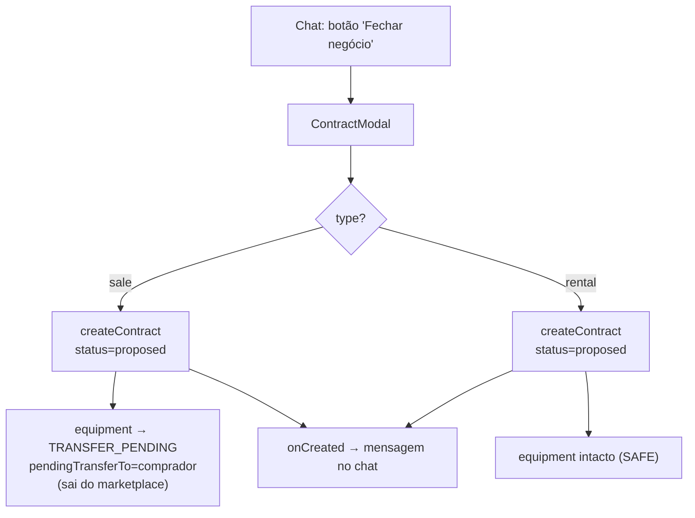
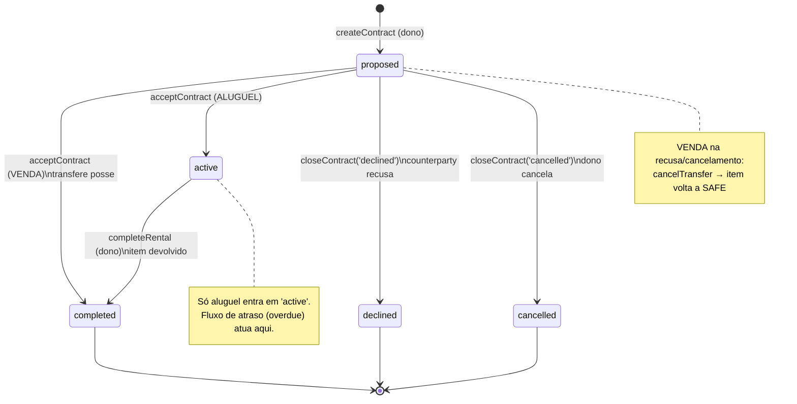
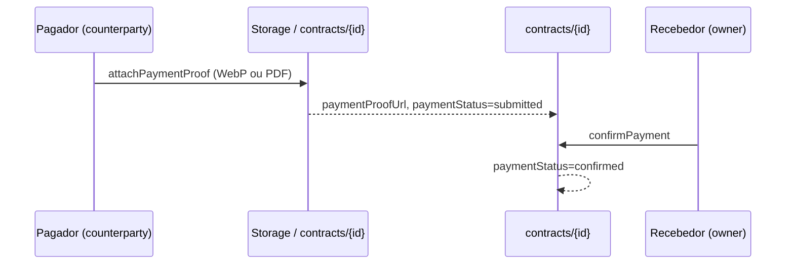
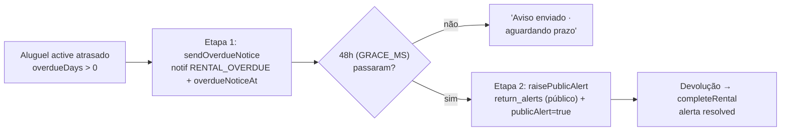

# Contratos & Pagamentos

> Acordos de aluguel e venda fechados dentro do app, com transferência de posse no aceite, comprovante de pagamento em duas etapas e um fluxo de escalonamento para não-devolução (aviso privado → alerta público).

Esta feature cobre o ciclo de vida de um `contract` (proposta → ativo/concluído → recusado/cancelado), a movimentação de equipamento que ele dispara, o registro de comprovante de pagamento e o mecanismo de alerta público de não-devolução (`return_alerts`). Todo o comportamento vive no **cliente**: não há Cloud Functions — a lógica está em `services/contractService.ts` e a UI em `pages/Contracts.tsx`, `components/ContractModal.tsx` e `pages/Chat.tsx`.

Ver também: [chat.md](./chat.md) (ponto de entrada da proposta), [network-and-transfers.md](./network-and-transfers.md) (transferência de posse do equipamento), [theft-and-safety.md](./theft-and-safety.md) (onde os alertas públicos aparecem), [marketplace.md](./marketplace.md), [../03-data-model.md](../03-data-model.md) e [../04-security.md](../04-security.md).

---

## 1. Modelo de dados

### Coleção `contracts`

Documento em `contracts/{id}`, com `id = crypto.randomUUID()`. Tipos em `types.ts` (`Contract`, `ContractType`, `ContractStatus`).

| Campo | Tipo | Notas |
|---|---|---|
| `id` | string | UUID; também usado como id do `ReturnAlert` (determinístico). |
| `type` | `'rental' \| 'sale'` | Aluguel ou venda. |
| `status` | `'proposed' \| 'active' \| 'completed' \| 'declined' \| 'cancelled'` | Ver diagrama de estados. |
| `parties` | `string[]` | `[ownerId, counterpartyId]`. Base da query (`array-contains`) e das regras. |
| `ownerId` / `ownerName` / `ownerAvatar` | string | Dono do equipamento (locador/vendedor). **Cria** o contrato. |
| `counterpartyId` / `counterpartyName` / `counterpartyAvatar` | string | Locatário/comprador. **Aceita** o contrato. |
| `equipmentId` / `equipmentName` / `equipmentImage?` | string | Snapshot denormalizado do item. |
| `value` | number | Aluguel: valor total do período. Venda: preço. |
| `pickupDate?` / `returnDate?` | string (ISO date) | Só em aluguel. |
| `chatId?` | string | Liga o contrato à conversa (ver [§8](#8-ligação-com-o-chat)). |
| `paymentStatus?` | `'submitted' \| 'confirmed'` | Ausente = pendente. |
| `paymentProofUrl?` | string | Comprovante (imagem WebP ou PDF) no Storage. |
| `paymentSubmittedBy?` | string | UID de quem anexou. |
| `paymentAt?` | string (ISO) | Momento do anexo. |
| `overdueNoticeAt?` | string (ISO) | Quando o dono notificou o atraso (inicia o prazo). |
| `publicAlert?` | boolean | Dono escalou para alerta público. |
| `publicAlertAt?` | string (ISO) | Momento do escalonamento. |
| `createdAt` / `updatedAt` | string (ISO) | |

> `createContract` remove chaves `undefined` antes do `setDoc` (`Object.fromEntries(... filter v !== undefined)`), porque o Firestore rejeita o documento inteiro se qualquer campo for `undefined` (`contractService.ts:50-51`).

### Coleção `return_alerts`

Documento em `return_alerts/{contractId}` (id **igual** ao do contrato). Tipo `ReturnAlert` em `types.ts:178-192`.

| Campo | Tipo | Notas |
|---|---|---|
| `id` / `contractId` | string | Ambos = id do contrato de origem. |
| `renterId` / `renterName` / `renterAvatar` | string | Quem não devolveu (o `counterparty` do contrato). |
| `ownerId` / `ownerName` | string | Quem emitiu o alerta. |
| `equipmentName` / `equipmentImage?` | string | Snapshot do item. |
| `agreedReturnDate` | string | `contract.returnDate` (ou `''`). |
| `raisedAt` | string (ISO) | Emissão. |
| `status` | `'active' \| 'resolved'` | `resolved` quando o aluguel é concluído. |
| `resolvedAt?` | string (ISO) | |

---

## 2. Criação da proposta

**Ponto de entrada:** botão **"Fechar negócio"** no cabeçalho de uma conversa (`pages/Chat.tsx:107-109`), que abre `components/ContractModal.tsx`. O `owner` é sempre o `user` logado; o `counterparty` é o outro participante do chat; o `chatId` é o da conversa (`Chat.tsx:143-151`).

Regras do formulário (`ContractModal.tsx`):

- O `select` de equipamento lista **apenas itens do inventário do próprio dono com `status === SAFE`** (`ContractModal.tsx:29-31`). Itens roubados, perdidos ou já em transferência não aparecem.
- Validação client-side em `handleSubmit` (`ContractModal.tsx:40-47`): equipamento selecionado, `value > 0`, e — para aluguel — `pickupDate` e `returnDate` obrigatórios com `returnDate >= pickupDate`.
- Ao criar, `onCreated` envia uma mensagem-resumo no chat via `chatService.sendMessage` (`Chat.tsx:150`), diferente para aluguel e venda (`ContractModal.tsx:59-63`).

`contractService.createContract` (`contractService.ts:26-66`):

1. Monta o `Contract` com `status: 'proposed'` e `parties: [owner.id, counterparty.id]`. Datas só entram em aluguel; `chatId` só entra se fornecido.
2. `setDoc(doc(db, 'contracts', id), clean)`.
3. **Se `type === 'sale'`**, atualiza o equipamento para `status: TRANSFER_PENDING` e `pendingTransferTo: counterparty.id` (`contractService.ts:54-60`), via `equipmentService.updateEquipment`. Como `status !== SAFE`, o item **sai do marketplace** imediatamente (a leitura pública só expõe `SAFE` + à venda/aluguel — ver [../04-security.md](../04-security.md)). A posse **não** muda ainda.
4. **Se `type === 'rental'`**, o equipamento **não** é tocado na criação.

Retorna o `id` do contrato, ou `null` em erro.

---

## 3. Ciclo de status

Observações importantes:

- **Venda** nunca passa por `active`: o aceite vai direto de `proposed` para `completed` (`contractService.ts:86`).
- **Aluguel** é o único tipo que fica `active`; só o dono o move para `completed`.
- `declined`/`cancelled` só saem de `proposed` (na UI, os botões de recusa/cancelamento só existem para propostas — `Contracts.tsx:115-123`). Não há reversão de estado terminal.

Rótulos e cores da UI (`STATUS_META`, `Contracts.tsx:9-15`): `proposed`→"Proposta", `active`→"Ativo", `completed`→"Concluído", `declined`→"Recusado", `cancelled`→"Cancelado".

Agrupamento em `pages/Contracts.tsx:74-77`:

| Seção (UI) | Filtro |
|---|---|
| Aguardando você | `status === 'proposed'` e não sou o dono |
| Propostas enviadas | `status === 'proposed'` e sou o dono |
| Ativos | `status === 'active'` |
| Histórico | `status ∈ {completed, declined, cancelled}` |

A lista é assinada por `subscribeUserContracts` (`contractService.ts:68-76`): `query(where('parties','array-contains', userId))` com `onSnapshot` em tempo real; a ordenação por `createdAt` desc é feita **no cliente**.

---

## 4. Aceite

`contractService.acceptContract(contract)` (`contractService.ts:79-102`). Chamado pelo `counterparty` (botão "Aceitar" em "Aguardando você" — `Contracts.tsx:117`, `onAccept` em `60-67`).

- **Venda:** chama `equipmentService.transferEquipmentOwnership(equipmentId, counterpartyId, value)` (`contractService.ts:82-84`). Se falhar, aborta (`return false`) **sem** mudar o status. Se ok, marca o contrato como `completed`. A transferência (`equipmentService.ts:233-281`) faz um `writeBatch` que:
  - troca `ownerId` para o comprador, volta `status` a `SAFE`, zera `pendingTransferTo` e **desliga** `isForRent`/`isForSale` (o item chega ao novo dono fora do marketplace — ele decide se re-anuncia);
  - reescreve o `ownerProfile` denormalizado com o perfil do comprador;
  - se `value > 0`, grava `value` no item e incrementa `transactionHistory[parceiro]` nos **dois** usuários.
  - A regra de segurança que autoriza o comprador a assumir a posse está em `firestore.rules:61-66` (ver [§9](#9-regras-de-segurança)).
- **Aluguel:** apenas move o contrato para `active` (`contractService.ts:88`).

**Impacto global (ambos os tipos):** após a transição, faz `setDoc(doc(db,'stats','global'), { ... }, { merge:true })` incrementando `transactions` (+1), `rentals`/`sales` (+1 conforme o tipo) e `transactedValue` (+`value`) (`contractService.ts:91-96`). É `stats/global` — só contadores agregados, sem dados individuais. O erro é engolido (`.catch(() => {})`), então uma falha aqui não desfaz o aceite.

> **Nota de precisão:** para venda, os incrementos de impacto usam `contract.type === 'sale'`, então `rentals` recebe `+0` e `sales` `+1`; para aluguel, o inverso. `transactions` sempre `+1`.

---

## 5. Recusa, cancelamento e conclusão

### Recusa / cancelamento — `closeContract`

`contractService.closeContract(contract, status)` com `status ∈ {'declined','cancelled'}` (`contractService.ts:114-125`):

- **Se `type === 'sale'`**, primeiro chama `equipmentService.cancelTransfer(equipmentId)`, que devolve o item ao marketplace: `status → SAFE`, `pendingTransferTo → null` (`equipmentService.ts:283-291`).
- Depois atualiza o contrato para o `status` alvo.

Na UI: `onDecline` (recusa, pelo counterparty) grava `'declined'`; `onCancel` (cancelamento, pelo dono) grava `'cancelled'` (`Contracts.tsx:68-69`). Ambos são ações destrutivas confirmadas via `ConfirmModal`.

> `cancelTransfer` **não** remove notificações de transferência pendentes — o comentário no código explica que a limpeza fica a cargo do destinatário ao visualizar, porque as regras não permitem consultar `notifications` por `itemId` (só por `toUserId`).

### Conclusão do aluguel — `completeRental`

`contractService.completeRental(contract)` (`contractService.ts:129-140`), acionado pelo **dono** de um aluguel `active` (botão "Marcar como devolvido" — `Contracts.tsx:124-126`, `onComplete` em `70`):

1. Contrato → `completed`.
2. **Se `contract.publicAlert`**, resolve o alerta público: `return_alerts/{contractId}` → `status: 'resolved'`, `resolvedAt` (erro engolido com `.catch`).

Isso encerra tanto a locação quanto qualquer alerta público pendente numa única ação.

---

## 6. Comprovante de pagamento

Fluxo em duas mãos, **independente do status do contrato** (pode ocorrer antes ou depois da retirada). UI no modal `ContractDetail` (`Contracts.tsx:179-259`); só aparece enquanto `canManagePayment = status ∈ {proposed, active, completed}` (`Contracts.tsx:185`).

Papéis (`Contracts.tsx:181-182`):
- **Pagador** = `counterpartyId === currentUserId` (locatário/comprador). Anexa o comprovante.
- **Recebedor** = `ownerId === currentUserId` (dono). Confirma o recebimento.

### Anexar — `attachPaymentProof`

`contractService.attachPaymentProof(contract, file, uploaderId)` (`contractService.ts:218-238`):

- O `<input>` aceita `image/*,application/pdf` (`Contracts.tsx:238`).
- **PDF** é enviado como está; **imagem** passa por `processImageForWebP` (WebP). Extensão e path: `contracts/{id}/payment_{Date.now()}.{pdf|webp}`.
- Upload via `resilientUpload` (detecta erro de CORS — ver `utils/imageProcessor.ts`). Se não retornar URL, aborta.
- Grava `paymentProofUrl`, `paymentStatus: 'submitted'`, `paymentSubmittedBy: uploaderId`, `paymentAt`.

O botão fica visível para o pagador enquanto `paymentStatus !== 'confirmed'`, e o rótulo alterna entre "Anexar comprovante" e "Trocar comprovante" (`Contracts.tsx:236-243`).

### Confirmar — `confirmPayment`

`contractService.confirmPayment(contractId)` (`contractService.ts:241-249`): grava `paymentStatus: 'confirmed'`. O botão "Confirmar recebimento" só aparece para o **recebedor** quando `paymentStatus === 'submitted'` (`Contracts.tsx:244-246`).

Rótulos derivados (`Contracts.tsx:19`): sem status → "Pagamento pendente"; `submitted` → "Comprovante enviado"; `confirmed` → "Pagamento confirmado".

---

## 7. Fluxo de não-devolução (2 etapas)

Aplica-se a **aluguéis `active` atrasados**, visível só para o dono. Cálculo de atraso em `Contracts.tsx:22-27`:

- `overdueDays(c)` só é > 0 quando `type === 'rental'`, `status === 'active'` e passou de `returnDate + 'T23:59:59'`.
- `GRACE_MS = 48h`. `graceOver(c)` = existe `overdueNoticeAt` e já se passaram ≥ 48h desde ele.

A UI escalona os botões (`Contracts.tsx:127-135`): enquanto `overdueDays > 0` e `!publicAlert`:
1. sem `overdueNoticeAt` → botão **"Notificar atraso"**;
2. com aviso mas prazo não vencido → texto passivo **"Aviso enviado · aguardando prazo"**;
3. `graceOver` → botão **"Emitir alerta público"**.

### Etapa 1 — `sendOverdueNotice`

`contractService.sendOverdueNotice(contract, owner)` (`contractService.ts:143-166`):

- Cria uma `Notification` `type: 'RENTAL_OVERDUE'` para `counterpartyId`, incluindo `fromUserPhone: owner.contactPhone`, com mensagem pedindo a devolução para evitar alerta público.
- Grava `overdueNoticeAt` no contrato — **isto inicia o prazo de 48h**.

### Etapa 2 — `raisePublicAlert`

`contractService.raisePublicAlert(contract, owner)` (`contractService.ts:169-205`):

1. Cria `return_alerts/{contractId}` (`ReturnAlert`, `status: 'active'`, `agreedReturnDate = contract.returnDate || ''`) — limpando `undefined` antes do `setDoc`.
2. Marca o contrato: `publicAlert: true`, `publicAlertAt`.
3. Cria uma segunda `Notification` `RENTAL_OVERDUE` avisando o locatário do alerta público.

O alerta é **público**: `subscribeCommunityAlerts` (`contractService.ts:208-215`, `query(where('status','==','active'))`) alimenta o Mapa de Segurança (`pages/SafetyMap.tsx:29`) e a Rede sinaliza usuários com alerta ativo (`pages/Network.tsx:27`). Ele é encerrado por `completeRental` (§5) quando o item é devolvido.

O botão "Emitir alerta público" (`onPublicAlert`, `Contracts.tsx:72`) é marcado como destrutivo e traz aviso explícito de que a acusação fica visível a todos e no perfil do locatário.

---

## 8. Ligação com o chat

- A proposta **só** nasce de dentro de uma conversa; `ContractModal` recebe o `chatId` e o grava no contrato (`Chat.tsx:149`, `contractService.ts:46`).
- Ao criar, um resumo (`📄 Proposta de ...`) é postado como mensagem no chat (`Chat.tsx:150`).
- No card de contrato, o botão **"Conversa"** só existe se houver `chatId`, e navega para `/chat` passando `state: { openChatId }` (`Contracts.tsx:114`); `Chat.tsx:12` lê esse estado para reabrir a conversa. As notificações usam o mesmo mecanismo (`pages/Notifications.tsx:66`).

Ver [chat.md](./chat.md) para o modelo de `chats`/`messages` e o `chatId` determinístico.

---

## 9. Regras de segurança

Trecho de `firestore.rules` (linhas 124-152). Não há Cloud Functions; toda transição de status é feita pelo cliente e as regras validam apenas o essencial.

### `contracts` (`firestore.rules:124-132`)

| Ação | Condição |
|---|---|
| `read` | Autenticado **e** (`uid ∈ resource.data.parties` **ou** `isAdmin()`). Admin lê tudo para o histórico. |
| `create` | Autenticado, `uid == request.resource.data.ownerId` **e** `uid ∈ parties`. Garante que **só o dono** cria a proposta e se inclui nas partes. |
| `update` | Autenticado **e** `uid ∈ resource.data.parties`. |
| `delete` | `false`. Contratos são imutáveis (só mudam de status). |

### `return_alerts` (`firestore.rules:141-152`)

| Ação | Condição |
|---|---|
| `read` | `true` — **público** (comunidade e perfil do locatário). |
| `create` | Autenticado, `uid == ownerId`, **e** o alerta é *grounded* contra o contrato real: `contractData(contractId).ownerId == uid` **e** `contractData(contractId).counterpartyId == renterId`. Impede acusação fabricada — só o dono do contrato de aluguel real, contra o locatário real daquele contrato, pode emitir. |
| `update` | Autenticado **e** `uid == resource.data.ownerId` (só o emissor resolve). |
| `delete` | `false`. |

### `stats` (`firestore.rules:135-138`)

`read`/`write` para qualquer autenticado, sem validação de campo — daí os incrementos de impacto global.

### Transferência de posse (`equipment`, `firestore.rules:61-74`)

O update de `equipment` autoriza, além do dono/admin, o **destinatário** de uma transferência pendente a: (a) assumir a posse (`status == TRANSFER_PENDING && pendingTransferTo == uid && request.resource.data.ownerId == uid`) — usado por `acceptContract` na venda; ou (b) recusar, devolvendo o item a `SAFE` sem trocar de dono. Ver [network-and-transfers.md](./network-and-transfers.md).

### Limitações reais (honestidade técnica)

- **Validação por campo ausente nos contratos.** A regra de `update` só exige `uid ∈ parties`. Assim, **qualquer uma das partes** pode, em tese, alterar qualquer campo — inclusive `status`, `paymentStatus`, `overdueNoticeAt`, `publicAlert`, `value`. As restrições de "quem pode fazer o quê" (o pagador anexa, o recebedor confirma, só o dono conclui/escala) são impostas **apenas na UI** (`pages/Contracts.tsx`), não nas regras.
- **`stats/global` é escrita livre** por qualquer autenticado, sem validação — um cliente malicioso poderia inflar os contadores de impacto.
- **`return_alerts.update`** só checa `ownerId`, não valida a transição `active → resolved` em si.
- **`transferEquipmentOwnership` é um batch client-side**; a consistência entre `contract.status = completed` e a troca de posse depende do cliente. Se o `updateDoc` do contrato falhar após a transferência do item, os dois podem divergir (o item já pertence ao comprador, mas o contrato pode não constar `completed`).
- O documento raiz [../../FIREBASE_RULES.md](../../FIREBASE_RULES.md) registra a migração dessas validações cruzadas para Cloud Functions como pendente.

---

## Fontes no código

- `services/contractService.ts` — CRUD e transições (`createContract`, `subscribeUserContracts`, `acceptContract`, `closeContract`, `completeRental`, `sendOverdueNotice`, `raisePublicAlert`, `subscribeCommunityAlerts`, `attachPaymentProof`, `confirmPayment`, `getAllContracts`).
- `pages/Contracts.tsx` — listagem, agrupamento por status, cálculo de atraso/prazo (48h), modal de detalhe e comprovante.
- `components/ContractModal.tsx` — formulário "Fechar negócio" (seleção de item `SAFE`, validação, tipo aluguel/venda).
- `pages/Chat.tsx` — ponto de entrada da proposta e reabertura de conversa via `openChatId`.
- `services/equipmentService.ts:233-291` — `transferEquipmentOwnership` e `cancelTransfer`.
- `types.ts:143-192` — `Contract`, `ContractType`, `ContractStatus`, `ReturnAlert`.
- `firestore.rules:52-77, 124-152` — regras de `equipment` (transferência), `contracts`, `return_alerts`, `stats`.
- Consumidores do feed público: `pages/SafetyMap.tsx:29`, `pages/Network.tsx:27`.
