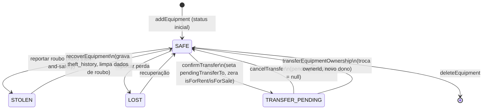

# Inventário de Equipamentos

> Cadastro, edição, exclusão e transferência dos equipamentos do usuário, com validações, upload de foto/nota fiscal, checagem de serial duplicado, limite do plano gratuito e integração com o marketplace.

O Inventário é o núcleo do Cine Safe: cada equipamento cadastrado alimenta a verificação de serial, o reporte de roubo, o marketplace (aluguel/venda) e as transferências de posse. A tela é a rota protegida `/inventory`, renderizada por `pages/Inventory.tsx`, cuja lógica vive inteiramente no hook `hooks/useInventory.ts`. A persistência é feita por `services/equipmentService.ts` na coleção Firestore `equipment`.

## Arquitetura da feature

- `pages/Inventory.tsx` — componente de apresentação. Só renderiza estado e dispara handlers; não contém regra de negócio.
- `hooks/useInventory.ts` — orquestra estado do formulário, validações, modais e chamadas de serviço.
- `services/equipmentService.ts` — CRUD na coleção `equipment`, upload no Storage, checagem de serial, transferência.
- `services/userService.ts` — `checkLimit('inventory')` (limite do plano gratuito) e denormalização do `ownerProfile`.
- `services/notificationService.ts` — cria a notificação `ITEM_TRANSFER` ao iniciar uma transferência.
- `utils/imageProcessor.ts` — `processImageForWebP` e `resilientUpload` (conversão WebP e upload resiliente a CORS).

```mermaid
flowchart TD
    Page["pages/Inventory.tsx"] -->|usa| Hook["hooks/useInventory.ts"]
    Hook -->|CRUD / upload| EqSvc["services/equipmentService.ts"]
    Hook -->|checkLimit inventory| UserSvc["services/userService.ts"]
    Hook -->|ITEM_TRANSFER| NotifSvc["services/notificationService.ts"]
    EqSvc -->|processImageForWebP / resilientUpload| ImgProc["utils/imageProcessor.ts"]
    EqSvc -->|coleção equipment| FS[("Firestore")]
    EqSvc -->|users/{uid}/equipment,invoices| ST[("Storage")]
    UserSvc -->|getUserProfile denormaliza| FS
```

## Modelo de dados: `Equipment`

Definido em [`types.ts`](../../types.ts) (interface `Equipment`, `EquipmentStatus`, `EquipmentCategory`). Campos relevantes ao inventário:

| Campo | Tipo | Observações |
| --- | --- | --- |
| `id` | `string` | Gerado no cliente via `crypto.randomUUID()` ao criar (`useInventory.ts:117`). |
| `ownerId` | `string` | UID do dono; base de toda query de inventário. |
| `name` | `string` | Se vazio no form, cai para ```${brand} ${model}` `` (`useInventory.ts:148`). |
| `brand` / `model` | `string` | Obrigatórios. `brand` é normalizado para Title Case no `onBlur`. |
| `serialNumber` | `string` | Obrigatório. **Normalizado** para `trim().toUpperCase()` ao salvar (`equipmentService.ts:27,44`). Imutável na edição. |
| `category` | `EquipmentCategory` | Enum pt-BR (ver abaixo). |
| `status` | `EquipmentStatus` | `SAFE` na criação. Ver diagrama de estados. |
| `value?` | `number` | Valor estimado (R$). Usado no impacto/recuperação. |
| `isForRent` / `isForSale` | `boolean` | Flags de marketplace. |
| `rentalPricePerDay?` / `salePrice?` | `number` | Preços; no form o hook usa `rentalPrice`/`salePrice` e mapeia para `rentalPricePerDay`/`salePrice` ao salvar. |
| `imageUrl?` | `string` | Foto (WebP). Fallback para avatar `ui-avatars.com` se ausente. |
| `invoiceUrl?` | `string` | Nota fiscal (WebP ou PDF); pode ser `null` ao remover. |
| `description?` | `string` | Obrigatória (≥10 chars) apenas ao anunciar. |
| `purchaseDate` | `string` | Preenchido com a data atual (`YYYY-MM-DD`) na criação. |
| `theftLocation?` / `theftDate?` / `theftAddress?` | — | Preenchidos pelo fluxo de roubo, não pelo inventário. |
| `pendingTransferTo?` | `string` | UID de destino durante `TRANSFER_PENDING`. |
| `ownerProfile?` | `{name, avatarUrl, location}` | **Denormalizado** por `equipmentService` a partir do perfil. **Nunca** inclui telefone (vitrine pública). |

### Categorias (`EquipmentCategory`)

Valores do enum (`types.ts:13`), usados no `<select>` de categoria e no agrupamento da listagem:

| Chave | Rótulo (valor) |
| --- | --- |
| `CAMERA` | Câmera |
| `LENS` | Lente |
| `AUDIO` | Áudio |
| `LIGHTING` | Iluminação |
| `DRONE` | Drone |
| `ACCESSORY` | Acessório |

O padrão do formulário é `EquipmentCategory.CAMERA` (`useInventory.ts:23`). A listagem agrupa os itens por `item.category`, com fallback textual `'Outros'` para itens sem categoria (`Inventory.tsx:24`), e oferece um filtro horizontal por categoria com contagem por grupo.

## Fluxo: adicionar equipamento

1. **Botão "Novo Item"** chama `handleAddNewClick` (`useInventory.ts:92`). Se o form já está aberto, ele fecha (toggle). Caso contrário, verifica o limite do plano via `userService.checkLimit(user.id, 'inventory')`:
   - `true` → abre o formulário (`setIsAdding(true)`).
   - `false` → abre o `ReferralModal` (`setShowReferralModal(true)`), sem abrir o form.
2. O usuário preenche o formulário. As validações rodam continuamente num `useEffect` sobre `[formData, previewImage]` (`useInventory.ts:61`), populando `formErrors`. O botão "Salvar" fica desabilitado enquanto `formErrors.length > 0` ou `uploadingImage`.
3. **Submit** (`handleSubmit`, `useInventory.ts:114`):
   - Se `formErrors.length > 0`, aborta.
   - `itemId = editingId || crypto.randomUUID()`.
   - **Checagem de serial** (ver seção própria) antes de qualquer upload.
   - Upload de imagem e/ou nota fiscal (ver seção própria), com tratamento de erro CORS.
   - Se não houver imagem final, gera fallback `https://ui-avatars.com/api/?name=<brand>&background=222&color=fff&size=400` (`useInventory.ts:145`).
   - Monta `commonData` e chama `equipmentService.addEquipment(...)` com `id`, `ownerId`, `status: SAFE` e `purchaseDate` = hoje.
   - `refreshData()` recarrega o inventário e `resetForm()` limpa o estado.

`addEquipment` (`equipmentService.ts:20`) denormaliza `ownerProfile` (busca o perfil do dono), normaliza o `serialNumber` e grava com `setDoc(doc(db, 'equipment', item.id), ...)` — ID do documento = `id` do item.

## Fluxo: editar equipamento

`handleEditClick` (`useInventory.ts:100`) preenche o `formData` a partir do item, seta `previewImage`/`invoicePreview` com as URLs existentes, marca `editingId` e rola a página ao topo.

- O campo **Nº de Série é imutável na edição**: o `<input>` fica `disabled` quando `editingId` está setado, com o rótulo "Imutável" e ícone de cadeado (`Inventory.tsx:129`).
- No submit, a checagem de serial é ignorada se o serial pertence ao próprio item editado (`existingItem.id === editingId`).
- A gravação usa `equipmentService.updateEquipment({ ...existing, ...commonData })` — parte do item existente é preservada (ex.: `status`, campos de roubo) e sobrescrita pelos campos do form. `updateEquipment` (`equipmentService.ts:40`) reforça a normalização do serial e garante `ownerProfile` presente.

## Fluxo: excluir equipamento

`promptDelete(id)` (`useInventory.ts:160`) abre o `ConfirmModal` (destrutivo, rótulo "Excluir"). Na confirmação, chama `equipmentService.deleteEquipment(id)` — `deleteDoc(doc(db, 'equipment', id))` (`equipmentService.ts:75`). Em sucesso, `refreshData()` e fecha o modal.

> Nota: a exclusão remove apenas o documento Firestore; os arquivos no Storage (foto/nota) não são apagados por este fluxo.

## Validações

Duas camadas, ambas **no cliente**.

### 1. Validação contínua do formulário (`useEffect`, `useInventory.ts:61`)

Recalcula `formErrors` a cada mudança de `formData`/`previewImage`:

| Condição | Mensagem de erro |
| --- | --- |
| `!brand \|\| !model \|\| !serialNumber` | "Marca, Modelo e Serial são obrigatórios." |
| `isForSale && (!salePrice \|\| salePrice <= 0)` | "O preço de venda deve ser maior que zero." |
| `isForRent && (!rentalPrice \|\| rentalPrice <= 0)` | "O preço do aluguel deve ser maior que zero." |
| `isListing && !previewImage` | "Uma imagem é obrigatória para listar um item." |
| `isListing && description.trim().length < 10` | "Uma descrição de pelo menos 10 caracteres é necessária." |

Onde `isListing = isForSale || isForRent`. Ou seja: **marca/modelo/serial são sempre obrigatórios**; imagem e descrição (≥10 chars) só são exigidas ao anunciar no marketplace. Enquanto houver erros, os erros são exibidos num bloco vermelho e o botão "Salvar" fica desabilitado.

### 2. Checagem de serial duplicado (no submit)

Antes de gravar, `handleSubmit` chama `equipmentService.checkSerial(formData.serialNumber)` (`useInventory.ts:121`). `checkSerial` (`equipmentService.ts:82`):

- Normaliza para maiúsculas, mas consulta **tanto o valor normalizado quanto o cru** (`[upper, trimmed]`) para não regredir em documentos legados ainda não normalizados.
- Faz `where('serialNumber', '==', value)` e retorna o primeiro item encontrado (ou `undefined`).

De volta no hook, se existe um item com o mesmo serial e ele **não** é o item em edição:

- Se `existingItem.ownerId === user.id` → modal "Item já cadastrado" ("Você já possui este item.").
- Caso contrário → modal "Serial Indisponível" ("Serial já registrado por outro usuário.").

Em qualquer dos casos o submit é abortado (nada é gravado).

> Limitação (honestidade técnica): a unicidade do serial é garantida **apenas por leitura no cliente antes de escrever** — não há restrição atômica no Firestore. Há uma janela de corrida teórica entre a leitura e a escrita. As regras de segurança (ver [`../04-security.md`](../04-security.md) e [`../../FIREBASE_RULES.md`](../../FIREBASE_RULES.md)) fazem defesa por-campo, mas a unicidade global de serial não é imposta pelo servidor.

## Upload de imagem e nota fiscal

Ambos os uploads passam por `utils/imageProcessor.ts`.

### Foto do equipamento

- Seleção via `handleFileChange` (`useInventory.ts:209`): `accept="image/*"`; usa `FileReader` para gerar o `previewImage` (data URL).
- No submit, `equipmentService.uploadEquipmentImage(file, user.id)` (`equipmentService.ts:216`):
  - `processImageForWebP` converte para **WebP 480px de largura @ qualidade 0.85** (`imageProcessor.ts`).
  - Grava em `users/{ownerId}/equipment/{timestamp}.webp` via `resilientUpload`.

### Nota fiscal (imagem ou PDF)

- Seleção via `handleInvoiceFileChange` (`useInventory.ts:211`): `accept="image/*,application/pdf"`; preview via `URL.createObjectURL`.
- Botão de remover (`handleRemoveInvoice`) limpa `invoiceFile`/`invoicePreview` e reseta o input.
- No submit, `equipmentService.uploadInvoiceImage(file, user.id, itemId)` (`equipmentService.ts:223`):
  - **PDF vai direto** (o pipeline WebP quebraria com PDF): extensão `.pdf`.
  - Imagem é convertida para WebP: extensão `.webp`.
  - Grava em `users/{ownerId}/invoices/{equipmentId}_{timestamp}.{ext}`.
- Se `invoicePreview === null` (nota removida e nenhum novo arquivo), grava `invoiceUrl: null` (`useInventory.ts:137,148`).
- Na listagem, itens com `invoiceUrl` exibem um ícone que abre a nota em nova aba (`Inventory.tsx:173`).

### Upload resiliente e erro de CORS

`resilientUpload` (`imageProcessor.ts`) usa a API `put()` do Firebase Storage (compat) e, quando detecta `storage/unauthorized` com "CORS" na mensagem, rejeita com `Error('CORS_CONFIG_ERROR')`. O hook captura essa mensagem e abre um modal explicativo ("Falha de Upload: Ação Necessária") orientando a configurar o CORS do bucket (`useInventory.ts:109,139`). Outros erros mostram um modal genérico "Erro de Upload".

> Leitura dos paths de Storage: `users/{uid}/equipment/**` é público; `users/{uid}/invoices/**` exige autenticação. Ver [`../04-security.md`](../04-security.md).

## Limite do plano gratuito e modal de referral

`userService.checkLimit(userId, 'inventory')` (`userService.ts:83`):

- Se `isPremium(user)` → `true` (sem limite). Premium = `referralCount >= PREMIUM_REFERRALS (5)` **ou** `role === 'admin'` (`userService.ts:79`).
- Senão, conta os itens do dono com `getCountFromServer(where('ownerId','==',userId))` e retorna `itemCount < FREE_LIMITS.inventory` — ou seja, **até 5 itens no plano gratuito** (`FREE_LIMITS.inventory = 5`, `userService.ts:13`).

Quando o limite é atingido, `handleAddNewClick` não abre o formulário e exibe o `ReferralModal` com `reason="inventory"` (`Inventory.tsx:29`). O modal mostra "Limite de Inventário Atingido" e explica que o plano gratuito permite até 5 equipamentos, incentivando indicações (o usuário vira Premium ao atingir 5 indicações). Ver [`referral-and-freemium.md`](./referral-and-freemium.md).

> Limitação: o limite é validado **no cliente**. As Firestore rules fazem defesa por-campo, mas o teto de 5 itens não é imposto atomicamente no servidor (pendência registrada em [`../../FIREBASE_RULES.md`](../../FIREBASE_RULES.md)).

## Entrada no marketplace (`isForRent` / `isForSale`)

No formulário, dois toggles controlam `formData.isForRent` e `formData.isForSale` (`handleRentToggle`/`handleSaleToggle`). Quando ativos, revelam os campos de preço (Valor Diária / Valor de Venda) e passam a exigir imagem + descrição (validação de listagem).

Um item entra na vitrine quando as queries do marketplace o selecionam. `_getMarketplaceItems` (`equipmentService.ts:113`) exige **`status === 'SAFE'`** e a flag correspondente:

```ts
where(filterField, '==', true), // 'isForRent' ou 'isForSale'
where('status', '==', 'SAFE'),
orderBy('id')
```

Consequências práticas:

- Um item `STOLEN`, `LOST` ou `TRANSFER_PENDING` **não** aparece no marketplace, mesmo com `isForRent`/`isForSale` true (o filtro `status === 'SAFE'` o exclui).
- Ao iniciar uma transferência, o hook zera `isForRent`/`isForSale` (`useInventory.ts:188`); ao concluir, `transferEquipmentOwnership` também zera as flags para o novo dono decidir se re-anuncia (`equipmentService.ts:252`).
- Na listagem do inventário, os badges "ALUGUEL"/"VENDA" só aparecem quando `status === SAFE` (`Inventory.tsx:170`).

> Detalhes do marketplace (paginação por `orderBy('id')`, filtros de localização "soft" O(N) na página, e busca textual limitada a ~120 itens em `searchMarketplace`) estão em [`marketplace.md`](./marketplace.md). Traçado aqui apenas o que decide a elegibilidade do item.

## Transferência de posse (a partir do inventário)

Fluxo iniciado na tela de inventário; a mudança de dono efetiva ocorre quando o destinatário aceita a notificação (fora deste hook).

1. `handleTransferClick(item)` (`useInventory.ts:165`): se a rede está vazia, abre modal sugerindo ir para `/network`; senão abre o modal de transferência.
2. `confirmTransfer` (`useInventory.ts:176`): monta uma `Notification` do tipo `ITEM_TRANSFER` (com `expiresAt` de 24h) e chama `notificationService.createNotification`. Em seguida marca o item como `TRANSFER_PENDING`, seta `pendingTransferTo` e zera `isForRent`/`isForSale`.
3. `handleCancelTransfer(item)` reverte via `equipmentService.cancelTransfer(id)` → `status: SAFE`, `pendingTransferTo: null` (`equipmentService.ts:283`).
4. Aceite (no destinatário) usa `equipmentService.transferEquipmentOwnership` (`equipmentService.ts:233`): troca `ownerId`, volta a `SAFE`, atualiza `ownerProfile` denormalizado e, se houver valor, registra `transactionHistory` de ambos via `increment`.

Detalhes completos em [`network-and-transfers.md`](./network-and-transfers.md).

## Recuperação de item roubado (a partir do inventário)

Itens `STOLEN` exibem o botão "Marcar como Recuperado" (`Inventory.tsx:190`), que abre o modal perguntando se a recuperação foi "Através do Cine Safe" ou "Outros meios". `confirmRecovery(viaApp)` chama `equipmentService.recoverEquipment(item, viaApp)` (`equipmentService.ts:60`), que grava um registro imutável em `theft_history` (alimenta o Mapa) e volta o item para `SAFE`, limpando os campos de roubo. Ver [`theft-and-safety.md`](./theft-and-safety.md).

## Diagrama de estados do equipamento

`EquipmentStatus` (`types.ts:6`): `SAFE`, `STOLEN`, `LOST`, `TRANSFER_PENDING`.



Observações fixadas no código:

- Apenas `SAFE` torna o item elegível ao marketplace (`_getMarketplaceItems`, `searchMarketplace`).
- A transição para `TRANSFER_PENDING` sempre desliga `isForRent`/`isForSale` (`useInventory.ts:188`).
- `LOST` existe no enum e é renderizado em outros contextos, mas a UI do inventário só trata explicitamente `SAFE`, `STOLEN` e `TRANSFER_PENDING` (o reporte de perda/roubo vive no fluxo de segurança, não neste hook).
- A exclusão (`deleteEquipment`) parte de qualquer estado; o inventário só a expõe para itens que não estão em transferência nem roubados (o card mostra os botões de edição/transferência/excluir apenas no ramo "else").

## Limitações e pontos pendentes (honestidade técnica)

- **Unicidade de serial**: garantida por leitura-antes-de-escrever no cliente; não é atômica no servidor (janela de corrida teórica).
- **Limite de 5 itens**: validado no cliente (`checkLimit`); não imposto atomicamente pelas regras.
- **Exclusão não remove arquivos do Storage**: `deleteEquipment` apaga só o doc Firestore.
- **Sem campo de ordenação temporal**: `getUserEquipment` não ordena (retorna a ordem do Firestore); o marketplace pagina por `orderBy('id')` por falta de `createdAt` (comentado no próprio serviço, `equipmentService.ts:124`).
- **Denormalização de `ownerProfile`**: pode ficar defasada; `updateEquipment`/`checkSerial` só refrescam o perfil quando ele está ausente.

## Fontes no código

- [`hooks/useInventory.ts`](../../hooks/useInventory.ts) — estado, validações, submit, transferência, recuperação, limite.
- [`pages/Inventory.tsx`](../../pages/Inventory.tsx) — UI do inventário, formulário, badges de status, modais.
- [`services/equipmentService.ts`](../../services/equipmentService.ts) — CRUD, `checkSerial`, uploads, marketplace, transferência.
- [`services/userService.ts`](../../services/userService.ts) — `checkLimit('inventory')`, `isPremium`, `FREE_LIMITS`, denormalização de perfil.
- [`utils/imageProcessor.ts`](../../utils/imageProcessor.ts) — `processImageForWebP`, `resilientUpload`.
- [`types.ts`](../../types.ts) — `Equipment`, `EquipmentStatus`, `EquipmentCategory`.

## Referências cruzadas

- [`../reference/hooks.md`](../reference/hooks.md) — referência do hook `useInventory` e demais hooks.
- [`../reference/services.md`](../reference/services.md) — referência de `equipmentService` e `userService`.
- [`../03-data-model.md`](../03-data-model.md) — modelo de dados e coleções.
- [`../04-security.md`](../04-security.md) e [`../../FIREBASE_RULES.md`](../../FIREBASE_RULES.md) — regras de segurança e pendências.
- [`marketplace.md`](./marketplace.md), [`network-and-transfers.md`](./network-and-transfers.md), [`theft-and-safety.md`](./theft-and-safety.md), [`referral-and-freemium.md`](./referral-and-freemium.md) — fluxos conectados.
