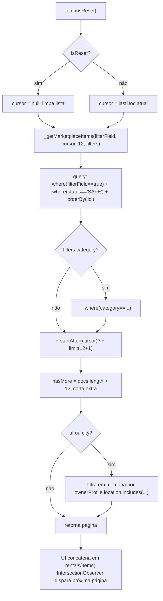
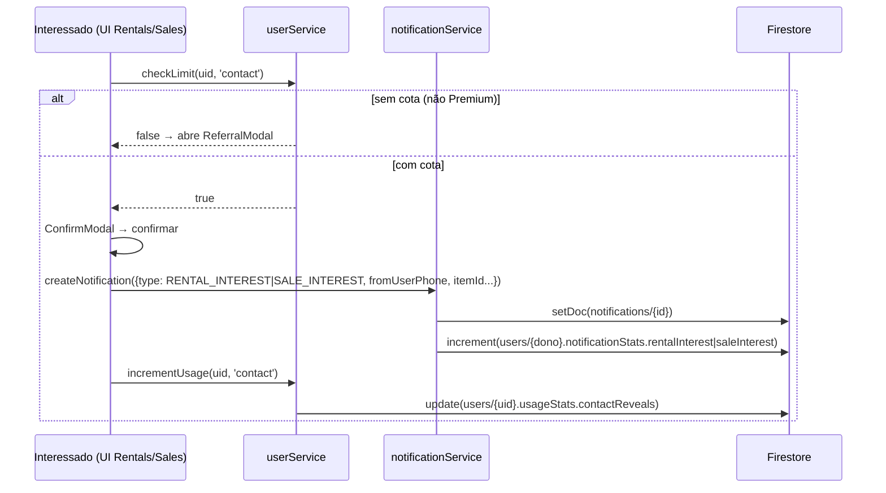

# Marketplace (Aluguel e Venda)

> Vitrine pública de equipamentos audiovisuais para aluguel e venda, com paginação por cursor, busca textual local, filtros por categoria/localização e demonstração de interesse via notificação.

O Marketplace expõe itens do inventário que o dono marcou como disponíveis
(`isForRent` e/ou `isForSale`) e cujo `status` é `SAFE`. É a superfície de
_descoberta_ do produto: quem encontra um item demonstra interesse, o que gera
uma **notificação** ao dono; a negociação e o fechamento formal acontecem depois
no fluxo de [Contratos e Pagamentos](./contracts-and-payments.md).

Duas páginas consomem a mesma infraestrutura de serviço:

| Página | Rota | Campo de filtro | Preço exibido | Detalhe visual |
| --- | --- | --- | --- | --- |
| `pages/Rentals.tsx` — "Alugar Equipamentos" | `/rentals` | `isForRent` | `rentalPricePerDay` (`R$ .../dia`) | acento `accent-secondary` |
| `pages/Sales.tsx` — "Comprar Equipamentos" | `/sales` | `isForSale` | `salePrice` | acento verde; badge "COM NOTA FISCAL" quando há `invoiceUrl` |

Ambas as rotas são protegidas (exigem login — ver `App.tsx`), mas os dados que
elas leem vêm da coleção `equipment`, cuja **leitura é pública** nas Firestore
rules (a vitrine precisa ser navegável). As duas páginas são praticamente
idênticas: divergem apenas no `filterField`, no campo de preço, na cor de acento
e no texto dos modais.

## Vitrine pública e privacidade

A consulta base do marketplace é, para qualquer visitante:

```ts
where(filterField, '==', true)   // 'isForRent' | 'isForSale'
where('status', '==', 'SAFE')
orderBy('id')
```

Os itens carregam o objeto **denormalizado** `ownerProfile` (`name`,
`avatarUrl`, `location`), gravado em `equipmentService.addEquipment` /
`updateEquipment`. Isso evita um `getDoc` por card para exibir dono e cidade.

**O telefone NUNCA é denormalizado no item.** O comentário em
`services/equipmentService.ts` (`addEquipment`) é explícito: como a vitrine é
pública, denormalizar o telefone o vazaria. O contato só acontece depois, dentro
de uma notificação privada ao dono (campo `fromUserPhone` do remetente). Ver
[Modelo de dados](../03-data-model.md) e [Segurança](../04-security.md).

## Paginação (`_getMarketplaceItems`)

O núcleo é `equipmentService._getMarketplaceItems(filterField, lastDoc, limitCount, filters)`
(`services/equipmentService.ts`). Os _wrappers_ `getRentalsPaginated` e
`getSalesPaginated` apenas fixam o `filterField`; as páginas chamam com
`limitCount = 12`.

Detalhes que importam:

- **Ordenação por `orderBy('id')`.** Não existe campo `createdAt` no `Equipment`,
  então a ordenação estável usada como cursor é o próprio `id` do documento. O
  código traz um comentário reconhecendo que o ideal, em produção, seria ordenar
  por um `createdAt`. Consequência prática: a vitrine **não** é ordenada por
  "mais recente", e sim pela ordem lexicográfica dos IDs.
- **`limit(limitCount + 1)` para calcular `hasMore` sem segunda consulta.** Busca
  um item a mais do que a página; se vierem mais de `limitCount` documentos,
  `hasMore = true` e o item extra é descartado (`allDocs.slice(0, limitCount)`).
  Evita um `getCountFromServer` separado.
- **Cursor:** `startAfter(lastDoc)` quando há `lastDoc`; o novo cursor
  (`newLastDoc`) é o último documento **da página já cortada**.
- **Filtro de categoria server-side:** se `filters.category`, adiciona
  `where('category', '==', filters.category)` à query.
- **Filtro de localização "soft" (client-side):** o Firestore não faz busca
  parcial/`contains` eficiente sem serviço externo. Portanto, quando há
  `filters.uf` ou `filters.city`, o filtro roda **em memória sobre a página já
  buscada** — `item.ownerProfile?.location?.toLowerCase().includes(searchLoc)`
  (usa `city` se houver, senão `uf`). É O(N) só sobre o tamanho da página, não
  sobre o banco.

O retorno é `{ data, lastDoc, hasMore }`.



### Scroll infinito na UI

As páginas usam `IntersectionObserver` via `lastElementRef` (callback ref no
último card). Quando o último card entra na viewport e `hasMore` é `true`,
chama-se `fetchRentals(false)` / `fetchSales(false)` para anexar a próxima página.
O `useEffect` que observa `[filterCategory, selectedUf, selectedCity, debouncedSearch]`
**reseta** a lista (`setRentals([])`, `setLastDoc(null)`, `setHasMore(true)`) e
decide entre paginação (`fetch(true)`) e busca (`runSearch`) conforme
`debouncedSearch` esteja vazio ou não.

## Busca textual (`searchMarketplace`)

Quando o usuário digita algo (input com `debounce` de 500 ms →
`debouncedSearch`), a página **abandona a paginação** e chama
`equipmentService.searchMarketplace(filterField, queryText, filters)`. Nessa
etapa `hasMore` é forçado a `false` (não há scroll infinito durante a busca).

`searchMarketplace` faz **uma única** query:

```ts
query(
  collection(db, 'equipment'),
  where(filterField, '==', true),
  where('status', '==', 'SAFE'),
  orderBy('id'),
  limit(120)          // teto do lote analisado
)
```

e depois filtra o lote **em memória**:

- **Texto:** `` `${name} ${brand} ${model}`.toLowerCase().includes(needle) `` —
  substring case-insensitive sobre nome + marca + modelo.
- **Categoria:** igualdade exata (`it.category === filters.category`).
- **Localização:** `ownerProfile.location.toLowerCase().includes(...)`, mesma
  lógica "soft" da paginação.

**Sem serviço externo** (nada de Algolia/Typesense) e **sem migração de dados**.

## Filtros

| Filtro | Onde roda | Fonte dos valores |
| --- | --- | --- |
| Categoria | Server-side (`where('category','==',...)`) na paginação; em memória na busca | `EquipmentCategory` enum (`types.ts`) |
| UF | Client-side ("soft", `includes` sobre `ownerProfile.location`) | `IBGEService.getUFs()` |
| Cidade | Client-side ("soft") | `IBGEService.getCitiesByUF(uf)` |

O seletor de UF começa em "Todo o Brasil"; o de cidade fica desabilitado até que
uma UF seja escolhida (`disabled={!selectedUf || loadingCities}`) e é repovoado
via IBGE a cada troca de UF. Ver [IBGEService](../reference/services.md).

## Demonstração de interesse → notificação

O botão "Tenho Interesse" (escondido no próprio anúncio via `isOwner`) dispara
`handleInterest(item)`. O fluxo é idêntico em `Rentals` e `Sales`, mudando só o
`type` da notificação e os textos:

1. **Guarda de dono:** se `!user` ou `item.ownerId === user.id`, retorna.
2. **Limite de contato:** `userService.checkLimit(user.id, 'contact')`.
   - Se `false` → abre o `ReferralModal` (`reason="contact"`) e encerra (não envia
     nada). Ver [Referral e Freemium](./referral-and-freemium.md).
3. **Confirmação:** abre `ConfirmModal`. No confirmar:
   - Monta uma `Notification` (id `crypto.randomUUID()`) com o remetente
     denormalizado (`fromUserName`, `fromUserPhone`, `fromUserAvatar`,
     `fromUserReputation`, `fromUserConnectionsCount`), os dados do item
     (`itemId`, `itemName`, `itemImage`), `type` e uma `message`.
   - `notificationService.createNotification(notification)`.
   - `userService.incrementUsage(user.id, 'contact')` — consome uma cota mensal.

| Página | `type` da notificação | Texto da mensagem |
| --- | --- | --- |
| `Rentals` | `RENTAL_INTEREST` | "Tenho interesse em alugar seu item {nome}." |
| `Sales` | `SALE_INTEREST` | "Tenho interesse em comprar seu item {nome}." |

### Limite `contactReveals`

O teto vem de `FREE_LIMITS.contactReveals = 3` (`services/userService.ts`):
**3 interesses/contatos enviados por mês** no plano gratuito. `checkLimit`
retorna `true` de imediato para **Premium** (`isPremium`: `referralCount >= 5`
ou `role === 'admin'`). A contagem mensal fica em `user.usageStats.contactReveals`
(`{ count, month }`), reiniciada quando o mês (`YYYY-MM`) muda. `incrementUsage`
grava esse estado.

> Limitação de segurança: `checkLimit`/`incrementUsage` rodam **no cliente**. Um
> ator malicioso pode escrever notificações fora da UI; as Firestore rules fazem
> defesa por-campo, mas a migração para Cloud Functions segue pendente
> (`FIREBASE_RULES.md`). Ver [Segurança](../04-security.md).

### Efeitos colaterais em `createNotification`

Além de gravar o doc em `notifications` (removendo campos `undefined` antes,
porque o Firestore rejeitaria o doc inteiro), `createNotification` **incrementa
`notificationStats`** no destinatário: `rentalInterest` para `RENTAL_INTEREST`,
`saleInterest` para `SALE_INTEREST`. Essas métricas são vitalícias (persistem
mesmo após a notificação expirar/ser apagada). A notificação de interesse é
criada **sem `expiresAt`** — não expira automaticamente até que o dono a
arquive (`scheduleNotificationExpiry` define `expiresAt` = +24h). A faxina de
expirados acontece no `subscribeUserNotifications`. Ver
[Notificações](./notifications.md).



## Ponte para chat e contratos

O interesse é só o primeiro contato. Ao receber a notificação
(`RENTAL_INTEREST`/`SALE_INTEREST`), o dono vê em `pages/Notifications.tsx` as
ações "Conversar no app" (abre o [Chat](./chat.md) interno) e "Adicionar à Rede".
A **negociação e o fechamento formal** (proposta, aceite, pagamento, devolução)
pertencem à coleção `contracts` e são documentados em
[Contratos e Pagamentos](./contracts-and-payments.md):

- **Venda:** o dono propõe → item vira `TRANSFER_PENDING` → comprador aceita →
  `equipmentService.transferEquipmentOwnership` transfere a posse. Ao transferir,
  o item sai do marketplace: `isForRent` e `isForSale` são zerados e o
  `ownerProfile` é re-denormalizado para o novo dono.
- **Aluguel:** aceite → `active`; devolução → `completed`.

Ou seja: o marketplace **descobre e conecta**; os contratos **formalizam**.

## Banner de anúncio (`useAd`)

O hook `hooks/useAd.ts` busca um anúncio ativo (`adService.getActiveAd`) e
registra a impressão (`adService.trackAdImpression`). `getActiveAd` filtra
`where('active','==',true)`, valida a janela `startDate <= hoje <= endDate` e
faz **seleção aleatória ponderada por `weight`**. O componente é
`components/AdBanner.tsx`.

> Observação factual (honestidade técnica): **as páginas do marketplace
> (`Rentals.tsx` e `Sales.tsx`) NÃO renderizam o `AdBanner` atualmente.** O
> banner aparece em `pages/Home.tsx`, `pages/SerialCheck.tsx` e
> `pages/Notifications.tsx` — inclusive na página de Notificações onde o dono lê
> os interesses recebidos. O hook `useAd`/`AdBanner` está disponível para ser
> plugado nas vitrines, mas hoje não está. Ver [Publicidade](./advertising.md).

## Limitações registradas

- **Ordenação:** paginação por `orderBy('id')` (lexicográfica), não por recência
  — falta um `createdAt` no `Equipment`.
- **Busca textual:** cobre apenas os **primeiros ~120 itens** do filtro
  (`limit(120)` em `searchMarketplace`) e faz `includes` em memória; adequado
  enquanto o catálogo é pequeno. Acima disso, exige full-text externo
  (Algolia/Typesense).
- **Localização "soft":** o filtro de UF/cidade roda sobre a página já buscada.
  Combinado com o scroll infinito, uma página pode retornar **menos itens que o
  `limit`** (itens fora da localização são removidos após o corte), e itens
  relevantes fora do lote de 120 (na busca) ficam invisíveis.
- **Limites no cliente:** `contactReveals` é validado no cliente
  (`userService.checkLimit`); a defesa forte depende de rules por-campo e da
  migração pendente para Cloud Functions.

## Fontes no código

- `pages/Rentals.tsx` — vitrine de aluguel, scroll infinito, interesse
- `pages/Sales.tsx` — vitrine de venda (badge nota fiscal, `salePrice`)
- `services/equipmentService.ts` — `_getMarketplaceItems`, `getRentalsPaginated`,
  `getSalesPaginated`, `searchMarketplace`, `transferEquipmentOwnership`
- `services/notificationService.ts` — `createNotification`, `notificationStats`,
  faxina de expirados
- `services/userService.ts` — `FREE_LIMITS.contactReveals`, `checkLimit`,
  `incrementUsage`, `isPremium`
- `services/adService.ts` — `getActiveAd` (ponderado por `weight`), tracking
- `hooks/useAd.ts` — hook do banner de anúncio
- `components/AdBanner.tsx` — componente do banner
- `pages/Notifications.tsx` — ações "Conversar no app" / "Adicionar à Rede"
- `types.ts` — `Equipment`, `MarketplaceFilters`, `Notification`,
  `NotificationType`, `UsageStats`, `Ad`
