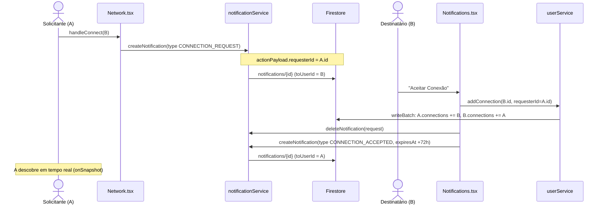
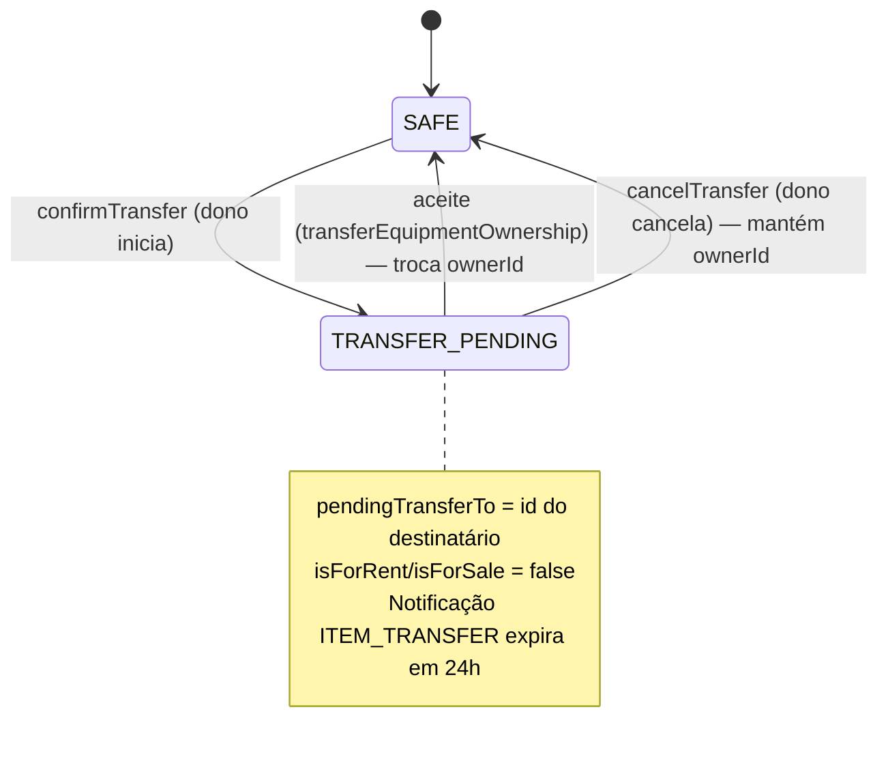
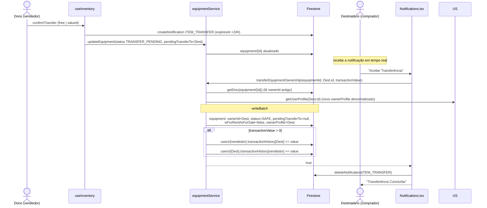

# Rede de Confiança & Transferência de Posse

> Rede mútua de usuários confiáveis que habilita a transferência direta de posse de equipamentos (gratuita ou com valor) fora do fluxo de contrato/marketplace.

Esta feature cobre dois mecanismos acoplados:

1. **Rede de Confiança** — grafo de conexões **mútuas** entre usuários (`users.connections[]`), usado para descobrir pessoas, exibir histórico de transações e habilitar a transferência direta.
2. **Transferência de Posse** — repasse de um item de inventário para uma conexão, com fluxo de aceite explícito e expiração de 24h.

Página principal: `pages/Network.tsx` (rota `/network`). Lógica de transferência: `hooks/useInventory.ts` + `services/equipmentService.ts`. Aceites: `pages/Notifications.tsx`.

---

## 1. Rede de Confiança

### 1.1 Busca de usuários (`searchUsers`)

`userService.searchUsers(queryStr, currentUserId)` (`services/userService.ts:179`) faz busca textual **no cliente**:

```ts
searchUsers: async (queryStr, currentUserId) => {
  if (!queryStr || queryStr.length < 2) return [];
  const allUsers = await userService.getAllUsers();          // baixa TODOS os users
  const lowerQuery = queryStr.toLowerCase();
  return allUsers.filter(u => u.id !== currentUserId &&
    (u.name.toLowerCase().includes(lowerQuery) ||
     u.email.toLowerCase().includes(lowerQuery))
  ).slice(0, 20);
}
```

Características e limitações reais:

| Aspecto | Comportamento |
| --- | --- |
| Gatilho na UI | `debounce` de 500 ms, dispara só com `searchQuery.trim().length >= 2` (`pages/Network.tsx:30`) |
| Campos pesquisados | `name` e `email` (substring, case-insensitive) |
| Placeholder | "Encontrar pessoas por nome..." — o e-mail também casa, embora não anunciado na UI |
| Exclusões | Remove o próprio usuário (`u.id !== currentUserId`) |
| Limite de resultados | `.slice(0, 20)` |
| Custo | `getAllUsers()` baixa **a coleção `users` inteira** e a `equipment` inteira (recalcula `reputationPoints` e `inventoryCount` por usuário em `userService.ts:142`). Não é escalável; adequado apenas enquanto a base é pequena. |

> **Nota de precisão:** a busca **não** filtra usuários já conectados nem bloqueados (`isBlocked`) no servidor. A UI apenas rotula quem já é conexão com o selo "Conectado" (`Network.tsx:122`), comparando contra a lista carregada por `getConnections`.

### 1.2 Conexões mútuas e atômicas

O modelo de rede é **simétrico**: se A está conectado a B, então B está conectado a A. Isso é garantido por escritas atômicas via `writeBatch`, evitando conexões unilaterais.

**Adicionar** (`userService.addConnection`, `services/userService.ts:188`):

```ts
addConnection: async (userAId, userBId) => {
  if (userAId === userBId) return false;              // não conecta consigo mesmo
  const batch = writeBatch(db);
  batch.update(doc(db, 'users', userAId), { connections: arrayUnion(userBId) });
  batch.update(doc(db, 'users', userBId), { connections: arrayUnion(userAId) });
  await batch.commit();                               // ou os dois lados, ou nenhum
  return true;
}
```

**Remover** (`userService.removeConnection`, `services/userService.ts:200`): mesmo padrão com `arrayRemove` nos dois documentos.

| Garantia | Implementação |
| --- | --- |
| Mutualidade | Ambos os `users/{id}.connections[]` são atualizados no mesmo batch |
| Atomicidade | `writeBatch(db)` + `batch.commit()` — falha total ou sucesso total |
| Idempotência | `arrayUnion`/`arrayRemove` não duplicam nem quebram se já presente/ausente |
| Anti-self | `addConnection` rejeita `userAId === userBId` |
| Retorno | `boolean` — `false` em qualquer exceção (`try/catch` engole o erro) |

`userService.getConnections(userId)` (`services/userService.ts:212`) resolve os IDs em perfis: lê `users/{userId}.connections[]`, faz `getDoc` de cada ID em paralelo (`Promise.all`) e retorna os `User` existentes (filtrando o próprio usuário por segurança).

### 1.3 Fluxo de convite: `CONNECTION_REQUEST` → `CONNECTION_ACCEPTED`

A conexão **não** é imediata: ela passa por um convite via notificação, aceito pelo destinatário. É o aceite — e não o envio — que efetiva a conexão mútua.



Pontos verificados no código:

- **Envio** (`Network.tsx:60-64`): cria `Notification` com `type: 'CONNECTION_REQUEST'` e `actionPayload: { requesterId: user.id }`. Antes checa se já são conexões e, se sim, apenas exibe "Já Conectados" (`Network.tsx:50`).
- **Aceite** (`Notifications.tsx:84-112`, `handleAcceptConnection`): chama `userService.addConnection(user.id, notif.actionPayload.requesterId)`; em sucesso, `deleteNotification(notif.id)` e cria uma notificação `CONNECTION_ACCEPTED` de volta ao solicitante, com `expiresAt` de **72h** (`Date.now() + 72 * 60 * 60 * 1000`).
- **"Adicionar à Rede" a partir de interesse** (`Notifications.tsx:69-82`, `handleConnectBack`): em notificações `RENTAL_INTEREST`/`SALE_INTEREST` de quem ainda não é conexão, permite disparar um novo `CONNECTION_REQUEST`.
- Não há botão explícito de **recusar convite**: uma `CONNECTION_REQUEST` não aceita simplesmente permanece na lista (ela não tem `expiresAt`).

### 1.4 Histórico de transações entre parceiros (`transactionHistory`)

`User.transactionHistory` (`types.ts:89`) é um mapa `{ [partnerId: string]: number }` com o **valor total acumulado** transacionado com cada parceiro.

Na tela de rede, cada conexão exibe um selo quando há histórico com valor positivo (`Network.tsx:164-169`):

```tsx
{user && user.transactionHistory && user.transactionHistory[conn.id] > 0 && (
  <span>R$ {user.transactionHistory[conn.id].toLocaleString('pt-BR', { notation: 'compact' })} transacionados</span>
)}
```

Este mapa é alimentado exclusivamente por transferências **com valor** (ver §2.3) e por vendas via contrato — ambos passam por `transferEquipmentOwnership`, que incrementa os dois lados.

### 1.5 Outras ações e sinais no card de conexão

Cada card de conexão (e cada resultado de busca) traz, além de desconectar e do selo de transações:

- **Enviar mensagem** (botão `Mail`, `Network.tsx:173`): `handleMessage` (`Network.tsx:75-79`) chama `chatService.openChat(...)` e navega para `/chat`, abrindo a conversa interna. É a ponte da Rede para o [Chat](chat.md).
- **Selo "Pendência de devolução"**: usuários que constam em um alerta público ativo de não-devolução aparecem sinalizados. A tela assina `contractService.subscribeCommunityAlerts` e monta um conjunto `flaggedIds` (`Network.tsx:27`, `Network.tsx:114`) — um sinal de confiança que cruza a Rede com os [alertas de não-devolução](contracts-and-payments.md) (coleção `return_alerts`).

---

## 2. Transferência de Posse (via rede)

Permite ao dono repassar um item do inventário para uma **conexão** da rede. Suporta transferência **gratuita** (`free`) ou **com valor** (`valued`).

### 2.1 Estados e ciclo de vida

O item transita entre `SAFE` e `TRANSFER_PENDING` (enum `EquipmentStatus`, `types.ts:6`):



### 2.2 Início da transferência (`confirmTransfer`)

Lógica em `hooks/useInventory.ts` (`handleTransferClick` + `confirmTransfer`, linhas 165-194):

1. `handleTransferClick(item)` (`useInventory.ts:165`): se a rede estiver vazia, abre modal "Rede Vazia" com atalho para `/network`; caso contrário abre o modal de transferência e pré-preenche `transactionValue` com `item.value`.
2. `confirmTransfer` (`useInventory.ts:176`): exige `selectedConnectionId` (uma conexão) e computa `value = transferType === 'valued' ? transactionValue : 0`.
3. Cria a notificação `ITEM_TRANSFER` e **em seguida** marca o item como pendente:

```ts
const notification: Notification = {
  id: crypto.randomUUID(),
  toUserId: targetUser.id,
  type: 'ITEM_TRANSFER',
  itemId: itemToTransfer.id, itemName: ..., itemImage: ...,
  createdAt: new Date().toISOString(),
  expiresAt: new Date(Date.now() + 24 * 60 * 60 * 1000).toISOString(),  // 24h
  actionPayload: { equipmentId: itemToTransfer.id, transactionValue: value },
};
await notificationService.createNotification(notification);
await equipmentService.updateEquipment({
  ...itemToTransfer,
  status: EquipmentStatus.TRANSFER_PENDING,
  pendingTransferTo: selectedConnectionId,
  isForRent: false, isForSale: false,     // sai do marketplace enquanto pendente
});
```

Enquanto `TRANSFER_PENDING`, o item é retirado do marketplace (`isForRent`/`isForSale` = `false`) e carrega `pendingTransferTo`.

> **Nota:** as duas escritas (notificação + item) **não** são atômicas entre si — não há `writeBatch` cobrindo notificação e equipamento. Se a segunda falhar, pode restar uma notificação sem o item pendente. A UI trata apenas o caminho feliz.

### 2.3 Aceite pelo destinatário (`transferEquipmentOwnership`)

O destinatário aceita em `pages/Notifications.tsx` (`handleAcceptTransfer`, linha 114), que chama `equipmentService.transferEquipmentOwnership(equipmentId, user.id, transactionValue)` (`services/equipmentService.ts:233`).



O que `transferEquipmentOwnership` faz (`equipmentService.ts:233-281`), tudo num único `writeBatch`:

| Campo do `equipment` | Novo valor |
| --- | --- |
| `ownerId` | `newOwnerId` (o destinatário) |
| `status` | `EquipmentStatus.SAFE` |
| `pendingTransferTo` | `null` |
| `isForRent` / `isForSale` | `false` (chega ao novo dono fora do marketplace) |
| `ownerProfile` | perfil **redenormalizado** do novo dono (`getUserProfile(newOwnerId)` → `{ name, avatarUrl, location }`) |
| `value` | atualizado para `transactionValue` **apenas se** `transactionValue > 0` |

Se `transactionValue > 0`, o mesmo batch incrementa `transactionHistory` nos **dois** usuários (`equipmentService.ts:267-273`):

```ts
batch.update(sellerRef, { [`transactionHistory.${newOwnerId}`]: increment(transactionValue) });
batch.update(buyerRef,  { [`transactionHistory.${item.ownerId}`]: increment(transactionValue) });
```

Em transferência **gratuita** (`value === 0`), nenhum histórico é gravado e `value` do item permanece inalterado.

Após sucesso, `Notifications.tsx:124` remove a notificação `ITEM_TRANSFER` (`deleteNotification`).

### 2.4 Recusa / cancelamento (`cancelTransfer`)

`equipmentService.cancelTransfer(equipmentId)` (`services/equipmentService.ts:283`) reverte o item ao estado disponível:

```ts
await updateDoc(doc(db, 'equipment', equipmentId), {
  status: EquipmentStatus.SAFE,
  pendingTransferTo: null,
});
```

> **Nota de precisão (importante):** no fluxo de rede, `cancelTransfer` é acionado pelo **dono/remetente**, não pelo destinatário. Em `useInventory.handleCancelTransfer` (`useInventory.ts:196`) o próprio dono cancela a transferência pendente a partir do inventário. A tela de `Notifications` do destinatário oferece **apenas** o botão "Aceitar Transferência" (`Notifications.tsx:216`) — **não há botão de recusar** para o destinatário.
>
> A `cancelTransfer` **não** apaga a notificação `ITEM_TRANSFER` do destinatário — o próprio código comenta que isso não é possível por regra de segurança (só o dono do `toUserId` pode ler/apagar): a limpeza depende do destinatário abrir a notificação ou de ela expirar (`equipmentService.ts:285-286`).

**Expiração de 24h.** A notificação `ITEM_TRANSFER` tem `expiresAt = createdAt + 24h`. A expiração atua **na notificação**, não no item:

- `notificationService.subscribeUserNotifications` faz "faxina": ao receber o snapshot, `deleteDoc` de qualquer notificação com `expiresAt <= now` (`services/notificationService.ts:19-20`).
- Na UI, `NotificationTimer`/`Countdown` escondem e removem a notificação expirada (`Notifications.tsx:14`, `155`, `193-198`).
- **Limitação real:** se a notificação expirar sem aceite e o dono não chamar `cancelTransfer`, o item permanece em `TRANSFER_PENDING` (fora do marketplace) até uma ação manual do dono. Não há job de servidor (sem Cloud Functions) que devolva o item a `SAFE` automaticamente.

---

## 3. Transferência via rede vs. venda via contrato/marketplace

As duas rotas de troca de posse **compartilham o mesmo núcleo** (`transferEquipmentOwnership`), mas diferem no que as envolve.

| Aspecto | Transferência via rede | Venda via contrato/marketplace |
| --- | --- | --- |
| Ponto de partida | Inventário (`useInventory.confirmTransfer`) | Contrato de venda (`contractService.createContract` tipo `sale`) |
| Pré-requisito | Destinatário **precisa ser conexão** da rede | Não exige conexão; parte de interesse no marketplace |
| Sinalização | Notificação `ITEM_TRANSFER` (expira em 24h) | Documento em `contracts` (status `proposed` → `completed`) |
| Estado intermediário | `TRANSFER_PENDING` + `pendingTransferTo` | `TRANSFER_PENDING` + `pendingTransferTo` (idêntico) |
| Aceite | `transferEquipmentOwnership(itemId, novoDono, value)` chamado por `Notifications.tsx` | `contractService.acceptContract` → chama o **mesmo** `transferEquipmentOwnership` (`contractService.ts:82`) |
| Valor | Opcional (`free` ou `valued`) | `contract.value` (preço de venda) |
| `transactionHistory` | Atualizado se `value > 0` | Atualizado (venda tem valor) |
| Impacto global (`stats/global`) | **Não** incrementa | **Incrementa** `transactions`/`sales`/`transactedValue` em `acceptContract` (`contractService.ts:90-96`) |
| Recusa/cancelamento | `cancelTransfer` pelo dono | `closeContract(..., 'declined'|'cancelled')` → chama `cancelTransfer` (`contractService.ts:117`) e devolve o item ao marketplace |
| Comprovante/pagamento | Nenhum | `paymentProofUrl`/`paymentStatus` no contrato |
| Chat vinculado | Não | `contract.chatId` |

Resumo: a **transferência via rede** é um repasse direto e informal entre pessoas confiáveis (com ou sem valor, sem contrato nem comprovante e sem alimentar o contador de impacto global). A **venda via contrato** é formal, tem trilha de pagamento/comprovante, vincula um chat e alimenta `stats/global`. Ambas terminam na mesma operação atômica de troca de `ownerId`.

Detalhes de contratos e pagamentos: ver [contracts-and-payments.md](./contracts-and-payments.md).

---

## 4. Limitações e pontos pendentes (honestidade técnica)

- **Busca não escalável.** `searchUsers` baixa `users` + `equipment` inteiras a cada consulta (`getAllUsers`). Sem índice de texto (Algolia/Typesense) nem paginação; adequado só para base pequena.
- **Validação no cliente.** A mutualidade da conexão é feita por `writeBatch` no cliente; a defesa por-campo fica a cargo das Firestore Rules (ver [FIREBASE_RULES.md](../../FIREBASE_RULES.md)). A documentação de regras registra a intenção de mover escritas cruzadas para Cloud Functions.
- **Transferência não-atômica na origem.** No início da transferência, notificação e item são escritos em chamadas separadas (sem batch conjunto).
- **Item pode ficar "preso" em `TRANSFER_PENDING`.** Sem aceite e sem `cancelTransfer` do dono, o item não volta a `SAFE` sozinho (sem Cloud Functions).
- **`cancelTransfer` não limpa a notificação do destinatário** (restrição de leitura por `toUserId`); a notificação some por visualização ou expiração.

---

## Fontes no código

- `pages/Network.tsx` — busca, lista de conexões, envio de `CONNECTION_REQUEST`, selo de `transactionHistory`, desconexão.
- `services/userService.ts` — `searchUsers`, `addConnection`/`removeConnection` (mútuas/atômicas), `getConnections`, `getAllUsers`.
- `hooks/useInventory.ts` — `handleTransferClick`, `confirmTransfer`, `handleCancelTransfer` (fluxo de transferência a partir do inventário).
- `services/equipmentService.ts` — `transferEquipmentOwnership`, `cancelTransfer`.
- `pages/Notifications.tsx` — `handleAcceptConnection`, `handleAcceptTransfer` (aceites), `CONNECTION_ACCEPTED`.
- `services/contractService.ts` — `acceptContract`/`closeContract` (venda via contrato reutiliza o mesmo núcleo de transferência).
- `services/notificationService.ts` — `subscribeUserNotifications` (faxina por `expiresAt`), `deleteNotification`.
- `types.ts` — `EquipmentStatus.TRANSFER_PENDING`, `Equipment.pendingTransferTo`, `User.connections`, `User.transactionHistory`, `NotificationType`, `Notification.actionPayload`.

## Ver também

- [../reference/services.md](../reference/services.md) — referência de `userService`, `equipmentService`, `contractService`, `notificationService`.
- [../reference/hooks.md](../reference/hooks.md) — `useInventory`.
- [../reference/pages.md](../reference/pages.md) — `Network`, `Notifications`.
- [../03-data-model.md](../03-data-model.md) — coleções `users`, `equipment`, `notifications`, `stats/global`.
- [../04-security.md](../04-security.md) — regras Firestore e validação cliente vs. servidor.
- [notifications.md](./notifications.md) — ciclo de vida das notificações e `expiresAt`.
- [contracts-and-payments.md](./contracts-and-payments.md) — venda formal e pagamento.
