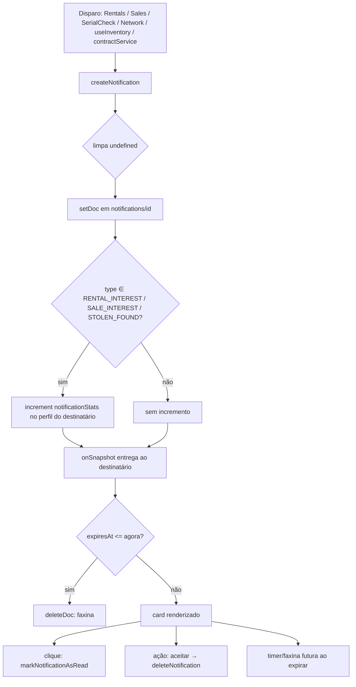

# Notificações

> Central privada de eventos por usuário, em tempo real via `onSnapshot`, com faxina automática de notificações expiradas e contadores vitalícios de interesse recebido.

A feature de Notificações é o canal de sinalização interno do Cine Safe: interesse de aluguel/venda, alerta de item roubado localizado, convites de rede, aceite de conexão, transferência de posse e aviso de aluguel atrasado. Todas as notificações são **privadas ao destinatário** (`toUserId`) e chegam **sem recarregar a página**. Não há push nativo nem Cloud Functions — tudo é cliente + Firestore.

Arquivos-fonte principais:

- `services/notificationService.ts` — CRUD, assinatura em tempo real, faxina, expiração.
- `pages/Notifications.tsx` — tela `/notifications`, ações por tipo, timers de expiração.
- `types.ts` — `NotificationType`, `Notification`, `NotificationStats`.
- `firestore.rules` — coleção `notifications` (bloco `---- NOTIFICATIONS ----`).

---

## Modelo de dados

O documento vive na coleção `notifications`, com id = `crypto.randomUUID()` (gerado no cliente, no ponto de disparo). Definição em `types.ts:111-133`:

```ts
export interface Notification {
  id: string;
  toUserId: string;          // destinatário — chave de privacidade
  fromUserId: string;        // remetente (assina o doc; validado nas rules)
  fromUserName: string;
  fromUserPhone?: string;    // opcional (pode vir undefined — ver createNotification)
  fromUserAvatar?: string;
  fromUserReputation?: number;
  fromUserConnectionsCount?: number;
  itemId?: string;
  itemName?: string;
  itemImage?: string;        // renderizado como thumbnail no card
  type: NotificationType;    // 7 tipos (tabela abaixo)
  createdAt: string;         // ISO — usado para ordenar desc
  read: boolean;
  message?: string;          // texto exibido no card
  expiresAt?: string;        // ISO — auto-exclusão/ocultação
  actionPayload?: {
    equipmentId?: string;    // ITEM_TRANSFER
    requesterId?: string;    // CONNECTION_REQUEST
    transactionValue?: number; // ITEM_TRANSFER (valor da venda na transferência)
  };
}
```

Campos denormalizados do remetente (`fromUserName`, `fromUserAvatar`, `fromUserReputation`, `fromUserConnectionsCount`) permitem renderizar o card sem uma leitura extra ao perfil de quem enviou. O card mostra reputação (XP) e nº de conexões do remetente diretamente desses campos (`pages/Notifications.tsx:177-181`).

### `NotificationStats` (contador vitalício no perfil)

Separado do documento de notificação, cada usuário guarda um agregado em `users/{uid}.notificationStats` (`types.ts:66-70`):

```ts
export interface NotificationStats {
  rentalInterest: number;
  saleInterest: number;
  stolenAlerts: number;
}
```

Esses contadores **persistem mesmo depois de a notificação ser lida ou excluída** — são a métrica vitalícia de "quanto interesse/alertas este usuário já recebeu". Só três dos sete tipos os incrementam (ver `createNotification`).

---

## Os 7 tipos e o que dispara cada um

`NotificationType` (`types.ts:102-109`) é uma união fechada de sete literais. A tabela liga cada tipo à sua origem no código, ao efeito colateral e à ação disponível no card.

| Tipo | Origem (arquivo\:linha) | `toUserId` | Efeitos e campos | Ação no card (`Notifications.tsx`) |
|---|---|---|---|---|
| `RENTAL_INTEREST` | `pages/Rentals.tsx:116-117` — usuário demonstra interesse em alugar um item da vitrine | dono do item (`item.ownerId`) | Incrementa `notificationStats.rentalInterest`. Carrega `itemId/itemName/itemImage`. | "Conversar no app" + "Adicionar à Rede" (se ainda não conectados) |
| `SALE_INTEREST` | `pages/Sales.tsx:112-113` — interesse em comprar um item | dono do item | Incrementa `notificationStats.saleInterest`. Carrega `itemId/itemName/itemImage`. | "Conversar no app" + "Adicionar à Rede" (se ainda não conectados) |
| `STOLEN_FOUND` | `pages/SerialCheck.tsx:55-56` — alguém verifica um nº de série que bate com um item `STOLEN` | dono do item roubado | Incrementa `notificationStats.stolenAlerts`. Badge vermelho "Alerta de Segurança"; mensagem "URGENTE: ...". | "Conversar no app" |
| `CONNECTION_REQUEST` | `pages/Network.tsx:61-62` (buscar e convidar) e `pages/Notifications.tsx:76-77` ("Adicionar à Rede" a partir de um interesse) | usuário convidado | `actionPayload.requesterId = fromUserId`. Sem incremento de stats. | "Aceitar Conexão" |
| `CONNECTION_ACCEPTED` | `pages/Notifications.tsx:92-105` — emitida ao aceitar um `CONNECTION_REQUEST` | quem enviou o convite (`requesterId`) | `expiresAt = agora + 72h` (informativa e efêmera). Sem incremento. | Nenhuma (só informa) |
| `ITEM_TRANSFER` | `hooks/useInventory.ts:185-187` — dono inicia transferência de posse para uma conexão | destinatário da transferência | `expiresAt = agora + 24h`; `actionPayload = { equipmentId, transactionValue }`. Sem incremento. | "Aceitar Transferência" |
| `RENTAL_OVERDUE` | `services/contractService.ts:145-159` (aviso de atraso) e `:188-199` (alerta público) | locatário (`contract.counterpartyId`) | Sem incremento; sem `expiresAt`. Badge vermelho "Aluguel Atrasado". | Nenhuma (só informa) |

Observações de precisão:

- **Só `RENTAL_INTEREST`, `SALE_INTEREST` e `STOLEN_FOUND` incrementam `notificationStats`** — os demais tipos passam pelo `createNotification` sem tocar no agregado.
- **Expiração é setada na criação** apenas para `CONNECTION_ACCEPTED` (72h) e `ITEM_TRANSFER` (24h). Os outros tipos nascem sem `expiresAt` e persistem até serem excluídos manualmente (ou por uma chamada explícita a `scheduleNotificationExpiry`).
- `RENTAL_OVERDUE` é reutilizado em duas etapas do fluxo de não-devolução: o aviso inicial (`sendOverdueNotice`) e o alerta público (`raisePublicAlert`). Ver [contracts-and-payments.md](./contracts-and-payments.md).
- O botão "Adicionar à Rede" só aparece para `RENTAL_INTEREST`/`SALE_INTEREST` quando o remetente ainda **não** é conexão (`canConnectBack`, `Notifications.tsx:158`).

---

## Modelo em tempo real: `subscribeUserNotifications`

A tela `/notifications` não faz polling. Ela assina um `onSnapshot` filtrado por `toUserId` e recebe atualizações contínuas (`services/notificationService.ts:12-28`):

```ts
subscribeUserNotifications: (userId, callback) => {
  const q = query(collection(db, 'notifications'), where('toUserId', '==', userId));
  return onSnapshot(q, (snap) => {
    const now = new Date();
    const active = [];
    snap.docs.forEach(d => {
      const n = d.data();
      if (n.expiresAt && new Date(n.expiresAt) <= now) {
        deleteDoc(doc(db, 'notifications', n.id)).catch(() => {}); // FAXINA
      } else {
        active.push(n);
      }
    });
    active.sort((a, b) => new Date(b.createdAt).getTime() - new Date(a.createdAt).getTime());
    callback(active);
  }, () => callback([])); // handler de erro → lista vazia
};
```

Pontos-chave:

- **Faxina embutida**: a cada snapshot, qualquer doc com `expiresAt <= agora` é **excluído do Firestore** (`deleteDoc`), não apenas ocultado. A exclusão é _fire-and-forget_ (`.catch(() => {})`) — falha silenciosa não trava o callback. É essa faxina que dá vida ao contrato `expiresAt -> auto-exclusão`; não há Cloud Function agendada.
- **Ordenação no cliente**: por `createdAt` decrescente (mais recentes primeiro). Não há `orderBy` no query — a ordenação acontece em memória após filtrar.
- **Retorno = unsubscribe**: a função devolve o próprio unsubscribe do `onSnapshot`. `pages/Notifications.tsx:52-53` chama e limpa no cleanup do `useEffect`.
- **Erro → lista vazia**: o segundo argumento do `onSnapshot` (`() => callback([])`) garante que uma falha de permissão/rede resulte em UI vazia, não em travamento.

### Ciclo de vida (assinatura + faxina)

```mermaid
sequenceDiagram
    participant UI as Notifications.tsx
    participant Svc as subscribeUserNotifications
    participant FS as Firestore (notifications)
    UI->>Svc: subscribe(user.id, setNotifications)
    Svc->>FS: onSnapshot(where toUserId == user.id)
    FS-->>Svc: snapshot (docs)
    loop cada doc
        alt expiresAt <= agora
            Svc->>FS: deleteDoc(id)  %% faxina (fire-and-forget)
        else ainda ativa
            Svc-->>Svc: push em active[]
        end
    end
    Svc-->>UI: callback(active ordenado desc por createdAt)
    Note over UI: card renderiza; NotificationTimer agenda onExpire
    UI->>Svc: unsubscribe() no cleanup
```

### Timers de expiração na UI

Além da faxina no servidor, a tela tem dois relógios locais:

- `NotificationTimer` (`Notifications.tsx:14-35`): agenda um `setTimeout` para `expiresAt` e chama `onExpire`, que remove o card do estado local (`handleExpire`, `:135`). Se o prazo já passou, dispara na hora.
- `Countdown` (`Notifications.tsx:238-255`): exibe "Xh Ym" restantes, atualizando a cada 60s, quando a notificação tem `expiresAt`.

A UI também tem um guard redundante: `isExpired` filtra visualmente qualquer card já vencido antes de renderizar (`Notifications.tsx:155-156`).

---

## Criação: `createNotification`

`services/notificationService.ts:30-57`. Faz duas coisas: grava o documento e, para três tipos, incrementa o contador vitalício.

```ts
createNotification: async (notification) => {
  // 1) Remove campos undefined — o Firestore rejeita o doc inteiro se houver undefined.
  const clean = Object.fromEntries(
    Object.entries(notification).filter(([, v]) => v !== undefined)
  );
  await setDoc(doc(db, 'notifications', notification.id), clean);

  // 2) Incremento vitalício só para 3 tipos
  const userRef = doc(db, 'users', notification.toUserId);
  let statField = '';
  if (notification.type === 'RENTAL_INTEREST') statField = 'notificationStats.rentalInterest';
  else if (notification.type === 'SALE_INTEREST') statField = 'notificationStats.saleInterest';
  else if (notification.type === 'STOLEN_FOUND') statField = 'notificationStats.stolenAlerts';
  if (statField) {
    await updateDoc(userRef, { [statField]: increment(1) });
  }
  return true; // false em caso de exceção (log no console)
};
```

Detalhes que importam:

- **Limpeza de `undefined`**: `fromUserPhone` (e outros opcionais) pode vir `undefined` quando o remetente não preencheu o telefone. Sem a filtragem, o `setDoc` falharia e a notificação nunca seria criada. Por isso o objeto passa por `Object.entries(...).filter(v !== undefined)` antes de gravar.
- **Incremento é escrita cruzada**: o `updateDoc` incide sobre `users/{toUserId}` — um documento de **outro** usuário. As Firestore rules liberam isso porque `notificationStats` está na allowlist de escritas cruzadas (`hasOnly(['connections','notificationStats','transactionHistory','referralCount'])`, `firestore.rules:42-44`). Ver [Segurança](#segurança-e-privacidade).
- **Uso do valor de retorno**: os disparos existentes (Rentals, Sales, SerialCheck, Network, useInventory, contractService) não checam o `boolean` retornado — a criação é otimista. Na aceitação de conexão/transferência, a remoção da notificação de origem é conduzida pelo `onSnapshot` após o `deleteDoc` (fonte única da verdade; ver `Notifications.tsx:89` e `:123`).

---

## Operações do serviço

`services/notificationService.ts`. Todas as cinco re-exportadas pelo facade em `services/storage.ts` (`createNotification`, `getUserNotifications`, `markNotificationAsRead`, `deleteNotification`, `scheduleNotificationExpiry`).

| Função | Linha | O que faz |
|---|---|---|
| `subscribeUserNotifications(userId, cb)` | 12-28 | Assina em tempo real + faxina + ordena. Retorna unsubscribe. |
| `createNotification(notification)` | 30-57 | Grava (limpando `undefined`) e incrementa `notificationStats` p/ 3 tipos. |
| `getUserNotifications(userId)` | 59-73 | Leitura pontual (one-shot): filtra expiradas **em memória** (não deleta) e ordena desc. Usada em `pages/Home.tsx:24` para o resumo da home. |
| `markNotificationAsRead(id)` | 75-80 | `updateDoc { read: true }`. |
| `deleteNotification(id)` | 82-90 | `deleteDoc`. |
| `scheduleNotificationExpiry(id)` | 92-101 | `updateDoc { read: true, expiresAt: agora + 24h }` — marca lida e agenda auto-exclusão. |

Diferença importante entre os dois "listadores": `subscribeUserNotifications` **exclui** as expiradas (faxina real); `getUserNotifications` apenas **as filtra** da resposta sem apagar (`:64-70`).

### Marcar como lida

Ao clicar em um card, `handleNotificationClick` (`Notifications.tsx:56-61`) chama `markNotificationAsRead` e atualiza o estado local otimisticamente. Cards não lidos ganham borda destacada e um ponto pulsante (`:161-163`).

### Excluir

`deleteNotification` é usada nos fluxos de aceite (conexão e transferência) para remover a notificação de origem após a ação (`Notifications.tsx:90` e `:124`). A UI não expõe um botão genérico de "excluir"; a remoção acontece por ação (aceitar) ou por expiração (faxina/timer).

### `scheduleNotificationExpiry` (24h)

Helper que marca a notificação como lida **e** define `expiresAt = agora + 24h`, delegando a exclusão futura à faxina do `subscribe`. Está definida e re-exportada em `services/storage.ts:73`, porém **não há chamador no código atual** — é um utilitário disponível, ainda não conectado a nenhuma ação de UI. Registrado aqui por honestidade de rastreabilidade.

---

## `actionPayload`

Campo opcional que carrega o contexto para a ação do card:

| Chave | Tipo em que aparece | Consumo |
|---|---|---|
| `requesterId` | `CONNECTION_REQUEST` | `handleAcceptConnection` chama `userService.addConnection(user.id, requesterId)` (`Notifications.tsx:84-112`), depois deleta a notificação e emite `CONNECTION_ACCEPTED`. |
| `equipmentId` | `ITEM_TRANSFER` | `handleAcceptTransfer` chama `equipmentService.transferEquipmentOwnership(equipmentId, user.id, transactionValue)` (`:114-132`), depois deleta a notificação. |
| `transactionValue` | `ITEM_TRANSFER` | Valor da venda (0 se transferência gratuita), repassado à transferência de posse. Alimenta `transactionHistory`/impacto. |

Fluxos de aceite completos estão em [network-and-transfers.md](./network-and-transfers.md).

---

## Segurança e privacidade

Bloco `---- NOTIFICATIONS ----` em `firestore.rules:82-86`:

```
match /notifications/{notifId} {
  allow read:          if isSignedIn() && resource.data.toUserId == request.auth.uid;
  allow create:        if isSignedIn() && request.resource.data.fromUserId == request.auth.uid;
  allow update, delete: if isSignedIn() && resource.data.toUserId == request.auth.uid;
}
```

- **Leitura estritamente do destinatário**: ninguém além de `toUserId` lê a notificação. O query do `subscribe` filtra por `toUserId == uid`, alinhado à regra.
- **Criação assinada**: quem cria precisa gravar o próprio uid em `fromUserId` (não dá para forjar remetente).
- **Gerência só do destinatário**: `update` (marcar lida) e `delete` (excluir/faxina) exigem ser o `toUserId`. Isso significa que a **faxina no `subscribe` só apaga o que é do próprio usuário** — coerente, já que ele só assina as próprias notificações.
- **Escrita cruzada de `notificationStats`**: o incremento em `createNotification` grava no perfil do destinatário. Permitido pela regra de `users` que restringe escritas de terceiros a `hasOnly(['connections','notificationStats','transactionHistory','referralCount'])` (`firestore.rules:42-44`) — defesa por-campo contra escalonamento de privilégio.

Limitação registrada: as validações de negócio (quem pode disparar qual tipo, limites de uso) rodam no **cliente**; as rules fazem defesa por-campo, mas mover a lógica sensível para Cloud Functions segue como pendência documentada em [FIREBASE_RULES.md](../../FIREBASE_RULES.md). Ver também [04-security.md](../04-security.md).

---

## Fluxo de vida de uma notificação



---

## Limitações e notas técnicas

- **Sem push real**: notificações só aparecem quando a tela está montada e assinando (`/notifications`) ou no carregamento pontual da Home (`getUserNotifications`). Não há Service Worker push nem badge no ícone do PWA.
- **Sem paginação**: o query traz **todas** as notificações do usuário (filtro apenas por `toUserId`), ordenadas em memória. Para volumes altos isso cresce sem limite.
- **Faxina oportunística**: a exclusão de expiradas depende de o destinatário abrir a tela e disparar um snapshot. Enquanto ele não abre, o doc expirado permanece no Firestore (apenas oculto na leitura pontual). Não há job de limpeza server-side.
- **`scheduleNotificationExpiry` sem chamador**: existe e está exportada, mas nenhuma ação de UI a invoca hoje.
- **Incremento não-transacional**: `createNotification` grava a notificação e incrementa o stat em duas escritas sequenciais separadas; uma falha no `updateDoc` deixa a notificação criada sem o stat correspondente (o `catch` retorna `false` mas os disparos não tratam o retorno).

---

## Fontes no código

- `services/notificationService.ts` — serviço completo (subscribe/faxina, create, read, markAsRead, delete, scheduleExpiry).
- `pages/Notifications.tsx` — tela `/notifications`, ações por tipo, `NotificationTimer`, `Countdown`.
- `types.ts` — `NotificationType` (`:102-109`), `Notification` (`:111-133`), `NotificationStats` (`:66-70`).
- `firestore.rules` — bloco `notifications` (`:82-86`) e escrita cruzada de `notificationStats` em `users` (`:42-44`).
- `pages/Rentals.tsx:116-117` — disparo `RENTAL_INTEREST`.
- `pages/Sales.tsx:112-113` — disparo `SALE_INTEREST`.
- `pages/SerialCheck.tsx:55-56` — disparo `STOLEN_FOUND`.
- `pages/Network.tsx:61-62` — disparo `CONNECTION_REQUEST`.
- `hooks/useInventory.ts:185-187` — disparo `ITEM_TRANSFER`.
- `services/contractService.ts:145-159` e `:188-199` — disparos `RENTAL_OVERDUE`.
- `pages/Home.tsx:24` — uso de `getUserNotifications` (resumo pontual).

## Veja também

- [../reference/services.md](../reference/services.md) — referência do `notificationService`.
- [../03-data-model.md](../03-data-model.md) — coleção `notifications` no modelo de dados.
- [../04-security.md](../04-security.md) — regras e privacidade.
- [./network-and-transfers.md](./network-and-transfers.md) — aceite de conexão e transferência de posse.
- [./marketplace.md](./marketplace.md) — origem de `RENTAL_INTEREST`/`SALE_INTEREST`.
- [./theft-and-safety.md](./theft-and-safety.md) — origem de `STOLEN_FOUND`.
- [./contracts-and-payments.md](./contracts-and-payments.md) — origem de `RENTAL_OVERDUE`.
- [./chat.md](./chat.md) — botão "Conversar no app" a partir da notificação.
