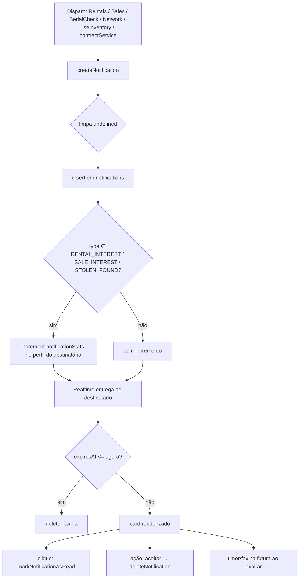

# Notificações

> Central privada de eventos por usuário, em tempo real via **Supabase Realtime** (`postgres_changes`), com faxina automática de notificações expiradas e contadores vitalícios de interesse recebido.

A feature de Notificações é o canal de sinalização interno do Cine Safe: interesse de aluguel/venda, alerta de item roubado localizado, convites de rede, aceite de conexão, transferência de posse e aviso de aluguel atrasado. Todas as notificações são **privadas ao destinatário** (`toUserId`) e chegam **sem recarregar a página**. Não há push nativo nem backend próprio — tudo é cliente + **Supabase** (PostgREST + Realtime), com a **RLS do Postgres** como fronteira de segurança.

> **Stack:** este app foi migrado de Firestore para **Supabase/Postgres**. A tabela é `public.notifications` (colunas em `snake_case`); a leitura em tempo real usa **Supabase Realtime** (`postgres_changes`), não `onSnapshot`. As policies de acesso vivem em SQL (RLS), não em `firestore.rules`.

Arquivos-fonte principais:

- `services/notificationService.ts` — CRUD (via `supabase`), assinatura em tempo real, faxina, expiração.
- `pages/Chat.tsx` / `pages/Notifications.tsx` — inbox unificado, ações por tipo, timers de expiração.
- `types.ts` — `NotificationType`, `Notification`, `NotificationStats`.
- `supabase/migrations/20260709_notifications_rls_realtime.sql` — RLS (select/insert/update/delete) + realtime da tabela `notifications`.

---

## Modelo de dados

O documento vive na coleção `notifications`, com id = `crypto.randomUUID()` (gerado no cliente, no ponto de disparo). Definição em `types.ts:111-133`:

```ts
export interface Notification {
  id: string;
  toUserId: string;          // destinatário — chave de privacidade
  fromUserId: string;        // remetente (assina o doc; validado nas rules)
  fromUserName: string;
  fromUserPhone?: string;    // opcional (pode vir undefined — ver createNotification)
  fromUserAvatar?: string;
  fromUserReputation?: number;
  fromUserConnectionsCount?: number;
  itemId?: string;
  itemName?: string;
  itemImage?: string;        // renderizado como thumbnail no card
  type: NotificationType;    // 7 tipos (tabela abaixo)
  createdAt: string;         // ISO — usado para ordenar desc
  read: boolean;
  message?: string;          // texto exibido no card
  expiresAt?: string;        // ISO — auto-exclusão/ocultação
  actionPayload?: {
    equipmentId?: string;    // ITEM_TRANSFER
    requesterId?: string;    // CONNECTION_REQUEST
    transactionValue?: number; // ITEM_TRANSFER (valor da venda na transferência)
  };
}
```

Campos denormalizados do remetente (`fromUserName`, `fromUserAvatar`, `fromUserReputation`, `fromUserConnectionsCount`) permitem renderizar o card sem uma leitura extra ao perfil de quem enviou. O card mostra reputação (XP) e nº de conexões do remetente diretamente desses campos (`pages/Notifications.tsx:177-181`).

### `NotificationStats` (contador vitalício no perfil)

Separado do documento de notificação, cada usuário guarda um agregado em `users/{uid}.notificationStats` (`types.ts:66-70`):

```ts
export interface NotificationStats {
  rentalInterest: number;
  saleInterest: number;
  stolenAlerts: number;
}
```

Esses contadores **persistem mesmo depois de a notificação ser lida ou excluída** — são a métrica vitalícia de "quanto interesse/alertas este usuário já recebeu". Só três dos sete tipos os incrementam (ver `createNotification`).

---

## Os 7 tipos e o que dispara cada um

`NotificationType` (`types.ts:102-109`) é uma união fechada de sete literais. A tabela liga cada tipo à sua origem no código, ao efeito colateral e à ação disponível no card.

| Tipo | Origem (arquivo\:linha) | `toUserId` | Efeitos e campos | Ação no card (`Notifications.tsx`) |
|---|---|---|---|---|
| `RENTAL_INTEREST` | `pages/Rentals.tsx:116-117` — usuário demonstra interesse em alugar um item da vitrine | dono do item (`item.ownerId`) | Incrementa `notificationStats.rentalInterest`. Carrega `itemId/itemName/itemImage`. | "Conversar no app" + "Adicionar à Rede" (se ainda não conectados) |
| `SALE_INTEREST` | `pages/Sales.tsx:112-113` — interesse em comprar um item | dono do item | Incrementa `notificationStats.saleInterest`. Carrega `itemId/itemName/itemImage`. | "Conversar no app" + "Adicionar à Rede" (se ainda não conectados) |
| `STOLEN_FOUND` | `pages/SerialCheck.tsx:55-56` — alguém verifica um nº de série que bate com um item `STOLEN` | dono do item roubado | Incrementa `notificationStats.stolenAlerts`. Badge vermelho "Alerta de Segurança"; mensagem "URGENTE: ...". | "Conversar no app" |
| `CONNECTION_REQUEST` | `pages/Network.tsx:61-62` (buscar e convidar) e `pages/Notifications.tsx:76-77` ("Adicionar à Rede" a partir de um interesse) | usuário convidado | `actionPayload.requesterId = fromUserId`. Sem incremento de stats. | "Aceitar Conexão" |
| `CONNECTION_ACCEPTED` | `pages/Notifications.tsx:92-105` — emitida ao aceitar um `CONNECTION_REQUEST` | quem enviou o convite (`requesterId`) | `expiresAt = agora + 72h` (informativa e efêmera). Sem incremento. | Nenhuma (só informa) |
| `ITEM_TRANSFER` | `hooks/useInventory.ts:185-187` — dono inicia transferência de posse para uma conexão | destinatário da transferência | `expiresAt = agora + 24h`; `actionPayload = { equipmentId, transactionValue }`. Sem incremento. | "Aceitar Transferência" |
| `RENTAL_OVERDUE` | `services/contractService.ts:145-159` (aviso de atraso) e `:188-199` (alerta público) | locatário (`contract.counterpartyId`) | Sem incremento; sem `expiresAt`. Badge vermelho "Aluguel Atrasado". | Nenhuma (só informa) |

Observações de precisão:

- **Só `RENTAL_INTEREST`, `SALE_INTEREST` e `STOLEN_FOUND` incrementam `notificationStats`** — os demais tipos passam pelo `createNotification` sem tocar no agregado.
- **Expiração é setada na criação** apenas para `CONNECTION_ACCEPTED` (72h) e `ITEM_TRANSFER` (24h). Os outros tipos nascem sem `expiresAt` e persistem até serem excluídos manualmente (ou por uma chamada explícita a `scheduleNotificationExpiry`).
- `RENTAL_OVERDUE` é reutilizado em duas etapas do fluxo de não-devolução: o aviso inicial (`sendOverdueNotice`) e o alerta público (`raisePublicAlert`). Ver [contracts-and-payments.md](./contracts-and-payments.md).
- O botão "Adicionar à Rede" só aparece para `RENTAL_INTEREST`/`SALE_INTEREST` quando o remetente ainda **não** é conexão (`canConnectBack`, `Notifications.tsx:158`).

---

## Modelo em tempo real: `subscribeUserNotifications`

A tela não faz polling. Faz uma **carga inicial** (`getUserNotifications`, filtrada por `to_user_id`) e assina um canal **Supabase Realtime** (`postgres_changes`) filtrado por `to_user_id=eq.<uid>`; a cada `INSERT/UPDATE/DELETE` recarrega a lista (`services/notificationService.ts:51-75`):

```ts
subscribeUserNotifications: (userId, callback) => {
  const loadInitial = async () => callback(await getUserNotifications(userId)); // carga + faxina de expiradas
  loadInitial();

  const channel = supabase
    .channel(`notifications:${userId}`)
    .on('postgres_changes', {
      event: '*', schema: 'public', table: 'notifications',
      filter: `to_user_id=eq.${userId}`,
    }, () => loadInitial())      // qualquer mudança -> recarrega tudo
    .subscribe();

  return () => { supabase.removeChannel(channel); }; // unsubscribe
};
```

Pontos-chave:

- **Realtime exige a tabela na publicação `supabase_realtime`** — garantido pela migração `20260709_notifications_rls_realtime.sql`. Sem isso, a notificação só apareceria após um reload (a carga inicial ainda funciona, mas não há entrega ao vivo).
- **Realtime respeita a RLS**: o assinante só recebe linhas que sua policy de `select` permite (`to_user_id = auth.uid()`), alinhado ao `filter` do canal.
- **Faxina embutida** em `getUserNotifications`: qualquer linha com `expiresAt <= agora` é **apagada** (`delete`, _fire-and-forget_) e omitida do retorno. É isso que concretiza o contrato `expiresAt -> auto-exclusão`; não há job server-side.
- **Ordenação no servidor**: `order('created_at', { ascending: false })` na carga inicial.
- **Retorno = unsubscribe**: a função devolve um cleanup que remove o canal; `Chat.tsx`/`Notifications.tsx` limpam no `useEffect`.

### Ciclo de vida (assinatura + faxina)

```mermaid
sequenceDiagram
    participant UI as Notifications.tsx
    participant Svc as subscribeUserNotifications
    participant FS as Supabase (notifications)
    UI->>Svc: subscribe(user.id, setNotifications)
    Svc->>FS: carga inicial (select where to_user_id == user.id) + canal Realtime
    FS-->>Svc: linhas (rows)
    loop cada linha
        alt expiresAt <= agora
            Svc->>FS: delete(id)  %% faxina (fire-and-forget)
        else ainda ativa
            Svc-->>Svc: push em active[]
        end
    end
    Svc-->>UI: callback(active ordenado desc por createdAt)
    Note over UI: card renderiza; NotificationTimer agenda onExpire
    UI->>Svc: unsubscribe() no cleanup
```

### Timers de expiração na UI

Além da faxina no servidor, a tela tem dois relógios locais:

- `NotificationTimer` (`Notifications.tsx:14-35`): agenda um `setTimeout` para `expiresAt` e chama `onExpire`, que remove o card do estado local (`handleExpire`, `:135`). Se o prazo já passou, dispara na hora.
- `Countdown` (`Notifications.tsx:238-255`): exibe "Xh Ym" restantes, atualizando a cada 60s, quando a notificação tem `expiresAt`.

A UI também tem um guard redundante: `isExpired` filtra visualmente qualquer card já vencido antes de renderizar (`Notifications.tsx:155-156`).

---

## Criação: `createNotification`

`services/notificationService.ts:77-106`. Faz duas coisas: grava a linha (via `mapToDb`, que já **omite campos `undefined`**) e, para três tipos, incrementa o contador vitalício no perfil do destinatário.

```ts
createNotification: async (notification) => {
  const { error } = await supabase.from('notifications').insert(mapToDb(notification));
  if (error) { console.error('createNotification insert error:', error); return false; } // <- falha detectável

  // Incremento vitalício só para 3 tipos (RENTAL_INTEREST/SALE_INTEREST/STOLEN_FOUND).
  // Escrita cruzada em users/{toUserId} — não bloqueia a entrega se falhar.
  // ...select notification_stats + update...
  return true;
};
```

Detalhes que importam:

- **Retorno é confiável e tratado em todos os disparos do cliente**: `createNotification` retorna `false` quando o `insert` falha (ex.: RLS negando, rede). Os disparos **checam o retorno** e mostram "Não foi possível enviar" (sem falsos positivos), fechando o bug histórico de "enviei e o dono não recebeu" passar despercebido (o erro era engolido no console):
  - `pages/Rentals.tsx` / `pages/Sales.tsx` (interesse): em falha **não gastam** a cota mensal (`incrementUsage`); em sucesso confirmam "Interesse enviado!".
  - `hooks/useInventory.ts` (transferência): em falha **não** marca o item como `TRANSFER_PENDING` — senão o item ficaria travado sem o destinatário saber.
  - `services/contractService.ts:sendOverdueNotice` (aviso de atraso): em falha **não** grava `overdue_notice_at` (não inicia o prazo de 48h); `pages/Contracts.tsx` exibe o erro.
  - `pages/Network.tsx` / `pages/Chat.tsx` (convite/re-convite de conexão) e `pages/SerialCheck.tsx` (alerta de item roubado): mostram sucesso/erro no modal.
  - Best-effort (a ação principal já valeu, a notificação é cortesia): `CONNECTION_ACCEPTED` (o vínculo já foi criado) e a notificação dentro de `raisePublicAlert` (o alerta público já foi registrado).
- **Usa `insert()`, NUNCA `upsert()`** (armadilha de RLS): o `id` é sempre um UUID novo, então não há conflito a resolver. Se fosse `upsert()`, o PostgREST geraria `INSERT ... ON CONFLICT DO UPDATE`, e o Postgres passaria a exigir **também** a policy de UPDATE (`with check to_user_id = auth.uid()`). Como a notificação é endereçada a **outro** usuário (o dono do item), essa checagem falha e a RLS nega com **403 / `42501`** — mesmo com a policy de INSERT correta. Foi exatamente esse o segundo bloqueio do bug "enviei e o dono não recebeu". Com `insert()`, só a policy de INSERT (`from_user_id = auth.uid()`) é avaliada.
- **RLS de INSERT é obrigatória**: a gravação só passa se a policy `notifications_insert_sender` (`from_user_id = auth.uid()`) existir — ver [Segurança](#segurança-e-privacidade) e a migração `20260709_notifications_rls_realtime.sql`.
- **Limpeza de `undefined`**: `mapToDb` só inclui os opcionais quando definidos (`from_user_phone`, `from_user_avatar`, etc.), evitando gravar `null` desnecessário.
- **Incremento é escrita cruzada**: o `update` incide sobre `users/{toUserId}` (outro usuário). É sequencial e **não-transacional**: se falhar, a notificação já foi criada — a entrega não depende dele.

---

## Operações do serviço

`services/notificationService.ts` expõe: `createNotification`, `getUserNotifications`, `markNotificationAsRead`, `deleteNotification`, `scheduleNotificationExpiry` (todas via cliente `supabase`).

| Função | Linha | O que faz |
|---|---|---|
| `subscribeUserNotifications(userId, cb)` | 12-28 | Assina em tempo real + faxina + ordena. Retorna unsubscribe. |
| `createNotification(notification)` | 30-57 | Grava (limpando `undefined`) e incrementa `notificationStats` p/ 3 tipos. |
| `getUserNotifications(userId)` | 59-73 | Leitura pontual (one-shot): filtra expiradas **em memória** (não deleta) e ordena desc. Usada em `pages/Home.tsx:24` para o resumo da home. |
| `markNotificationAsRead(id)` | 130-135 | `update { read: true }`. |
| `deleteNotification(id)` | 137-145 | `delete` da linha. |
| `scheduleNotificationExpiry(id)` | 147-156 | `update { read: true, expires_at: agora + 24h }` — marca lida e agenda auto-exclusão. |

Diferença importante entre os dois "listadores": `subscribeUserNotifications` **exclui** as expiradas (faxina real); `getUserNotifications` apenas **as filtra** da resposta sem apagar (`:64-70`).

### Marcar como lida

Ao clicar em um card, `handleNotificationClick` (`Notifications.tsx:56-61`) chama `markNotificationAsRead` e atualiza o estado local otimisticamente. Cards não lidos ganham borda destacada e um ponto pulsante (`:161-163`).

### Excluir

`deleteNotification` é usada nos fluxos de aceite (conexão e transferência) para remover a notificação de origem após a ação (`Notifications.tsx:90` e `:124`). A UI não expõe um botão genérico de "excluir"; a remoção acontece por ação (aceitar) ou por expiração (faxina/timer).

### `scheduleNotificationExpiry` (24h)

Helper que marca a notificação como lida **e** define `expires_at = agora + 24h`, delegando a exclusão futura à faxina do `subscribe`. Está definida em `services/notificationService.ts`, porém **não há chamador no código atual** — é um utilitário disponível, ainda não conectado a nenhuma ação de UI. Registrado aqui por honestidade de rastreabilidade.

---

## `actionPayload`

Campo opcional que carrega o contexto para a ação do card:

| Chave | Tipo em que aparece | Consumo |
|---|---|---|
| `requesterId` | `CONNECTION_REQUEST` | `handleAcceptConnection` chama `userService.addConnection(user.id, requesterId)` (`Notifications.tsx:84-112`), depois deleta a notificação e emite `CONNECTION_ACCEPTED`. |
| `equipmentId` | `ITEM_TRANSFER` | `handleAcceptTransfer` chama `equipmentService.transferEquipmentOwnership(equipmentId, user.id, transactionValue)` (`:114-132`), depois deleta a notificação. |
| `transactionValue` | `ITEM_TRANSFER` | Valor da venda (0 se transferência gratuita), repassado à transferência de posse. Alimenta `transactionHistory`/impacto. |

Fluxos de aceite completos estão em [network-and-transfers.md](./network-and-transfers.md).

---

## Segurança e privacidade

RLS da tabela `public.notifications` (SQL em `supabase/migrations/20260709_notifications_rls_realtime.sql`):

```sql
-- select / update / delete: só o destinatário
create policy notifications_select_recipient on public.notifications
  for select using (to_user_id = auth.uid());
create policy notifications_update_recipient on public.notifications
  for update using (to_user_id = auth.uid()) with check (to_user_id = auth.uid());
create policy notifications_delete_recipient on public.notifications
  for delete using (to_user_id = auth.uid());
-- insert: remetente assinado (impede forjar em nome de terceiro)
create policy notifications_insert_sender on public.notifications
  for insert with check (from_user_id = auth.uid());
```

- **Leitura estritamente do destinatário**: ninguém além de `to_user_id` lê a linha. O filtro do canal Realtime (`to_user_id=eq.<uid>`) e o `getUserNotifications` batem com a policy de `select`.
- **Criação assinada**: quem cria precisa gravar o próprio uid em `from_user_id` (não dá para forjar remetente). **Esta policy resolve o bug** de notificações não entregues: existia uma policy legada **RESTRICTIVE** `notifications_insert_auth` (`to_user_id = auth.uid()`) que, por ser combinada com AND, só deixava criar notificação **para si mesmo** — logo, avisar o dono de um item era negado (HTTP 403 / `42501`) mesmo com a policy permissiva presente. A migração cria `notifications_insert_sender` e remove a legada.
- **Gerência só do destinatário**: `update` (marcar lida) e `delete` (faxina/aceite) exigem ser o `to_user_id`.
- **Inserts de servidor**: as funções `SECURITY DEFINER` de sorteio (`participar_sorteio`, `ensure_participation_reminder`, `resetar_participacoes_sorteio`) inserem notificações **ignorando a RLS** — por isso os lembretes de sorteio funcionavam mesmo com a policy de `insert` ausente.
- **Escrita cruzada de `notification_stats`**: o incremento em `createNotification` grava em `users/{toUserId}` (outro usuário). Depende da policy de `update` de `users` liberar esse conjunto de campos; se falhar, **não** bloqueia a entrega (a notificação já foi inserida).

Limitação registrada: as validações de negócio (quem pode disparar qual tipo, limites de uso) rodam no **cliente**; a RLS faz a defesa de posse/privacidade. Ver [04-security.md](../04-security.md).

---

## Fluxo de vida de uma notificação



---

## Limitações e notas técnicas

- **Sem push real**: notificações só aparecem quando a tela está montada e assinando (`/notifications`) ou no carregamento pontual da Home (`getUserNotifications`). Não há Service Worker push nem badge no ícone do PWA.
- **Sem paginação**: o query traz **todas** as notificações do usuário (filtro apenas por `toUserId`), ordenadas em memória. Para volumes altos isso cresce sem limite.
- **Faxina oportunística**: a exclusão de expiradas depende de o destinatário abrir a tela e disparar uma carga. Enquanto ele não abre, a linha expirada permanece na tabela (apenas oculta na leitura pontual). Não há job de limpeza server-side.
- **`scheduleNotificationExpiry` sem chamador**: existe e está exportada, mas nenhuma ação de UI a invoca hoje.
- **Incremento não-transacional**: `createNotification` grava a notificação e incrementa o stat em duas escritas sequenciais separadas; uma falha no `update` do stat deixa a notificação criada sem o stat correspondente (não bloqueia a entrega).

---

## Fontes no código

- `services/notificationService.ts` — serviço completo (subscribe/faxina, create, read, markAsRead, delete, scheduleExpiry).
- `pages/Notifications.tsx` — tela `/notifications`, ações por tipo, `NotificationTimer`, `Countdown`.
- `types.ts` — `NotificationType` (`:102-109`), `Notification` (`:111-133`), `NotificationStats` (`:66-70`).
- `supabase/migrations/20260709_notifications_rls_realtime.sql` — RLS (select/insert/update/delete) e realtime da tabela `notifications`.
- `pages/Rentals.tsx:116-117` — disparo `RENTAL_INTEREST`.
- `pages/Sales.tsx:112-113` — disparo `SALE_INTEREST`.
- `pages/SerialCheck.tsx:55-56` — disparo `STOLEN_FOUND`.
- `pages/Network.tsx:61-62` — disparo `CONNECTION_REQUEST`.
- `hooks/useInventory.ts:185-187` — disparo `ITEM_TRANSFER`.
- `services/contractService.ts:145-159` e `:188-199` — disparos `RENTAL_OVERDUE`.
- `pages/Home.tsx:24` — uso de `getUserNotifications` (resumo pontual).

## Veja também

- [../reference/services.md](../reference/services.md) — referência do `notificationService`.
- [../03-data-model.md](../03-data-model.md) — coleção `notifications` no modelo de dados.
- [../04-security.md](../04-security.md) — regras e privacidade.
- [./network-and-transfers.md](./network-and-transfers.md) — aceite de conexão e transferência de posse.
- [./marketplace.md](./marketplace.md) — origem de `RENTAL_INTEREST`/`SALE_INTEREST`.
- [./theft-and-safety.md](./theft-and-safety.md) — origem de `STOLEN_FOUND`.
- [./contracts-and-payments.md](./contracts-and-payments.md) — origem de `RENTAL_OVERDUE`.
- [./chat.md](./chat.md) — botão "Conversar no app" a partir da notificação.
