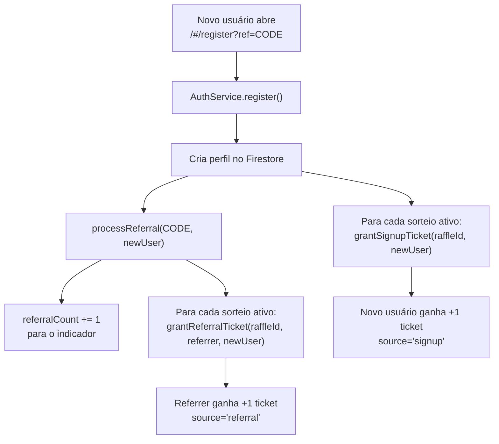
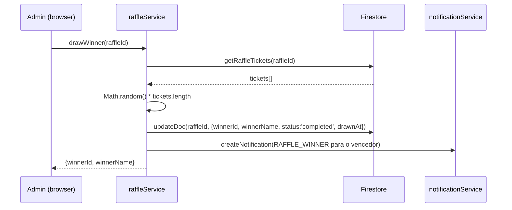

# Sorteios (Raffles)

> Como o Cine Safe permite que administradores criem sorteios de equipamentos para a comunidade, com tickets gamificados por cadastro e referral.

O sistema de sorteios incentiva o crescimento orgânico da plataforma. O admin cria um sorteio com prêmio (ex: câmera), define um período e todos os usuários que se cadastrarem durante esse período ganham automaticamente 1 ticket. Cada convite via referral que resulte em um novo cadastro dá +1 ticket ao convidador. Mais tickets = mais chances de ganhar.

**Restrição:** apenas **um sorteio ativo por vez** (validado no cliente, no formulário do admin).

Toda a lógica vive em [`services/raffleService.ts`](../reference/services.md); a UI do admin em [`pages/AdminDashboard.tsx`](../reference/pages.md) (aba "Sorteios"); a página pública em [`pages/Raffles.tsx`](../reference/pages.md).

> Aviso importante: **tickets e contadores são validados no cliente.** Um usuário com acesso direto ao Firestore poderia manipular tickets. Isso segue o padrão de dívida técnica documentado do projeto. As Firestore Rules protegem contra fabricação de tickets para outros usuários (`userId == auth.uid`).

---

## Campos no modelo

### `Raffle` (coleção `raffles`)

Definido em [`types.ts`](../03-data-model.md):

| Campo | Tipo | Descrição |
| --- | --- | --- |
| `id` | `string` | UUID |
| `title` | `string` | Nome do prêmio (ex: "Câmera Sony A7III") |
| `description` | `string` | Descrição do prêmio e regras |
| `prizeImageUrl?` | `string` | Foto do prêmio (Storage, WebP) |
| `status` | `RaffleStatus` | `'draft'` \| `'active'` \| `'completed'` \| `'cancelled'` |
| `createdBy` | `string` | Admin que criou (userId) |
| `startDate` | `string` | ISO — início do período de participação |
| `endDate` | `string` | ISO — fim / data do sorteio |
| `createdAt` | `string` | ISO da criação |
| `updatedAt` | `string` | ISO da última atualização |
| `winnerId?` | `string` | userId do vencedor (após sorteio) |
| `winnerName?` | `string` | Snapshot do nome do vencedor |
| `winnerAvatar?` | `string` | Snapshot do avatar do vencedor |
| `drawnAt?` | `string` | ISO da realização do sorteio |
| `totalTickets` | `number` | Soma de todos os tickets (denormalizado, via `increment`) |
| `totalParticipants` | `number` | Participantes distintos (denormalizado, via `increment`) |

### `RaffleTicket` (coleção `raffle_tickets`)

| Campo | Tipo | Descrição |
| --- | --- | --- |
| `id` | `string` | UUID |
| `raffleId` | `string` | FK → `raffles` |
| `userId` | `string` | Dono do ticket |
| `userName` | `string` | Snapshot |
| `userAvatar` | `string` | Snapshot |
| `source` | `'signup'` \| `'referral'` | Origem: cadastro ou convite |
| `referredUserId?` | `string` | Se referral, quem se cadastrou |
| `referredUserName?` | `string` | Snapshot |
| `createdAt` | `string` | ISO |

---

## Fluxo: ganhar tickets



### Detalhes:

1. **Ticket de cadastro (`signup`):** concedido automaticamente em `AuthService.register` após salvar o perfil. Percorre `raffleService.getActiveRaffles()` e chama `grantSignupTicket` para cada sorteio ativo.

2. **Ticket de referral:** concedido em `userService.processReferral` quando o código de referral é válido. Percorre os sorteios ativos e chama `grantReferralTicket` para cada um. O indicador ganha o ticket (não o novo usuário).

3. **Atomicidade:** cada `grantSignupTicket`/`grantReferralTicket` usa `writeBatch` para criar o ticket E incrementar os contadores do raffle (`totalTickets`, `totalParticipants`) atomicamente.

4. **`totalParticipants`** só é incrementado quando o usuário não tinha tickets anteriores naquele sorteio (verificação via `getUserTickets`).

---

## Realização do sorteio (`drawWinner`)



- Cada ticket tem peso igual (1 entrada). Se um usuário tem 5 tickets e outro tem 1, o primeiro tem 5× mais chances.
- O sorteio é irreversível: muda o status para `completed`.
- O vencedor recebe uma notificação do tipo `RAFFLE_WINNER`.

### Animação de roleta

No painel admin, ao clicar "Sortear":
1. Busca o leaderboard do sorteio
2. Abre um modal fullscreen com animação de roleta
3. Cicla rapidamente pelos nomes dos participantes por 3 segundos (intervalo de 100ms)
4. Chama `drawWinner` no backend
5. Para no nome do vencedor com destaque dourado
6. Admin clica "Fechar" e o sorteio está encerrado

---

## Regras de segurança

Em [`firestore.rules`](../../firestore.rules):

```
// RAFFLES: leitura por autenticados; CRUD somente admin
match /raffles/{raffleId} {
  allow read: if isSignedIn();
  allow create, update, delete: if isAdmin();
}

// RAFFLE_TICKETS: leitura por autenticados; criação auto-atribuída; edição admin
match /raffle_tickets/{ticketId} {
  allow read: if isSignedIn();
  allow create: if isSignedIn() && request.resource.data.userId == request.auth.uid;
  allow update, delete: if isAdmin();
}
```

**Anti-fabricação:** a regra `request.resource.data.userId == request.auth.uid` impede que um usuário crie tickets atribuídos a outro usuário. Porém, um usuário malicioso poderia criar tickets para si mesmo fora do fluxo legítimo (cadastro/referral). A mitigação completa requer Cloud Functions (mesma dívida técnica dos limites de plano).

---

## Página de Sorteios (`/raffles`)

[`pages/Raffles.tsx`](../reference/pages.md) — rota protegida. Mostra:

1. **Hero** com imagem do prêmio, título, descrição e countdown animado (dias/horas/min/seg)
2. **Stats** — participantes, tickets totais, seus tickets, suas chances (%)
3. **Seus tickets** — breakdown por tipo (cadastro vs referral)
4. **Link de convite** — com botão de copiar (reusa o `referralCode` existente)
5. **Leaderboard** — top 10 por nº de tickets, com medalhas 🥇🥈🥉
6. **Resultado** — quando concluído, mostra o vencedor; se for o usuário, exibe parabéns
7. **Regras** — "Como funciona" em 3 passos

### Componentes reutilizáveis

- **`RaffleCountdown`** ([`components/RaffleCountdown.tsx`](../reference/components.md)) — countdown com modo full (4 blocos neon) e compact (inline). Detecta expiração.
- **`RaffleCard`** ([`components/RaffleCard.tsx`](../reference/components.md)) — card compacto para Home com imagem, countdown e tickets do usuário.

---

## Admin — aba Sorteios

Em [`pages/AdminDashboard.tsx`](../reference/pages.md), 5ª aba ("🎯 Sorteios"):

- **Formulário** de criação/edição (título, descrição, status, datas, imagem)
- **Lista** de sorteios com status, contadores e ações
- **Botão "Sortear"** — aparece quando `status == 'active'` e `endDate <= hoje`; abre roleta animada
- **Modal de detalhes** — participantes, tickets, leaderboard
- **Exclusão** — remove o sorteio e todos os tickets associados (via `writeBatch`)
- **Restrição:** ao criar um sorteio com status `active`, o sistema verifica se já existe outro ativo e bloqueia

---

## Home — Banner do sorteio

Em [`pages/Home.tsx`](../reference/pages.md), quando há um sorteio ativo:
- Exibe um `RaffleCard` compacto entre o greeting e os action cards
- Mostra mini countdown e tickets do usuário
- Link para `/raffles` para ver detalhes

---

## Notificações

Dois novos tipos em `NotificationType`:
- `RAFFLE_TICKET` — "Você ganhou um ticket para o sorteio X!" (reservado para uso futuro)
- `RAFFLE_WINNER` — "Parabéns! Você ganhou o sorteio X!" (criado automaticamente por `drawWinner`)

---

## Limitações e pendências

- **Validação no cliente.** Tickets são criados pelo cliente no fluxo de cadastro/referral. Um usuário com acesso direto ao Firestore poderia fabricar tickets para si mesmo (a rule impede fabricação para outros, mas não para si).
- **Sem anti-fraude.** Assim como no referral, criar N contas com o mesmo `?ref` gera N tickets. Sem teto por usuário.
- **Sorteio irreversível.** Uma vez executado, não há rollback. O admin deve ter certeza antes de sortear.
- **Contadores denormalizados** (`totalTickets`, `totalParticipants`) são incrementados atomicamente via `writeBatch + increment()`, mas poderiam ficar inconsistentes se um ticket fosse deletado manualmente sem ajustar os contadores.
- **Imagem do prêmio** passa pelo pipeline WebP (480px @0.85) via `processImageForWebP`.

---

## Fontes no código

- [`types.ts`](../../types.ts) — `Raffle`, `RaffleTicket`, `RaffleStatus`, `NotificationType` (RAFFLE_TICKET, RAFFLE_WINNER).
- [`services/raffleService.ts`](../../services/raffleService.ts) — CRUD, tickets, sorteio, leaderboard, upload.
- [`services/auth.ts`](../../services/auth.ts) — auto-ticket no `register`.
- [`services/userService.ts`](../../services/userService.ts) — ticket de referral no `processReferral`.
- [`components/RaffleCountdown.tsx`](../../components/RaffleCountdown.tsx) — countdown visual.
- [`components/RaffleCard.tsx`](../../components/RaffleCard.tsx) — card compacto.
- [`pages/Raffles.tsx`](../../pages/Raffles.tsx) — página principal.
- [`pages/AdminDashboard.tsx`](../../pages/AdminDashboard.tsx) — aba "Sorteios" com roleta.
- [`pages/Home.tsx`](../../pages/Home.tsx) — banner do sorteio ativo.
- [`components/Layout.tsx`](../../components/Layout.tsx) — item de menu "Sorteios".
- [`firestore.rules`](../../firestore.rules) — regras de `raffles` e `raffle_tickets`.

Relacionados: [`referral-and-freemium.md`](./referral-and-freemium.md) · [`admin.md`](./admin.md) · [`notifications.md`](./notifications.md) · [`../03-data-model.md`](../03-data-model.md) · [`../04-security.md`](../04-security.md).
