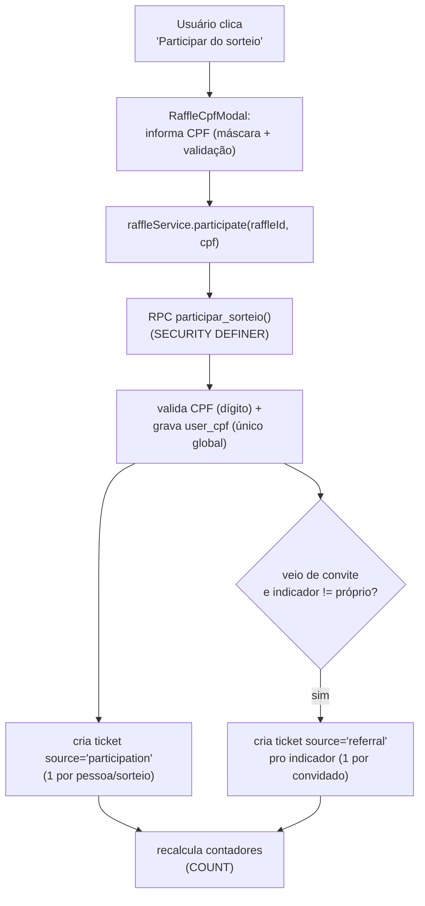
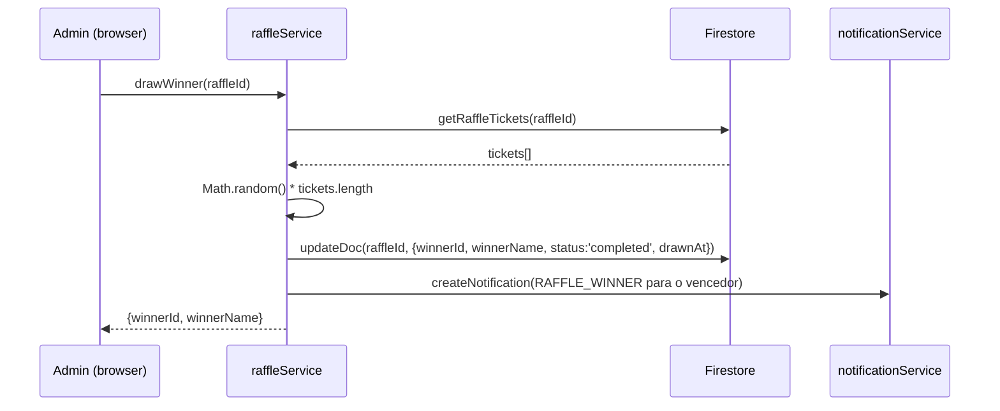

# Sorteios (Raffles)

> Como o Cine Safe permite que administradores criem sorteios de equipamentos para a comunidade, com **participação protegida por antifraude (CPF único)** e tickets por referral qualificado.

O sistema de sorteios incentiva o crescimento orgânico da plataforma. O admin cria um sorteio com prêmio (ex: câmera) e um período. Para concorrer, o usuário clica em **"Participar do sorteio"** e informa um **CPF válido e único** (1 CPF = 1 conta) — isso garante *1 pessoa real = 1 participação* e mata o "N e-mails → N chances". Cada convidado que **participar** (com CPF) dá +1 ticket ao convidador (**referral qualificado**). Mais tickets = mais chances.

> **Antifraude (Fase 1)** — spec: [`docs/superpowers/specs/2026-07-08-antifraude-sorteios-design.md`](../superpowers/specs/2026-07-08-antifraude-sorteios-design.md). A validação de CPF por dígito verificador barra o casual; a barreira contra CPFs *gerados* (atacante determinado) é a **Fase 2** (API paga de existência de CPF), documentada como upgrade.

**Restrição:** apenas **um sorteio ativo por vez** (validado no cliente, no formulário do admin).

Toda a lógica de escrita de ticket vive em **funções Postgres `SECURITY DEFINER`** (ver [`supabase/migrations/20260708_antifraude_sorteios.sql`](../../supabase/migrations/20260708_antifraude_sorteios.sql)); o cliente chama via `raffleService.participate` ([`services/raffleService.ts`](../reference/services.md)). UI do admin em [`pages/AdminDashboard.tsx`](../reference/pages.md) (aba "Sorteios"); página pública em [`pages/Raffles.tsx`](../reference/pages.md); modal de CPF em [`components/RaffleCpfModal.tsx`](../reference/components.md).

> **Escrita de ticket é server-side.** O `INSERT` direto em `raffle_tickets` foi **revogado** do cliente — só a função `participar_sorteio` grava. Isso fecha a auto-fabricação de tickets pelo console (o buraco crítico da arquitetura client-only).

---

## Campos no modelo

### `Raffle` (coleção `raffles`)

Definido em [`types.ts`](../03-data-model.md):

| Campo | Tipo | Descrição |
| --- | --- | --- |
| `id` | `string` | UUID |
| `title` | `string` | Nome do prêmio (ex: "Câmera Sony A7III") |
| `description` | `string` | Descrição do prêmio e regras |
| `prizeImageUrl?` | `string` | Foto do prêmio (Storage, WebP) |
| `status` | `RaffleStatus` | `'draft'` \| `'active'` \| `'completed'` \| `'cancelled'` |
| `createdBy` | `string` | Admin que criou (userId) |
| `startDate` | `string` | ISO — início do período de participação |
| `endDate` | `string` | ISO — fim / data do sorteio |
| `createdAt` | `string` | ISO da criação |
| `updatedAt` | `string` | ISO da última atualização |
| `winnerId?` | `string` | userId do vencedor (após sorteio) |
| `winnerName?` | `string` | Snapshot do nome do vencedor |
| `winnerAvatar?` | `string` | Snapshot do avatar do vencedor |
| `drawnAt?` | `string` | ISO da realização do sorteio |
| `totalTickets` | `number` | Soma de todos os tickets (denormalizado, via `increment`) |
| `totalParticipants` | `number` | Participantes distintos (denormalizado, via `increment`) |

### `RaffleTicket` (coleção `raffle_tickets`)

| Campo | Tipo | Descrição |
| --- | --- | --- |
| `id` | `string` | UUID |
| `raffleId` | `string` | FK → `raffles` |
| `userId` | `string` | Dono do ticket |
| `userName` | `string` | Snapshot |
| `userAvatar` | `string` | Snapshot |
| `source` | `'participation'` \| `'referral'` | Origem: participação (com CPF) ou convite qualificado |
| `referredUserId?` | `string` | Se referral, quem se cadastrou |
| `referredUserName?` | `string` | Snapshot |
| `createdAt` | `string` | ISO |

---

## Fluxo: ganhar tickets (via participação com CPF)

### Detalhes:

1. **Nada é concedido no cadastro** (nem e-mail nem Google). O ticket nasce só quando a pessoa **participa** com CPF.

2. **Ticket de participação (`participation`):** criado dentro de `participar_sorteio` após validar o CPF e gravá-lo em `user_cpf` (constraint `UNIQUE(cpf)` → 1 CPF = 1 conta). Índice `UNIQUE(raffle_id, user_id) WHERE source='participation'` torna a operação idempotente.

3. **Ticket de referral qualificado (`referral`):** também criado dentro de `participar_sorteio`, quando o participante tem `referred_by` que resolve para um indicador **diferente dele mesmo** (auto-referral bloqueado). Índice `UNIQUE(raffle_id, referred_user_id) WHERE source='referral'` → 1 referral por convidado. O `referral_count` (métrica do Premium) continua sendo incrementado no cadastro por `processReferral` — separado do ticket de sorteio.

4. **Contadores** (`totalTickets`, `totalParticipants`) são **recalculados via `COUNT()`** ao final da função (evita drift/corrida), não incrementados.

5. **Referral via Google:** o `?ref` é persistido em `localStorage` no `Register` (`storeReferral`) e recuperado no `AuthService.getSession` ao criar o perfil OAuth (`consumeStoredReferral`, uso único com TTL 24h) — sem isso, convidados que entram por Google não contariam.

---

## Realização do sorteio (`drawWinner`)

- Cada ticket tem peso igual (1 entrada). Se um usuário tem 5 tickets e outro tem 1, o primeiro tem 5× mais chances.
- O sorteio é irreversível: muda o status para `completed`.
- O vencedor recebe uma notificação do tipo `RAFFLE_WINNER`.

### Animação de roleta

No painel admin, ao clicar "Sortear":
1. Busca o leaderboard do sorteio
2. Abre um modal fullscreen com animação de roleta
3. Cicla rapidamente pelos nomes dos participantes por 3 segundos (intervalo de 100ms)
4. Chama `drawWinner` no backend
5. Para no nome do vencedor com destaque dourado
6. Admin clica "Fechar" e o sorteio está encerrado

---

## Regras de segurança (Supabase/Postgres)

> Nota: as docs antigas citavam `firestore.rules` — o projeto migrou para Supabase. A segurança dos sorteios agora é **Postgres**: RLS + permissões + funções `SECURITY DEFINER`. Ver [`supabase/migrations/20260708_antifraude_sorteios.sql`](../../supabase/migrations/20260708_antifraude_sorteios.sql).

- **`raffle_tickets`:** `SELECT` para autenticados; **`INSERT` revogado** de `anon`/`authenticated` (só a função `participar_sorteio` grava); `UPDATE`/`DELETE` só admin (sortear/excluir).
- **`user_cpf`:** `SELECT` só do dono ou admin; nenhuma escrita direta do cliente. `UNIQUE(cpf)` global.
- **`users`:** trigger `prevent_referred_by_change` impede alterar `referred_by` após definido (reforço anti auto-referral) — sem usar GRANT por coluna, que quebraria escritas legítimas.
- **Funções** `participar_sorteio` / `ensure_participation_reminder` / `resetar_participacoes_sorteio`: `SECURITY DEFINER` com `search_path` fixo; a de reset é guardada por `is_admin()` interno.

**Anti-fabricação:** como o `INSERT` direto foi revogado, o cliente **não** consegue mais criar tickets pelo console (o buraco crítico da arquitetura client-only). Toda concessão passa pela função, que valida CPF, unicidade e bloqueia auto-referral.

---

## Página de Sorteios (`/raffles`)

[`pages/Raffles.tsx`](../reference/pages.md) — rota protegida. Mostra:

1. **Hero** com imagem do prêmio, título, descrição e countdown animado (dias/horas/min/seg)
2. **Stats** — participantes, tickets totais, seus tickets, suas chances (%)
3. **Seus tickets** — breakdown por tipo (cadastro vs referral)
4. **Link de convite** — com botão de copiar (reusa o `referralCode` existente)
5. **Resultado** — quando concluído, mostra o vencedor; se for o usuário, exibe parabéns
6. **Regras** — "Como funciona" em 3 passos

> O **ranking público de participantes** (leaderboard) foi **removido** da página `/raffles` — expor quem participa e com quantos tickets não agrega e conflita com o antifraude. O `raffleService.getRaffleLeaderboard` segue disponível para o admin e para calcular os stats do topo; só a seção visual saiu.

### Componentes reutilizáveis

- **`RaffleCountdown`** ([`components/RaffleCountdown.tsx`](../reference/components.md)) — countdown com modo full (4 blocos neon) e compact (inline). Detecta expiração.
- **`RaffleCard`** ([`components/RaffleCard.tsx`](../reference/components.md)) — card compacto para Home com imagem, countdown e tickets do usuário.

---

## Admin — aba Sorteios

Em [`pages/AdminDashboard.tsx`](../reference/pages.md), 5ª aba ("🎯 Sorteios"):

- **Formulário** de criação/edição (título, descrição, status, datas, imagem)
- **Lista** de sorteios com status, contadores e ações
- **Botão "Sortear"** — aparece quando `status == 'active'` e `endDate <= hoje`; abre roleta animada
- **Modal de detalhes** — participantes, tickets, leaderboard
- **Exclusão** — remove o sorteio e todos os tickets associados (via `writeBatch`)
- **Restrição:** ao criar um sorteio com status `active`, o sistema verifica se já existe outro ativo e bloqueia

---

## Home — Banner do sorteio

Em [`pages/Home.tsx`](../reference/pages.md), quando há um sorteio ativo:
- Exibe um `RaffleCard` compacto entre o greeting e os action cards
- Mostra mini countdown e tickets do usuário
- Link para `/raffles` para ver detalhes

---

## Notificações

Dois novos tipos em `NotificationType`:
- `RAFFLE_TICKET` — "Você ganhou um ticket para o sorteio X!" (reservado para uso futuro)
- `RAFFLE_WINNER` — "Parabéns! Você ganhou o sorteio X!" (criado automaticamente por `drawWinner`)

---

## Limitações e pendências

- **Antifraude Fase 1.** A validação de CPF por dígito verificador barra o casual e a trava `UNIQUE(cpf)` impede a mesma pessoa em N contas. Um atacante determinado ainda pode **gerar** CPFs válidos — a barreira definitiva (existência real do CPF) é a **Fase 2** (API paga), documentada no spec.
- **Premium ainda farmável.** `referral_count` (que libera o Premium) continua incrementando no cadastro, sem CPF. A garantia "1 pessoa real" cobre **os tickets de sorteio**, não o Premium. Risco aceito nesta fase.
- **Lembrete só in-app.** A notificação de "complete seu CPF" (>24h) só alcança quem retorna ao app; não puxa de volta quem sumiu (seria e-mail/WhatsApp).
- **Sorteio irreversível.** Uma vez executado, não há rollback. O admin deve ter certeza antes de sortear. O `drawWinner` continua no cliente (admin) — integridade auditável do sorteio está fora do escopo desta fase.
- **Contadores denormalizados** (`totalTickets`, `totalParticipants`) são recalculados via `COUNT()` dentro de `participar_sorteio`, mas poderiam ficar inconsistentes se um ticket fosse deletado manualmente sem re-rodar o cálculo.
- **Imagem do prêmio** passa pelo pipeline WebP (480px @0.85) via `processImageForWebP`.

---

## Fontes no código

- [`types.ts`](../../types.ts) — `Raffle`, `RaffleTicket` (`source: 'participation' | 'referral'`), `RaffleStatus`, `NotificationType` (RAFFLE_WINNER, RAFFLE_CPF_REMINDER).
- [`supabase/migrations/20260708_antifraude_sorteios.sql`](../../supabase/migrations/20260708_antifraude_sorteios.sql) — tabela `user_cpf`, funções `participar_sorteio`/`ensure_participation_reminder`/`resetar_participacoes_sorteio`, `is_valid_cpf`, revoke + trigger.
- [`services/raffleService.ts`](../../services/raffleService.ts) — `participate`, `ensureParticipationReminder`, sorteio, leaderboard, upload.
- [`services/auth.ts`](../../services/auth.ts) — `storeReferral`/`consumeStoredReferral` (referral via OAuth); sem auto-ticket.
- [`services/userService.ts`](../../services/userService.ts) — `processReferral` (só `referral_count`).
- [`utils/cpf.ts`](../../utils/cpf.ts) — `isValidCPF`, `maskCPF`.
- [`components/RaffleCpfModal.tsx`](../../components/RaffleCpfModal.tsx) — modal antifraude de participação.
- [`components/RaffleCountdown.tsx`](../../components/RaffleCountdown.tsx) · [`components/RaffleCard.tsx`](../../components/RaffleCard.tsx).
- [`pages/Raffles.tsx`](../../pages/Raffles.tsx) — página principal (botão Participar / estados).
- [`pages/AdminDashboard.tsx`](../../pages/AdminDashboard.tsx) — aba "Sorteios" com roleta.
- [`pages/Home.tsx`](../../pages/Home.tsx) — banner + dispara `ensureParticipationReminder`.
- Spec: [`docs/superpowers/specs/2026-07-08-antifraude-sorteios-design.md`](../superpowers/specs/2026-07-08-antifraude-sorteios-design.md).

Relacionados: [`referral-and-freemium.md`](./referral-and-freemium.md) · [`admin.md`](./admin.md) · [`notifications.md`](./notifications.md) · [`../03-data-model.md`](../03-data-model.md) · [`../04-security.md`](../04-security.md).
