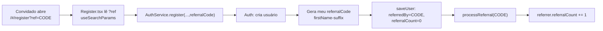
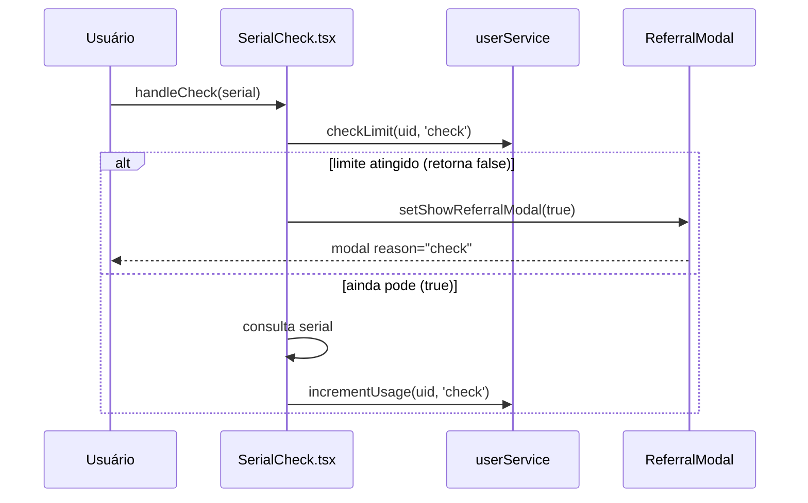
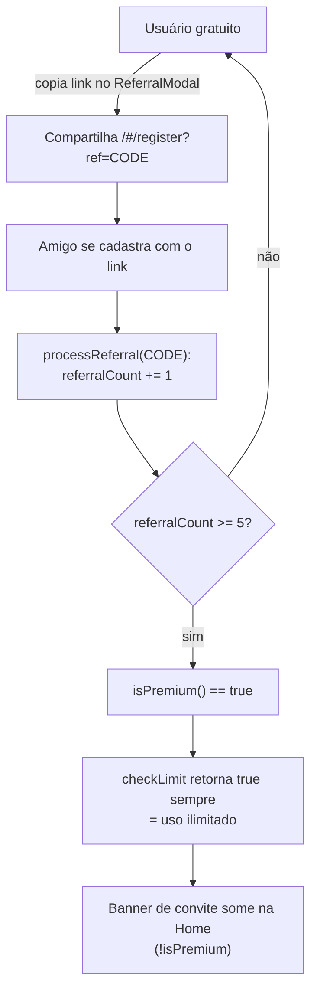

# Indicações (Referral) e Freemium

> Como o Cine Safe gera códigos de indicação no cadastro, conta indicações para liberar o plano Premium e aplica (no cliente) os limites do plano gratuito de inventário, verificações de serial e contatos.

O Cine Safe não cobra por assinatura: o "Premium" é desbloqueado por **indicações**. Cada usuário recebe um `referralCode` no cadastro; ao indicar `PREMIUM_REFERRALS` (5) pessoas — ou ao ser `admin` — a conta passa a ter uso ilimitado. Enquanto isso, o plano gratuito impõe tetos de inventário, verificações de serial e envios de interesse/contato.

Toda a lógica vive em [`services/userService.ts`](../reference/services.md) e [`services/auth.ts`](../reference/services.md); a UI de bloqueio é o [`components/ReferralModal.tsx`](../reference/components.md).

> Aviso importante: **todos esses limites são validados no cliente.** Um usuário com acesso ao Firestore pode contorná-los. Ver [`../04-security.md`](../04-security.md) e [`FIREBASE_RULES.md`](../../FIREBASE_RULES.md) (mover para Cloud Functions está registrado como pendente).

---

## Campos no modelo `User`

Definidos em [`types.ts`](../03-data-model.md) (`interface User`, bloco "Referral & Limits"):

| Campo | Tipo | Origem | Papel |
| --- | --- | --- | --- |
| `referralCode` | `string?` | gerado no `register` | Código único do usuário; entra no link de convite. |
| `referredBy` | `string?` | `?ref` no cadastro | Código de quem indicou este usuário (só existe se veio via convite). |
| `referralCount` | `number?` | `processReferral` | Quantas pessoas este usuário já indicou. Base do Premium. |
| `usageStats` | `UsageStats?` | `incrementUsage` | Contadores mensais de verificações e contatos. |

`UsageStats` ([`types.ts:61-64`](../03-data-model.md)):

```ts
export interface UsageStats {
  serialChecks:   { count: number, month: string };  // month = "YYYY-MM"
  contactReveals: { count: number, month: string };
}
```

O limite de **inventário não usa `usageStats`**: é medido por uma contagem ao vivo dos documentos em `equipment` (ver [`checkLimit`](#checklimit--porteiro-retorna-ainda-pode)), então diminui automaticamente quando o usuário exclui itens.

---

## Constantes de negócio

Em [`services/userService.ts:11-17`](../reference/services.md):

```ts
export const PREMIUM_REFERRALS = 5;
export const FREE_LIMITS = {
  inventory: 5,       // itens no inventário
  serialChecks: 5,    // verificações de serial por mês
  contactReveals: 3,  // interesses/contatos enviados por mês
};
```

---

## Geração do `referralCode` no cadastro

No `AuthService.register` ([`services/auth.ts:39-78`](../reference/services.md)), logo após criar o usuário no Firebase Auth, o código é montado como `primeiroNome-sufixoAleatorio`:

```ts
// services/auth.ts:45-48
const firstName = name.split(' ')[0].toLowerCase().replace(/[^a-z0-9]/g, '');
const randomSuffix = Math.random().toString(36).substring(2, 6); // 4 chars base36
const myReferralCode = `${firstName}-${randomSuffix}`;
```

- `firstName`: primeira palavra do nome, minúscula, sem acentos/símbolos (regex remove tudo que não é `a-z0-9`).
- `randomSuffix`: 4 caracteres base36 derivados de `Math.random()`.
- Exemplo: nome "João Silva" → algo como `joo-4k2p`.

O perfil é então persistido via `userService.saveUser` com os campos de referral inicializados ([`services/auth.ts:51-67`](../reference/services.md)):

```ts
const newUser: User = {
  ...,
  referralCode: myReferralCode,
  ...(referralCode ? { referredBy: referralCode } : {}), // só grava se veio convite
  referralCount: 0,
  usageStats: { serialChecks: {count: 0, month: ''}, contactReveals: {count: 0, month: ''} }
};
await userService.saveUser(newUser);
if (referralCode) {
  await userService.processReferral(referralCode);
}
```

Notas de precisão:

- `referredBy` só é gravado quando existe `referralCode` de entrada — o spread condicional evita gravar `undefined` no Firestore (o comentário no código explica isso).
- `usageStats` nasce com `month: ''`, o que faz a primeira `checkLimit` de cada tipo cair no caminho "mês diferente do atual → libera" (ver adiante).
- **O código não é garantidamente único.** O nome diz "Generate Unique Referral Code", mas não há verificação de colisão: a unicidade depende apenas dos 4 caracteres aleatórios. Colisões são improváveis, porém possíveis, e não são tratadas.

### Onde entra o `?ref`

A página de cadastro lê o parâmetro de query e o repassa ao `register`:

```ts
// pages/Register.tsx:36-37, 85
const [searchParams] = useSearchParams();
const referralCode = searchParams.get('ref');
...
const err = await register(..., referralCode || undefined);
```

Quando há `?ref`, a página exibe um selo "Você foi convidado!" ([`pages/Register.tsx:108-112`](../reference/pages.md)). O link que carrega esse parâmetro é montado pelo `ReferralModal` (ver [ReferralModal](#referralmodal)).



---

## `processReferral` — creditar o indicador

[`services/userService.ts:125-132`](../reference/services.md):

```ts
processReferral: async (referralCode: string) => {
  const q = query(collection(db, 'users'), where('referralCode', '==', referralCode));
  const snapshot = await getDocs(q);
  if (!snapshot.empty) {
    const referrerDoc = snapshot.docs[0];
    await updateDoc(referrerDoc.ref, { referralCount: increment(1) });
  }
}
```

- Busca o usuário cujo `referralCode` bate com o código recebido e incrementa o `referralCount` dele em 1 (via `increment(1)` atômico do Firestore).
- Se nenhum usuário tem aquele código, é um no-op silencioso (não gera erro, não bloqueia o cadastro).
- Usa `snapshot.docs[0]`: se houvesse colisão de código, apenas o primeiro resultado seria creditado.

Limitações reais (registradas para honestidade técnica):

- **Sem anti-fraude.** Não há verificação de auto-indicação nem deduplicação por dispositivo/IP: criar N contas com o mesmo `?ref` credita N indicações. Não há teto no `referralCount`.
- É chamado no cliente, dentro do fluxo de cadastro — mesma ressalva de [`../04-security.md`](../04-security.md).

---

## Regra de Premium (`isPremium`)

[`services/userService.ts:79-81`](../reference/services.md):

```ts
isPremium: (user: User): boolean => {
  return (user.referralCount || 0) >= PREMIUM_REFERRALS || user.role === 'admin';
}
```

É Premium quem indicou **≥ 5** pessoas **ou** é `admin`. É uma função pura sobre o objeto `User` já carregado — não faz I/O. Usada, por exemplo, na Home para esconder o banner de convite ([`pages/Home.tsx:48,114`](../reference/pages.md)) e dentro de `checkLimit` como atalho de "acesso ilimitado".

---

## Limites: gratuito vs. Premium

| Recurso | Plano gratuito | Premium (≥ 5 indicações ou admin) | Como é medido | `ReferralModal.reason` |
| --- | --- | --- | --- | --- |
| Itens no inventário | 5 | Ilimitado | Contagem ao vivo de `equipment` por `ownerId` | `inventory` |
| Verificações de serial | 5 / mês | Ilimitado | `usageStats.serialChecks` (janela mensal) | `check` |
| Interesses/contatos enviados | 3 / mês | Ilimitado | `usageStats.contactReveals` (janela mensal) | `contact` |

Premium não altera nenhum contador — apenas faz `checkLimit` retornar `true` de imediato.

---

## `checkLimit` — porteiro (retorna "ainda pode?")

[`services/userService.ts:83-104`](../reference/services.md). Retorna `true` quando a ação **ainda é permitida**.

```ts
checkLimit: async (userId, type: 'inventory' | 'check' | 'contact'): Promise<boolean> => {
  const user = await userService.getUserProfile(userId);
  if (!user) return false;
  if (userService.isPremium(user)) return true;          // Premium: sem limite
  const currentMonth = new Date().toISOString().slice(0, 7); // "YYYY-MM"

  if (type === 'inventory') {
    const q = query(collection(db, 'equipment'), where('ownerId', '==', userId));
    const itemCount = (await getCountFromServer(q)).data().count;
    return itemCount < FREE_LIMITS.inventory;            // < 5
  }
  if (type === 'check') {
    const stats = user.usageStats?.serialChecks || { count: 0, month: '' };
    if (stats.month !== currentMonth) return true;        // mês novo → reseta
    return stats.count < FREE_LIMITS.serialChecks;        // < 5
  }
  if (type === 'contact') {
    const stats = user.usageStats?.contactReveals || { count: 0, month: '' };
    if (stats.month !== currentMonth) return true;        // mês novo → reseta
    return stats.count < FREE_LIMITS.contactReveals;      // < 3
  }
  return false;
}
```

Pontos-chave:

- Se o perfil não é encontrado, nega (`false`).
- `inventory` usa `getCountFromServer` (agregação server-side, não baixa a coleção) e compara com o total de itens — por isso excluir itens libera espaço.
- `check`/`contact` comparam o mês guardado com o mês atual: se forem diferentes, a janela mensal "virou" e a ação é liberada mesmo sem gravar nada ainda (o reset efetivo ocorre em `incrementUsage`).

## `incrementUsage` — registra o consumo mensal

[`services/userService.ts:106-123`](../reference/services.md). Só para `'check' | 'contact'` (inventário não tem incremento):

```ts
incrementUsage: async (userId, type: 'check' | 'contact') => {
  const user = await userService.getUserProfile(userId);
  if (!user) return;
  const currentMonth = new Date().toISOString().slice(0, 7);
  const usageStats: UsageStats = {
    serialChecks:   user.usageStats?.serialChecks   || { count: 0, month: currentMonth },
    contactReveals: user.usageStats?.contactReveals || { count: 0, month: currentMonth }
  };
  if (type === 'check') {
    if (usageStats.serialChecks.month !== currentMonth) usageStats.serialChecks = { count: 1, month: currentMonth };
    else usageStats.serialChecks.count += 1;
  }
  if (type === 'contact') {
    if (usageStats.contactReveals.month !== currentMonth) usageStats.contactReveals = { count: 1, month: currentMonth };
    else usageStats.contactReveals.count += 1;
  }
  await updateDoc(doc(db, 'users', userId), { usageStats });
}
```

- Reescreve o objeto `usageStats` inteiro. Quando o mês guardado não bate com o atual, zera o contador daquele tipo para `{ count: 1, month: atual }` (a janela reinicia). Caso contrário, soma 1.
- **Não** é atômico como `increment()`: faz read-modify-write. Chamadas simultâneas podem perder contagem — aceitável para a finalidade de rate-limit de UX.

### Janela mensal (`YYYY-MM`)

O "mês" é `new Date().toISOString().slice(0, 7)`, ou seja **UTC** (ex.: `"2026-07"`). A troca de mês reseta cada contador na primeira chamada de `checkLimit`/`incrementUsage` daquele novo mês. Não há job de limpeza: o reset é preguiçoso, disparado pela comparação de `month`.

### Relacionado: `incrementUserStat`

[`services/userService.ts:134-140`](../reference/services.md) incrementa contadores vitalícios (`checksCount`/`reportsCount`) e, quando o stat é `checksCount`, **também** chama `incrementUsage(userId, 'check')` — ou seja, o contador vitalício de verificações e a cota mensal andam juntos por esse caminho.

---

## Sequência: consumir uma verificação de serial

Exemplo concreto do fluxo em [`pages/SerialCheck.tsx:29-45`](../reference/pages.md) (o padrão de `inventory`/`contact` é análogo):



### Onde cada limite é aplicado

| Recurso | Arquivo / chamada | Ao bloquear |
| --- | --- | --- |
| Inventário | `hooks/useInventory.ts:95` — `handleAddNewClick` → `checkLimit('inventory')` | `setShowReferralModal(true)` (`reason="inventory"`) em vez de abrir o formulário |
| Verificação | `pages/SerialCheck.tsx:30` — `handleCheck` → `checkLimit('check')` | modal `reason="check"`; em sucesso, `incrementUsage('check')` (linha 44) |
| Contato (venda) | `pages/Sales.tsx:105` — `handleInterest` → `checkLimit('contact')` | modal `reason="contact"`; ao confirmar, cria notificação + `incrementUsage('contact')` |
| Contato (aluguel) | `pages/Rentals.tsx:109` — `handleInterest` → `checkLimit('contact')` | modal `reason="contact"`; ao confirmar, notificação + `incrementUsage('contact')` |
| Convite (proativo) | `pages/Home.tsx:128` — botão "Convidar Agora" | abre modal `reason="invite"` (não é bloqueio) |

Observação: o `incrementUsage('contact')` de venda/aluguel ocorre **dentro da ação de confirmação** do modal de interesse — só conta quando o usuário efetivamente notifica o dono, não ao abrir o diálogo.

---

## ReferralModal

[`components/ReferralModal.tsx`](../reference/components.md) — renderizado via `createPortal` no `document.body`. Props:

```ts
interface ReferralModalProps {
  isOpen: boolean;
  onClose: () => void;
  reason: 'inventory' | 'check' | 'contact' | 'invite';
}
```

- `reason` escolhe título e mensagem (`titles`/`messages`, [`ReferralModal.tsx:30-42`](../reference/components.md)):
  - `inventory` → "Limite de Inventário Atingido" / "…até 5 equipamentos."
  - `check` → "Limite de Verificações Atingido" / "…limite de 5 verificações de serial por mês."
  - `contact` → "Limite de Contatos Atingido" / "…já enviou 3 interesses/contatos este mês."
  - `invite` → "Convide Amigos" / mensagem de crescimento.
- Ícone de cadeado para limites; ícone de usuários para `invite`.
- Barra de progresso: `currentReferrals = user.referralCount || 0`, `target = 5`, `progress = min(100, (currentReferrals/target)*100)`.
- Link de convite montado com o próprio código:

```ts
// ReferralModal.tsx:22
const inviteLink = `${window.location.origin}/#/register?ref=${user.referralCode}`;
```

  Clicar no link copia para a área de transferência (`navigator.clipboard.writeText`) e mostra "Link copiado!" por 2 s.

Limitação: o alvo `5` está **hardcoded** aqui (`target = 5`, `ReferralModal.tsx:19`) e também na Home (`referralTarget = 5`, [`pages/Home.tsx:50`](../reference/pages.md)); nenhum dos dois importa `PREMIUM_REFERRALS`. Se a constante mudar em `userService.ts`, esses textos de UI ficam desalinhados.

---

## Fluxo completo: virar Premium



Não há tela de "upgrade": a transição para Premium é implícita e reavaliada a cada `checkLimit`/`isPremium` a partir do `referralCount` atual. Admins já entram como Premium por `role === 'admin'`, sem indicações.

---

## Limitações e pendências

- **Validação no cliente.** `checkLimit`, `incrementUsage`, `isPremium` e `processReferral` rodam no navegador. As Firestore Rules fazem defesa por-campo (anti-escalonamento de privilégio), mas a cota em si não é garantida server-side. Mover para Cloud Functions está pendente — ver [`../04-security.md`](../04-security.md) e [`FIREBASE_RULES.md`](../../FIREBASE_RULES.md).
- **Sem anti-fraude no referral:** auto-indicação e múltiplas contas contam; sem teto no `referralCount`.
- **Unicidade do código não garantida** (só 4 chars aleatórios; sem checagem de colisão).
- **`incrementUsage` é read-modify-write** (não atômico); concorrência pode subcontar.
- **Alvo `5` duplicado/hardcoded** na UI (`ReferralModal`, `Home`), desacoplado de `PREMIUM_REFERRALS`.
- **Janela mensal em UTC**, com reset preguiçoso na virada de mês.

---

## Fontes no código

- [`services/userService.ts`](../reference/services.md) — `PREMIUM_REFERRALS`, `FREE_LIMITS`, `isPremium`, `checkLimit`, `incrementUsage`, `processReferral`, `incrementUserStat`.
- [`services/auth.ts`](../reference/services.md) — geração do `referralCode` e inicialização de `referredBy`/`referralCount`/`usageStats` no `register`.
- [`components/ReferralModal.tsx`](../reference/components.md) — modal de bloqueio/convite, barra de progresso e link `?ref`.
- [`pages/Register.tsx`](../reference/pages.md) — leitura do `?ref` e selo "Você foi convidado!".
- [`pages/Home.tsx`](../reference/pages.md) — banner Premium e botão "Convidar Agora".
- [`pages/SerialCheck.tsx`](../reference/pages.md), [`pages/Sales.tsx`](../reference/pages.md), [`pages/Rentals.tsx`](../reference/pages.md), [`hooks/useInventory.ts`](../reference/hooks.md) — pontos onde `checkLimit`/`incrementUsage` são aplicados.
- [`types.ts`](../03-data-model.md) — `User` (campos de referral) e `UsageStats`.

Relacionados: [`inventory.md`](./inventory.md) · [`marketplace.md`](./marketplace.md) · [`theft-and-safety.md`](./theft-and-safety.md) · [`raffles.md`](./raffles.md) · [`../04-security.md`](../04-security.md) · [`../03-data-model.md`](../03-data-model.md).

---

## Integração com Sorteios

O sistema de referral foi estendido para conceder **tickets de sorteio** quando há sorteios ativos:

- **`processReferral`** agora aceita um segundo parâmetro `newUser?: User`. Quando presente, percorre os sorteios ativos e chama `raffleService.grantReferralTicket` para cada um, dando +1 ticket ao indicador.
- **`AuthService.register`** também percorre os sorteios ativos após salvar o perfil, chamando `raffleService.grantSignupTicket` para dar +1 ticket ao novo usuário.

Dessa forma, o mesmo link de convite (`?ref=CODE`) que credita indicações para o Premium agora também gera tickets para sorteios, criando um incentivo duplo.

Ver [`features/raffles.md`](./raffles.md) para detalhes completos do sistema de sorteios.
