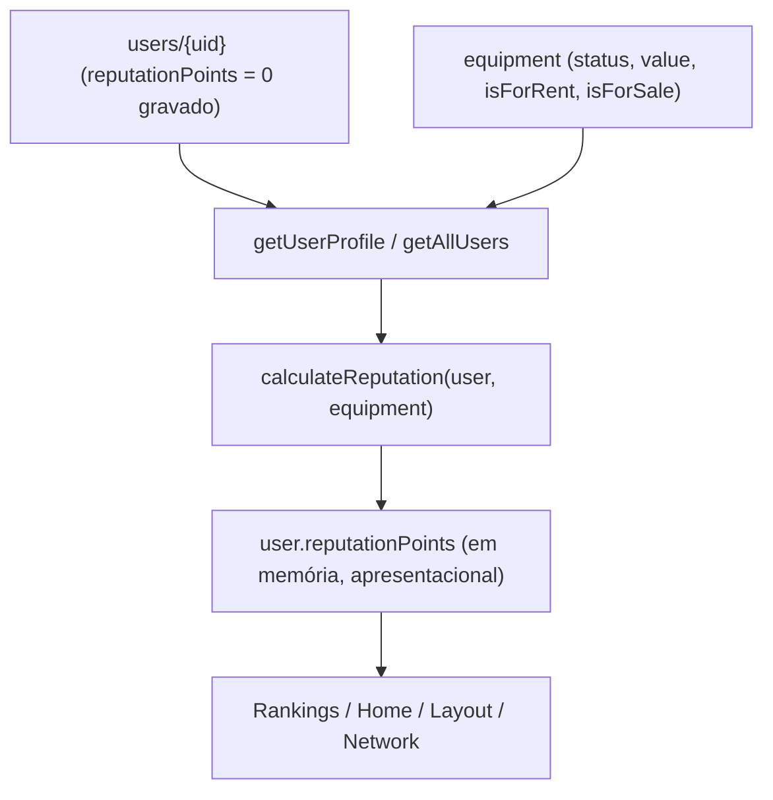
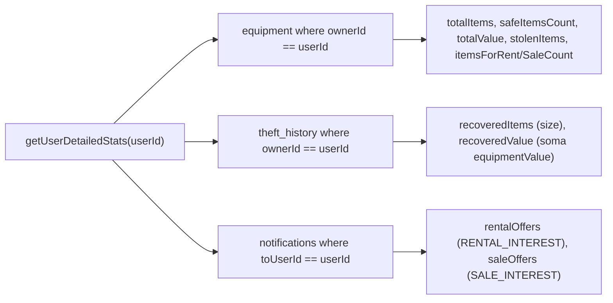

# Reputação & Ranking

> Sistema de pontuação (XP) que mede a confiabilidade de cada profissional, calculado no cliente a partir do perfil, inventário e atividade, e usado para ordenar o ranking da comunidade.

Esta feature cobre três blocos correlacionados:

1. **Reputação** — `reputationPoints`, um número calculado por `calculateReputation` a partir de sinais do usuário e do seu inventário.
2. **Ranking** — a página `/rankings`, que ordena todos os usuários por `reputationPoints` e classifica em tiers (Bronze → Diamond).
3. **Estatísticas** — painéis de "Meu Patrimônio" (por usuário) e "Impacto global" (agregado), servidos por `getUserDetailedStats` e `getGlobalDetailedStats`.

> [!IMPORTANT]
> **A reputação é 100% client-side e apresentacional.** O campo `reputationPoints` gravado em `users/{uid}` vale `0` desde o cadastro (`services/auth.ts:57`) e **nunca** é sobrescrito com o valor calculado. O número exibido é recomputado a cada leitura em `getUserProfile`/`getAllUsers`. Não há autoridade de servidor sobre a pontuação — ela não pode ser usada como controle de acesso ou gate de negócio.

---

## Fórmula da reputação (`calculateReputation`)

Função **privada** (não exportada) em `services/userService.ts:21-44`. Recebe o `User` e a lista de `Equipment` do dono e devolve um inteiro.

```ts
const calculateReputation = (user: User, equipment: Equipment[]): number => {
  let score = 0;
  if (user.avatarUrl && !user.avatarUrl.includes('ui-avatars')) score += 50;
  if (user.contactPhone) score += 50;
  if (user.role === 'admin') score += 500;

  const safeItems = equipment.filter(e => e.status === EquipmentStatus.SAFE);
  score += safeItems.length * 10;
  score += safeItems.length * 5; // Streak bonus

  const forRentItems = safeItems.filter(e => e.isForRent);
  score += forRentItems.length * 20;

  const forSaleItems = safeItems.filter(e => e.isForSale);
  score += forSaleItems.length * 15;

  const totalValue = safeItems.reduce((acc, item) => acc + (item.value || 0), 0);
  score += Math.floor(totalValue / 1000);

  score += (user.checksCount || 0) * 2;
  score += (user.reportsCount || 0) * 1;
  score += (user.connections?.length || 0) * 20;
  return score;
};
```

### Tabela de pesos

| Critério | Fonte do dado | Peso / regra | Observações |
| --- | --- | --- | --- |
| Avatar próprio | `user.avatarUrl` | **+50** (fixo) | Só conta se a URL **não** contém `ui-avatars`. O avatar padrão gerado no cadastro é `https://ui-avatars.com/...` (`services/auth.ts:56`), então o bônus só ativa após upload de foto real. |
| Telefone de contato | `user.contactPhone` | **+50** (fixo) | Qualquer valor truthy conta. |
| Admin | `user.role === 'admin'` | **+500** (fixo) | Bônus de cargo. |
| Itens seguros | `equipment` com `status === SAFE` | **+10 por item** | Base do inventário. |
| Bônus "Streak" | mesmos itens SAFE | **+5 por item** | Rotulado como "Streak bonus" no código, mas é apenas um multiplicador adicional por item SAFE — **não** há lógica de sequência/streak real. Efetivamente cada item SAFE vale +15 (10 + 5). |
| Em aluguel | itens SAFE com `isForRent` | **+20 por item** | Só itens SAFE (o filtro parte de `safeItems`). |
| À venda | itens SAFE com `isForSale` | **+15 por item** | Idem — parte de `safeItems`. |
| Valor do inventário | soma de `value` dos itens SAFE | **+1 a cada R$ 1.000** | `Math.floor(totalValue / 1000)`. Trunca para baixo; itens sem `value` contam `0`. |
| Verificações de serial | `user.checksCount` | **+2 por verificação** | Contador vitalício, incrementado por `incrementUserStat(userId, 'checksCount')`. |
| Reports de roubo | `user.reportsCount` | **+1 por report** | Contador vitalício, incrementado por `incrementUserStat(userId, 'reportsCount')`. |
| Conexões | `user.connections.length` | **+20 por conexão** | Rede de confiança (ver [network-and-transfers.md](./network-and-transfers.md)). |

> Não há teto (cap) nem decaimento temporal. A pontuação é monotônica em relação ao inventário/atividade e recalculada do zero a cada leitura.

---

## Onde a reputação é calculada

`calculateReputation` é invocada em exatamente dois pontos, ambos em `services/userService.ts`:

| Função | Linha | Como obtém o `Equipment[]` | Efeito |
| --- | --- | --- | --- |
| `getUserProfile(userId)` | `:58` | `query(collection(db,'equipment'), where('ownerId','==',userId))` | Atribui `user.reputationPoints` no objeto retornado (não grava no Firestore). |
| `getAllUsers()` | `:149` | Baixa **toda** a coleção `equipment` uma vez e filtra por `ownerId` em memória | Atribui `reputationPoints` **e** `inventoryCount` a cada usuário. |



Consequências práticas:

- O valor **nunca é persistido**, então dois clientes podem ver números diferentes se o inventário mudar entre leituras.
- `getAllUsers` faz um **full scan** de `users` + `equipment` (sem paginação). Custo O(nº de itens) por carregamento — relevante para a página de ranking e para busca de usuários (`searchUsers`, que reaproveita `getAllUsers`).
- Como o cálculo depende de `checksCount`/`reportsCount`/`connections` (campos do doc do usuário) e do inventário atual, a pontuação reflete o estado no momento da consulta.

---

## Selo verificado (`isVerified`)

Campo booleano em `types.ts:79`. Renderizado como ícone `CheckCircle` azul ao lado do nome em:

- `pages/Rankings.tsx:171` — `{user.isVerified && <Icons.CheckCircle ... />}`
- `pages/AdminDashboard.tsx:177`

> [!WARNING]
> **`isVerified` é gravado como `false` no cadastro (`services/auth.ts:58`) e não existe nenhum caminho de código que o defina como `true`.** Uma busca por `isVerified` em todo o repositório encontra apenas: a definição do tipo, o default no cadastro, o default do usuário "guest" (`services/storage.ts:18`) e os dois pontos de leitura acima. Ou seja, o selo é hoje **ineficaz na prática** — só apareceria se o campo fosse editado manualmente no Firestore. É um gancho de UI pronto para uma futura verificação (KYC/curadoria), ainda não conectado.

`isVerified` é independente de `reputationPoints` e dos tiers — são sinais de confiança distintos.

---

## Ranking (`/rankings`)

Página em `pages/Rankings.tsx`. Fluxo:

1. `getAllUsers()` retorna todos os usuários já com `reputationPoints` calculado.
2. Ordenação **decrescente** por pontos: `[...allUsers].sort((a, b) => b.reputationPoints - a.reputationPoints)` (`Rankings.tsx:17`).
3. Renderiza o leaderboard (medalhas 🥇🥈🥉 para o top 3, `#N` para o resto), com avatar, tier, localidade, selo `isVerified` e XP total.
4. O ponto verde/amarelo sobre o avatar indica `role` (`admin` = amarelo, demais = verde) — **não** é o selo verificado.

### Tiers

Definidos em `getTier(points)` (`Rankings.tsx:29-35`). São faixas puramente visuais derivadas de `reputationPoints`:

| Tier | Faixa de XP | Cor |
| --- | --- | --- |
| Bronze | `0 – 499` | laranja |
| Silver | `500 – 999` | slate |
| Gold | `1000 – 2499` | amber |
| Platinum | `2500 – 4999` | indigo |
| Diamond | `≥ 5000` | ciano |

O card lateral do usuário logado mostra uma **barra de progresso** até o próximo limiar (`nextTierPoints`, `Rankings.tsx:65-66`) e uma **composição da pontuação** (`ScoreRow`), item a item.

> [!NOTE]
> **Duplicação da fórmula.** O detalhamento no card (`calculateBreakdown`, `Rankings.tsx:38-61`) **reimplementa** os mesmos pesos de `calculateReputation` no cliente — porque a função original é privada e só devolve o total. As duas cópias precisam ser mantidas em sincronia manualmente; qualquer mudança de peso deve ser aplicada nos dois lugares (`services/userService.ts` **e** `pages/Rankings.tsx`).

### Onde mais a reputação aparece

| Local | Arquivo | Uso |
| --- | --- | --- |
| Badge de XP no header/menu | `components/Layout.tsx:116` | `{user.reputationPoints} XP` |
| Card "Reputação" na Home | `pages/Home.tsx:83` | XP do usuário logado |
| Busca e cards da Rede | `pages/Network.tsx:116,159` | XP de resultados/conexões |
| Ordenação de usuários no Admin | `pages/AdminDashboard.tsx:108,184,402` | ordena e exibe XP |
| Metadado de notificações | `pages/Sales.tsx`, `Rentals.tsx`, `SerialCheck.tsx`, `Notifications.tsx`, `hooks/useInventory.ts` | copia `fromUserReputation` para dar contexto de confiança ao destinatário |

---

## Estatísticas de perfil (`getUserDetailedStats`)

`services/userService.ts:222-247`. Devolve `DetailedStats` (`types.ts:223-236`) para **um** usuário, agregando três coleções no cliente:



| Campo | Origem |
| --- | --- |
| `totalItems` | contagem de `equipment` do dono |
| `safeItemsCount` | itens com `status === SAFE` |
| `totalValue` | soma de `value` (todos os itens, não só SAFE) |
| `stolenItems` | itens com `status === STOLEN` |
| `itemsForRentCount` / `itemsForSaleCount` | itens SAFE com `isForRent` / `isForSale` |
| `recoveredItems` / `recoveredValue` | `size` e soma de `equipmentValue` de `theft_history` |
| `rentalOffers` / `saleOffers` | notificações `RENTAL_INTEREST` / `SALE_INTEREST` recebidas |

Consumido via o hook `hooks/useUserStats.ts`, que roda `getUserDetailedStats` + `getGlobalDetailedStats` em paralelo e alimenta os painéis da Home ("Meu Patrimônio" e "Impacto global", `pages/Home.tsx:132-154`).

> Este método **baixa** os documentos de `equipment`/`theft_history`/`notifications` do usuário e agrega no cliente (diferente do global, que usa agregação no servidor).

---

## Impacto global (`getGlobalDetailedStats`)

`services/userService.ts:249-282`. Diferente do por-usuário, usa **queries de agregação** do Firestore (`getCountFromServer`, `getAggregateFromServer` com `count()` e `sum()`), evitando baixar coleções inteiras. Todas as sub-consultas rodam em `Promise.all`:

| Sub-consulta | API | Resultado |
| --- | --- | --- |
| Total de itens | `getCountFromServer(eqCol)` | `totalItems` |
| Itens SAFE | `getCountFromServer(where status == 'SAFE')` | `safeItemsCount` |
| Itens STOLEN | `getCountFromServer(where status == 'STOLEN')` | `stolenItems` |
| Em aluguel | `getCountFromServer(where isForRent == true)` | `itemsForRentCount` |
| À venda | `getCountFromServer(where isForSale == true)` | `itemsForSaleCount` |
| Valor total | `getAggregateFromServer(eqCol, { total: sum('value') })` | `totalValue` |
| Histórico de recuperação | `getAggregateFromServer(histCol, { c: count(), total: sum('equipmentValue') })` | `recoveredItems`, `recoveredValue` |
| Contadores de negócio | `getDoc(doc(db,'stats','global'))` | `transactionsCount`, `transactedValue` |

Detalhes importantes:

- `rentalOffers` e `saleOffers` são **forçados a `0`** no global — são dados privados (notificações de destinatário) e não entram na visão agregada (`userService.ts:274-276`).
- `transactionsCount` e `transactedValue` vêm do documento `stats/global`, lidos como `Number(global.transactions)` / `Number(global.transactedValue)`. Esse doc é **incrementado** quando um contrato é aceito, em `services/contractService.ts:91-96`:

```ts
await setDoc(doc(db, 'stats', 'global'), {
  transactions: increment(1),
  rentals: increment(contract.type === 'rental' ? 1 : 0),
  sales: increment(contract.type === 'sale' ? 1 : 0),
  transactedValue: increment(Number(contract.value) || 0),
}, { merge: true }).catch(() => {});
```

  Ou seja, `stats/global` só contém números agregados (sem dados individuais) e a escrita é *best-effort* (o `.catch(() => {})` engole falhas para não bloquear a aceitação do contrato). Ver [contracts-and-payments.md](./contracts-and-payments.md).

Renderizado em `pages/Home.tsx:144-153` ("Impacto global do Cine Safe") e reutilizado no painel administrativo (`pages/AdminDashboard.tsx:60,68`).

---

## Limitações e pontos de atenção

- **Apresentacional, não autoritativo.** `reputationPoints` não deve gatear regras de negócio — o valor real no Firestore é `0`. Freemium/limites usam outros sinais (`referralCount`, `role`); ver [referral-and-freemium.md](./referral-and-freemium.md) e [../04-security.md](../04-security.md).
- **Selo `isVerified` inerte.** Nenhum código concede o selo; hoje ele nunca aparece salvo edição manual do banco.
- **Fórmula duplicada** entre `services/userService.ts` (total) e `pages/Rankings.tsx` (breakdown) — risco de divergência.
- **Custo de `getAllUsers`.** Full scan de `users` + `equipment` sem paginação; a página de ranking e a busca de usuários carregam tudo em memória.
- **"Streak bonus" é um nome enganoso** — é apenas +5 por item SAFE, sem qualquer lógica de sequência temporal.
- **`getUserDetailedStats` baixa documentos** (agrega no cliente), enquanto `getGlobalDetailedStats` usa agregação no servidor — comportamentos e custos assimétricos.

---

## Fontes no código

- `services/userService.ts` — `calculateReputation` (privada), `getUserProfile`, `getAllUsers`, `getUserDetailedStats`, `getGlobalDetailedStats`, `incrementUserStat`.
- `pages/Rankings.tsx` — ordenação por `reputationPoints`, tiers (`getTier`), breakdown (`calculateBreakdown`/`ScoreRow`), selo `isVerified`.
- `pages/Profile.tsx` — edição de avatar/telefone que alimentam os bônus de perfil (+50/+50).
- `pages/Home.tsx` — painéis "Meu Patrimônio" e "Impacto global".
- `hooks/useUserStats.ts` — orquestra `getUserDetailedStats` + `getGlobalDetailedStats`.
- `services/contractService.ts` — incrementa `stats/global` (`transactions`, `transactedValue`).
- `services/auth.ts` — valores iniciais (`reputationPoints: 0`, `isVerified: false`, avatar `ui-avatars`).
- `types.ts` — `User` (`reputationPoints`, `isVerified`, `checksCount`, `reportsCount`, `connections`) e `DetailedStats`.

### Ver também

- [../reference/services.md](../reference/services.md) — referência de `userService`.
- [../reference/hooks.md](../reference/hooks.md) — `useUserStats`.
- [../03-data-model.md](../03-data-model.md) — coleções `users`, `equipment`, `theft_history`, `stats/global`.
- [./network-and-transfers.md](./network-and-transfers.md) — conexões (peso +20).
- [./contracts-and-payments.md](./contracts-and-payments.md) — origem dos contadores globais.
- [./referral-and-freemium.md](./referral-and-freemium.md) — Premium vs. reputação.
