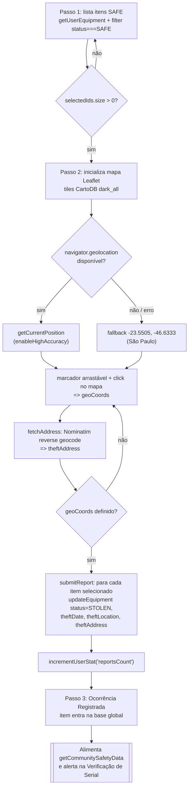

# Roubo & Segurança

> Reporte de roubo com geolocalização, verificação de número de série contra a base global e mapa comunitário de incidentes — o núcleo antifurto do Cine Safe.

Esta feature cobre três telas protegidas e a lógica de serviço que as sustenta:

| Tela | Rota | Componente | Serviço principal |
| --- | --- | --- | --- |
| Reportar Roubo | `/report-theft` | `pages/TheftReport.tsx` | `equipmentService.updateEquipment`, `userService.incrementUserStat` |
| Verificação de Serial | `/check-serial` | `pages/SerialCheck.tsx` | `equipmentService.checkSerial`, `userService.checkLimit`/`incrementUsage` |
| Mapa de Segurança | `/safety` | `pages/SafetyMap.tsx` | `userService.getCommunitySafetyData`, `contractService.subscribeCommunityAlerts` |

A recuperação de um item (`equipmentService.recoverEquipment`) não tem tela própria: é disparada a partir do inventário (`hooks/useInventory.ts`, `confirmRecovery`).

Todas as afirmações abaixo estão ancoradas no código-fonte listado em [Fontes no código](#fontes-no-código). O modelo de dados completo das coleções está em [../03-data-model.md](../03-data-model.md); a referência de assinaturas de serviço em [../reference/services.md](../reference/services.md).

---

## 1. Reporte de roubo com geolocalização

O `pages/TheftReport.tsx` é um fluxo de 3 passos controlado pelo estado `step: 1 | 2 | 3`.

### 1.1 Passo 1 — Seleção de itens

No mount (`useEffect` em `[user]`) a página carrega `equipmentService.getUserEquipment(user.id)` e filtra **somente itens `SAFE`** (`e.status === EquipmentStatus.SAFE`). Itens já roubados, perdidos ou em transferência não aparecem.

A seleção é múltipla, mantida em um `Set<string>` de IDs (`selectedIds`); `toggleSelection` adiciona/remove. O botão "Continuar" fica desabilitado enquanto `selectedIds.size === 0`.

### 1.2 Passo 2 — Localização no mapa (Leaflet)

O mapa usa a variável global `L` (Leaflet 1.9.4 carregado via CDN — declarada em [../03-data-model.md](../03-data-model.md) e em `types.ts` como `declare global { var L: any }`).

Comportamento (`TheftReport.tsx:44-119`):

- **Inicialização condicional:** o mapa só é criado quando `step === 2`, o container existe e ainda não há instância (`!mapInstanceRef.current`).
- **Geolocalização do navegador:** tenta `navigator.geolocation.getCurrentPosition(..., { enableHighAccuracy: true })`. Em caso de erro ou ausência de suporte, cai em uma **coordenada padrão fixa** `-23.5505, -46.6333` — a cidade de **São Paulo** (o código a comenta como *Brazil center*, `TheftReport.tsx:46`, embora geograficamente seja São Paulo, não o centro do país).
- **Tiles:** camada escura `https://{s}.basemaps.cartocdn.com/dark_all/{z}/{x}/{y}{r}.png` (CartoDB Dark, coerente com o tema dark do app).
- **Marcador:** `L.divIcon` customizado (círculo vermelho com borda branca), `draggable: true`.
- **Interação:** tanto o evento `dragend` do marcador quanto o `click` no mapa atualizam `geoCoords` e chamam `fetchAddress(lat, lng)`. O mapa faz `panTo` para a nova posição.
- **Correção de layout:** `map.invalidateSize()` após `setTimeout` de 600 ms (casa com a animação de fade-in).
- **Botão "minha localização"** (ícone `Navigation`): `handleManualLocation` reposiciona marcador e mapa via geolocalização.
- **Cleanup:** um `useEffect` com dependência `[step]` chama `mapInstanceRef.current.remove()` ao desmontar/trocar de passo, evitando vazamento de instância Leaflet.

### 1.3 Geocódigo reverso (Nominatim)

`fetchAddress(lat, lng)` (`TheftReport.tsx:121-139`) faz reverse geocoding via OpenStreetMap/Nominatim:

```ts
const response = await fetch(
  `https://nominatim.openstreetmap.org/reverse?format=json&lat=${lat}&lon=${lng}`
);
const data = await response.json();
// Simplifica display_name para as 3 primeiras partes separadas por ", "
const parts = data.display_name.split(', ');
const simpleAddress = parts.slice(0, 3).join(', ');
```

Fallbacks textuais: `"Localização no mapa"` quando não há `display_name`, e `"Endereço aproximado (mapa)"` em caso de exceção de rede. O endereço resolvido é guardado em `address` e exibido com skeleton enquanto `isFetchingAddress` estiver ativo.

### 1.4 Passo 3 — Confirmação e escrita (`STOLEN`)

`submitReport` (`TheftReport.tsx:148-162`):

1. Rebusca `getUserEquipment(user.id)` e filtra pelos `selectedIds`.
2. Para cada item selecionado, monta o payload:
   ```ts
   { ...item,
     status: EquipmentStatus.STOLEN,
     theftDate: new Date().toISOString(),
     theftLocation: geoCoords || undefined,
     theftAddress: address }
   ```
3. Persiste **um item por vez** com `await equipmentService.updateEquipment(item)` (sem batch).
4. Chama `userService.incrementUserStat(user.id, 'reportsCount')`.
5. Avança para `step = 3` (tela "Ocorrência Registrada").

O botão "Confirmar Reporte" fica bloqueado enquanto `processing || !geoCoords` — ou seja, é obrigatório ter uma coordenada marcada.

> **Nota técnica:** cada item vira uma escrita `updateDoc` independente. Não há transação atômica agrupando o lote; se uma escrita falhar no meio, itens anteriores já ficam marcados como `STOLEN`.

### 1.5 Campos gravados no documento `equipment`

Definidos em `types.ts` (interface `Equipment`):

| Campo | Tipo | Origem |
| --- | --- | --- |
| `status` | `EquipmentStatus.STOLEN` | fixo no reporte |
| `theftDate` | `string` (ISO) | `new Date().toISOString()` |
| `theftLocation` | `Coordinates { lat, lng }` | `geoCoords` do mapa |
| `theftAddress` | `string` | geocódigo reverso Nominatim |

### 1.6 Diagrama de fluxo do reporte



---

## 2. Verificação de número de série

### 2.1 `equipmentService.checkSerial`

Assinatura: `checkSerial(serial: string): Promise<Equipment | undefined>` (`equipmentService.ts:82-111`).

Normalização e busca:

- `trim()` + `toUpperCase()` sobre a entrada.
- **Estratégia de candidatos:** se o valor em maiúsculas já for igual ao valor cru (`upper === trimmed`), busca só `[upper]`; caso contrário busca `[upper, trimmed]`. O valor cru serve de fallback para **documentos legados** que ainda não foram normalizados (`addEquipment`/`updateEquipment` gravam sempre `serialNumber` normalizado — `equipmentService.ts:27` e `:44`).
- Para cada candidato: `query(collection('equipment'), where('serialNumber', '==', value))`; retorna o `data()` do primeiro doc do primeiro candidato que casar.
- Se o item não tiver `ownerProfile` denormalizado, rehidrata via `userService.getUserProfile`.
- Retorna `undefined` quando nada casa ou em qualquer exceção (`try/catch` engole o erro).

> **Limitação:** a busca é por igualdade exata de serial normalizado. Não há busca parcial/fuzzy, e a igualdade case-insensitive só cobre o par (UPPERCASE, cru).

### 2.2 Fluxo na tela (`pages/SerialCheck.tsx`)

`handleCheck` (`SerialCheck.tsx:26-46`):

1. **Limite mensal:** `await userService.checkLimit(user.id, 'check')`. Se `false`, abre o `ReferralModal` (`reason="check"`) e aborta — o usuário free precisa indicar amigos para liberar mais verificações.
2. Delay artificial de 600 ms (feedback de "escaneando").
3. `equipmentService.checkSerial(serial)` → decide o resultado:
   - item encontrado com `status === STOLEN` → `result = 'stolen'`;
   - item encontrado em outro status → `result = 'clean'`;
   - `undefined` → `result = 'unknown'`.
4. `await userService.incrementUsage(user.id, 'check')` — contabiliza a verificação do mês.

Estados de UI:

| `result` | Exibe |
| --- | --- |
| `clean` | "Tudo Limpo!", nome do dono (`foundItem.ownerProfile?.name`) e imagem do item |
| `stolen` | "ALERTA DE ROUBO" em vermelho, `theftAddress`, `theftDate` formatado e botão **Notificar Proprietário** |
| `unknown` | "Não Encontrado" + aviso de que ausência não garante que o item é seguro |

### 2.3 Limite mensal `serialChecks` (`userService`)

Constantes (`userService.ts:12-17`):

```ts
export const PREMIUM_REFERRALS = 5;
export const FREE_LIMITS = { inventory: 5, serialChecks: 5, contactReveals: 3 };
```

`checkLimit(userId, 'check')` (`userService.ts:83-104`):

- Usuário **Premium** (`referralCount >= 5` **ou** `role === 'admin'`) → sempre `true`.
- Mês corrente = `new Date().toISOString().slice(0, 7)` (`"YYYY-MM"`).
- Lê `user.usageStats.serialChecks = { count, month }`. Se o `month` armazenado difere do mês corrente, considera zerado e retorna `true` (**reset mensal implícito**). Caso contrário retorna `count < FREE_LIMITS.serialChecks`.

`incrementUsage(userId, 'check')` (`userService.ts:106-123`) grava `usageStats.serialChecks`: se virou o mês, reinicia em `{ count: 1, month }`; senão incrementa `count`.

> **Precisão sobre `incrementUserStat`:** a tela de verificação usa `incrementUsage` (contador **mensal**), **não** `incrementUserStat`. A função `userService.incrementUserStat(userId, stat)` (`userService.ts:134-140`) é usada no reporte de roubo com `'reportsCount'` (contador vitalício) e, quando chamada com `'checksCount'`, encadeia `incrementUsage(..., 'check')` **e** incrementa o campo vitalício `checksCount`. Ou seja, a verificação de serial afeta o limite mensal, mas **não** o `checksCount` vitalício.

> **Honestidade técnica:** o limite é validado no **cliente**. As Firestore rules fazem defesa por-campo, mas a validação de cota ainda não é autoritativa no servidor (ver `FIREBASE_RULES.md` e [../04-security.md](../04-security.md)).

---

## 3. Alerta `STOLEN_FOUND` (achado na verificação)

Quando a verificação retorna `stolen`, o usuário pode acionar **"Notificar Proprietário Imediatamente"** (`handleNotifyOwner`, `SerialCheck.tsx:48-61`). Um `ConfirmModal` confirma a ação e, ao aceitar, cria uma notificação:

```ts
const notification: Notification = {
  id: crypto.randomUUID(),
  toUserId: foundItem.ownerId,        // vai para o dono do item roubado
  fromUserId: user.id,
  fromUserName: user.name,
  fromUserPhone: user.contactPhone,   // canal de contato do "achador"
  fromUserAvatar: user.avatarUrl,
  fromUserReputation: user.reputationPoints,
  fromUserConnectionsCount: user.connections?.length || 0,
  itemId: foundItem.id, itemName: foundItem.name, itemImage: foundItem.imageUrl,
  type: 'STOLEN_FOUND',
  createdAt: new Date().toISOString(),
  read: false,
  message: `URGENTE: Seu item roubado ${foundItem.name} foi localizado!`
};
await notificationService.createNotification(notification);
```

Detalhes de `notificationService.createNotification` (`services/notificationService.ts:30-57`):

- **Remove campos `undefined`** antes de gravar (o Firestore rejeita o documento inteiro se houver `undefined` — por isso `fromUserPhone` ausente não quebra o envio).
- Grava em `notifications/{id}` (privada ao destinatário via `toUserId`).
- Incrementa o agregado vitalício do destinatário: `notificationStats.stolenAlerts += 1`.

A notificação é consumida em `pages/Notifications.tsx`, que rotula o tipo `STOLEN_FOUND` como "Alerta de Segurança" e expõe o contato do achador. Detalhes do canal em [notifications.md](./notifications.md).

> Este é o mecanismo que o passo 3 do reporte promete: *"Se alguém tentar verificar o serial, receberá um alerta vermelho imediatamente"* e poderá avisar o dono.

---

## 4. Recuperação de equipamento

`equipmentService.recoverEquipment(item, recoveredViaApp = false)` (`equipmentService.ts:60-73`). Disparada pelo inventário via `hooks/useInventory.ts` (`confirmRecovery(viaApp)` → `recoverEquipment(itemToRecover, viaApp)`), onde o usuário indica se a recuperação aconteceu através do app.

Duas escritas:

1. **Cria** um documento em `theft_history` (coleção **imutável** após criada — alimenta o mapa e as estatísticas de impacto):
   ```ts
   { equipmentId, ownerId, theftDate,
     theftLat: item.theftLocation?.lat, theftLng: item.theftLocation?.lng,
     theftAddress, equipmentValue: item.value || 0,
     recoveryDate: new Date().toISOString(), recoveredViaApp }
   ```
2. **Atualiza** o `equipment`: volta a `status: SAFE` e **limpa** os campos de furto (`theftDate: null, theftLocation: null, theftAddress: null`).

Retorna `true`/`false` (`try/catch`). O `theft_history` preserva as coordenadas originais do furto mesmo depois de o item voltar a `SAFE` — é essa cópia que mantém o ponto no mapa como "histórico".

`getUserDetailedStats`/`getGlobalDetailedStats` leem `theft_history` para `recoveredItems` e `recoveredValue` (soma de `equipmentValue`), compondo o painel de impacto (ver [reputation-and-rankings.md](./reputation-and-rankings.md) e [admin.md](./admin.md)).

---

## 5. Mapa de Segurança da comunidade

### 5.1 Fonte de dados — `userService.getCommunitySafetyData`

`getCommunitySafetyData()` (`userService.ts:284-296`) une **duas fontes** em uma lista de pontos `{ lat, lng, address, date, itemName }`:

| Fonte | Query | `itemName` |
| --- | --- | --- |
| Roubos ativos | `equipment where status == 'STOLEN'`, filtrando os que têm `theftLocation` | nome real do item |
| Histórico/recuperados | todos os docs de `theft_history` (`theftLat`/`theftLng`) | literal `'Item Recuperado/Histórico'` |

O literal `'Item Recuperado/Histórico'` é o discriminador usado na tela para diferenciar visualmente e filtrar.

### 5.2 Renderização (`pages/SafetyMap.tsx`)

- **Carga de dados** (`useEffect` inicial): `getCommunitySafetyData()` popula `reports`. O total exibido em "Total de Ocorrências" é `reports.length` (ativos + histórico).
- **Hotspots** (`SafetyMap.tsx:38-75`): agrupa por chave derivada do `address` (split em `" - "`, heurística "Bairro, Cidade - UF"), ordena por contagem e pega o **Top 5**. É uma heurística textual sobre o `display_name` do Nominatim — sensível ao formato do endereço.
- **Feed "Reportados Recentemente"** (`SafetyMap.tsx:77-83`): descarta os pontos de histórico (`itemName !== 'Item Recuperado/Histórico'`), ordena por `date` desc e corta em 10.
- **Mapa Leaflet** (`SafetyMap.tsx:90-125`):
  - Tiles **claros** `https://{s}.basemaps.cartocdn.com/light_all/{z}/{x}/{y}{r}.png` (CartoDB Positron) — contraste deliberado com o mapa escuro do reporte, para leitura de "área de risco".
  - Centraliza em `reports[0]` (primeiro ponto retornado — a lista **não** é ordenada por data, apesar do comentário `most recent` no código; só o feed `recentThefts` recebe `sort` por data) ou no fallback São Paulo, zoom 10.
  - Cada ponto vira um `L.circle` de **raio 300 m** (heatmap aproximado): **vermelho `#ef4444`** para roubo ativo, **azul `#3b82f6`** para item recuperado/histórico. Popup mostra nome, data e endereço, marcando "Recuperado" quando aplicável.

### 5.3 Alertas de não-devolução (comunidade)

A mesma tela também assina `contractService.subscribeCommunityAlerts` (`SafetyMap.tsx:28-31`), listando `return_alerts` — alertas **públicos** de equipamentos alugados e não devolvidos, gerados a partir de contratos reais. É um fluxo distinto do roubo (origem em contrato), documentado em [contracts-and-payments.md](./contracts-and-payments.md); aqui aparece apenas como painel adicional de segurança da comunidade.

---

## 6. Resumo de leituras/escritas por operação

| Operação | Lê | Escreve |
| --- | --- | --- |
| Reportar roubo | `equipment` (do dono) | `equipment` (status→STOLEN, campos de furto), `users` (`reportsCount++`) |
| Verificar serial | `equipment` (por `serialNumber`), `users` (limite) | `users` (`usageStats.serialChecks`) |
| Notificar dono (`STOLEN_FOUND`) | — | `notifications`, `users` (`notificationStats.stolenAlerts++`) |
| Recuperar item | — | `theft_history` (novo doc imutável), `equipment` (status→SAFE, limpa furto) |
| Mapa de segurança | `equipment` (STOLEN), `theft_history`, `return_alerts` (realtime) | — |

---

## Fontes no código

- `pages/TheftReport.tsx` — fluxo de reporte de 3 passos, mapa Leaflet, geocódigo reverso Nominatim, escrita `STOLEN`.
- `pages/SerialCheck.tsx` — verificação de serial, limite mensal, resultado clean/stolen/unknown, criação do alerta `STOLEN_FOUND`.
- `pages/SafetyMap.tsx` — mapa comunitário (tiles claros), hotspots, feed recente, alertas de não-devolução.
- `services/equipmentService.ts` — `checkSerial` (normalização + fallback legado), `recoverEquipment` (theft_history + volta a SAFE), `updateEquipment`.
- `services/userService.ts` — `checkLimit`/`incrementUsage`/`incrementUserStat`, `FREE_LIMITS`, `getCommunitySafetyData`, estatísticas de recuperação.
- `services/notificationService.ts` — `createNotification` (limpeza de `undefined`, `notificationStats.stolenAlerts`).
- `hooks/useInventory.ts` — `confirmRecovery` (ponto de disparo de `recoverEquipment`).
- `types.ts` — `Equipment` (`status`, `theftLocation`, `theftDate`, `theftAddress`), `EquipmentStatus`, `Coordinates`, `Notification`/`NotificationType` (`STOLEN_FOUND`), `UsageStats`, `ReturnAlert`.

### Documentos relacionados

- Modelo de dados das coleções: [../03-data-model.md](../03-data-model.md)
- Referência de serviços: [../reference/services.md](../reference/services.md)
- Segurança e Firestore rules: [../04-security.md](../04-security.md)
- Notificações: [notifications.md](./notifications.md) · Contratos e alertas de não-devolução: [contracts-and-payments.md](./contracts-and-payments.md)
