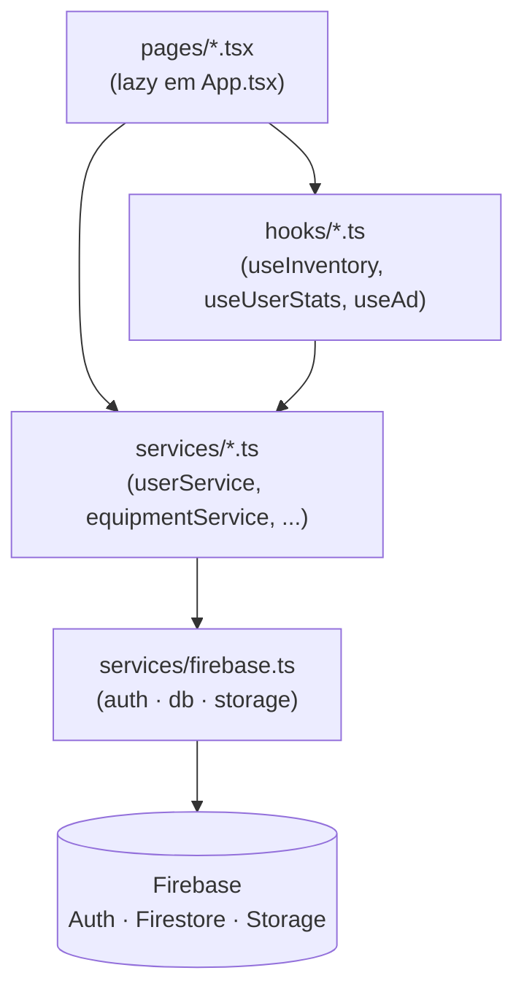

# Convenções e padrões de código

> Guia de padrões do CINESAFE para desenvolvedores e agentes de IA: como as camadas se organizam, como escrever um serviço, como lidar com o Firestore sem se machucar, e como adicionar uma página/feature sem quebrar as convenções existentes.

Este documento descreve **como o código é escrito hoje** (não um ideal aspiracional). Toda regra abaixo foi extraída do código-fonte; caminhos e linhas são citados para você confirmar. Para o contrato de cada função, veja [../reference/services.md](../reference/services.md); para o modelo de dados, [../03-data-model.md](../03-data-model.md); para segurança, [../04-security.md](../04-security.md).

---

## 1. Organização por camadas

O app é **client-only**: não há backend próprio nem Cloud Functions. O React fala direto com o Firebase (Auth, Firestore, Storage) através dos serviços. A dependência flui em um único sentido:



| Camada | Diretório | Responsabilidade | Regra |
| --- | --- | --- | --- |
| Páginas | `pages/` | Compõem a UI da rota. Carregadas via `lazy` em `App.tsx`. | Podem chamar hooks **e** serviços; nunca importam `firebase/firestore` direto. |
| Hooks | `hooks/` | Estado + orquestração de uma tela (ex.: `useInventory`). | Chamam serviços; encapsulam `useState`/`useEffect`. |
| Serviços | `services/` | Toda leitura/escrita no Firebase. Única camada que importa o SDK. | Objeto exportado com métodos; retornos previsíveis (veja §2). |
| Firebase | `services/firebase.ts` | Inicializa e exporta `auth`, `db`, `storage`. | Ponto único de config; ninguém mais chama `initializeApp`. |

**Sinais concretos no código:**

- `App.tsx` (linhas 27-43) carrega toda página com `lazyWithReload(...)` — um `lazy()` que, ao falhar o chunk (deploy trocou os hashes), recarrega a página **uma vez** (guarda `chunkReloadAt` no `sessionStorage`, janela de 10s) e, se falhar de novo, cai no `RouteErrorBoundary` em vez de tela preta.
- `hooks/useInventory.ts` (linhas 5-7) importa `equipmentService`, `userService` e `notificationService` — nunca o SDK do Firestore.
- Somente `services/*.ts` importam de `firebase/firestore`; a UI nunca vê `db`, `doc`, `collection`, etc.

Corolário para agentes de IA: **se você precisa ler/gravar no Firestore, o código vai em `services/`**, não na página nem no hook.

---

## 2. Padrão de serviço

Cada arquivo em `services/` exporta **um objeto literal** cujas propriedades são funções `async`. Não há classes.

```ts
// services/adService.ts (forma canônica)
export const adService = {
  createAd: async (ad: Ad): Promise<boolean> => {
    try {
      await setDoc(doc(db, 'ads', ad.id), ad);
      return true;
    } catch (e) { return false; }
  },
  // ...
};
```

### Contrato de retorno

Funções de **escrita** seguem o padrão `try/catch` e retornam um valor previsível — nunca propagam a exceção:

| Retorno | Significado | Exemplos |
| --- | --- | --- |
| `Promise<boolean>` | `true` = sucesso, `false` = erro (logado em `console.error`) | `equipmentService.deleteEquipment`, `userService.toggleUserBlock`, `contractService.acceptContract`, `notificationService.markNotificationAsRead` |
| `Promise<T \| null>` | objeto em sucesso, `null` em falha/ausência | `userService.getUserProfile`, `contractService.createContract`, `equipmentService.uploadEquipmentImage` |
| `Promise<T \| undefined>` | `undefined` quando não encontrado | `equipmentService.checkSerial` |
| `Promise<T[]>` | lista; **`[]` em erro** (nunca lança) | `userService.searchUsers`, `userService.getConnections` |

Nem todas as funções são defensivas: leituras simples como `equipmentService.getUserEquipment` (linhas 14-18) e algumas escritas de base — `equipmentService.addEquipment` (linhas 20-38), `updateEquipment` (linhas 40-58) e `userService.saveUser` (linhas 68-70) — **não** usam `try/catch` e deixam o erro subir. Ao adicionar uma escrita cruzada ou upload, **envolva em `try/catch` e retorne `boolean`/`null`** para manter o padrão que a UI espera.

### O facade legado `StorageService`

`services/storage.ts` exporta um objeto `StorageService` que **apenas reencaminha** para os serviços de domínio (ex.: `getUserEquipment: equipmentService.getUserEquipment`). Ele existe para compatibilidade com telas antigas.

- **Não adicione lógica nova ao facade.** Escreva no serviço de domínio (`userService`, `equipmentService`, etc.) e, em código novo, importe o serviço diretamente — como faz `hooks/useInventory.ts`.
- Alguns métodos do facade são *wrappers* que adaptam formatos legados (ex.: `getGlobalStats` linhas 39-42 reduz `getGlobalDetailedStats`; `findUserByEmail` linhas 29-32 filtra `searchUsers`; `getCurrentUser` linhas 16-19 é só um placeholder — a sessão real vem do `AuthContext`). Não confie neles para código novo.

Autenticação vive à parte em `services/auth.ts` (`AuthService`), fora do facade, e delega o perfil ao `userService`.

---

## 3. Tipos centralizados em `types.ts`

Todas as entidades de domínio e enums vivem em **`types.ts` na raiz**. Serviços, hooks e páginas importam de lá (`import { Equipment, User } from '../types'`).

- **Enums** para valores fechados: `EquipmentStatus` (`SAFE`/`STOLEN`/`LOST`/`TRANSFER_PENDING`) e `EquipmentCategory` (rótulos pt-BR: `'Câmera'`, `'Lente'`, ...). Use o membro do enum (`EquipmentStatus.SAFE`), não a string literal, nas escritas — como em `equipmentService` e `useInventory`.
- **Uniões de string** para tipos abertos porém restritos: `ContractType`, `ContractStatus`, `NotificationType`.
- **Campos opcionais (`?`)** marcam o que pode não existir no documento (ex.: `Equipment.value?`, `User.contactPhone?`, `Notification.expiresAt?`). Isso conecta direto com a §4.1 (limpar `undefined`).
- Interfaces auxiliares de UI/serviço também moram aqui: `MarketplaceFilters`, `DetailedStats`, `UsageStats`, `NotificationStats`, `ReturnAlert`.

Regra: **um campo novo em uma coleção começa em `types.ts`.** Nunca grave um campo que não exista na interface — o resto do código (e as Rules) assume que a forma do documento corresponde ao tipo.

---

## 4. Padrões Firestore (as armadilhas)

O Firestore tem comportamentos que já mordem quem não conhece. Os padrões abaixo são obrigatórios.

### 4.1 Limpar `undefined` antes de `setDoc`

**O Firestore rejeita o documento inteiro se qualquer campo for `undefined`.** Quando o objeto pode conter opcionais não preenchidos, filtre antes de gravar:

```ts
// services/notificationService.ts:35-38
const clean = Object.fromEntries(
  Object.entries(notification).filter(([, v]) => v !== undefined)
) as Notification;
await setDoc(doc(db, 'notifications', notification.id), clean);
```

Ocorre também em `contractService.createContract` (linha 51) e `raisePublicAlert` (linha 185). Uma alternativa usada em `services/auth.ts` (linha 62) é **espalhar condicionalmente**: `...(referralCode ? { referredBy: referralCode } : {})` — assim o campo nem entra no objeto quando ausente. Prefira uma das duas técnicas sempre que gravar um objeto com opcionais.

### 4.2 `writeBatch` para atomicidade

Quando duas ou mais gravações precisam suceder juntas (ou nenhuma), use `writeBatch(db)` + `batch.commit()`:

- `userService.addConnection`/`removeConnection` (linhas 188-210): as duas pontas da rede mudam juntas — evita conexão unilateral.
- `equipmentService.transferEquipmentOwnership` (linhas 239-275): troca o dono do equipamento **e** atualiza o `transactionHistory` dos dois usuários no mesmo batch.

### 4.3 `increment` e `arrayUnion`/`arrayRemove`

Nunca faça read-modify-write para contadores ou listas; use os operadores atômicos do Firestore:

| Operador | Uso no código |
| --- | --- |
| `increment(n)` | contadores de anúncio (`adService.trackAdImpression`/`trackAdClick`), `referralCount` (`processReferral`), stats de notificação (`notificationService.createNotification`), impacto global (`contractService.acceptContract`), `transactionHistory.{id}` |
| `arrayUnion` / `arrayRemove` | `connections[]` em `userService.addConnection`/`removeConnection` |

Note o **campo aninhado por dot-path**: `{ [`transactionHistory.${newOwnerId}`]: increment(value) }` (`equipmentService.ts:271`) e `{ 'notificationStats.rentalInterest': increment(1) }`.

### 4.4 `onSnapshot` sempre devolve o `unsubscribe`

Assinaturas em tempo real retornam a função de cancelamento, que o chamador (via `useEffect` cleanup) precisa invocar:

```ts
// services/chatService.ts:72-77
subscribeMessages: (chatId, cb) => {
  const q = query(collection(db, 'chats', chatId, 'messages'), orderBy('createdAt', 'asc'));
  return onSnapshot(q, snap => cb(...), () => cb([])); // 2º callback = onError -> lista vazia
}
```

Convenções de subscribe: nome `subscribeX`, retorna `unsubscribe`, e sempre passa um **handler de erro** que devolve estado vazio (`() => cb([])`) para não quebrar a UI. Exemplos: `notificationService.subscribeUserNotifications`, `chatService.subscribeUserChats`, `contractService.subscribeUserContracts`/`subscribeCommunityAlerts`.

`subscribeUserNotifications` (linhas 12-28) faz **faxina no fluxo**: ao receber o snapshot, apaga notificações com `expiresAt` vencido (`deleteDoc`) e só entrega as ativas.

### 4.5 Ordenar/filtrar no cliente para evitar índices compostos

Consultas com `where(array-contains)` + `orderBy` exigem índice composto no Firestore. O padrão aqui é **consultar só pelo filtro e ordenar em memória**:

```ts
// services/chatService.ts:80-88 — comentário no código: "Ordena no cliente ... (evita índice composto)"
const q = query(collection(db, 'chats'), where('participants', 'array-contains', userId));
onSnapshot(q, snap => {
  const list = snap.docs.map(d => d.data() as ChatSummary)
    .sort((a, b) => new Date(b.lastMessageAt).getTime() - new Date(a.lastMessageAt).getTime());
  cb(list);
});
```

Mesmo padrão em `contractService`, `notificationService` e nas listas de `return_alerts`. **Limitações reais** dessa escolha (documente-as, não as esconda):

- **Paginação do marketplace** (`equipmentService._getMarketplaceItems`, linhas 121-172) ordena por `orderBy('id')` — não há campo `createdAt` no `Equipment`, então a ordem é pela string do UUID, não cronológica. Busca uma linha extra (`limit(limitCount + 1)`) para calcular `hasMore` sem um segundo `count`.
- **Filtro de localização** é "soft": aplicado sobre a página já baixada (linhas 161-166), pois o Firestore não faz `contains` de texto. Isso pode devolver páginas com menos itens que o `limit`.
- **Busca textual** (`equipmentService.searchMarketplace`, linhas 187-214) baixa no máximo `limit(120)` itens e filtra por substring em memória. Suficiente enquanto o catálogo é pequeno; acima disso, exige full-text externo (Algolia/Typesense).
- `userService.searchUsers` baixa **todos** os usuários (`getAllUsers`) e filtra no cliente — igualmente limitado à escala atual.

Para números globais, prefira **queries de agregação** em vez de baixar coleções: `getGlobalDetailedStats` (linhas 249-282) usa `getCountFromServer` e `getAggregateFromServer(..., { total: sum('value') })`.

---

## 5. Identificadores (IDs)

| Tipo de ID | Como é gerado | Onde |
| --- | --- | --- |
| **Aleatório** | `crypto.randomUUID()` | `id` de equipamento (`useInventory.handleSubmit:117`), contrato (`contractService.createContract:28`), notificação (`useInventory`, `contractService`) |
| **Determinístico** (chat) | `[a, b].sort().join('__')` | `chatService.chatIdFor` — abrir conversa com a mesma pessoa sempre cai no **mesmo doc**, tornando `openChat` idempotente |
| **Determinístico** (alerta) | `id = contractId` | `ReturnAlert.id` = `contract.id` (`raisePublicAlert:172`) — um contrato tem no máximo um alerta público |
| **Fixo/singleton** | literal `'global'` | `doc(db, 'stats', 'global')` — documento único de contadores agregados |

Regra: **IDs determinísticos onde a unicidade lógica existe** (uma conversa por par, um alerta por contrato, um doc de stats globais); UUID para tudo que é genuinamente novo. O `referralCode` do usuário é um caso à parte: `${primeiroNome}-${sufixoAleatório}` (`auth.ts:46-48`).

---

## 6. Normalização de número de série

O serial é a chave de verificação anti-roubo; precisa casar independente de espaços/caixa. **Normalize sempre com `trim().toUpperCase()` na gravação:**

```ts
// services/equipmentService.ts:27 (addEquipment) e :44 (updateEquipment)
serialNumber: String(item.serialNumber || '').trim().toUpperCase()
```

Na **leitura**, `checkSerial` (linhas 82-111) tenta primeiro o valor normalizado e, se não achar, o valor cru — para não regredir em documentos legados ainda não normalizados:

```ts
const candidates = upper === trimmed ? [upper] : [upper, trimmed];
```

Ao criar qualquer novo caminho que grave ou compare serial, aplique a mesma normalização.

---

## 7. Imagens: pipeline WebP

Todo upload de imagem passa por `utils/imageProcessor.ts` antes de ir ao Storage:

- `processImageForWebP` (linhas 3-26): redimensiona para **480px de largura** (mantém proporção) e exporta **WebP a 0.85** de qualidade.
- `cropImageHelper` (linhas 64-80): usado no crop de avatar, exporta **WebP a 0.95**.
- `resilientUpload` (linhas 28-53): faz o `put` e **detecta erro de CORS** (`storage/unauthorized` + mensagem com `CORS`), rejeitando com `new Error('CORS_CONFIG_ERROR')` — que a UI (`useInventory.handleCorsError`) traduz numa mensagem acionável.
- **PDF é a exceção**: `uploadInvoiceImage` (equipment) e `attachPaymentProof` (contract) enviam PDFs **sem conversão** (`isPdf ? file : await processImageForWebP(file)`), pois o pipeline de canvas só lida com imagem.

Paths de Storage seguem uma convenção por dono/recurso: `users/{uid}/equipment/**`, `users/{uid}/avatar/**`, `users/{uid}/invoices/**`, `ads/**`, `contracts/{id}/**`. O nome do arquivo carimba `Date.now()` para evitar colisão. Veja [../04-security.md](../04-security.md) para quais desses paths têm leitura pública.

---

## 8. Idioma e comentários

- **Produto e UI: pt-BR.** Mensagens ao usuário, rótulos de enum (`EquipmentCategory`), textos de notificação e formatação monetária (`toLocaleString('pt-BR', { style: 'currency', currency: 'BRL' })`).
- **Comentários explicativos: pt-BR.** O padrão do repositório é comentar o *porquê* em português, especialmente as armadilhas (ex.: `// Remove undefined (o Firestore rejeita o doc inteiro com undefined)`, `// Ordena no cliente ... (evita índice composto)`). Mantenha esse tom: comente a decisão não-óbvia, não o óbvio.
- **Identificadores de código: inglês** (nomes de função, variável, campo). Não misture — um campo novo é `paymentStatus`, não `statusPagamento`.

---

## 9. Como adicionar uma nova página/feature (passo a passo)

Sequência que respeita as camadas e as Rules. Exemplo hipotético: uma feature de "favoritos".

1. **Modele o tipo** em `types.ts`. Se for uma coleção nova, crie a interface (ex.: `interface Favorite { id: string; userId: string; equipmentId: string; createdAt: string; }`) e qualquer enum/união necessária. Marque opcionais com `?`.

2. **Escreva o serviço** em `services/` (novo arquivo ou método num serviço existente), seguindo §2:
   - objeto exportado com métodos `async`;
   - escrita em `try/catch` retornando `boolean`/`null`;
   - limpe `undefined` antes de `setDoc` (§4.1);
   - use `crypto.randomUUID()` ou ID determinístico conforme §5;
   - se for tempo real, exponha um `subscribeX` que retorna o `unsubscribe` e trata erro devolvendo vazio (§4.4);
   - ordene/filtre no cliente se a query exigir índice composto (§4.5).

3. **(Opcional) Crie um hook** em `hooks/` se a tela tiver estado/orquestração não-trivial, espelhando `useInventory` (estado com `useState`, carga no `useEffect`, funções que chamam o serviço). Não coloque acesso ao Firestore no hook — só chamadas ao serviço.

4. **Crie a página** em `pages/NomeDaPagina.tsx` exportando um **componente nomeado** (`export const Favorites = () => {...}`) — o `lazy` em `App.tsx` importa por named export (`module => ({ default: module.Favorites })`).

5. **Registre a rota** em `App.tsx`:
   - adicione `const Favorites = lazyWithReload(() => import('./pages/Favorites').then(m => ({ default: m.Favorites })));` (linhas 27-43);
   - adicione a `<Route>` dentro de `<Routes>`. Envolva em `<ProtectedRoute>` (exige login) ou `<ProtectedRoute adminOnly>` (exige admin). Rotas realmente públicas ficam fora do wrapper (`/login`, `/register`, `/`).

6. **Atualize as Rules** se você criou uma coleção ou path novo — veja §10. Sem isso, as gravações do serviço serão negadas em produção.

7. **Documente**: adicione a feature em `docs/features/` e, se criou serviço/hook/coleção, atualize [../reference/services.md](../reference/services.md), [../reference/hooks.md](../reference/hooks.md) e [../03-data-model.md](../03-data-model.md).

---

## 10. Boas práticas ao alterar as Security Rules

As regras são **versionadas no repositório**: [`firestore.rules`](../../firestore.rules) e [`storage.rules`](../../storage.rules). Nunca edite apenas pelo Console — a mudança se perde no próximo deploy. Contexto completo em [../../FIREBASE_RULES.md](../../FIREBASE_RULES.md).

Princípios que o modelo atual segue e que você deve preservar:

- **Client-only significa que as Rules são a defesa real.** Limites de freemium (`FREE_LIMITS` em `userService`), validação de escrita cruzada e checagens de propriedade rodam **no cliente** e podem ser burladas por um atacante que fale direto com o Firestore. As Rules são a única barreira efetiva — trate-as como tal.
- **Leitura pública é a exceção, não a regra.** Só o que a vitrine precisa é público: itens do marketplace (`status == SAFE` **e** `isForRent`/`isForSale`) e as fotos em `users/{uid}/equipment/**` e `ads/**`. Inventário privado, perfis, notificações e comprovantes **não** são públicos.
- **Defesa por campo contra escalonamento de privilégio.** Em `users`, o dono edita o próprio perfil mas **não** pode mudar `role`, `isBlocked` nem `referralCount` (senão viraria admin/Premium ou se desbloquearia). Outro usuário só toca os campos das escritas cruzadas legítimas (`connections`, `notificationStats`, `transactionHistory`, `referralCount`). Ao adicionar um campo sensível, **negue-o explicitamente** na atualização por terceiros.
- **Imutabilidade onde o negócio exige.** `theft_history` é imutável após criado; `return_alerts` é validado contra o contrato real ("grounded"). Não afrouxe isso.
- **Toda coleção/path novo precisa de regra.** O default é negar. Se o passo 6 da §9 criou uma coleção, adicione a regra correspondente antes de fazer deploy, senão as escritas do serviço falham silenciosamente (retornam `false`).

Fluxo de deploy (de [../../FIREBASE_RULES.md](../../FIREBASE_RULES.md)):

```bash
firebase deploy --only firestore:rules,storage
```

**Pendência conhecida (honestidade técnica):** a documentação registra como *próximo passo* mover as escritas cruzadas e a validação de limites para Cloud Functions, para que nem os campos de fluxo possam ser adulterados entre usuários. Isso exige um ambiente de teste (emulador do Firebase ou staging) e ainda não foi feito. Enquanto isso, a validação no cliente **não** é uma fronteira de segurança — é só UX.

---

## Fontes no código

- `services/storage.ts` — facade legado `StorageService` e reencaminhamento aos serviços de domínio.
- `services/equipmentService.ts` — normalização de serial, paginação/busca do marketplace, `writeBatch` na transferência, upload WebP.
- `services/userService.ts` — `FREE_LIMITS`/`PREMIUM_REFERRALS`, freemium no cliente, reputação calculada, `writeBatch` de conexões, agregações globais.
- `services/notificationService.ts` — limpeza de `undefined`, `subscribeUserNotifications` com faxina de expiração, `increment` de stats.
- `services/contractService.ts` — IDs (`crypto.randomUUID`, `ReturnAlert.id = contractId`), `stats/global` com `increment`+`merge`, subscribes ordenados no cliente.
- `services/chatService.ts` — `chatIdFor` determinístico, `onSnapshot` com `unsubscribe`, ordenação no cliente.
- `services/adService.ts` — forma canônica de serviço (`try/catch` → `boolean`), seleção ponderada, `increment` de métricas.
- `services/auth.ts` — geração de `referralCode`, spread condicional de opcionais.
- `services/firebase.ts` — inicialização única (compat + SDK modular), exports `auth`/`db`/`storage`.
- `hooks/useInventory.ts` — padrão de hook, uso de `crypto.randomUUID`, tradução de erro de CORS.
- `utils/imageProcessor.ts` — `processImageForWebP` (480px @0.85), `cropImageHelper` (@0.95), `resilientUpload`.
- `types.ts` — enums, interfaces e uniões centralizadas.
- `App.tsx` — `lazyWithReload`, `ProtectedRoute`/`RootRoute`, registro de rotas.
- `firestore.rules`, `storage.rules`, `FIREBASE_RULES.md` — regras versionadas e pendências de segurança.
