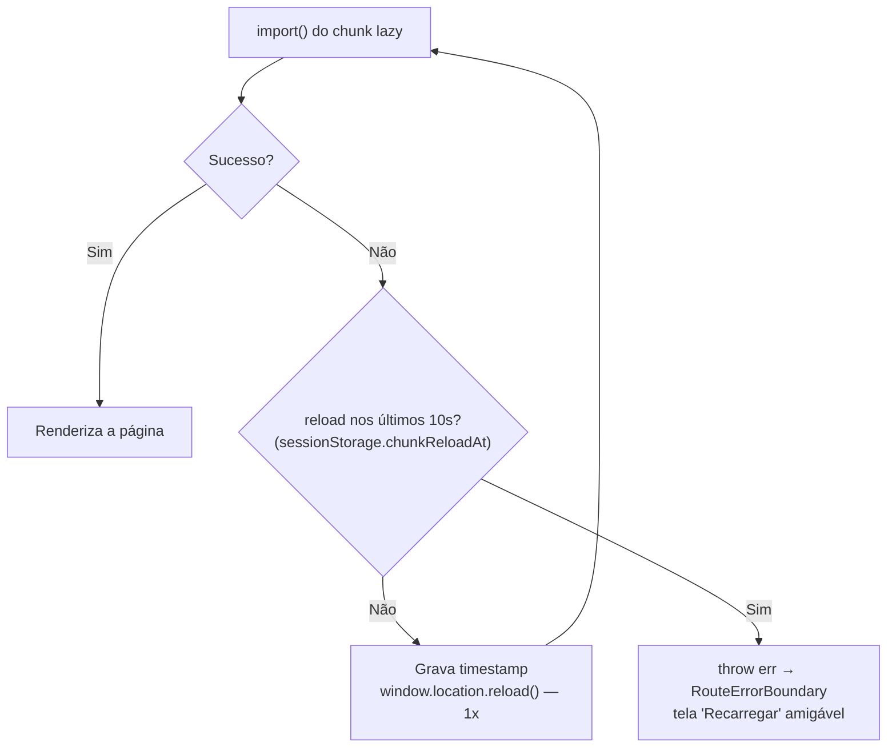

# Deploy

> Como publicar o Cine Safe em produção: Vercel (SPA estática), container/Cloud Run via Express (`server.js`) e as regras do Firebase (`cine-guard`), com o checklist pós-deploy e o modelo de cache.

O Cine Safe é uma aplicação **client-only** (React + Vite; sem backend próprio, sem Cloud
Functions — ver [../02-architecture.md](../02-architecture.md)). "Deploy" tem, portanto,
dois componentes independentes:

1. **Os arquivos estáticos** (`dist/`) — servidos por uma CDN/edge (Vercel) **ou** por um
   servidor de arquivos (o Express de [`server.js`](../../server.js), para container/Cloud Run).
2. **As regras do Firebase** (`firestore.rules` + `storage.rules`) — publicadas no projeto
   Firebase `cine-guard`, independentemente de onde o front-end é hospedado.

O front-end fala com o Firebase direto do navegador; não existe servidor de aplicação para
implantar. As chaves públicas do cliente ficam em [`services/firebase.ts`](../../services/firebase.ts).

## Visão geral dos alvos

| Alvo | Serve | Fonte de verdade | Quando usar |
| :--- | :--- | :--- | :--- |
| **Vercel** | `dist/` na edge | [`vercel.json`](../../vercel.json) | Deploy padrão. Cache + headers de segurança já configurados. |
| **Container / Cloud Run** | `dist/` via Express | [`server.js`](../../server.js) | Quando exige-se um container próprio (Cloud Run, Docker, etc.). |
| **Regras Firebase** | Firestore + Storage rules | [`firebase.json`](../../firebase.json), [`.firebaserc`](../../.firebaserc) | Sempre que `firestore.rules` ou `storage.rules` mudarem. |

> Os alvos 1 e 2 são **mutuamente exclusivos** (escolha onde hospedar os estáticos). O alvo
> 3 é **ortogonal** e obrigatório sempre que as regras mudarem, seja qual for o host.

## Pré-requisitos

| Requisito | Detalhe |
| :--- | :--- |
| Node.js | `>= 18.0.0` (campo `engines` em [`package.json`](../../package.json)). |
| Build de produção | `npm run build` → gera `dist/` (Vite; `build.outDir: dist` em [`vite.config.ts`](../../vite.config.ts)). |
| Firebase CLI | Necessária apenas para publicar regras via linha de comando. |

Guia de setup local completo em [getting-started.md](getting-started.md).

---

## Alvo 1 — Vercel

Toda a configuração vive em [`vercel.json`](../../vercel.json). A Vercel detecta o framework
e roda o build; as regras abaixo são declarativas.

### Configuração de build

| Chave (`vercel.json`) | Valor | Efeito |
| :--- | :--- | :--- |
| `framework` | `vite` | Vercel aplica os defaults do preset Vite. |
| `buildCommand` | `npm run build` | Executa `vite build` (script de [`package.json`](../../package.json)). |
| `outputDirectory` | `dist` | Diretório publicado (bate com `build.outDir` do Vite). |

### Rewrite de SPA

```json
"rewrites": [
  { "source": "/(.*)", "destination": "/index.html" }
]
```

Qualquer caminho cai em `/index.html`. O app usa **HashRouter** (ver
[../05-frontend.md](../05-frontend.md)), então as rotas reais vivem no fragmento `#/...` e o
servidor nunca as vê — o rewrite é sobretudo uma **rede de segurança** para acessos diretos a
caminhos fora do hash e para o próprio `/`.

### Headers (cache + segurança)

Definidos em `vercel.json` → `headers`:

| `source` | Header | Valor | Porquê |
| :--- | :--- | :--- | :--- |
| `/assets/(.*)` | `Cache-Control` | `public, max-age=31536000, immutable` | Arquivos com hash de conteúdo no nome (ex.: `assets/index-C3HJo609.js`) — cache eterno seguro. |
| `/favicon.svg` | `Cache-Control` | `public, max-age=31536000, immutable` | Estático estável. |
| `/index.html` | `Cache-Control` | `public, max-age=0, must-revalidate` | Ponto de entrada: precisa revalidar a cada deploy para apontar aos novos hashes. |
| `/sw.js` | `Cache-Control` | `public, max-age=0, must-revalidate` | O service worker precisa ser rebuscado para propagar novas versões. |
| `/sw.js` | `Service-Worker-Allowed` | `/` | Autoriza o SW (registrado em `/sw.js`) a controlar o escopo raiz. |
| `/(.*)` | `X-Content-Type-Options` | `nosniff` | Impede MIME sniffing. |
| `/(.*)` | `X-Frame-Options` | `DENY` | Bloqueia embutir o app em iframe (anti-clickjacking). |
| `/(.*)` | `X-XSS-Protection` | `1; mode=block` | Filtro XSS legado do navegador. |

Ver a relação entre `immutable` e `must-revalidate` na seção [Cache e auto-reload](#cache-e-auto-reload-de-chunk-stale).

### Passos

1. Conecte o repositório à Vercel (import do Git) — o preset `vite` e o `vercel.json` já
   ditam build e output; não há variáveis de ambiente de servidor a configurar (o Firebase
   usa chaves públicas embutidas no bundle).
2. Cada push na branch de produção dispara `npm run build` e publica `dist/` na edge.
3. Após o deploy, rode o [checklist pós-deploy](#checklist-pós-deploy).

> As regras do Firebase **não** são publicadas pela Vercel. Veja o [Alvo 3](#alvo-3--regras-do-firebase).

---

## Alvo 2 — Container / Cloud Run (Express)

Para hospedar os estáticos em um container próprio (Cloud Run, Docker, qualquer runtime Node),
use o servidor Express de [`server.js`](../../server.js). Ele é um servidor de arquivos fino,
não um backend de aplicação.

### O que o `server.js` faz

| Comportamento | Detalhe (`server.js`) |
| :--- | :--- |
| Porta | `const PORT = process.env.PORT || 8080` — respeita a env `PORT` (Cloud Run injeta essa variável). |
| Diretório servido | `DIST_DIR = path.join(__dirname, 'dist')`, servido por `express.static(DIST_DIR)`. |
| Checagem de build ausente | No boot, `if (!fs.existsSync(DIST_DIR))` loga `ERRO CRÍTICO` pedindo `npm run build`. **Não encerra o processo** — o container reinicia e tenta de novo; o log identifica a causa. |
| Fallback de SPA | `app.get('*')` responde `dist/index.html` para qualquer rota; se o `index.html` não existir, responde **HTTP 500** com mensagem explicando que o build falhou. |
| Módulo | ESM (`"type": "module"` em `package.json`); `__dirname` é reconstruído via `fileURLToPath(import.meta.url)`. |

O script de inicialização é `npm start` → `node server.js` (ver `scripts` em
[`package.json`](../../package.json)).

### Passos (build **depois** start)

O `dist/` **não** está versionado (`dist` está no [`.gitignore`](../../.gitignore)), então o
build tem de rodar antes de subir o servidor:

```bash
npm ci            # instala dependências de forma reprodutível
npm run build     # gera dist/ (Vite)
npm start         # node server.js — serve dist/ na porta $PORT (default 8080)
```

Se `npm start` rodar sem um `dist/` presente, o servidor sobe mas loga o `ERRO CRÍTICO` e
devolve 500 nas requisições — sintoma inequívoco de "esqueci o `npm run build`".

### `.dockerignore` e Dockerfile

- O repositório contém um [`.dockerignore`](../../.dockerignore), mas hoje o arquivo está com
  **conteúdo binário/ilegível** (41 bytes, não é texto UTF-8 válido) — trate-o como placeholder.
  Antes de containerizar, recrie-o em texto para evitar copiar `node_modules`, `dist` e artefatos
  de git para o contexto de build. Conteúdo mínimo recomendado:

  ```
  node_modules
  dist
  .git
  npm-debug.log*
  ```

- **Não existe Dockerfile no repositório.** Se for empacotar em container, crie um. Exemplo
  mínimo alinhado aos fatos acima (ilustrativo — não faz parte do repo):

  ```dockerfile
  # Exemplo — não versionado no repositório
  FROM node:18-alpine
  WORKDIR /app
  COPY package*.json ./
  RUN npm ci
  COPY . .
  RUN npm run build          # gera dist/
  ENV PORT=8080
  EXPOSE 8080
  CMD ["npm", "start"]       # node server.js serve dist/
  ```

> **Limitação (honestidade técnica):** o `server.js` serve `dist/` com os defaults do
> `express.static` (envia `ETag`/`Last-Modified`, sem `Cache-Control` de longa duração). Ele
> **não replica** os headers de cache (`immutable` / `must-revalidate`) nem os headers de
> segurança (`X-Frame-Options`, `nosniff`, etc.) definidos no [`vercel.json`](../../vercel.json).
> Ao hospedar via Express/Cloud Run, configure esses headers no proxy/edge à frente do container
> (ou estenda o `server.js`) se quiser paridade com o comportamento da Vercel.

---

## Alvo 3 — Regras do Firebase

Fonte de verdade versionada no repositório (ver [../../FIREBASE_RULES.md](../../FIREBASE_RULES.md)):

| Arquivo | Papel |
| :--- | :--- |
| [`firestore.rules`](../../firestore.rules) | Regras do Firestore (RBAC por-campo, vitrine pública, transferência protegida). |
| [`storage.rules`](../../storage.rules) | Regras do Storage (fotos de item públicas; avatar/invoices/comprovantes autenticados). |
| [`firebase.json`](../../firebase.json) | Aponta `firestore.rules` e `storage.rules`. |
| [`.firebaserc`](../../.firebaserc) | Projeto default: **`cine-guard`**. |

A explicação campo a campo das regras está em [../04-security.md](../04-security.md).

### Opção A — via CLI (recomendado)

A CLI já está instalada; o login pode ter expirado. Rode uma vez o reauth e então o deploy:

```bash
firebase login --reauth        # abre o navegador (conta admin, ver FIREBASE_RULES.md)
firebase deploy --only firestore:rules,storage
```

O `--only firestore:rules,storage` publica **apenas** as regras — não toca em dados nem em
outras partes do projeto. O alvo é resolvido pelo `.firebaserc` (`cine-guard`).

### Opção B — via Console (copiar e colar)

Quando não há acesso à CLI:

- **Firestore:** Firebase Console → *Firestore Database* → *Rules* → cole o conteúdo de
  [`firestore.rules`](../../firestore.rules) → **Publicar**.
- **Storage:** Firebase Console → *Storage* → *Rules* → cole o conteúdo de
  [`storage.rules`](../../storage.rules) → **Publicar**.

> Sintoma clássico de regras do Firestore não publicadas: a **vitrine pública** (página inicial
> deslogado) fica vazia — faltou a leitura pública de `equipment`. Ver
> [checklist](#checklist-pós-deploy).

---

## Cache e auto-reload de chunk stale

O modelo de cache e o auto-reload do cliente trabalham juntos para que um deploy novo nunca
resulte em tela quebrada. Há **três camadas**:

1. **Headers de cache da edge** (`vercel.json`) — política de longa/curta duração.
2. **Auto-reload de chunk stale** ([`App.tsx`](../../App.tsx)) — recarrega a página uma vez se
   um chunk lazy sumiu.
3. **Service worker** ([`public/sw.js`](../../public/sw.js)) — cache offline resiliente.

### Immutable vs. must-revalidate

O Vite escreve os JS/CSS em `dist/assets/` com **hash de conteúdo no nome** (ex.:
`index-C3HJo609.js`, `vendor-react-CDml0HqQ.js`). Isso torna seguro o par de políticas:

| Recurso | Política | Racional |
| :--- | :--- | :--- |
| `/assets/*` | `immutable`, 1 ano | O nome muda quando o conteúdo muda — o navegador pode manter para sempre; um deploy novo referencia **novos** nomes. |
| `/index.html` | `max-age=0, must-revalidate` | É o índice mutável que lista quais hashes de asset carregar; precisa ser revalidado a cada visita para "descobrir" o novo build. |
| `/sw.js` | `max-age=0, must-revalidate` | Garante que o navegador rebusque o SW e ative uma versão nova (o `CACHE_VERSION` em `sw.js` limpa caches antigos no `activate`). |

**A relação:** o `index.html` sempre-fresco aponta para os assets `immutable`. Enquanto o
`index.html` e os assets forem coerentes, o carregamento é perfeito. O problema aparece **na
janela** em que um cliente ainda tem um `index.html` antigo em cache (aba aberta há tempo, SW,
CDN intermediária) que referencia um hash de asset que **já não existe** no servidor — é aí que
entra o auto-reload.

### Auto-reload de chunk stale (`App.tsx`)

As páginas são carregadas com `React.lazy` via o wrapper `lazyWithReload` em
[`App.tsx`](../../App.tsx). Se o `import()` de um chunk falhar (deploy trocou os hashes; SW/CDN
servindo HTML antigo), o wrapper recarrega a página **uma vez** para pegar o `index.html` +
chunks atuais. A segunda falha em sequência cai no `RouteErrorBoundary`, que mostra uma tela
amigável com botão *Recarregar* — nunca uma tela preta.

O guard usa `sessionStorage['chunkReloadAt']` com janela de **10 s**: só recarrega se o último
reload foi há mais de 10 s, evitando loop de reload.



### Service worker (`public/sw.js`)

Registrado em [`index.tsx`](../../index.tsx) **apenas em produção** (pulado quando o hostname é
`localhost`). Comportamento por tipo de recurso:

| Recurso | Estratégia | Nota |
| :--- | :--- | :--- |
| HTML | Network-first, fallback ao cache | Prioriza o `index.html` fresco; usa cópia em cache só offline. |
| `/assets/*`, fontes, `.woff` | Cache-first (stale-while-revalidate) | **Nunca** cacheia resposta `text/html` no lugar de um asset (checa `content-type`) — evita envenenar o cache servindo HTML como JS. |
| Imagens do Firebase Storage | Cache com TTL longo | `firebasestorage.googleapis.com`. |

No `activate`, o SW apaga todo cache cujo prefixo não bata com o `CACHE_VERSION` atual
(`cinesafe-v3`) — subir a versão invalida os caches antigos.

---

## Checklist pós-deploy

Rode após publicar os estáticos **e** as regras.

- [ ] **Vitrine pública funcionando:** abra a página inicial **deslogado** — os itens do
      marketplace (`status == SAFE` com `isForRent`/`isForSale`) devem aparecer. Vazio ⇒ regras
      do Firestore provavelmente não publicadas (falta a leitura pública de `equipment`); ver
      [Alvo 3](#alvo-3--regras-do-firebase).
- [ ] **Login/registro:** autenticação por e-mail/senha funciona e redireciona.
- [ ] **Assets carregam:** sem 404 em `/assets/*`; conferir headers `Cache-Control: immutable`
      nesses arquivos e `max-age=0, must-revalidate` em `/index.html` e `/sw.js` (só na Vercel;
      ver limitação do [Alvo 2](#alvo-2--container--cloud-run-express)).
- [ ] **Headers de segurança presentes** (Vercel): `X-Frame-Options: DENY`,
      `X-Content-Type-Options: nosniff`, `X-XSS-Protection: 1; mode=block`.
- [ ] **Navegação entre páginas** (rotas lazy) sem tela preta — o auto-reload de chunk absorve
      um deploy recém-publicado.
- [ ] **Fotos de item** carregam do Storage (leitura pública) e **upload** de avatar/foto funciona.
- [ ] **Mapa de segurança** renderiza (Leaflet via CDN unpkg; tiles CartoDB).
- [ ] **Regras publicadas no projeto certo:** `cine-guard` (conferir `.firebaserc`).

---

## Fontes no código

- [`vercel.json`](../../vercel.json) — build, rewrite de SPA, headers de cache e segurança.
- [`server.js`](../../server.js) — servidor Express (PORT, `dist/`, checagem de build, fallback SPA).
- [`package.json`](../../package.json) — scripts (`build`, `start`), `engines.node >= 18`, `type: module`.
- [`vite.config.ts`](../../vite.config.ts) — `build.outDir: dist`, `manualChunks` (vendor splitting).
- [`App.tsx`](../../App.tsx) — `lazyWithReload`, guard de 10 s e `RouteErrorBoundary`.
- [`index.tsx`](../../index.tsx) — registro do service worker (só em produção).
- [`public/sw.js`](../../public/sw.js) — estratégias de cache do service worker (`cinesafe-v3`).
- [`firebase.json`](../../firebase.json) / [`.firebaserc`](../../.firebaserc) — alvos de regras e projeto `cine-guard`.
- [`FIREBASE_RULES.md`](../../FIREBASE_RULES.md) — publicação das regras (CLI e Console).
- [`.dockerignore`](../../.dockerignore) — presente, porém com conteúdo binário/ilegível (placeholder).
- [`.gitignore`](../../.gitignore) — confirma que `dist/` não é versionado.

---

**Veja também:** [Configuração & build](../reference/configuration.md) ·
[Arquitetura](../02-architecture.md) · [Segurança](../04-security.md) ·
[Início rápido](getting-started.md) · [Índice da documentação](../README.md)
