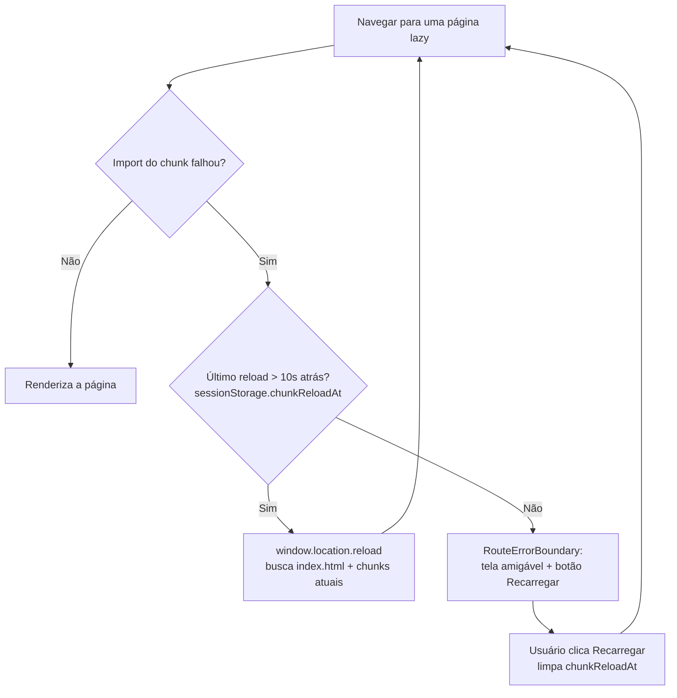

# Início rápido

> Clonar, instalar, rodar e entender a estrutura do repositório do Cine Safe em poucos minutos.

Este guia é um tutorial passo a passo para colocar o **Cine Safe** rodando localmente,
gerar o build de produção e conhecer a organização do código. Ele assume familiaridade
básica com terminal e Node.js. Cada afirmação aqui é aterrada no código-fonte (veja
[Fontes no código](#fontes-no-código)).

O Cine Safe é uma aplicação **client-side** (React + Vite) que fala diretamente com o
Firebase (Auth, Firestore, Storage). **Não há backend próprio nem Cloud Functions** — o
`server.js` só serve os arquivos estáticos do build. Isso simplifica o setup local: basta
Node e as dependências npm; não é preciso subir banco, container ou emulador para
desenvolver.

---

## Pré-requisitos

| Requisito | Versão | Observação |
| :--- | :--- | :--- |
| **Node.js** | `>= 18.0.0` | Declarado em [`package.json`](../../package.json) (`engines.node`). |
| **npm** | Acompanha o Node | Usado para instalar dependências e rodar os scripts. |
| **Git** | Qualquer recente | Para clonar o repositório. |
| Navegador moderno | — | O app usa Canvas/WebP, `backdrop-filter` (glassmorphism) e Service Worker. |

Não é necessário instalar o Firebase CLI para **desenvolver** — a configuração do cliente
é pública e já vem embutida no código (veja [Configuração do Firebase](#onde-fica-a-configuração-do-firebase)).
O CLI só é preciso para **publicar as regras** de segurança (veja [Rodando as regras](#rodando-as-regras-do-firebase)).

---

## Passo a passo

### 1. Clonar o repositório

```bash
git clone https://github.com/oziaudiovisual/cinesafe.git
cd cinesafe
```

### 2. Instalar as dependências

```bash
npm install
```

Isso instala React 18, Vite 5, o SDK do Firebase 10 e as demais dependências listadas em
[`package.json`](../../package.json).

### 3. Subir o servidor de desenvolvimento

```bash
npm run dev
```

O script `dev` executa `vite` ([`package.json`](../../package.json)). O servidor sobe com
`host: '0.0.0.0'` e `allowedHosts: true` ([`vite.config.ts`](../../vite.config.ts)), então
fica acessível também por outros dispositivos na mesma rede. A porta padrão do Vite é
**5173** (também registrada em [`.claude/launch.json`](../../.claude/launch.json)).

### 4. Abrir no navegador

Acesse **http://localhost:5173**.

O roteamento usa **HashRouter** ([`App.tsx`](../../App.tsx)), então as URLs internas levam
`#`, por exemplo `http://localhost:5173/#/inventory`. A raiz (`/`) mostra a **Landing**
pública para visitantes e o **Home** (dashboard) para usuários logados; todas as demais
telas ficam atrás de `ProtectedRoute` e exigem login. Para usar o app, crie uma conta em
`#/register` ou entre em `#/login` (Auth por e-mail/senha).

> **Service Worker:** o SW só é registrado fora de `localhost`
> ([`index.tsx`](../../index.tsx)), então o cache offline **não** interfere no
> desenvolvimento local. Isso é importante para o diagnóstico de tela branca (veja
> [Solução de problemas](#solução-de-problemas)).

---

## Build de produção e preview

```bash
npm run build     # gera o build otimizado em dist/
npm run preview   # serve o conteúdo de dist/ localmente para conferência
```

- `build` executa `vite build`, com saída em **`dist/`** (`build.outDir`,
  [`vite.config.ts`](../../vite.config.ts)). O bundle é dividido em chunks manuais:
  `vendor-react`, `vendor-firebase` e `vendor-ui`, e o limite de aviso de tamanho está em
  `1000` kB.
- `preview` executa `vite preview`, um servidor estático apenas para inspecionar o build
  final antes de publicar.

Alternativa de produção com Node/Express (para container ou Cloud Run):

```bash
npm run build
npm start          # node server.js — serve dist/ na porta process.env.PORT || 8080
```

O [`server.js`](../../server.js) serve os arquivos estáticos de `dist/` e faz *fallback*
de qualquer rota desconhecida para `index.html` (necessário para SPA). Se `dist/` não
existir, ele registra um erro crítico claro no log, mas **não** encerra o processo — o
`app.listen` sobe mesmo assim (em container, o restart do orquestrador cuida disso), e as
rotas respondem `500` até o build existir. Detalhes de deploy (Vercel, container e regras)
ficam em [deployment.md](deployment.md).

---

## Onde fica a configuração do Firebase

Toda a inicialização do Firebase está em **[`services/firebase.ts`](../../services/firebase.ts)**.
O arquivo:

- Usa `firebase/compat` para **Auth** e **Storage** e o **SDK modular** (`getFirestore`)
  para o Firestore — a mistura é intencional, para máxima compatibilidade entre ambientes
  de build/CDN.
- Contém o objeto `firebaseConfig` com as chaves do cliente (projeto **`cine-guard`**,
  bucket `cine-guard.firebasestorage.app`).
- Exporta três instâncias usadas em todo o app: `auth`, `db` (Firestore) e `storage`.

```ts
// services/firebase.ts (resumo)
const firebaseConfig = {
  apiKey: "…",                 // chave PÚBLICA do cliente
  authDomain: "cine-guard.firebaseapp.com",
  projectId: "cine-guard",
  storageBucket: "cine-guard.firebasestorage.app",
  messagingSenderId: "…",
  appId: "…",
};

export const auth = app.auth();
export const db = getFirestore(app as unknown as any);
export const storage = app.storage();
```

### Essas chaves são seguras no código?

**Sim.** A `apiKey` e os demais campos de `firebaseConfig` são **identificadores públicos
do projeto**, não segredos. Toda aplicação Firebase web precisa expô-los ao navegador para
inicializar o SDK. Quem protege os dados **não** é a chave, e sim:

1. As **Firestore Rules** ([`firestore.rules`](../../firestore.rules)) e **Storage Rules**
   ([`storage.rules`](../../storage.rules)), versionadas no repositório, que definem por
   documento/campo quem pode ler e escrever.
2. A autenticação por sessão (Firebase Auth), que amarra as escritas a `request.auth.uid`.

Por isso a config fica *hardcoded* no arquivo (não há `.env` nem variáveis de ambiente para
o cliente). Para o modelo de segurança completo — incluindo a defesa por-campo contra
escalonamento de privilégio e o que ainda é validado só no cliente — veja
[../04-security.md](../04-security.md) e [../../FIREBASE_RULES.md](../../FIREBASE_RULES.md).

> **Limitação honesta:** limites de uso do freemium e algumas escritas cruzadas entre
> usuários são validados no **cliente** (`services/userService.ts`). As rules fazem defesa
> por-campo, mas mover essa lógica para Cloud Functions segue registrado como pendente em
> [../../FIREBASE_RULES.md](../../FIREBASE_RULES.md).

---

## Estrutura de pastas do repositório

Árvore comentada dos diretórios e arquivos mais relevantes (dependências e build omitidos):

```text
cinesafe/
├── index.html              # HTML raiz: fontes (Plus Jakarta Sans), Leaflet via CDN, CSS glass
├── index.tsx               # Bootstrap React (createRoot) + registro do Service Worker (prod)
├── index.css               # Camadas do Tailwind + estilos globais
├── App.tsx                 # Rotas (HashRouter), lazy-load com auto-reload, ErrorBoundary
├── types.ts                # Tipos TypeScript compartilhados do domínio
│
├── pages/                  # Uma tela por rota (lazy-loaded em App.tsx)
│   ├── Landing.tsx         #   "/" para visitantes (vitrine pública aberta)
│   ├── Home.tsx            #   "/" para usuários logados (dashboard)
│   ├── Login.tsx  Register.tsx
│   ├── Inventory.tsx       #   /inventory  — inventário de equipamentos
│   ├── TheftReport.tsx     #   /report-theft — reporte de roubo com geolocalização
│   ├── Rentals.tsx  Sales.tsx        #   marketplace de aluguel e venda
│   ├── SerialCheck.tsx     #   /check-serial — verificação de número de série
│   ├── SafetyMap.tsx       #   /safety — mapa (Leaflet) de recuperações
│   ├── Contracts.tsx       #   /contracts — ciclo de aluguel/venda e pagamentos
│   ├── Network.tsx         #   /network — rede de confiança e transferência de posse
│   ├── Chat.tsx            #   /chat — chat interno
│   ├── Notifications.tsx   #   /notifications
│   ├── Rankings.tsx        #   /rankings — reputação/ranking
│   ├── Profile.tsx         #   /profile
│   └── AdminDashboard.tsx  #   /admin (adminOnly)
│
├── components/             # UI compartilhada
│   ├── Layout.tsx          #   casca de navegação das telas protegidas
│   ├── Icons.tsx  CineSafeLogo.tsx  CineGuardLogo.tsx  UserAvatar.tsx
│   ├── ConfirmModal.tsx  ContractModal.tsx  ReferralModal.tsx
│   └── AdBanner.tsx        #   banner de anúncio (seleção ponderada)
│
├── services/               # Acesso a dados (Firebase) — sem backend próprio
│   ├── firebase.ts         #   init do Firebase; exporta auth, db, storage
│   ├── auth.ts             #   login/registro/logout
│   ├── userService.ts      #   perfil, RBAC, freemium (FREE_LIMITS), reputação
│   ├── equipmentService.ts #   CRUD de itens, marketplace, transferência
│   ├── contractService.ts  #   contratos (aluguel/venda) e pagamentos
│   ├── chatService.ts  notificationService.ts  adService.ts
│   ├── storage.ts          #   uploads no Cloud Storage
│   └── ibge.ts             #   estados/cidades (API do IBGE)
│
├── hooks/                  # React hooks de dados
│   ├── useInventory.ts  useUserStats.ts  useAd.ts
│
├── context/
│   └── AuthContext.tsx     # estado global de autenticação (useAuth)
│
├── utils/
│   ├── formatters.ts       # BRL, datas
│   └── imageProcessor.ts   # WebP 480px @0.85 (crop @0.95) + upload resiliente (CORS)
│
├── public/                 # servidos como estáticos
│   ├── favicon.svg  logo.webp
│   └── sw.js               # Service Worker (cache offline; só em produção)
│
├── firestore.rules         # regras do Firestore (versionadas)
├── storage.rules           # regras do Storage (versionadas)
├── firebase.json  .firebaserc   # deploy das regras (projeto cine-guard)
├── server.js               # Express: serve dist/ com fallback SPA (container/Cloud Run)
├── vercel.json             # deploy Vercel (rewrites SPA + headers de cache/segurança)
├── vite.config.ts  tailwind.config.js  postcss.config.js  tsconfig.json
└── docs/                   # esta documentação
```

Para o detalhamento de cada camada, veja a [Referência de código](../reference/services.md)
e o [Front-end](../05-frontend.md). Para a arquitetura geral (modelo client-only, fluxo de
dados), veja [../02-architecture.md](../02-architecture.md).

---

## Comandos

| Comando | O que faz | Fonte |
| :--- | :--- | :--- |
| `npm install` | Instala as dependências | [`package.json`](../../package.json) |
| `npm run dev` | Servidor de desenvolvimento (Vite + HMR), porta 5173 | `scripts.dev` → `vite` |
| `npm run build` | Build de produção em `dist/` | `scripts.build` → `vite build` |
| `npm run preview` | Serve o `dist/` localmente para conferência | `scripts.preview` → `vite preview` |
| `npm start` | Servidor Express servindo `dist/` (porta `PORT` ou 8080) | `scripts.start` → `node server.js` |

> Não há scripts de teste, lint ou typecheck definidos em `package.json`. O TypeScript é
> compilado pelo Vite durante o `build`.

---

## Rodando as regras do Firebase

As regras de segurança ficam versionadas no repositório e são publicadas separadamente do
app:

- Firestore: [`firestore.rules`](../../firestore.rules)
- Storage: [`storage.rules`](../../storage.rules)
- Alvo de deploy: [`firebase.json`](../../firebase.json) + [`.firebaserc`](../../.firebaserc)
  (projeto `cine-guard`)

Publicação via CLI (requer login com a conta admin do projeto):

```bash
firebase login                                          # autentica no navegador
firebase deploy --only firestore:rules,storage          # publica as duas regras
```

O passo a passo completo (incluindo a opção via Console e a verificação da vitrine após
publicar) está em [../../FIREBASE_RULES.md](../../FIREBASE_RULES.md). O guia de deploy do
app está em [deployment.md](deployment.md).

---

## Solução de problemas

### Tela branca ou "chunk stale" após um deploy

**Sintoma:** depois de uma atualização em produção, a tela fica branca ao navegar, ou o
console mostra falha ao carregar um arquivo `.js` (chunk) que "não existe mais".

**Causa:** o Vite gera nomes de arquivo com hash a cada build. Um cliente com o
`index.html` antigo em cache (Service Worker ou CDN) pode pedir um chunk cujo hash mudou.

Fluxo de recuperação automática ([`App.tsx`](../../App.tsx)):



**O que o app faz sozinho** ([`App.tsx`](../../App.tsx)): o wrapper `lazyWithReload`
intercepta a falha do import dinâmico e **recarrega a página uma vez** para buscar o
`index.html` e os chunks atuais. Ele usa `sessionStorage['chunkReloadAt']` com uma janela
de 10 s para evitar loop de reload. Se falhar de novo logo em seguida, o
`RouteErrorBoundary` mostra uma tela amigável com botão **"Recarregar"** (que limpa
`chunkReloadAt`) — nunca uma tela preta.

**O que fazer manualmente:**

- Force um *hard reload* (recarregar ignorando cache).
- Em produção, se persistir, limpe/atualize o Service Worker em DevTools →
  *Application* → *Service Workers* (Unregister) e recarregue. O SW é versionado
  (`CACHE_VERSION` em [`public/sw.js`](../../public/sw.js)) e revalida `index.html` e
  `/sw.js` (cache `max-age=0`, conforme [`vercel.json`](../../vercel.json)).
- **Em desenvolvimento** o SW **não** é registrado (só fora de `localhost`,
  [`index.tsx`](../../index.tsx)). Portanto, uma tela branca no `npm run dev` quase sempre
  é um **erro de JavaScript real** — abra o console do navegador e leia o stack trace.

### Erro de CORS ao enviar imagens para o Storage

**Sintoma:** o upload de foto de equipamento, avatar ou comprovante falha; o app reporta
`CORS_CONFIG_ERROR`.

**Onde acontece:** [`utils/imageProcessor.ts`](../../utils/imageProcessor.ts) — a função
`resilientUpload` detecta o erro `storage/unauthorized` cuja mensagem contém `CORS` e o
converte em `new Error('CORS_CONFIG_ERROR')` para dar uma mensagem clara ao usuário.

**Causa e correção:** o bucket do Cloud Storage precisa de uma configuração de **CORS** que
autorize a origem do app (dev e/ou produção) a fazer `GET`/`PUT`. Essa configuração é feita
no bucket, não no código, e **não** há um arquivo `cors.json` versionado neste repositório.
Exemplo com `gsutil`:

```bash
# cors.json com as origens permitidas, ex.:
# [{ "origin": ["http://localhost:5173", "https://SEU-DOMINIO"],
#    "method": ["GET", "PUT", "POST"], "maxAgeSeconds": 3600,
#    "responseHeader": ["Content-Type"] }]
gsutil cors set cors.json gs://cine-guard.firebasestorage.app
```

**Verifique também:**

- O usuário está **autenticado**. As Storage Rules exigem `request.auth.uid == userId`
  para escrever em `users/{uid}/**` ([`storage.rules`](../../storage.rules)).
- O caminho de escrita bate com o dono da pasta (o app organiza uploads por `uid`).
- As imagens são convertidas para **WebP** (480px, qualidade 0.85; crop 0.95) antes do
  upload — falhas de conversão aparecem antes do upload, no `processImageForWebP`.

### O app inicia, mas a vitrine da página inicial fica vazia

Geralmente é falta de publicação das **Firestore Rules** (a leitura pública de `equipment`
só vale para itens `status == SAFE` com `isForRent`/`isForSale`). Republique as regras
(veja [Rodando as regras](#rodando-as-regras-do-firebase)) e confira deslogado, conforme a
nota em [../../FIREBASE_RULES.md](../../FIREBASE_RULES.md).

---

## Próximos passos

- [../01-overview.md](../01-overview.md) — o que é o Cine Safe, personas e funcionalidades.
- [../02-architecture.md](../02-architecture.md) — arquitetura client-only e fluxo de dados.
- [../03-data-model.md](../03-data-model.md) — coleções Firestore e diagrama ER.
- [../reference/configuration.md](../reference/configuration.md) — Vite, Tailwind, Vercel, Express, CDNs.
- [deployment.md](deployment.md) — publicar o app e as regras.
- [conventions.md](conventions.md) — convenções de código e como adicionar uma feature.

---

## Fontes no código

- [`package.json`](../../package.json) — scripts (`dev`/`build`/`preview`/`start`) e `engines.node >= 18`.
- [`vite.config.ts`](../../vite.config.ts) — `host`/`allowedHosts`, `outDir: dist`, chunks manuais.
- [`.claude/launch.json`](../../.claude/launch.json) — porta 5173 do dev server.
- [`services/firebase.ts`](../../services/firebase.ts) — `firebaseConfig` (projeto `cine-guard`), `auth`/`db`/`storage`.
- [`App.tsx`](../../App.tsx) — HashRouter, rotas, `lazyWithReload`, `ProtectedRoute`, `RouteErrorBoundary`.
- [`index.tsx`](../../index.tsx) — bootstrap React e registro do Service Worker (só fora de `localhost`).
- [`index.html`](../../index.html) — fontes e Leaflet via CDN, estilos glass.
- [`server.js`](../../server.js) — Express servindo `dist/` com fallback SPA.
- [`vercel.json`](../../vercel.json) — rewrites SPA e headers de cache/segurança.
- [`utils/imageProcessor.ts`](../../utils/imageProcessor.ts) — WebP + `resilientUpload` e `CORS_CONFIG_ERROR`.
- [`public/sw.js`](../../public/sw.js) — Service Worker e `CACHE_VERSION`.
- [`firestore.rules`](../../firestore.rules), [`storage.rules`](../../storage.rules),
  [`firebase.json`](../../firebase.json), [`.firebaserc`](../../.firebaserc) — regras e deploy.
- [`FIREBASE_RULES.md`](../../FIREBASE_RULES.md) — publicação das regras e limitações conhecidas.
</content>
</invoke>
