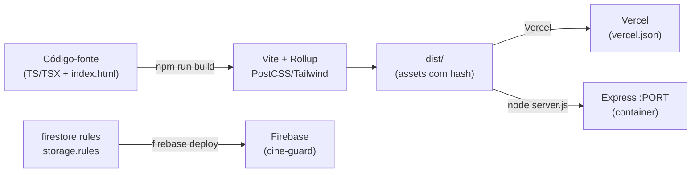

# Referência de Configuração e Build

> Catálogo dos arquivos de configuração, scripts de build, dependências via CDN e alvos de deploy (Vercel, Express, Firebase CLI) do Cine Safe.

Esta página documenta **como o projeto é construído e servido**, não a lógica de negócio. Para o design system (tokens de cor, tipografia, componentes), veja [`../../DESIGN_SYSTEM.md`](../../DESIGN_SYSTEM.md); para as regras de segurança, [`../../FIREBASE_RULES.md`](../../FIREBASE_RULES.md) e [`../04-security.md`](../04-security.md); para a arquitetura de runtime, [`../02-architecture.md`](../02-architecture.md).

---

## Mapa dos arquivos de configuração

| Arquivo | Papel |
| :--- | :--- |
| `package.json` | Dependências, scripts npm, `engines.node >= 18` |
| `vite.config.ts` | Bundler (React), `manualChunks`, host do dev server, `outDir` |
| `tsconfig.json` | Compilador TypeScript (type-check apenas, `noEmit`) |
| `tailwind.config.js` | Tokens de tema (brand/accent), sombras glow, animações |
| `postcss.config.js` | Pipeline PostCSS: `tailwindcss` + `autoprefixer` |
| `index.html` | Documento HTML raiz, CDNs (Leaflet, Google Fonts), CSS global inline |
| `index.css` | Entrypoint `@tailwind` + estilos globais (glass, scrollbar, `.line`) |
| `index.tsx` | Bootstrap React + registro do Service Worker |
| `server.js` | Servidor Express que serve `dist/` (container/Cloud Run) |
| `public/sw.js` | Service Worker (cache offline, network-first para HTML) |
| `vercel.json` | Deploy Vercel: build, rewrites SPA, cache e headers de segurança |
| `firebase.json` / `.firebaserc` | Firebase CLI: deploy das rules; projeto `cine-guard` |
| `services/firebase.ts` | Inicialização do SDK do cliente (config pública) |
| `metadata.json` | Metadados do app + permissão de `geolocation` |
| `.gitignore` | Exclusões do Git |
| `.dockerignore` | Presente, porém com bytes não-textuais (ver abaixo) |



---

## Scripts npm

Definidos em `package.json`. O projeto usa `"type": "module"` (ESM).

| Script | Comando | Uso |
| :--- | :--- | :--- |
| `dev` | `vite` | Servidor de desenvolvimento com HMR |
| `build` | `vite build` | Build de produção em `dist/` |
| `preview` | `vite preview` | Servidor local que serve o `dist/` já buildado (verificação) |
| `start` | `node server.js` | Servidor Express de produção sobre `dist/` (container) |

```bash
npm install       # requer Node >= 18
npm run dev       # http://localhost:5173 (Vite), exposto em 0.0.0.0
npm run build     # gera dist/
npm run start     # serve dist/ via Express na porta PORT (default 8080)
```

> Não há scripts de `lint`, `test` ou `typecheck`. O type-check pode ser rodado manualmente com `npx tsc --noEmit` (o `tsconfig.json` já usa `noEmit`).

---

## Vite (`vite.config.ts`)

```ts
export default defineConfig({
  plugins: [react()],
  server: { host: '0.0.0.0', allowedHosts: true },
  build: {
    outDir: 'dist',
    chunkSizeWarningLimit: 1000,
    rollupOptions: { output: { manualChunks: { /* ... */ } } }
  }
})
```

**Plugin.** `@vitejs/plugin-react` habilita JSX/TSX e Fast Refresh.

**Dev server.**
- `host: '0.0.0.0'` — o dev server escuta em todas as interfaces de rede (necessário para acesso via container/preview em rede local, não só `localhost`).
- `allowedHosts: true` — desativa a checagem de header `Host` do Vite, permitindo qualquer hostname (ex.: túneis/preview com domínio arbitrário).

**Build.**
- `outDir: 'dist'` — diretório de saída (consumido por `server.js` e por `vercel.json → outputDirectory`).
- `chunkSizeWarningLimit: 1000` — eleva o limite de aviso de tamanho de chunk para 1000 kB.

**`manualChunks` (code splitting de vendors).** Separa dependências grandes em chunks estáveis para melhorar o cache do navegador:

| Chunk | Módulos |
| :--- | :--- |
| `vendor-react` | `react`, `react-dom`, `react-router-dom` |
| `vendor-firebase` | `firebase/app`, `firebase/auth`, `firebase/firestore`, `firebase/storage` |
| `vendor-ui` | `lucide-react`, `react-easy-crop` |

> As páginas em `pages/` são carregadas via `React.lazy` no `App.tsx` (não configurado aqui — o split por rota é feito no código, com auto-reload em chunk stale após deploy). Veja [`../05-frontend.md`](../05-frontend.md).

---

## TypeScript (`tsconfig.json`)

Configuração enxuta de projeto Vite. Pontos relevantes:

| Opção | Valor | Efeito |
| :--- | :--- | :--- |
| `target` / `lib` | `ES2020` + DOM | Alvo moderno com APIs de browser |
| `module` / `moduleResolution` | `ESNext` / `bundler` | Resolução no estilo bundler (Vite) |
| `noEmit` | `true` | TSC só faz type-check; o Vite emite o JS |
| `jsx` | `react-jsx` | Novo runtime JSX (sem `import React`) |
| `strict` | `true` | Checagem estrita ativada |
| `allowImportingTsExtensions` | `true` | Permite `import './x.ts'` |
| `resolveJsonModule` | `true` | Import de `.json` (ex.: `metadata.json`) |
| `isolatedModules` | `true` | Cada arquivo transpila isolado (exigência do esbuild) |
| `noUnusedLocals` / `noUnusedParameters` | `false` | Não bloqueia por variáveis/parâmetros não usados |
| `noFallthroughCasesInSwitch` | `true` | Erro em `case` sem `break`/`return` |

Escopo: `include: ["**/*.ts", "**/*.tsx"]`, `exclude: ["node_modules", "dist"]`.

---

## Tailwind e PostCSS

O CSS é compilado via **PostCSS** (`postcss.config.js`): plugins `tailwindcss` seguido de `autoprefixer`. O entrypoint de estilos é `index.css`, que abre com as diretivas:

```css
@tailwind base;
@tailwind components;
@tailwind utilities;
```

**`content` (purge/scan de classes)** em `tailwind.config.js`:

```js
content: [
  "./index.html",
  "./{App,pages,components,services,context}/**/*.{js,ts,jsx,tsx}",
]
```

> Limitação real: os diretórios `hooks/` e `utils/` **não** estão no `content`. Classes Tailwind que existirem apenas em arquivos sob `hooks/` ou `utils/` podem ser removidas do CSS final (purge). Utilitários manuais como `.glass` não são afetados, pois vêm de CSS bruto em `index.css`.

**Tokens de tema (`theme.extend`)** — resumo; a especificação completa (uso de cada cor, exemplos) está em [`../../DESIGN_SYSTEM.md`](../../DESIGN_SYSTEM.md):

| Categoria | Tokens |
| :--- | :--- |
| `fontFamily.sans` | `"Plus Jakarta Sans", sans-serif` |
| `colors.brand.*` | Escala `50`–`950` (midnight blue → quase preto), ex.: `950 #020410`, `900 #080C18` |
| `colors.accent.*` | `primary #22d3ee` (cyan neon), `secondary #a78bfa` (violet), `success #34d399`, `danger #fb7185`, `warning #fbbf24`, `blue #3b82f6`, `gold #fbbf24` |
| `backgroundImage` | `main-gradient`, `mesh-gradient`, `glass-card`, `glass-border`, `glow-text` |
| `boxShadow` | `glow` (`0 0 20px -5px rgba(34,211,238,.3)`), `glow-purple` (violet), `glass` (`0 8px 32px 0 rgba(0,0,0,.3)`) |
| `animation` / `keyframes` | `float` (6s, `translateY` ±15px) e `fade-in` (0.5s, fade + subida 10px) |

---

## HTML de entrada e dependências via CDN (`index.html`)

`index.html` (`lang="pt-BR"`, `<title>Cine Safe - Segurança no Audiovisual</title>`) monta o app em `<div id="root">` e carrega `/index.tsx` como módulo. Favicon: `/favicon.svg` (arquivo em `public/favicon.svg`).

**Otimização de conexão (hints):**

| Tipo | Origens |
| :--- | :--- |
| `dns-prefetch` | `firebasestorage.googleapis.com`, `fonts.googleapis.com`, `fonts.gstatic.com`, `unpkg.com`, `firestore.googleapis.com` |
| `preconnect` | `fonts.googleapis.com`, `fonts.gstatic.com` (crossorigin), `firebasestorage.googleapis.com` (crossorigin) |

**Dependências carregadas por CDN (não pelo bundle):**

| Recurso | URL | Uso |
| :--- | :--- | :--- |
| Google Font "Plus Jakarta Sans" | `fonts.googleapis.com/css2?family=Plus+Jakarta+Sans:wght@300;400;500;600;700;800&display=swap` | Tipografia global |
| Leaflet CSS 1.9.4 | `unpkg.com/leaflet@1.9.4/dist/leaflet.css` (com `integrity`/SRI) | Estilos do mapa |
| Leaflet JS 1.9.4 | `unpkg.com/leaflet@1.9.4/dist/leaflet.js` (com `integrity`/SRI, `crossorigin`) | Biblioteca de mapas (`window.L`) |

> Leaflet é injetado globalmente via `<script>` — não é dependência npm. O código de mapa consome `window.L`. Os tiles usam CartoDB e o geocódigo reverso usa OpenStreetMap/Nominatim (configurados no componente de mapa, não aqui). Veja [`../features/theft-and-safety.md`](../features/theft-and-safety.md).

**CSS global inline.** O `<head>` inclui um `<style>` embutido que reproduz os mesmos utilitários de `index.css` (base `html/body/#root`, fundo com gradientes radiais fixos, scrollbar custom, `.glass`, `.glass-card`, `.glass-input`, ajustes Leaflet e as linhas `.line`). Isso garante o visual básico antes do CSS compilado carregar. Ao final do `<head>` há `<link rel="stylesheet" href="/index.css">` (CSS compilado pelo Tailwind/PostCSS).

> Duplicação intencional/redundante: as regras `.glass*`, scrollbar e `.line` aparecem **tanto** no `<style>` inline de `index.html` **quanto** em `index.css`. Ao editar um utilitário global, atualize os dois.

---

## Utilitários CSS globais (`index.css`)

Classes que não vêm do Tailwind e são usadas amplamente na UI:

| Classe | Efeito |
| :--- | :--- |
| `.glass` | Painel de vidro: `rgba(15,21,38,.7)` + `backdrop-filter: blur(20px)` + borda sutil |
| `.glass-card` | Cartão translúcido: `rgba(255,255,255,.03)` + `blur(16px)` + sombra |
| `.glass-input` | Input escuro translúcido; no `:focus` ganha borda cyan `#22d3ee` e glow |
| `.animate-float` | Aplica `float 6s ease-in-out infinite` (equivalente manual ao token Tailwind) |
| `.leaflet-container` / `.custom-div-icon` | Ajustes de fonte e marcadores do Leaflet |
| `.line` (× até 30) | **Fundo do AdBanner**: círculos concêntricos absolutos. Cada `:nth-child(n)` define `width/height/top/right` crescentes (200px → 3100px); a opacidade da borda decai por faixas (`-n+10`, `11..20`, `21+`) |

O `AdBanner` (`components/AdBanner.tsx`) renderiza `Array.from({ length: 30 })` de `<div className="line" />` dentro de um contêiner absoluto para produzir o efeito de linhas concêntricas. Veja [`./components.md`](./components.md).

---

## Service Worker (`public/sw.js`)

Registrado por `index.tsx` **apenas em produção** (pulado quando o hostname contém `localhost`), no evento `load`:

```ts
if ('serviceWorker' in navigator && !window.location.hostname.includes('localhost')) {
  window.addEventListener('load', () => navigator.serviceWorker.register('/sw.js') /* ... */);
}
```

Estratégias de cache (`CACHE_VERSION = 'cinesafe-v3'`):

| Recurso | Estratégia |
| :--- | :--- |
| HTML (`accept: text/html`) | Network-first, fallback para cache |
| `/assets/*`, fontes (`fonts.gstatic.com`, `.woff`) | Cache-first / stale-while-revalidate; **nunca** cacheia resposta `text/html` (evita servir HTML no lugar de um JS/chunk removido) |
| Imagens do Firebase Storage | Cache-first (cache dinâmico `DYNAMIC_CACHE`); as entradas persistem até um bump de `CACHE_VERSION` — **não há expiração/TTL por tempo** |

O `install` pré-cacheia `/`, `/index.html`, `/favicon.svg` e chama `skipWaiting()`; o `activate` limpa caches de versões antigas e chama `clients.claim()`.

---

## Servidor Express (`server.js`)

Alvo de deploy em container (ex.: Cloud Run). ESM, sem dependências além de `express`.

- Porta: `PORT = process.env.PORT || 8080`.
- Serve estáticos de `DIST_DIR = <root>/dist` via `express.static`.
- **SPA fallback:** `app.get('*')` responde `dist/index.html` para qualquer rota desconhecida (o roteamento é feito no cliente por HashRouter; o fallback cobre o carregamento inicial).
- Na inicialização, checa se `dist/` existe e loga erro crítico caso contrário (orienta rodar `npm run build`); se `index.html` não existir na requisição, responde `500`.

```bash
npm run build && npm run start   # serve dist/ em http://localhost:8080
```

---

## Deploy Vercel (`vercel.json`)

```json
{ "buildCommand": "npm run build", "outputDirectory": "dist", "framework": "vite" }
```

**Rewrites (SPA):** `"/(.*)" → "/index.html"` — toda rota serve o HTML raiz; o roteamento acontece no cliente.

**Cache-Control por rota:**

| Rota | `Cache-Control` |
| :--- | :--- |
| `/sw.js` | `public, max-age=0, must-revalidate` (+ `Service-Worker-Allowed: /`) |
| `/assets/(.*)` | `public, max-age=31536000, immutable` (1 ano; assets têm hash) |
| `/favicon.svg` | `public, max-age=31536000, immutable` |
| `/index.html` | `public, max-age=0, must-revalidate` |

**Headers de segurança** (aplicados a `/(.*)`):

| Header | Valor |
| :--- | :--- |
| `X-Content-Type-Options` | `nosniff` |
| `X-Frame-Options` | `DENY` |
| `X-XSS-Protection` | `1; mode=block` |

---

## Firebase CLI (`firebase.json`, `.firebaserc`)

O Firebase CLI é usado **apenas para publicar regras de segurança** — não há hosting, functions ou emuladores configurados aqui.

```json
// firebase.json
{ "firestore": { "rules": "firestore.rules" }, "storage": { "rules": "storage.rules" } }
```

```json
// .firebaserc
{ "projects": { "default": "cine-guard" } }
```

- Projeto padrão: **`cine-guard`**.
- `firestore.rules` e `storage.rules` estão na raiz do repo e são documentados em [`../../FIREBASE_RULES.md`](../../FIREBASE_RULES.md) e [`../04-security.md`](../04-security.md).

```bash
firebase deploy --only firestore:rules,storage:rules   # publica as rules no projeto cine-guard
```

---

## Configuração do cliente Firebase (`services/firebase.ts`)

Valores **públicos** do SDK web (não são segredo; a segurança vem das rules). O módulo usa `firebase/compat` para **Auth** e **Storage**, e o SDK **modular** para o **Firestore**.

| Campo | Valor |
| :--- | :--- |
| `projectId` | `cine-guard` |
| `authDomain` | `cine-guard.firebaseapp.com` |
| `storageBucket` | `cine-guard.firebasestorage.app` |
| `messagingSenderId` | `26658934292` |
| `appId` | `1:26658934292:web:9d33f06250ba49dc68e101` |
| `apiKey` | presente no arquivo (chave web pública) |

```ts
import firebase from 'firebase/compat/app';
import 'firebase/compat/auth';
import { getFirestore } from 'firebase/firestore';
import 'firebase/compat/storage';

const app = firebase.apps.length > 0 ? firebase.app() : firebase.initializeApp(firebaseConfig);
export const auth = app.auth();                       // compat
export const db = getFirestore(app as unknown as any); // modular
export const storage = app.storage();                 // compat
```

- A inicialização é idempotente (`firebase.apps.length > 0`) para sobreviver a hot-reload.
- Não há backend próprio nem Cloud Functions — o cliente fala direto com Auth/Firestore/Storage. Veja [`./services.md`](./services.md).

---

## `metadata.json`

Metadados do app e permissões de frame solicitadas:

```json
{
  "name": "Cine Safe Ajuste Manus",
  "description": "Cine Safe: Segurança no Audiovisual. ...",
  "requestFramePermissions": ["geolocation"]
}
```

`geolocation` é a permissão requisitada — usada no fluxo de reporte de roubo (captura de localização). Veja [`../features/theft-and-safety.md`](../features/theft-and-safety.md).

---

## Arquivos ignorados

**`.gitignore`** ignora: `node_modules`, `dist`, `dist-ssr`, logs (`*.log`, `npm-debug.log*`, etc.), `*.local`, diretórios de editor (`.vscode/*` exceto `extensions.json`, `.idea`, `.DS_Store`) e artefatos diversos.

**`.dockerignore`** — o arquivo existe (41 bytes), porém seu conteúdo **não é texto**: são bytes binários/não-UTF-8 (o comando `file` reporta `data`). Não é um `.dockerignore` válido e **não há `Dockerfile`** no repositório. Na prática, o build de container documentado é feito via `server.js` (Node) e não depende deste arquivo. Recomenda-se recriá-lo como texto (ex.: ignorar `node_modules`, `dist`, `.git`) se um `Dockerfile` for adicionado.

---

## Fontes no código

- `package.json` — scripts, dependências, `engines`
- `vite.config.ts` — bundler, `manualChunks`, dev server
- `tsconfig.json` — compilador TypeScript
- `tailwind.config.js` — tokens de tema, sombras, animações
- `postcss.config.js` — pipeline PostCSS
- `index.html` — HTML raiz, CDNs, CSS inline, hints de conexão
- `index.css` — entrypoint Tailwind e utilitários globais
- `index.tsx` — bootstrap React + registro do Service Worker
- `public/sw.js` — Service Worker
- `components/AdBanner.tsx` — uso das linhas `.line`
- `server.js` — servidor Express de produção
- `vercel.json` — deploy Vercel (rewrites, cache, segurança)
- `firebase.json`, `.firebaserc` — Firebase CLI e projeto `cine-guard`
- `services/firebase.ts` — config do cliente Firebase
- `metadata.json` — metadados e permissão de geolocation
- `.gitignore`, `.dockerignore` — arquivos ignorados
