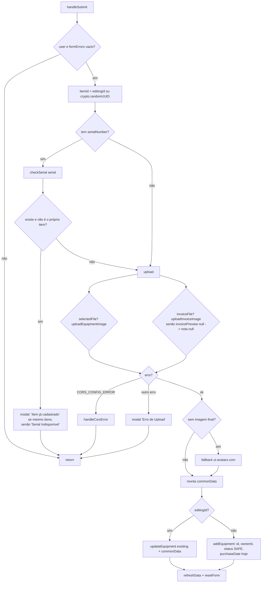

# Referência: React Hooks customizados

> Hooks que encapsulam estado, efeitos e handlers de UI do Cine Safe, delegando toda a I/O aos serviços em `services/`.

O diretório `hooks/` concentra a lógica de estado das telas mais pesadas, mantendo os componentes de página (`pages/`) declarativos. Cada hook consome a camada de serviços (ver [`./services.md`](./services.md)) e nunca fala diretamente com o Firestore/Storage — todo acesso a dados passa por `services/*Service.ts`.

| Hook | Arquivo | Consumido por | Propósito |
| --- | --- | --- | --- |
| `useInventory` | `hooks/useInventory.ts` | `pages/Inventory.tsx` | Estado completo do inventário: formulário, upload, modais, transferência e recuperação de itens. |
| `useUserStats` | `hooks/useUserStats.ts` | `pages/Home.tsx` | Carrega estatísticas detalhadas do usuário e globais para o dashboard. |
| `useAd` | `hooks/useAd.ts` | `pages/Home.tsx`, `pages/SerialCheck.tsx`, `pages/Notifications.tsx` | Busca um anúncio ativo (aleatório ponderado) e registra a impressão. |

---

## `useInventory`

Arquivo: `hooks/useInventory.ts`. É o maior hook do projeto: reúne o CRUD de equipamentos, o fluxo de listagem no marketplace, o upload resiliente de imagem/nota fiscal, a transferência de posse e a recuperação de itens roubados. Toda a página `pages/Inventory.tsx` é orquestrada por ele.

### Dependências

| Dependência | Origem | Uso |
| --- | --- | --- |
| `useAuth()` | `context/AuthContext` | Obtém `user` (dono corrente). Todos os efeitos e handlers dependem dele. |
| `useNavigate()` | `react-router-dom` | Redireciona para `/network` quando a rede está vazia. |
| `equipmentService` | `services/equipmentService.ts` | Leitura/escrita de itens, upload de imagem e nota, checagem de serial, transferência e recuperação. |
| `userService` | `services/userService.ts` | `getConnections` (rede) e `checkLimit(uid, 'inventory')` (limite freemium). |
| `notificationService` | `services/notificationService.ts` | `createNotification` para a solicitação de transferência (`ITEM_TRANSFER`). |

### Estado retornado

O hook expõe um único objeto grande. Os grupos de estado abaixo refletem os blocos comentados no código-fonte.

#### Estado de dados

| Campo | Tipo | Descrição |
| --- | --- | --- |
| `equipment` | `Equipment[]` | Itens do usuário, carregados por `equipmentService.getUserEquipment(user.id)`. |
| `connections` | `User[]` | Rede de confiança do usuário (destinos possíveis de transferência). |
| `loading` | `boolean` | `true` enquanto `refreshData()` busca o inventário. |

#### Estado de formulário

| Campo | Tipo | Descrição |
| --- | --- | --- |
| `isAdding` | `boolean` | Se o formulário de adicionar/editar está aberto. |
| `editingId` | `string \| null` | `id` do item em edição; `null` significa criação. |
| `formData` | objeto | Campos do formulário (ver abaixo). Exposto junto de `setFormData`. |
| `formErrors` | `string[]` | Mensagens de validação recalculadas a cada mudança (ver [Validação](#validação-formerrors)). |
| `filterCategory` | `string` | Filtro de categoria da listagem (`'ALL'` por padrão), com `setFilterCategory`. |

Forma de `formData` (inicial em `resetForm`):

```ts
{
  name: '', brand: '', model: '', serialNumber: '',
  category: EquipmentCategory.CAMERA, // default
  isForRent: false, rentalPrice: 0,
  isForSale: false, salePrice: 0,
  description: '', value: 0,
}
```

> Atenção ao mapeamento: no formulário o preço de aluguel é `rentalPrice`, mas no modelo `Equipment` o campo persistido é `rentalPricePerDay`. `handleEditClick` lê `item.rentalPricePerDay` para popular `formData.rentalPrice`, e `handleSubmit` grava `rentalPricePerDay: Number(formData.rentalPrice)`.

#### Estado de arquivos (upload)

| Campo | Tipo | Descrição |
| --- | --- | --- |
| `selectedFile` | `File \| null` | Imagem do equipamento escolhida no input. |
| `previewImage` | `string \| null` | Preview da imagem (dataURL do `FileReader`, ou `imageUrl` existente na edição). Também usado na validação de listagem. |
| `uploadingImage` | `boolean` | `true` durante checagem de serial e upload; trava o submit. |
| `invoiceFile` | `File \| null` | Nota fiscal selecionada. |
| `invoicePreview` | `string \| null` | Preview da nota (`URL.createObjectURL`, ou `invoiceUrl` existente). |
| `fileInputRef` | `RefObject<HTMLInputElement>` | Ref do input de imagem. |
| `invoiceFileInputRef` | `RefObject<HTMLInputElement>` | Ref do input de nota (limpo em `handleRemoveInvoice`). |

#### Estado de modais

`modalConfig` é um modal de confirmação genérico, reutilizado por exclusão, erros de upload, avisos de serial e confirmações de transferência.

| Campo | Tipo | Descrição |
| --- | --- | --- |
| `modalOpen` | `boolean` | Visibilidade do modal genérico. |
| `modalProcessing` | `boolean` | `true` enquanto a `action` do modal executa. |
| `modalConfig` | `{ title, message, action: () => Promise<void>, isDestructive, confirmLabel }` | Conteúdo e ação do modal corrente. |

Modais especializados:

| Campo | Tipo | Descrição |
| --- | --- | --- |
| `transferModalOpen`, `itemToTransfer`, `selectedConnectionId` | `boolean`, `Equipment \| null`, `string` | Estado do modal de transferência. |
| `transferType` | `'free' \| 'valued'` | Transferência gratuita ou com valor. |
| `transactionValue` | `number` | Valor da transferência quando `transferType === 'valued'`. |
| `recoverModalOpen`, `itemToRecover` | `boolean`, `Equipment \| null` | Estado do modal de recuperação. |
| `showReferralModal` | `boolean` | Aberto quando o limite freemium de inventário é atingido. |

#### Constante

`TOP_AV_BRANDS` — lista fixa de marcas de audiovisual (Sony, Canon, Blackmagic Design, ARRI, RED, DJI, etc.) para autocompletar/sugestões no formulário. É retornada pelo hook.

### Efeitos (`useEffect`)

| Dependências | Comportamento |
| --- | --- |
| `[user]` | Ao ter usuário, dispara `refreshData()` (inventário) e `loadConnections()` (rede). |
| `[formData, previewImage]` | Recalcula `formErrors` de forma reativa (validação viva, sem submit). |

### Validação (`formErrors`)

O efeito `[formData, previewImage]` reconstrói o array de erros a cada digitação. Um item é considerado "listagem" quando `isForSale || isForRent`.

| Condição | Mensagem adicionada |
| --- | --- |
| `isForSale` e `salePrice <= 0` | "O preço de venda deve ser maior que zero." |
| `isForRent` e `rentalPrice <= 0` | "O preço do aluguel deve ser maior que zero." |
| listagem sem `previewImage` | "Uma imagem é obrigatória para listar um item." |
| listagem com `description` < 10 chars | "Uma descrição de pelo menos 10 caracteres é necessária." |
| falta `brand`, `model` ou `serialNumber` | "Marca, Modelo e Serial são obrigatórios." |

`handleSubmit` aborta imediatamente se `formErrors.length > 0`, então a validação viva é também a barreira de submissão.

### `handleSubmit`

Fluxo do envio do formulário (`hooks/useInventory.ts:114`). Cobre checagem de serial duplicado, upload resiliente e a bifurcação criar-vs-atualizar.



Detalhes que importam:

- **`itemId`** é `editingId` (edição) ou `crypto.randomUUID()` (criação); é passado como `equipmentId` ao subir a nota fiscal, gerando o path `users/{uid}/invoices/{itemId}_<timestamp>.<ext>` (o `itemId` é prefixo do nome do arquivo, não uma subpasta) mesmo em item novo.
- **Checagem de serial**: `equipmentService.checkSerial(serialNumber)` roda com `uploadingImage = true`. Se retornar um item e não for o próprio (edição do mesmo `id`), o submit para com um modal cuja mensagem depende de `existingItem.ownerId === user.id` (já é do usuário) ou não (registrado por outro).
- **Upload resiliente**: imagem e nota são enviadas dentro de um `try/catch`. Se o erro for `CORS_CONFIG_ERROR` (lançado pelo `equipmentService`), chama `handleCorsError` (modal explicando a configuração de CORS do bucket); qualquer outro erro abre um modal genérico "Erro de Upload". Em ambos, o submit retorna sem gravar.
- **Fallback de imagem**: sem imagem final, gera avatar em `https://ui-avatars.com/api/?name=<brand>&...` — item nunca fica sem `imageUrl`.
- **`name`** cai para `` `${brand} ${model}` `` quando o campo `name` está vazio.
- **Criar vs. atualizar**: com `editingId`, faz `updateEquipment({ ...existing, ...commonData })` (preserva campos não editados como `ownerId`/`status`). Sem `editingId`, `addEquipment` acrescenta `id`, `ownerId`, `status: SAFE` e `purchaseDate` (data de hoje `YYYY-MM-DD`).

### Handlers retornados

| Handler | O que faz |
| --- | --- |
| `refreshData()` | Recarrega `equipment` via `getUserEquipment`. |
| `resetForm()` | Zera formulário, previews e flags de edição/adição. |
| `handleAddNewClick()` | Alterna o formulário; antes de abrir chama `userService.checkLimit(uid,'inventory')`. Se estourou o limite, abre `showReferralModal` em vez do formulário. |
| `handleEditClick(item)` | Popula `formData`/previews a partir do item, marca `editingId`, abre o formulário e rola ao topo. |
| `handleSubmit(e)` | Ver [seção dedicada](#handlesubmit). |
| `handleFileChange(e)` | Guarda `selectedFile` e gera `previewImage` via `FileReader` (dataURL). |
| `handleInvoiceFileChange(e)` | Guarda `invoiceFile` e gera `invoicePreview` via `URL.createObjectURL`. |
| `handleRemoveInvoice(e)` | Remove nota, limpa preview e reseta o valor do input (`stopPropagation`). |
| `promptDelete(id)` | Modal destrutivo → `equipmentService.deleteEquipment(id)` → `refreshData`. |
| `handleTransferClick(item)` | Se a rede está vazia, modal que navega para `/network`; senão prepara `itemToTransfer`, `transactionValue = item.value` e abre o modal de transferência. |
| `confirmTransfer()` | Ver [Transferência](#transferência-de-posse). |
| `handleCancelTransfer(item)` | Modal destrutivo → `equipmentService.cancelTransfer(item.id)` → `refreshData`. |
| `confirmRecovery(viaApp)` | `equipmentService.recoverEquipment(itemToRecover, viaApp)` → `refreshData`; `viaApp` marca se a recuperação foi pela rede do app. |
| `handleModalConfirm()` | Executa `modalConfig.action()` entre `modalProcessing = true/false`. |
| `toTitleCase(str)` | Utilitário de capitalização Title Case. |
| `handleRentToggle(checked)` / `handleSaleToggle(checked)` | Alternam `isForRent` / `isForSale` em `formData`. |

### Transferência de posse

`confirmTransfer()` (`hooks/useInventory.ts:176`) executa a solicitação de transferência para uma conexão selecionada:

1. Resolve o `targetUser` em `connections` por `selectedConnectionId`.
2. Calcula `value` (`transactionValue` se `transferType === 'valued'`, senão `0`) e monta a mensagem em BRL.
3. Cria uma `Notification` do tipo `ITEM_TRANSFER` com `expiresAt` de **24h** e `actionPayload: { equipmentId, transactionValue: value }`, via `notificationService.createNotification`.
4. `equipmentService.updateEquipment` põe o item em `status: TRANSFER_PENDING`, define `pendingTransferTo` e desliga `isForRent`/`isForSale`.
5. `refreshData`, limpa o estado de transferência e abre modal "Solicitação Enviada" (aguarda aceite em 24h).

O aceite/recusa acontece do lado do destinatário (fora deste hook — ver [`../features/network-and-transfers.md`](../features/network-and-transfers.md)).

### Recuperação de item roubado

`confirmRecovery(viaApp: boolean)` chama `equipmentService.recoverEquipment(itemToRecover, viaApp)`, que grava um registro imutável em `theft_history` e devolve o equipamento a `status: SAFE` (limpando `theftDate`/`theftLocation`/`theftAddress`). Fluxo detalhado em [`../features/theft-and-safety.md`](../features/theft-and-safety.md).

---

## `useUserStats`

Arquivo: `hooks/useUserStats.ts`. Carrega dois conjuntos de estatísticas para o dashboard da Home: as do usuário e as globais do sistema.

### Retorno

| Campo | Tipo | Descrição |
| --- | --- | --- |
| `userStats` | `DetailedStats \| null` | Estatísticas do usuário logado. |
| `systemStats` | `DetailedStats \| null` | Estatísticas agregadas globais (impacto). |
| `loading` | `boolean` | `true` enquanto ambas as buscas correm. |

### Dependências e efeito

Consome `useAuth()` (para `user`) e `userService`. O único `useEffect` depende de `[user]` e, com usuário presente, roda em paralelo:

```ts
const [uStats, sStats] = await Promise.all([
  userService.getUserDetailedStats(user.id),
  userService.getGlobalDetailedStats(),
]);
```

### Semântica dos dois conjuntos

Ambos são do tipo `DetailedStats` (`types.ts:223`), mas preenchidos de formas diferentes:

- **`getUserDetailedStats`** varre `equipment`, `theft_history` e `notifications` do próprio usuário. Inclui `rentalOffers`/`saleOffers` (contagem de notificações `RENTAL_INTEREST`/`SALE_INTEREST`).
- **`getGlobalDetailedStats`** usa **queries de agregação** (`getCountFromServer`, `getAggregateFromServer` com `sum`/`count`) sobre `equipment` e `theft_history`, mais o doc `stats/global` para `transactionsCount`/`transactedValue`. Por privacidade, zera `rentalOffers`/`saleOffers` no global (dado individual não entra no agregado).

Ver [`../reference/services.md`](../reference/services.md) e [`../03-data-model.md`](../03-data-model.md) para os campos completos de `DetailedStats`.

---

## `useAd`

Arquivo: `hooks/useAd.ts`. Busca um anúncio ativo e registra a impressão. Usado pela Home, pela verificação de serial e pela tela de notificações.

### Retorno

| Campo | Tipo | Descrição |
| --- | --- | --- |
| `ad` | `Ad \| null` | Anúncio selecionado (ou `null` se nenhum válido). |
| `loading` | `boolean` | `true` durante a busca. |

### Efeito

`useEffect` com dependência `[]` (executa uma vez na montagem):

```ts
const activeAd = await adService.getActiveAd();
setAd(activeAd);
if (activeAd) {
  await adService.trackAdImpression(activeAd.id);
}
```

- `adService.getActiveAd()` filtra `ads` por `active === true` e janela `startDate <= hoje <= endDate`, então faz **seleção aleatória ponderada por `weight`** (peso default `1`).
- Quando há anúncio, incrementa `impressions` via `trackAdImpression` (única escrita disparada por este hook).
- O clique (`adService.trackAdClick`) **não** é tratado aqui — fica a cargo do componente que renderiza o banner. Ver [`../features/advertising.md`](../features/advertising.md).

---

## Notas e limitações

- **Validação no cliente**: `useInventory` valida limites (`checkLimit`) e serial duplicado (`checkSerial`) no cliente; as Firestore rules fazem defesa por-campo, mas o endurecimento pleno é registrado como pendente em [`../../FIREBASE_RULES.md`](../../FIREBASE_RULES.md).
- **Upload e CORS**: o tratamento de `CORS_CONFIG_ERROR` existe porque o Storage é acessado só pelo cliente; um bucket mal configurado quebra o upload silenciosamente sem esse guard.
- **`useAd` sem retry**: falhas de `getActiveAd`/`trackAdImpression` não têm retry no hook (o serviço apenas loga o erro da impressão); o banner simplesmente não aparece.

## Fontes no código

- `hooks/useInventory.ts`
- `hooks/useUserStats.ts`
- `hooks/useAd.ts`
- `services/equipmentService.ts` (`getUserEquipment`, `checkSerial`, `uploadEquipmentImage`, `uploadInvoiceImage`, `addEquipment`, `updateEquipment`, `deleteEquipment`, `cancelTransfer`, `recoverEquipment`)
- `services/userService.ts` (`getConnections`, `checkLimit`, `getUserDetailedStats`, `getGlobalDetailedStats`)
- `services/notificationService.ts` (`createNotification`)
- `services/adService.ts` (`getActiveAd`, `trackAdImpression`)
- `types.ts` (`Equipment`, `EquipmentCategory`, `EquipmentStatus`, `Notification`, `DetailedStats`, `Ad`)
- Consumidores: `pages/Inventory.tsx`, `pages/Home.tsx`, `pages/SerialCheck.tsx`, `pages/Notifications.tsx`
