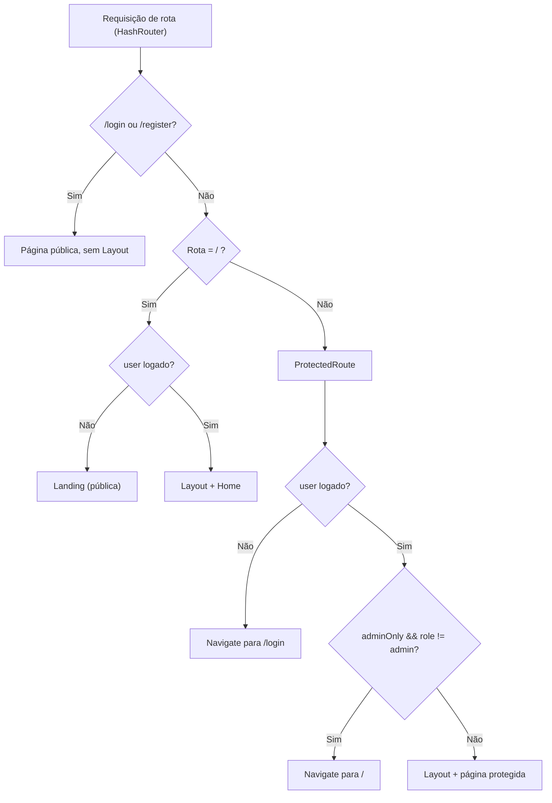
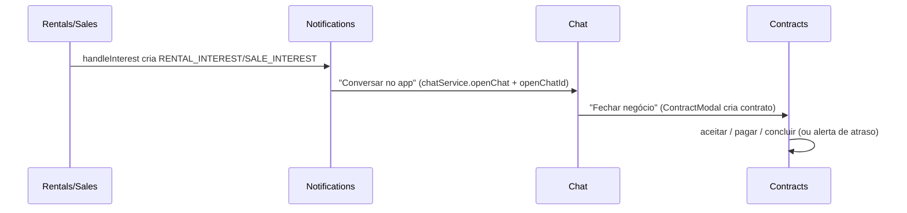

# Referência de Páginas (Rotas)

> Uma página por rota do Cine Safe: propósito, dados que carrega, interações do usuário, componentes/modais e controle de acesso.

Este documento cataloga as telas do app, cada uma exportada de `pages/*.tsx` e ligada a uma rota em [`App.tsx`](../../App.tsx). O roteamento usa `HashRouter` do `react-router-dom` e todas as páginas são carregadas via `lazy` com auto-reload em caso de chunk obsoleto (`lazyWithReload`, [`App.tsx:12`](../../App.tsx)).

Para a arquitetura de front-end e o design system, veja [`../05-frontend.md`](../05-frontend.md). Para serviços, hooks e componentes reutilizados por estas páginas, veja [`services.md`](./services.md), [`hooks.md`](./hooks.md) e [`components.md`](./components.md).

## Controle de acesso

O gate é feito em [`App.tsx`](../../App.tsx) por três invólucros:

- **`RootRoute`** (`App.tsx:72`): a rota `/` renderiza `Landing` (pública) para visitantes e `Home` (dentro de `Layout`) para usuários logados.
- **`ProtectedRoute`** (`App.tsx:53`): exige `user`; sem sessão, redireciona para `/login`. Quando `adminOnly` é `true` e `user.role !== 'admin'`, redireciona para `/`. Envolve o conteúdo em [`Layout`](../../components/Layout.tsx).
- Rotas `/login` e `/register` são públicas e renderizam **fora** do `Layout` (tela cheia própria).

Usuários com `isBlocked` são deslogados à força pelo [`AuthContext`](../../context/AuthContext.tsx) (`AuthContext.tsx:26` e `:41`), então nunca alcançam as rotas protegidas. Ver [`../04-security.md`](../04-security.md).

A navegação fica em [`Layout`](../../components/Layout.tsx): a lista `navItems` (`Layout.tsx:21`) expõe Início, Notificações, Mensagens, Contratos, Minha Rede, Inventário, Alugar, Comprar, Segurança, Verificar e Ranking — e aparece **tanto na sidebar desktop** (`aside`, `hidden md:flex`) **quanto no menu overlay mobile**. Apenas na **sidebar desktop** (rodapé): o link **Admin** (só quando `user.role === 'admin'`, `Layout.tsx:82`), o botão **REPORTAR** → `/report-theft` (`Layout.tsx:103`) e o avatar → `/profile` (`Layout.tsx:109`). O **menu mobile** contém somente os `navItems` e o botão Sair. O logout volta para `/` (`Layout.tsx:18`).

## Tabela geral

| Rota | Arquivo | Acesso | Propósito |
| --- | --- | --- | --- |
| `/` (visitante) | [`pages/Landing.tsx`](../../pages/Landing.tsx) | Público | Vitrine pública com CTA de cadastro; toda ação exige login. |
| `/` (logado) | [`pages/Home.tsx`](../../pages/Home.tsx) | Protegido | Dashboard pessoal: reputação, patrimônio, impacto global, ações sugeridas. |
| `/login` | [`pages/Login.tsx`](../../pages/Login.tsx) | Público | Autenticação por e-mail/senha. |
| `/register` | [`pages/Register.tsx`](../../pages/Register.tsx) | Público | Cadastro com localização (IBGE) e código de indicação. |
| `/inventory` | [`pages/Inventory.tsx`](../../pages/Inventory.tsx) | Protegido | CRUD de equipamentos, transferência de posse, recuperação. |
| `/report-theft` | [`pages/TheftReport.tsx`](../../pages/TheftReport.tsx) | Protegido | Reporte de roubo em 3 passos com geolocalização. |
| `/rentals` | [`pages/Rentals.tsx`](../../pages/Rentals.tsx) | Protegido | Marketplace de aluguel com filtros e paginação. |
| `/sales` | [`pages/Sales.tsx`](../../pages/Sales.tsx) | Protegido | Marketplace de venda com filtros e paginação. |
| `/check-serial` | [`pages/SerialCheck.tsx`](../../pages/SerialCheck.tsx) | Protegido | Verificação antirroubo por número de série. |
| `/safety` | [`pages/SafetyMap.tsx`](../../pages/SafetyMap.tsx) | Protegido | Mapa de segurança, hotspots e alertas de não-devolução. |
| `/rankings` | [`pages/Rankings.tsx`](../../pages/Rankings.tsx) | Protegido | Ranking de reputação e composição da pontuação. |
| `/profile` | [`pages/Profile.tsx`](../../pages/Profile.tsx) | Protegido | Edição de perfil, avatar, telefone e localização. |
| `/notifications` | [`pages/Notifications.tsx`](../../pages/Notifications.tsx) | Protegido | Central de notificações em tempo real com ações inline. |
| `/network` | [`pages/Network.tsx`](../../pages/Network.tsx) | Protegido | Rede de confiança: busca, conexões, mensagens. |
| `/chat` | [`pages/Chat.tsx`](../../pages/Chat.tsx) | Protegido | Chat interno 1-a-1 e abertura de contratos. |
| `/contracts` | [`pages/Contracts.tsx`](../../pages/Contracts.tsx) | Protegido | Ciclo de vida de contratos, pagamentos e atrasos. |
| `/admin` | [`pages/AdminDashboard.tsx`](../../pages/AdminDashboard.tsx) | Admin | Painel administrativo (usuários, transações, incidentes, anúncios). |

---

## `Landing` — `/` (visitante)

**Propósito.** Storefront público. O visitante navega pela vitrine, mas qualquer ação (ver detalhes, ter interesse, buscar, anunciar) o empurra para `/login` ou `/register`.

**Dados que carrega.** No `useEffect`, busca em paralelo `equipmentService.getRentalsPaginated(null, 24, {})` e `getSalesPaginated(null, 24, {})` ([`Landing.tsx:21`](../../pages/Landing.tsx)), deduplica por `item.id` num `Map` (um item para aluguel **e** venda aparece uma vez com as duas etiquetas) e embaralha com Fisher-Yates. Falha na leitura pública degrada com elegância: mantém hero e CTAs. Filtro de categoria (`filterCategory`) é aplicado localmente via `useMemo` sobre `EquipmentCategory`.

**Interações.** `goToLogin`/`goToRegister` disparados por: barra superior (Entrar/Criar conta), hero, campo de busca `readOnly` (foco/clique → login), chips de categoria (filtro local, não navega), cards da vitrine (clique → login) e CTA final.

**Componentes/modais.** [`CineSafeLogo`](../../components/CineSafeLogo.tsx), [`Icons`](../../components/Icons.tsx); subcomponentes locais `Feature` e `Step`. Sem modais.

Ver features: [`../features/marketplace.md`](../features/marketplace.md).

## `Home` — `/` (logado)

**Propósito.** Dashboard pessoal pós-login: saudação, reputação, ações sugeridas, patrimônio e impacto global agregado.

**Dados que carrega.** `useAuth` (`user`), [`useUserStats`](./hooks.md) (`userStats`, `systemStats`, `loading`) e [`useAd`](./hooks.md) (`ad`). Notificações via `notificationService.getUserNotifications(user.id)` ([`Home.tsx:24`](../../pages/Home.tsx)) para calcular `unreadCount`. `userService.isPremium(user)` decide o bloco de indicação. Enquanto `loadingStats`/`userStats`/`systemStats` não resolvem, exibe spinner.

**Interações.** Botão "Convidar Agora" abre `ReferralModal` (`reason="invite"`). Cards de ação condicionais: perfil incompleto (`!contactPhone` ou avatar `ui-avatars.com`) → `/profile`; sem inventário → `/inventory`; itens seguros sem aluguel → `/inventory`. Barra de progresso Premium usa `referralCount / 5`. Link "Ver Notificações" → `/notifications`.

**Componentes/modais.** [`ReferralModal`](../../components/ReferralModal.tsx), [`AdBanner`](../../components/AdBanner.tsx), `Icons`; subcomponentes locais `ActionCard`, `StatItem`, `GlobalStatItem`.

Ver features: [`../features/reputation-and-rankings.md`](../features/reputation-and-rankings.md), [`../features/referral-and-freemium.md`](../features/referral-and-freemium.md), [`../features/advertising.md`](../features/advertising.md).

## `Login` — `/login`

**Propósito.** Autenticação por e-mail/senha (público, tela cheia).

**Dados que carrega.** Nenhum na montagem. Usa `useAuth().login`.

**Interações.** `handleSubmit` chama `login(email, password)`; em sucesso `navigate('/')`, em erro exibe a mensagem retornada. Link para `/register`.

**Componentes/modais.** [`CineSafeLogo`](../../components/CineSafeLogo.tsx), `Icons`. Sem modais.

## `Register` — `/register`

**Propósito.** Cadastro de conta com nome, e-mail, senha e localização brasileira; suporta indicação (referral).

**Dados que carrega.** `IBGEService.getUFs()` na montagem e `IBGEService.getCitiesByUF(selectedUf)` quando a UF muda ([`Register.tsx:44`](../../pages/Register.tsx)). O código de indicação vem de `useSearchParams().get('ref')`; se presente, mostra o selo "Você foi convidado!".

**Interações.** Validação client-side: senha ≥ 6 caracteres e UF+cidade obrigatórias. Monta `location = "${cidade} - ${UF}"` e chama `register(email, password, name, fullLocation, referralCode?)` ([`Register.tsx:85`](../../pages/Register.tsx)); em sucesso `navigate('/')`. Cidade usa `<input list>` + `<datalist>`. Link para `/login`.

**Componentes/modais.** [`CineSafeLogo`](../../components/CineSafeLogo.tsx), `Icons`. Sem modais.

Ver features: [`../features/referral-and-freemium.md`](../features/referral-and-freemium.md).

## `Inventory` — `/inventory`

**Propósito.** Gestão do inventário do usuário: criar/editar/excluir equipamentos, ativar aluguel/venda, transferir posse e marcar recuperação.

**Dados que carrega.** Toda a lógica de estado e efeitos vive no hook [`useInventory`](./hooks.md) ([`Inventory.tsx:10`](../../pages/Inventory.tsx)), que expõe `equipment`, `connections`, estado de formulário, uploads e handlers. A página agrupa `equipment` por `category` para render por seção e chips de filtro.

**Interações.** Formulário de item: upload de foto e de nota fiscal (`fileInputRef`/`invoiceFileInputRef`), marca com `<datalist>` de `TOP_AV_BRANDS`, categoria (`EquipmentCategory`), valor, descrição e toggles `isForRent`/`isForSale` com preços correspondentes. O `serialNumber` fica **imutável** ao editar (`disabled={!!editingId}`, `Inventory.tsx:129`). Cards mostram badges de status (`STOLEN`, `TRANSFER_PENDING`, `ALUGUEL`, `VENDA`) e ações: Editar, Transferir, Excluir, Cancelar Transferência (quando pendente) ou "Marcar como Recuperado" (quando roubado).

**Componentes/modais.** [`ConfirmModal`](../../components/ConfirmModal.tsx), [`ReferralModal`](../../components/ReferralModal.tsx) e dois modais inline via `createPortal`: **Transferir Propriedade** (destinatário da rede, tipo `free`/`valued`, valor) e **Item Recuperado** (via Cine Safe / outros meios).

Ver features: [`../features/inventory.md`](../features/inventory.md), [`../features/network-and-transfers.md`](../features/network-and-transfers.md).

## `TheftReport` — `/report-theft`

**Propósito.** Reportar roubo/furto de itens em um fluxo de 3 passos com localização no mapa.

**Dados que carrega.** Na montagem, `equipmentService.getUserEquipment(user.id)` filtrando itens `EquipmentStatus.SAFE` ([`TheftReport.tsx:25`](../../pages/TheftReport.tsx)) — só itens seguros podem ser reportados.

**Interações.** Passo 1: seleção múltipla de itens (`selectedIds`). Passo 2: mapa Leaflet (tiles CartoDB dark) inicializado com `navigator.geolocation` (fallback centro do Brasil); pino arrastável e clique no mapa atualizam `geoCoords`; geocodificação reversa via Nominatim (`fetchAddress`, `TheftReport.tsx:121`). `submitReport` recarrega o inventário, marca cada item selecionado como `STOLEN` com `theftDate`/`theftLocation`/`theftAddress` via `equipmentService.updateEquipment`, e chama `userService.incrementUserStat(user.id, 'reportsCount')`. Passo 3: confirmação.

**Componentes/modais.** `Icons`; Leaflet global (`L`) via CDN. Sem modais próprios.

Ver features: [`../features/theft-and-safety.md`](../features/theft-and-safety.md).

## `Rentals` — `/rentals`

**Propósito.** Marketplace de aluguel: descobrir equipamentos por localização/categoria e sinalizar interesse ao dono.

**Dados que carrega.** `equipmentService.getRentalsPaginated(cursor, 12, filters)` com scroll infinito via `IntersectionObserver` (`lastElementRef`, [`Rentals.tsx:38`](../../pages/Rentals.tsx)) e cursor `QueryDocumentSnapshot`. Filtros: `category` (`EquipmentCategory`), `uf`/`city` (`IBGEService`). Busca textual debounced (500 ms) usa `equipmentService.searchMarketplace('isForRent', ...)`, que retorna um lote único e desliga a paginação (`hasMore=false`).

> Limitação: a busca por texto **não** usa paginação nativa; a filtragem por `searchQuery` está desativada no caminho paginado (comentário em `Rentals.tsx:70`) e a busca textual é resolvida separadamente pelo serviço. Ver [`services.md`](./services.md) para o alcance real da busca.

**Interações.** `handleInterest` verifica `userService.checkLimit(user.id, 'contact')`; sem cota, abre `ReferralModal`. Caso contrário, `ConfirmModal` confirma o envio de `notificationService.createNotification` do tipo `RENTAL_INTEREST` e incrementa uso com `userService.incrementUsage(user.id, 'contact')`. O próprio anúncio mostra "Seu Anúncio" em vez do botão.

**Componentes/modais.** [`ConfirmModal`](../../components/ConfirmModal.tsx), [`ReferralModal`](../../components/ReferralModal.tsx) (`reason="contact"`), [`UserAvatar`](../../components/UserAvatar.tsx), `Icons`.

Ver features: [`../features/marketplace.md`](../features/marketplace.md), [`../features/referral-and-freemium.md`](../features/referral-and-freemium.md).

## `Sales` — `/sales`

**Propósito.** Marketplace de venda; mesma mecânica de `Rentals` para compra.

**Dados que carrega.** `equipmentService.getSalesPaginated(cursor, 12, filters)` com scroll infinito; busca via `equipmentService.searchMarketplace('isForSale', ...)`. Mesmos filtros de UF/cidade/categoria e mesma limitação de busca textual descrita em `Rentals`.

**Interações.** `handleInterest` idêntico ao de `Rentals`, mas cria notificação `SALE_INTEREST` ([`Sales.tsx:112`](../../pages/Sales.tsx)). Cards exibem preço de venda e o selo **COM NOTA FISCAL** quando `item.invoiceUrl` existe.

**Componentes/modais.** `ConfirmModal`, `ReferralModal` (`reason="contact"`), `UserAvatar`, `Icons`.

Ver features: [`../features/marketplace.md`](../features/marketplace.md).

## `SerialCheck` — `/check-serial`

**Propósito.** Consultar um número de série para saber se consta como roubado antes de comprar usado.

**Dados que carrega.** `useAd` para banner. A consulta chama `equipmentService.checkSerial(serial)` ([`SerialCheck.tsx:36`](../../pages/SerialCheck.tsx)) e classifica o resultado em `clean` (item `SAFE`), `stolen` (`STOLEN`) ou `unknown` (não encontrado).

**Interações.** Antes de consultar, `userService.checkLimit(user.id, 'check')`; sem cota, abre `ReferralModal`. Após a consulta, `userService.incrementUsage(user.id, 'check')`. Se roubado, `handleNotifyOwner` abre `ConfirmModal` e cria notificação `STOLEN_FOUND` ao dono. Resultado limpo mostra dono/imagem; desconhecido alerta que ausência não garante segurança.

**Componentes/modais.** [`AdBanner`](../../components/AdBanner.tsx), [`ConfirmModal`](../../components/ConfirmModal.tsx), [`ReferralModal`](../../components/ReferralModal.tsx) (`reason="check"`), `Icons`.

Ver features: [`../features/theft-and-safety.md`](../features/theft-and-safety.md), [`../features/referral-and-freemium.md`](../features/referral-and-freemium.md).

## `SafetyMap` — `/safety`

**Propósito.** Panorama de segurança da comunidade: mapa de ocorrências, locais críticos, feed recente e alertas de não-devolução.

**Dados que carrega.** `userService.getCommunitySafetyData()` retorna pontos (`lat`, `lng`, `address`, `date`, `itemName`) usados no mapa ([`SafetyMap.tsx:35`](../../pages/SafetyMap.tsx)). Em tempo real, `contractService.subscribeCommunityAlerts` alimenta `alerts` (`ReturnAlert`, coleção `return_alerts`). Hotspots são derivados no cliente a partir do parsing do string de endereço; o feed "Reportados Recentemente" exclui itens marcados como `"Item Recuperado/Histórico"`.

**Interações.** Mapa Leaflet (tiles CartoDB **light**) com círculos de 300 m: vermelho para roubo ativo, azul para item recuperado/histórico, com popup por ponto. Painel de "Locais Críticos" (top 5) e lista de alertas de comunidade.

**Componentes/modais.** `Icons`; Leaflet global. Sem modais.

Ver features: [`../features/theft-and-safety.md`](../features/theft-and-safety.md), [`../features/contracts-and-payments.md`](../features/contracts-and-payments.md).

## `Rankings` — `/rankings`

**Propósito.** Leaderboard de reputação da comunidade e detalhamento da pontuação do usuário atual.

**Dados que carrega.** `userService.getAllUsers()` ordenado por `reputationPoints` desc ([`Rankings.tsx:16`](../../pages/Rankings.tsx)); `equipmentService.getUserEquipment(currentUser.id)` para compor o breakdown de pontos do próprio usuário.

**Interações.** Somente leitura. `getTier` mapeia faixas Bronze→Diamond (500/1000/2500/5000 XP). `calculateBreakdown` reproduz no cliente os critérios de pontuação (perfil, itens seguros, aluguel, venda, valor, verificações, reports, conexões, bônus admin). O card do usuário destaca sua própria linha no ranking.

> A reputação exibida é `user.reputationPoints`, calculada no cliente e **não autoritativa**; o breakdown local é ilustrativo. Ver [`../features/reputation-and-rankings.md`](../features/reputation-and-rankings.md) e [`../04-security.md`](../04-security.md).

**Componentes/modais.** `Icons`; subcomponente local `ScoreRow`. Sem modais.

## `Profile` — `/profile`

**Propósito.** Editar dados do perfil: nome, foto (avatar), localização (UF/cidade) e telefone de contato.

**Dados que carrega.** `useAuth` (`user`, `refreshUser`). `IBGEService.getUFs()` e `getCitiesByUF`; pré-preenche UF/cidade a partir de `user.location` (formato `"Cidade - UF"`, [`Profile.tsx:40`](../../pages/Profile.tsx)).

**Interações.** `handleFileChange` gera preview do avatar. No submit: valida UF+cidade e telefone obrigatórios; se houver novo arquivo, `userService.uploadUserAvatar` (trata `CORS_CONFIG_ERROR` com mensagem específica), depois `userService.updateUserProfile(...)`, `refreshUser()` e `navigate('/')` após 1,5 s.

> Nota de implementação: há estado de cropper declarado (`showCropper`, `crop`, `zoom`, `croppedAreaPixels`, `cropperImageSrc`, `Profile.tsx:33-37`), mas neste arquivo o fluxo de upload usa o arquivo direto sem abrir um recorte — a UI de `react-easy-crop` não está montada aqui. Tratar como vestigial até ser fiado.

**Componentes/modais.** `Icons`. Sem modais próprios.

## `Notifications` — `/notifications`

**Propósito.** Central de notificações do destinatário em tempo real, com ações inline por tipo.

**Dados que carrega.** `notificationService.subscribeUserNotifications(user.id, ...)` (onSnapshot em tempo real, [`Notifications.tsx:52`](../../pages/Notifications.tsx)) e `userService.getConnections(user.id)` para saber quem já é conexão. Notificações com `expiresAt` somem via `NotificationTimer`/`handleExpire` e são filtradas se expiradas.

**Interações.** Clique marca como lida (`markNotificationAsRead`). Botões por tipo: "Conversar no app" (`chatService.openChat` → `navigate('/chat', { state: { openChatId } })`); "Adicionar à Rede" para `RENTAL_INTEREST`/`SALE_INTEREST` de quem ainda não é conexão (cria `CONNECTION_REQUEST`); "Aceitar Conexão" (`userService.addConnection` + notifica `CONNECTION_ACCEPTED` com `expiresAt` de 72 h); "Aceitar Transferência" (`equipmentService.transferEquipmentOwnership`). Tipos renderizados: `RENTAL_INTEREST`, `SALE_INTEREST`, `STOLEN_FOUND`, `CONNECTION_REQUEST`, `CONNECTION_ACCEPTED`, `RENTAL_OVERDUE`, `ITEM_TRANSFER`.

**Componentes/modais.** [`ConfirmModal`](../../components/ConfirmModal.tsx), [`AdBanner`](../../components/AdBanner.tsx), `Icons`; subcomponentes locais `NotificationTimer` e `Countdown`.

Ver features: [`../features/notifications.md`](../features/notifications.md), [`../features/network-and-transfers.md`](../features/network-and-transfers.md), [`../features/chat.md`](../features/chat.md).

## `Network` — `/network`

**Propósito.** Rede de confiança: encontrar pessoas, conectar/desconectar e iniciar conversa.

**Dados que carrega.** `userService.getConnections(user.id)` ([`Network.tsx:35`](../../pages/Network.tsx)); busca debounced (500 ms, mínimo 2 caracteres) via `userService.searchUsers(query, user.id)`. `contractService.subscribeCommunityAlerts` alimenta `flaggedIds` (por `renterId`), exibindo o selo "Pendência de devolução" em resultados com alerta público ativo.

**Interações.** `handleConnect` cria `CONNECTION_REQUEST` (ou avisa se já conectados); `handleDisconnect` chama `userService.removeConnection`; `handleMessage` abre chat via `chatService.openChat` e navega para `/chat`. Cards de conexão mostram XP, nº de amigos e um badge de valor transacionado quando `user.transactionHistory[conn.id] > 0`.

**Componentes/modais.** [`ConfirmModal`](../../components/ConfirmModal.tsx), `Icons`.

Ver features: [`../features/network-and-transfers.md`](../features/network-and-transfers.md), [`../features/chat.md`](../features/chat.md).

## `Chat` — `/chat`

**Propósito.** Chat interno 1-a-1 entre participantes e ponto de partida para fechar contratos.

**Dados que carrega.** `chatService.subscribeUserChats(user.id, ...)` (lista de conversas em tempo real) e `chatService.subscribeMessages(selectedId, ...)` (mensagens da conversa selecionada), ambos onSnapshot ([`Chat.tsx:22`](../../pages/Chat.tsx) e `:29`). A conversa inicial pode vir de `location.state.openChatId` (setada por Notifications/Network/Contracts).

**Interações.** `handleSend` chama `chatService.sendMessage(selectedId, user.id, text)`. Cabeçalho da thread tem "Fechar negócio", que abre `ContractModal`; ao criar contrato, `onCreated` envia um resumo como mensagem na conversa. Layout responsivo alterna lista/thread no mobile.

**Componentes/modais.** [`ContractModal`](../../components/ContractModal.tsx), `Icons`. Tipos `ChatSummary`/`ChatMessage` vêm de `services/chatService`.

Ver features: [`../features/chat.md`](../features/chat.md), [`../features/contracts-and-payments.md`](../features/contracts-and-payments.md).

## `Contracts` — `/contracts`

**Propósito.** Gerir o ciclo de vida de contratos de aluguel e venda, incluindo pagamento e fluxo de atraso.

**Dados que carrega.** `contractService.subscribeUserContracts(user.id, ...)` em tempo real ([`Contracts.tsx:40`](../../pages/Contracts.tsx)). A lista é particionada em: "Aguardando você" (`proposed` onde não sou dono), "Propostas enviadas" (`proposed` onde sou dono), "Ativos" e "Histórico" (`completed`/`declined`/`cancelled`).

**Interações.** Ações por estado: `acceptContract` (venda aceita transfere posse), `closeContract('declined'|'cancelled')`, `completeRental`, `sendOverdueNotice` e `raisePublicAlert`. O alerta público só é liberado após a janela de carência de **48 h** desde `overdueNoticeAt` (`GRACE_MS`, `Contracts.tsx:21`). O modal `ContractDetail` mostra os termos, permite `attachPaymentProof` (pagador) e `confirmPayment` (recebedor), e imprime/salva PDF via `window.print()`.

**Componentes/modais.** [`ConfirmModal`](../../components/ConfirmModal.tsx), `Icons`; subcomponentes locais `Card`, `Section`, `ContractDetail`, `Row`.

Ver features: [`../features/contracts-and-payments.md`](../features/contracts-and-payments.md), [`../features/theft-and-safety.md`](../features/theft-and-safety.md).

## `AdminDashboard` — `/admin` (admin)

**Propósito.** Painel administrativo com abas de Usuários, Transações, Roubos & Recuperações e Anúncios. Protegido por `adminOnly` em `ProtectedRoute`.

**Dados que carrega.** No `loadData`, em paralelo ([`AdminDashboard.tsx:57`](../../pages/AdminDashboard.tsx)): `userService.getAllUsers()`, `adService.getAllAds()`, `userService.getGlobalDetailedStats()`, `contractService.getAllContracts()`, e leituras diretas ao Firestore — `getDocs(query(collection(db,'equipment'), where('status','==','STOLEN')))` e `getDocs(collection(db,'theft_history'))`, além da contagem em `users`. Usa `db` de [`services/firebase`](./services.md).

**Interações.**
- **Usuários**: busca por nome/e-mail; `toggleUserRole` (admin/user), `toggleUserBlock`, `deleteUser`; modal de detalhe com `userService.getStats(id)`.
- **Transações**: filtra `contracts` por intervalo de datas (`txFrom`/`txTo`, comparando `createdAt.slice(0,10)`) e por busca textual em nomes/e-mails das partes (`emailById` derivado de `users`); mostra total movimentado.
- **Roubos & Recuperações**: lista itens `STOLEN` e o histórico de `theft_history` (ordenado por `recoveryDate`).
- **Anúncios**: CRUD via `adService.createAd`/`updateAd`/`deleteAd`/`uploadAdImage`, com `weight`, datas, `impressions`/`clicks`; trata `CORS_CONFIG_ERROR` no upload.

**Componentes/modais.** [`ConfirmModal`](../../components/ConfirmModal.tsx), `Icons`; modal de detalhe de usuário via `createPortal`; subcomponente local `StatCard`.

> Segurança: várias escritas administrativas partem do cliente; as Firestore Rules fazem a defesa por-campo. Ver [`../../FIREBASE_RULES.md`](../../FIREBASE_RULES.md) e [`../04-security.md`](../04-security.md).

Ver features: [`../features/admin.md`](../features/admin.md), [`../features/advertising.md`](../features/advertising.md).

---

## Fluxo cruzado entre páginas

Como as telas se encadeiam numa negociação típica (do interesse ao contrato):

## Fontes no código

- [`App.tsx`](../../App.tsx) — roteamento, `RootRoute`, `ProtectedRoute`, `RouteErrorBoundary`, `lazyWithReload`.
- [`components/Layout.tsx`](../../components/Layout.tsx) — navegação, gate visual do link Admin, logout.
- [`context/AuthContext.tsx`](../../context/AuthContext.tsx) — sessão, `login`/`register`/`logout`/`refreshUser`, força de logout de bloqueados.
- [`pages/Landing.tsx`](../../pages/Landing.tsx)
- [`pages/Home.tsx`](../../pages/Home.tsx)
- [`pages/Login.tsx`](../../pages/Login.tsx)
- [`pages/Register.tsx`](../../pages/Register.tsx)
- [`pages/Inventory.tsx`](../../pages/Inventory.tsx)
- [`pages/TheftReport.tsx`](../../pages/TheftReport.tsx)
- [`pages/Rentals.tsx`](../../pages/Rentals.tsx)
- [`pages/Sales.tsx`](../../pages/Sales.tsx)
- [`pages/SerialCheck.tsx`](../../pages/SerialCheck.tsx)
- [`pages/SafetyMap.tsx`](../../pages/SafetyMap.tsx)
- [`pages/Rankings.tsx`](../../pages/Rankings.tsx)
- [`pages/Profile.tsx`](../../pages/Profile.tsx)
- [`pages/Notifications.tsx`](../../pages/Notifications.tsx)
- [`pages/Network.tsx`](../../pages/Network.tsx)
- [`pages/Chat.tsx`](../../pages/Chat.tsx)
- [`pages/Contracts.tsx`](../../pages/Contracts.tsx)
- [`pages/AdminDashboard.tsx`](../../pages/AdminDashboard.tsx)
