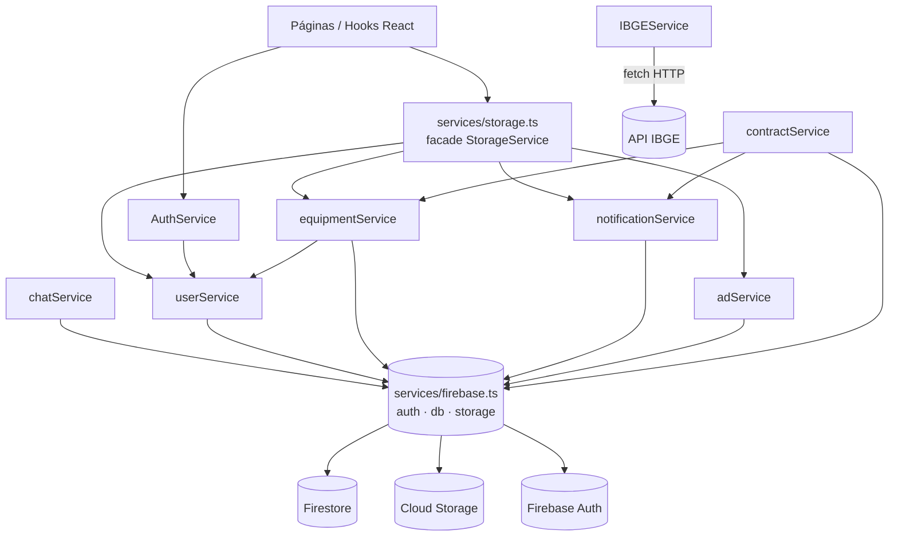

# Referência da camada de serviços

> Contrato de API dos módulos em `services/*`: a única ponte entre a UI (React) e o Firebase (Auth, Firestore, Storage) — não há backend próprio nem Cloud Functions.

Todos os serviços rodam **no cliente**. Cada função aqui documentada é uma chamada direta ao SDK do Firebase a partir do navegador. Isso tem consequências de segurança (validação de limites e escritas cruzadas acontecem no cliente; a defesa real fica nas Firestore Security Rules) — veja [../04-security.md](../04-security.md) e [../../FIREBASE_RULES.md](../../FIREBASE_RULES.md). Para o modelo de dados e as coleções citadas abaixo, veja [../03-data-model.md](../03-data-model.md).

## Visão geral dos módulos



| Módulo | Arquivo | Responsabilidade |
| --- | --- | --- |
| firebase | `services/firebase.ts` | Inicializa o app e exporta `auth`, `db`, `storage`. |
| AuthService | `services/auth.ts` | Sessão, login, registro, logout. |
| userService | `services/userService.ts` | Perfil, limites/freemium, referral, rede, reputação, stats. |
| equipmentService | `services/equipmentService.ts` | Inventário, verificação de serial, marketplace, transferência de posse. |
| contractService | `services/contractService.ts` | Contratos de aluguel/venda, pagamento, não-devolução. |
| notificationService | `services/notificationService.ts` | Notificações privadas ao destinatário. |
| chatService | `services/chatService.ts` | Conversas 1:1 e mensagens. |
| adService | `services/adService.ts` | Banners de anúncio e métricas. |
| IBGEService | `services/ibge.ts` | Estados e municípios (API pública do IBGE). |
| StorageService | `services/storage.ts` | Facade legado que reencaminha para os serviços de domínio. |

Convenções recorrentes no código:

- Quase todas as funções de escrita são `try/catch` que retornam `boolean` (`true` sucesso, `false` erro) ou `null`; erros vão para `console.error`, não são propagados.
- IDs novos usam `crypto.randomUUID()` (contratos, notificações) ou o `id` já presente no objeto de domínio.
- Antes de `setDoc`, objetos com campos `undefined` são "limpos" com `Object.fromEntries(... v !== undefined)` porque o Firestore rejeita o documento inteiro se houver `undefined` (ex.: `contractService.createContract`, `raisePublicAlert`, `notificationService.createNotification`).
- Upload de imagem passa por `processImageForWebP` + `resilientUpload` de [../reference/utils.md](../reference/utils.md) (`utils/imageProcessor.ts`); PDFs são enviados sem conversão.

---

## firebase (`services/firebase.ts`)

Ponto único de inicialização. Usa **firebase/compat** para App/Auth/Storage e o **SDK modular** para o Firestore (linhas 3-6). A inicialização é idempotente (checa `firebase.apps.length` antes de `initializeApp`, linha 19), evitando erro em hot-reload.

| Export | Tipo | Origem | Uso |
| --- | --- | --- | --- |
| `auth` | `firebase.auth.Auth` (compat) | `app.auth()` | Login/registro/sessão em `AuthService`. |
| `db` | `Firestore` (modular) | `getFirestore(app)` | Todas as operações de Firestore. |
| `storage` | `firebase.storage.Storage` (compat) | `app.storage()` | Uploads (`storage.ref(path)`). |

Config do projeto (linhas 9-16): `projectId: "cine-guard"`, `storageBucket: "cine-guard.firebasestorage.app"`. Não há emuladores configurados; o cliente fala com produção. As chaves são públicas por design (app cliente); a proteção real está nas Security Rules.

> A mistura compat + modular é intencional: `db` é modular (API `collection`/`doc`/`query`), enquanto `auth` e `storage` mantêm a API encadeada compat (`auth.signInWithEmailAndPassword`, `storage.ref(...).put(...)`).

---

## AuthService (`services/auth.ts`)

Objeto com quatro métodos. Toda leitura de perfil delega para `userService.getUserProfile` (que recalcula reputação).

| Função | Assinatura | Retorno |
| --- | --- | --- |
| `getSession` | `() => Promise<User \| null>` | Perfil do usuário logado, ou `null`. |
| `login` | `(email: string, password: string) => Promise<{ user: User \| null; error?: string }>` | Perfil + erro opcional. |
| `register` | `(email, password, name, location, referralCode?) => Promise<{ user: User \| null; error?: string }>` | Perfil recém-criado + erro opcional. |
| `logout` | `() => Promise<void>` | — |

**`getSession`** — Registra `auth.onAuthStateChanged` como listener de uma única leitura (chama `unsubscribe()` imediatamente após resolver, linhas 12-20). Se há usuário Firebase, busca `users/{uid}` via `userService.getUserProfile`; senão resolve `null`.

**`login`** — `auth.signInWithEmailAndPassword` e depois `getUserProfile(uid)`. Se o perfil Firestore não existir, retorna `{ user: null, error: 'Perfil não encontrado.' }`. Exceções viram `{ user: null, error: e.message }`.

**`register`** — Fluxo completo de cadastro:
1. `auth.createUserWithEmailAndPassword` (cria a credencial).
2. Gera `referralCode` determinístico-ish: `${primeiroNome-normalizado}-${sufixo aleatório base36}` (linhas 46-48).
3. Monta o objeto `User` com `avatarUrl` apontando para `ui-avatars.com`, `role: 'user'`, `reputationPoints: 0`, `usageStats` zerado. `referredBy` só é incluído se `referralCode` foi passado (evita `undefined` no Firestore, linha 62).
4. `userService.saveUser(newUser)` → `setDoc` em `users/{uid}`.
5. Se veio `referralCode`, chama `userService.processReferral(referralCode)` para creditar quem indicou.

**`logout`** — `auth.signOut()`.

> `register` **não** cria os dois lados atomicamente: se o `setDoc` do perfil falhar após a criação da credencial de Auth, sobra um usuário de Auth sem documento em `users`. Não há compensação/rollback.

---

## userService (`services/userService.ts`)

Módulo mais denso. Concentra freemium, referral, rede de confiança, reputação e agregações de impacto.

### Constantes exportadas

```ts
export const PREMIUM_REFERRALS = 5;          // Premium = indicar >= 5 amigos OU ser admin
export const FREE_LIMITS = {
  inventory: 5,       // itens no inventário
  serialChecks: 5,    // verificações de serial por mês
  contactReveals: 3,  // interesses/contatos enviados por mês
};
```

Consumidas por `isPremium` e `checkLimit`. São a fonte de verdade dos limites do plano gratuito. Detalhe de produto em [../features/referral-and-freemium.md](../features/referral-and-freemium.md).

### `calculateReputation` (interno, não exportado)

`(user: User, equipment: Equipment[]) => number`. Pontuação calculada **no cliente**, portanto **não autoritativa**. Regras (linhas 21-44):

| Critério | Pontos |
| --- | --- |
| Avatar próprio (não `ui-avatars`) | +50 |
| `contactPhone` preenchido | +50 |
| `role === 'admin'` | +500 |
| Cada item `SAFE` | +10, +5 (streak) |
| Cada item `SAFE` com `isForRent` | +20 |
| Cada item `SAFE` com `isForSale` | +15 |
| Valor total dos itens `SAFE` | +1 por R$1.000 |
| `checksCount` | ×2 |
| `reportsCount` | ×1 |
| `connections.length` | ×20 |

O valor é gravado em `user.reputationPoints` toda vez que o perfil é lido (`getUserProfile`, `getAllUsers`); nunca é persistido de forma independente. Ver [../features/reputation-and-rankings.md](../features/reputation-and-rankings.md).

### Perfil e escrita básica

| Função | Assinatura | Firestore | Observações |
| --- | --- | --- | --- |
| `getUserProfile` | `(userId) => Promise<User \| null>` | `getDoc users/{id}` + `getDocs(equipment where ownerId==id)` | Recalcula `reputationPoints` antes de retornar. Erros → `null`. |
| `saveUser` | `(user: User) => Promise<void>` | `setDoc users/{user.id}` | Sobrescreve o doc inteiro. |
| `updateUserProfile` | `(userId, updates: Partial<User>) => Promise<boolean>` | `updateDoc users/{id}` | Merge parcial. |

### Freemium e uso

| Função | Assinatura | Firestore / efeito |
| --- | --- | --- |
| `isPremium` | `(user: User) => boolean` | Puro: `referralCount >= PREMIUM_REFERRALS \|\| role === 'admin'`. |
| `checkLimit` | `(userId, type: 'inventory' \| 'check' \| 'contact') => Promise<boolean>` | Lê o perfil; premium retorna `true`. `inventory`: `getCountFromServer(equipment where ownerId==id)` vs `FREE_LIMITS.inventory`. `check`/`contact`: compara `usageStats` do mês corrente (`YYYY-MM`) com o limite; mês diferente → reseta (retorna `true`). |
| `incrementUsage` | `(userId, type: 'check' \| 'contact') => Promise<void>` | Lê perfil, monta `usageStats` com reset mensal, `updateDoc users/{id} { usageStats }`. |
| `incrementUserStat` | `(userId, stat: 'checksCount' \| 'reportsCount') => Promise<void>` | Se `checksCount`, também chama `incrementUsage(userId, 'check')`; depois `updateDoc { [stat]: increment(1) }`. |

O "mês corrente" é `new Date().toISOString().slice(0, 7)` (fuso UTC). `checkLimit` é apenas consultivo — não bloqueia por si; a página deve respeitar o retorno.

### Referral

| Função | Assinatura | Firestore |
| --- | --- | --- |
| `processReferral` | `(referralCode: string) => Promise<void>` | `getDocs(users where referralCode==code)`; no primeiro match, `updateDoc { referralCount: increment(1) }`. Silencioso se não achar. |

### Administração de usuários

| Função | Assinatura | Firestore | Efeito |
| --- | --- | --- | --- |
| `getAllUsers` | `() => Promise<User[]>` | `getDocs(users)` + `getDocs(equipment)` (coleções inteiras) | Para cada user calcula `reputationPoints` e `inventoryCount`. Custo O(N) de leituras. |
| `toggleUserBlock` | `(userId, currentStatus: boolean) => Promise<boolean>` | `updateDoc { isBlocked: !currentStatus }` | Bloqueio de acesso. |
| `deleteUser` | `(userId) => Promise<boolean>` | `getDocs(equipment where ownerId==id)` → `deleteDoc` de cada item, depois `deleteDoc users/{id}` | Apaga itens antes do perfil. Os `deleteDoc` do loop **não são aguardados** (`forEach(async ...)`), então a função pode retornar antes de tudo apagar. Não remove doc de Auth. |
| `toggleUserRole` | `(userId, newRole: 'admin' \| 'user') => Promise<boolean>` | `updateDoc { role: newRole }` | Promove/rebaixa admin. |
| `searchUsers` | `(queryStr, currentUserId) => Promise<User[]>` | Via `getAllUsers` | Ignora buscas com < 2 chars. Filtra por substring em `name`/`email` (case-insensitive), exclui o próprio usuário, `slice(0, 20)`. Busca client-side sobre toda a coleção. |

### Rede de confiança

| Função | Assinatura | Firestore | Efeito |
| --- | --- | --- | --- |
| `addConnection` | `(userAId, userBId) => Promise<boolean>` | `writeBatch`: `arrayUnion` em ambos os lados | **Atômico**: ou os dois ganham a conexão, ou nenhum. Retorna `false` se A==B. |
| `removeConnection` | `(userAId, userBId) => Promise<boolean>` | `writeBatch`: `arrayRemove` em ambos | Atômico bidirecional. |
| `getConnections` | `(userId) => Promise<User[]>` | `getUserProfile` + `getDoc` por id em `connections[]` | Retorna perfis existentes, exceto o próprio. |

Ver [../features/network-and-transfers.md](../features/network-and-transfers.md).

### Estatísticas e impacto

| Função | Assinatura | Firestore | Observações |
| --- | --- | --- | --- |
| `getUserDetailedStats` | `(userId) => Promise<DetailedStats>` | `getDocs` em `equipment`, `theft_history` e `notifications` (todos filtrados por usuário) | Agrega no cliente: totais, valor, roubados, recuperados (`theft_history`), ofertas de aluguel/venda (contagem de notificações `RENTAL_INTEREST`/`SALE_INTEREST`). |
| `getGlobalDetailedStats` | `() => Promise<DetailedStats>` | **Queries de agregação**: `getCountFromServer` (total, SAFE, STOLEN, isForRent, isForSale), `getAggregateFromServer` (`sum('value')` em equipment; `count()`+`sum('equipmentValue')` em theft_history), `getDoc stats/global` | Não baixa coleções inteiras. `rentalOffers`/`saleOffers` ficam **zerados** (dados privados não entram no global). `transactionsCount`/`transactedValue` vêm de `stats/global`. |
| `getCommunitySafetyData` | `() => Promise<{lat,lng,address,date,itemName}[]>` | `getDocs(equipment where status==STOLEN)` + `getDocs(theft_history)` | Alimenta o Mapa de Segurança. Itens roubados ativos usam `theftLocation`; histórico usa `theftLat/theftLng`. |
| `getStats` | `(userId) => Promise<{total,value,stolen,forRent,forSale}>` | `getDocs(equipment where ownerId==id)` | Resumo simples do inventário do usuário (agregado no cliente). |

`stats/global` é escrito por `contractService.acceptContract` (ver abaixo). Modelo em [../03-data-model.md](../03-data-model.md).

### Upload

| Função | Assinatura | Storage | Pipeline |
| --- | --- | --- | --- |
| `uploadUserAvatar` | `(file: File, userId) => Promise<string \| null>` | `users/{userId}/avatar/{timestamp}.webp` | `processImageForWebP` → `resilientUpload`. |
| `cropImage` | `= cropImageHelper` | — | Re-export de `utils/imageProcessor.ts` (crop de avatar, react-easy-crop). |

---

## equipmentService (`services/equipmentService.ts`)

Inventário, verificação de serial, marketplace paginado e transferência de posse. Coleção principal: `equipment`.

### Inventário e serial

| Função | Assinatura | Firestore | Efeitos / denormalização |
| --- | --- | --- | --- |
| `getUserEquipment` | `(userId) => Promise<Equipment[]>` | `getDocs(equipment where ownerId==id)` | — |
| `addEquipment` | `(item: Equipment) => Promise<void>` | `getUserProfile(ownerId)` + `setDoc equipment/{item.id}` | Normaliza `serialNumber` (`trim().toUpperCase()`). Denormaliza `ownerProfile {name, avatarUrl, location}`. **Nunca** grava telefone (vitrine pública). |
| `updateEquipment` | `(updatedItem: Equipment) => Promise<void>` | `updateDoc equipment/{id}` (e `getUserProfile` se faltar `ownerProfile`) | Mantém o serial normalizado; refaz `ownerProfile` só se ausente. |
| `recoverEquipment` | `(item: Equipment, recoveredViaApp = false) => Promise<boolean>` | `setDoc` novo doc em `theft_history` + `updateDoc equipment/{id}` | Cria registro **imutável** de recuperação (grava `theftLat/theftLng/theftAddress/equipmentValue/recoveryDate/recoveredViaApp`) e devolve o item a `SAFE`, limpando `theftDate/theftLocation/theftAddress`. |
| `deleteEquipment` | `(id) => Promise<boolean>` | `deleteDoc equipment/{id}` | — |
| `checkSerial` | `(serial) => Promise<Equipment \| undefined>` | `getDocs(equipment where serialNumber==valor)` | Tenta o valor normalizado (uppercase) e, se diferir, também o cru — cobre docs legados não normalizados. Reidrata `ownerProfile` se ausente. |

### Marketplace

| Função | Assinatura | Firestore | Notas |
| --- | --- | --- | --- |
| `_getMarketplaceItems` (interno) | `(filterField, lastDoc, limitCount, filters) => Promise<{ data, lastDoc, hasMore }>` | `query(equipment where filterField==true, where status==SAFE, orderBy('id'), [startAfter], limit(limitCount+1))` | Base compartilhada. Busca `limit+1` para deduzir `hasMore` sem query extra. Filtro de `category` é server-side; `uf`/`city` é **soft** (substring em `ownerProfile.location`, só sobre a página) — pode retornar página com menos itens que `limit`. |
| `getRentalsPaginated` | `(lastDoc, limit, filters: MarketplaceFilters)` | via `_getMarketplaceItems('isForRent', ...)` | Vitrine de aluguel. |
| `getSalesPaginated` | `(lastDoc, limit, filters)` | via `_getMarketplaceItems('isForSale', ...)` | Vitrine de venda. |
| `searchMarketplace` | `(filterField: 'isForRent' \| 'isForSale', queryText, filters = {}) => Promise<Equipment[]>` | `query(... orderBy('id'), limit(120))` | Busca textual por substring (case-insensitive) em `name`/`brand`/`model`; aplica `category`/`uf`/`city` no cliente. **Limitação**: cobre só os primeiros ~120 itens do filtro. |

> A ordenação/paginação usa `orderBy('id')` porque `Equipment` não tem `createdAt`. É uma decisão consciente registrada em comentário no próprio serviço (linhas 122-127): para catálogo grande, migrar para `createdAt` e/ou full-text externo (Algolia/Typesense). Ver [../features/marketplace.md](../features/marketplace.md).

### Upload

| Função | Assinatura | Storage | Notas |
| --- | --- | --- | --- |
| `uploadEquipmentImage` | `(file: File, ownerId) => Promise<string \| null>` | `users/{ownerId}/equipment/{ts}.webp` | Leitura pública (vitrine). |
| `uploadInvoiceImage` | `(file: File, ownerId, equipmentId) => Promise<string \| null>` | `users/{ownerId}/invoices/{equipmentId}_{ts}.{webp\|pdf}` | PDF passa direto (pipeline WebP quebraria); imagem vira WebP. Leitura só autenticada. |

### Transferência de posse

| Função | Assinatura | Firestore | Efeitos |
| --- | --- | --- | --- |
| `transferEquipmentOwnership` | `(itemId, newOwnerId, transactionValue?) => Promise<boolean>` | `getDoc equipment/{id}` + `getUserProfile(newOwnerId)` + `writeBatch` | **Batch**: atualiza o item (`ownerId`, `status: SAFE`, limpa `pendingTransferTo`, zera `isForRent`/`isForSale`, refaz `ownerProfile`); se `transactionValue > 0`, grava `value` e incrementa `transactionHistory.{parceiro}` nos **dois** usuários (`increment(value)`). |
| `cancelTransfer` | `(equipmentId) => Promise<boolean>` | `updateDoc equipment/{id} { status: SAFE, pendingTransferTo: null }` | Devolve o item ao marketplace. Não limpa notificações (regra de segurança só permite consulta por `toUserId`). |

O item chega ao novo dono **fora** do marketplace (`isForRent`/`isForSale` = false): ele decide se re-anuncia.

---

## contractService (`services/contractService.ts`)

Ciclo de vida de contratos (`rental`/`sale`), pagamento e fluxo de não-devolução. Coleções: `contracts`, `return_alerts`, `stats/global`. Depende de `equipmentService` e `notificationService`.

`CreateContractInput` (linhas 11-20): `{ type, owner: User, counterparty: {id,name,avatarUrl}, equipment: Equipment, value, pickupDate?, returnDate?, chatId? }`.

```mermaid
sequenceDiagram
  participant Dono
  participant CS as contractService
  participant Comprador
  Dono->>CS: createContract(sale) -> item vira TRANSFER_PENDING
  Comprador->>CS: acceptContract -> transferEquipmentOwnership + status=completed
  CS->>CS: stats/global increment(transactions, sales, transactedValue)
  Note over Dono,Comprador: Aluguel: accept -> active; devolução -> completeRental (completed)
  Dono->>CS: sendOverdueNotice -> RENTAL_OVERDUE + overdueNoticeAt
  Dono->>CS: raisePublicAlert -> return_alerts(active) + publicAlert
```

| Função | Assinatura | Firestore | Efeitos-chave |
| --- | --- | --- | --- |
| `createContract` | `(input: CreateContractInput) => Promise<string \| null>` | `setDoc contracts/{uuid}` (status `proposed`); se `sale`, `equipmentService.updateEquipment(... TRANSFER_PENDING, pendingTransferTo)` | Limpa `undefined` antes de gravar. Retorna o id. Venda já tira o item do marketplace (status != SAFE). |
| `subscribeUserContracts` | `(userId, cb) => unsubscribe` | `onSnapshot(contracts where parties array-contains userId)` | Tempo real; ordena por `createdAt` desc no cliente. Erro → `cb([])`. |
| `acceptContract` | `(contract: Contract) => Promise<boolean>` | `sale`: `transferEquipmentOwnership` + `updateDoc status: completed`. `rental`: `updateDoc status: active`. Depois `setDoc stats/global {..} {merge:true}` | **Incrementa impacto global**: `transactions +1`, `rentals`/`sales +1` conforme tipo, `transactedValue += value`. A escrita em `stats/global` é best-effort (`.catch(()=>{})`). |
| `getAllContracts` | `() => Promise<Contract[]>` | `getDocs(contracts)` | Uso admin (histórico). Ordena por `createdAt` desc. |
| `closeContract` | `(contract, status: 'declined' \| 'cancelled') => Promise<boolean>` | Se `sale`, `equipmentService.cancelTransfer(equipmentId)`; depois `updateDoc contracts/{id} { status }` | Recusa (counterparty) ou cancelamento (dono). Venda devolve item ao marketplace. |
| `completeRental` | `(contract) => Promise<boolean>` | `updateDoc status: completed`; se `contract.publicAlert`, `updateDoc return_alerts/{id} { status: 'resolved', resolvedAt }` | Chamado pelo dono ao receber o item; resolve alerta público, se existir. |
| `sendOverdueNotice` | `(contract, owner: User) => Promise<boolean>` | `notificationService.createNotification(RENTAL_OVERDUE)` + `updateDoc contracts/{id} { overdueNoticeAt }` | **Etapa 1** da não-devolução: avisa o locatário e inicia o prazo. |
| `raisePublicAlert` | `(contract, owner: User) => Promise<boolean>` | `setDoc return_alerts/{contractId}` (id = contractId) + `updateDoc contracts/{id} { publicAlert: true, publicAlertAt }` + `createNotification(RENTAL_OVERDUE)` | **Etapa 2**: escala para alerta **público** (comunidade + perfil do locatário). |
| `subscribeCommunityAlerts` | `(cb) => unsubscribe` | `onSnapshot(return_alerts where status==active)` | Feed público; ordena por `raisedAt` desc. |
| `attachPaymentProof` | `(contract, file: File, uploaderId) => Promise<boolean>` | `resilientUpload` em `contracts/{id}/payment_{ts}.{webp\|pdf}` + `updateDoc { paymentProofUrl, paymentStatus: 'submitted', paymentSubmittedBy, paymentAt }` | Quem paga anexa (antes ou depois). PDF passa direto. |
| `confirmPayment` | `(contractId) => Promise<boolean>` | `updateDoc contracts/{id} { paymentStatus: 'confirmed' }` | Quem recebe confirma. |

O `return_alerts/{id}` usa o **mesmo id** do contrato (determinístico), o que permite a regra de segurança validar o alerta contra o contrato real ("grounded"). Detalhes em [../features/contracts-and-payments.md](../features/contracts-and-payments.md).

---

## notificationService (`services/notificationService.ts`)

Notificações privadas ao destinatário (`toUserId`). Coleção: `notifications`. Tipos em `NotificationType` (ver [../03-data-model.md](../03-data-model.md)).

| Função | Assinatura | Firestore | Efeitos |
| --- | --- | --- | --- |
| `subscribeUserNotifications` | `(userId, callback) => unsubscribe` | `onSnapshot(notifications where toUserId==userId)` | Tempo real. **Faxina**: notificações com `expiresAt <= agora` são apagadas (`deleteDoc`) durante o callback; as ativas são ordenadas por `createdAt` desc e entregues. Erro → `callback([])`. |
| `createNotification` | `(notification: Notification) => Promise<boolean>` | `setDoc notifications/{id}` + (às vezes) `updateDoc users/{toUserId}` | Remove `undefined` (ex.: `fromUserPhone`). Incrementa `notificationStats.{rentalInterest\|saleInterest\|stolenAlerts}` no destinatário conforme o `type` (`RENTAL_INTEREST`/`SALE_INTEREST`/`STOLEN_FOUND`); outros tipos não incrementam. |
| `getUserNotifications` | `(userId) => Promise<Notification[]>` | `getDocs(notifications where toUserId==userId)` | Filtra expiradas no cliente (não apaga aqui) e ordena por `createdAt` desc. |
| `markNotificationAsRead` | `(notificationId) => Promise<boolean>` | `updateDoc { read: true }` | — |
| `deleteNotification` | `(notificationId) => Promise<boolean>` | `deleteDoc notifications/{id}` | — |
| `scheduleNotificationExpiry` | `(notificationId) => Promise<boolean>` | `updateDoc { read: true, expiresAt }` | Marca lida e agenda auto-exclusão em **+24h** (ISO). A exclusão efetiva ocorre depois, na faxina do `subscribe`. |

`notificationStats` é um contador vitalício (persiste mesmo após a notificação ser apagada). Ver [../features/notifications.md](../features/notifications.md).

---

## chatService (`services/chatService.ts`)

Conversas 1:1 com id **determinístico** e mensagens em subcoleção. Coleções: `chats` e `chats/{id}/messages`.

Interfaces exportadas: `ChatParticipant {name, avatarUrl}`, `ChatSummary {id, participants[], participantInfo{uid:ChatParticipant}, lastMessage, lastMessageAt, lastSenderId}`, `ChatMessage {id, senderId, text, createdAt}`.

| Função | Assinatura | Firestore | Notas |
| --- | --- | --- | --- |
| `chatIdFor` | `(a: string, b: string) => string` | — | `[a,b].sort().join('__')`. Determinístico: mesma dupla → mesmo id, em qualquer ordem. |
| `openChat` | `(me: User, other: {id,name,avatarUrl}) => Promise<string>` | `getDoc chats/{id}`; se não existe, `setDoc` com `participants` + `participantInfo` | **Idempotente**: garante a conversa e devolve o id. |
| `sendMessage` | `(chatId, senderId, text) => Promise<boolean>` | `addDoc chats/{id}/messages` + `updateDoc chats/{id} { lastMessage, lastMessageAt, lastSenderId }` | Ignora texto vazio (`trim`). Atualiza o resumo do chat. |
| `subscribeMessages` | `(chatId, cb) => unsubscribe` | `onSnapshot(messages orderBy createdAt asc)` | Tempo real, ordem cronológica (server-side). |
| `subscribeUserChats` | `(userId, cb) => unsubscribe` | `onSnapshot(chats where participants array-contains userId)` | Ordena por `lastMessageAt` desc **no cliente** (evita índice composto). |

Ver [../features/chat.md](../features/chat.md).

---

## adService (`services/adService.ts`)

Banners de marketing com seleção aleatória ponderada. Coleção: `ads`.

| Função | Assinatura | Firestore | Notas |
| --- | --- | --- | --- |
| `createAd` | `(ad: Ad) => Promise<boolean>` | `setDoc ads/{ad.id}` | — |
| `updateAd` | `(ad: Ad) => Promise<boolean>` | `updateDoc ads/{ad.id} { ...ad }` | — |
| `deleteAd` | `(id) => Promise<boolean>` | `deleteDoc ads/{id}` | — |
| `getAllAds` | `() => Promise<Ad[]>` | `getDocs(ads orderBy startDate desc)` | Uso admin. |
| `getActiveAd` | `() => Promise<Ad \| null>` | `getDocs(ads where active==true)` | Filtra por janela de datas (`startDate <= hoje <= endDate`, comparação de string ISO `YYYY-MM-DD`) e faz **seleção aleatória ponderada** por `weight` (default 1). `null` se nenhum válido. |
| `trackAdImpression` | `(id) => Promise<void>` | `updateDoc { impressions: increment(1) }` | Erro só logado. |
| `trackAdClick` | `(id) => Promise<void>` | `updateDoc { clicks: increment(1) }` | Erro só logado. |
| `uploadAdImage` | `(file: File) => Promise<string \| null>` | Storage `ads/{ts}.webp` | `processImageForWebP` → `resilientUpload`. Leitura pública, escrita admin. |

Algoritmo de ponderação (linhas 47-54): soma os `weight`, sorteia `random ∈ [0, totalWeight)`, subtrai `weight` de cada anúncio até `random <= 0`. Ver [../features/advertising.md](../features/advertising.md).

---

## IBGEService (`services/ibge.ts`)

Único serviço que **não** fala com o Firebase: consome a API pública de localidades do IBGE via `fetch`. Usado nos seletores de UF/cidade (registro, filtros de marketplace).

Tipos internos: `UF {id, sigla, nome}`, `City {id, nome}`.

| Função | Assinatura | Endpoint | Notas |
| --- | --- | --- | --- |
| `getUFs` | `() => Promise<UF[]>` | `GET .../localidades/estados?orderBy=nome` | Estados ordenados por nome. Erro/falha → `[]`. |
| `getCitiesByUF` | `(ufSigla: string) => Promise<City[]>` | `GET .../localidades/estados/{ufSigla}/municipios` | Retorna `[]` se `ufSigla` vazio ou em erro. |

Base: `https://servicodados.ibge.gov.br/api/v1`. Sem cache local — cada chamada é uma requisição HTTP.

---

## StorageService — facade (`services/storage.ts`)

Objeto legado mantido por **compatibilidade retroativa**. Reexporta os serviços de domínio (`export { adService, equipmentService, notificationService, userService }`) e expõe `StorageService`, que **reencaminha** métodos para eles. Novo código deve usar os serviços diretamente; `StorageService` existe para páginas antigas.

A maioria das entradas é reencaminhamento 1:1 (ex.: `StorageService.getUserProfile = userService.getUserProfile`). As exceções — pequenos adaptadores definidos no próprio facade — são:

| Método do facade | Comportamento | Delegação |
| --- | --- | --- |
| `getCurrentUser` | Retorna um `User` **placeholder** `{ id: 'guest', ... }`. Comentário indica que a sessão real deve vir do `AuthContext`/`userService`. | Nenhuma (stub). |
| `findUserByEmail` | Chama `userService.searchUsers(email, '')` e retorna o match exato por email (case-insensitive) ou `null`. | `searchUsers`. |
| `getGlobalStats` | Adapta `getGlobalDetailedStats` para `{ users: 0, equipment, stolen, value }` (`users` fica zerado). | `userService.getGlobalDetailedStats`. |
| `getRentals` | Busca a 1ª página (`limit 100`, sem filtros) e retorna só `.data`. | `equipmentService.getRentalsPaginated`. |

Demais métodos são aliases diretos, agrupados por domínio no arquivo: **User** (perfil, limites, referral, rede, stats, avatar), **Equipment** (inventário, serial, marketplace, transferência), **Notification** e **Ads**. O facade **não** cobre `contractService`, `chatService` nem `IBGEService` — esses são sempre importados diretamente.

> `StorageService.getCurrentUser` nunca retorna o usuário real; qualquer chamada a ele devolve o guest placeholder. A sessão verdadeira vem de `AuthService.getSession` / `AuthContext`.

---

## Notas de segurança e limitações (reais)

- **Validação no cliente**: limites (`checkLimit`), premium (`isPremium`) e escritas cruzadas (transferência, conexões, stats) são calculados/decididos no navegador. As Firestore Rules fazem defesa por-campo (anti-escalonamento de privilégio), mas mover a lógica sensível para Cloud Functions está registrado como pendente em [../../FIREBASE_RULES.md](../../FIREBASE_RULES.md).
- **Busca textual limitada**: `equipmentService.searchMarketplace` cobre só ~120 itens; `userService.searchUsers` baixa a coleção `users` inteira e filtra no cliente.
- **Paginação por `orderBy('id')`**: `Equipment` não tem `createdAt`; a ordem do marketplace é por id (não cronológica).
- **`reputationPoints` não autoritativo**: recalculado no cliente a cada leitura de perfil; não é fonte de verdade.
- **`deleteUser`** não aguarda a exclusão dos itens (loop `forEach(async)`) e não remove o usuário do Firebase Auth.
- **`register`** não é transacional entre Auth e Firestore.

## Fontes no código

- `services/firebase.ts`
- `services/auth.ts`
- `services/userService.ts`
- `services/equipmentService.ts`
- `services/contractService.ts`
- `services/notificationService.ts`
- `services/chatService.ts`
- `services/adService.ts`
- `services/storage.ts`
- `services/ibge.ts`
- `types.ts` (interfaces `User`, `Equipment`, `Contract`, `ReturnAlert`, `Notification`, `Ad`, `DetailedStats`, `MarketplaceFilters`, `UsageStats`, `NotificationStats`)
- `utils/imageProcessor.ts` (`processImageForWebP`, `resilientUpload`, `cropImageHelper`)
