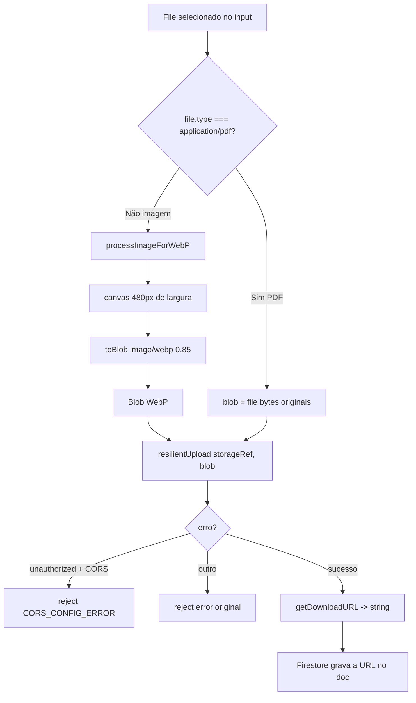
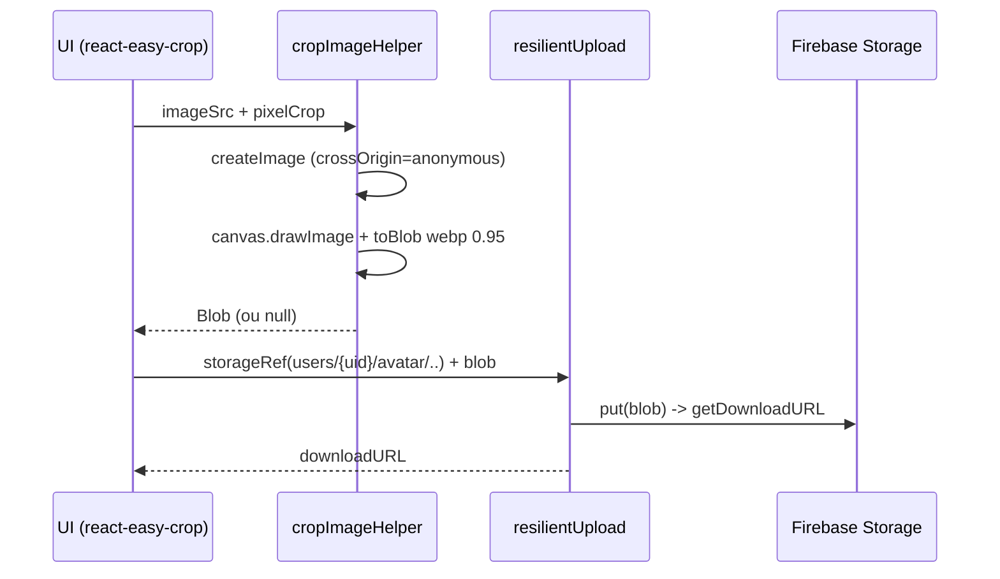

# Referência: Utilitários (`utils/`)

> Funções puras de formatação (pt-BR/BRL) e o pipeline de imagem (canvas → WebP) com upload resiliente ao Firebase Storage.

O diretório `utils/` reúne helpers sem estado e sem dependência do React: `utils/formatters.ts` (formatação de valores, datas e texto) e `utils/imageProcessor.ts` (processamento de imagem em canvas, upload resiliente e recorte de avatar). Toda a lógica descrita aqui foi lida diretamente do código-fonte; onde o comportamento tem arestas (timezone, acrônimos, PDF), o texto registra a limitação real.

---

## 1. `utils/formatters.ts`

Quatro funções puras. Todas usam a API nativa `Intl` via `Number.prototype.toLocaleString` / `Date.prototype.toLocaleDateString` com locale fixo `'pt-BR'` — não há biblioteca de i18n nem configuração externa.

| Função | Assinatura | Retorno |
| --- | --- | --- |
| `formatCurrency` | `(value: number) => string` | Moeda BRL, 2 casas |
| `formatCompactCurrency` | `(value: number) => string` | Moeda BRL compacta (mil/mi/bi), 1 casa |
| `formatDate` | `(dateString: string) => string` | Data `dd/mm/aaaa` (ou `''` se vazio) |
| `toTitleCase` | `(str: string) => string` | Texto com iniciais maiúsculas por token |

### `formatCurrency(value)`

```ts
export const formatCurrency = (value: number): string =>
  value.toLocaleString('pt-BR', {
    style: 'currency',
    currency: 'BRL',
    maximumFractionDigits: 2,
  });
```

Formata como Real brasileiro com até 2 casas decimais. Sem `minimumFractionDigits`, então o padrão do locale BRL (2 casas) prevalece.

| Entrada | Saída |
| --- | --- |
| `1500` | `R$ 1.500,00` |
| `1234.5` | `R$ 1.234,50` |
| `0` | `R$ 0,00` |
| `-49.9` | `-R$ 49,90` |

> Nota: o separador após `R$` é um espaço não separável (U+00A0), não um espaço comum — relevante ao comparar strings ou escrever testes/snapshots.

### `formatCompactCurrency(value)`

```ts
export const formatCompactCurrency = (value: number): string =>
  value.toLocaleString('pt-BR', {
    style: 'currency',
    currency: 'BRL',
    notation: 'compact',
    maximumFractionDigits: 1,
  });
```

Notação compacta (`notation: 'compact'`) com no máximo 1 casa decimal, pensada para painéis de impacto/valores agregados onde o espaço é curto. Os sufixos vêm do locale pt-BR: `mil`, `mi`, `bi`. ⚠️ Hoje o módulo `utils/formatters.ts` **não é importado** por nenhuma tela (elas formatam BRL inline com `toLocaleString`); estas funções ficam disponíveis como utilitário, mas não estão em uso — ver *Estado de uso* abaixo.

| Entrada | Saída |
| --- | --- |
| `1500` | `R$ 1,5 mil` |
| `12000` | `R$ 12,0 mil` |
| `2500000` | `R$ 2,5 mi` |
| `1000000000` | `R$ 1,0 bi` |
| `990` | `R$ 990,0` |

### `formatDate(dateString)`

```ts
export const formatDate = (dateString: string): string => {
  if (!dateString) return '';
  return new Date(dateString).toLocaleDateString('pt-BR');
};
```

Recebe uma string de data, constrói um `Date` e formata como `dd/mm/aaaa`. Guarda-clausula: string vazia (`''`, `undefined`/`null` coeridos) retorna `''` — evita renderizar `Invalid Date` em campos opcionais.

| Entrada | Saída |
| --- | --- |
| `'2026-07-08T13:45:00.000Z'` (timestamp completo) | `08/07/2026` (conforme fuso do cliente) |
| `''` | `''` |
| `'texto inválido'` | `Invalid Date` |

> Limitação (timezone): para strings **somente-data** no formato ISO (`'2026-07-08'`), `new Date()` interpreta como meia-noite **UTC**. Em fusos negativos como `America/Sao_Paulo` (UTC−3) o horário local recai no dia anterior, produzindo `07/07/2026`. Na prática o CINESAFE grava datas como `new Date().toISOString()` (timestamp completo com hora), então esse off-by-one não aparece nesses campos; ele só ocorreria se um valor date-only puro fosse passado. Valores não parseáveis retornam a string `Invalid Date` (a guarda só cobre o caso falsy).

### `toTitleCase(str)`

```ts
export const toTitleCase = (str: string): string =>
  str.replace(/\w\S*/g, (text) =>
    text.charAt(0).toUpperCase() + text.substring(1).toLowerCase()
  );
```

Capitaliza a primeira letra de cada token e força o restante a minúsculas. O regex `/\w\S*/g` casa "um caractere de palavra seguido de zero ou mais não-espaços" — ou seja, tokens delimitados por espaço em branco.

| Entrada | Saída |
| --- | --- |
| `'sony alpha'` | `Sony Alpha` |
| `'CANON EOS R5'` | `Canon Eos R5` |
| `'canon-eos'` | `Canon-eos` |

> Limitações reais: (1) acrônimos são achatados — `EOS` vira `Eos`; (2) pontuação interna **não** inicia novo token — `canon-eos` vira `Canon-eos` (apenas a primeira letra do token todo é maiúscula), porque `-` conta como `\S`. É um normalizador de nomes de marca "bom o suficiente", não um title-case tipográfico completo.

### Estado de uso no código (honestidade técnica)

Os quatro helpers estão **exportados mas não importados** em nenhum módulo do repositório atual. Em particular, a lógica de `toTitleCase` é **reimplementada inline** dentro de [`hooks/useInventory.ts`](../../hooks/useInventory.ts) (por volta da linha 228), exposta pelo hook e consumida em [`pages/Inventory.tsx`](../../pages/Inventory.tsx) no `onBlur` do campo "Marca". Ou seja, `utils/formatters.ts` funciona como biblioteca de referência canônica, porém há duplicação de código a ser consolidada. Ao adicionar formatação nova, prefira importar deste módulo em vez de recriar a função.

---

## 2. `utils/imageProcessor.ts`

Três funções exportadas mais um helper interno. Rodam **inteiramente no cliente** (dependem de `document`, `canvas`, `Image` e `URL.createObjectURL` do browser) — não há processamento server-side (o CINESAFE não tem backend próprio nem Cloud Functions). Todas as três exportadas são usadas de fato pelos services (ver "Fontes no código").

| Função | Assinatura | Papel |
| --- | --- | --- |
| `processImageForWebP` | `(file: File) => Promise<Blob>` | Redimensiona para 480px de largura e recodifica em WebP @0.85 |
| `resilientUpload` | `(storageRef: any, blob: Blob) => Promise<string>` | Envolve o `uploadTask` do Storage numa Promise e detecta erro de CORS |
| `cropImageHelper` | `(imageSrc: string, pixelCrop: {x,y,width,height}) => Promise<Blob \| null>` | Recorta uma região e recodifica em WebP @0.95 (avatar) |
| `createImage` *(interno)* | `(url: string) => Promise<HTMLImageElement>` | Carrega imagem com `crossOrigin='anonymous'` |

### `processImageForWebP(file)`

```ts
export const processImageForWebP = async (file: File): Promise<Blob> => {
  return new Promise((resolve, reject) => {
    const img = new Image();
    img.src = URL.createObjectURL(file);
    img.onload = () => {
      const canvas = document.createElement('canvas');
      const targetWidth = 480;                       // otimizado p/ mobile/web
      const scaleFactor = targetWidth / img.width;
      canvas.width = targetWidth;
      canvas.height = img.height * scaleFactor;

      const ctx = canvas.getContext('2d');
      if (!ctx) return reject('Canvas context not available');

      ctx.drawImage(img, 0, 0, canvas.width, canvas.height);
      canvas.toBlob((blob) => {
        if (blob) resolve(blob);
        else reject('Image processing failed');
      }, 'image/webp', 0.85);                        // WebP 85%
    };
    img.onerror = reject;
  });
};
```

Pipeline:

1. Cria um `Image` a partir de um object URL do `File`.
2. No `onload`, monta um `<canvas>` com **largura fixa de 480px** e altura proporcional (`scaleFactor = 480 / img.width`), preservando o aspect ratio.
3. Desenha a imagem redimensionada no canvas.
4. Exporta via `canvas.toBlob(..., 'image/webp', 0.85)` — **WebP a 85% de qualidade**.

Rejeições possíveis: `'Canvas context not available'` (sem contexto 2D), `'Image processing failed'` (`toBlob` retornou `null`), ou o evento de `img.onerror` (arquivo não é imagem decodificável).

> Notas reais: (1) o redimensionamento é sempre **para 480px** — imagens menores que isso são **ampliadas** (upscaled), pois não há `Math.min`. (2) O object URL criado em `URL.createObjectURL(file)` **não é revogado** (`revokeObjectURL`), um vazamento menor de memória por chamada. (3) A função assume entrada de imagem; PDFs não passam por aqui (ver "Tratamento de PDF").

### `resilientUpload(storageRef, blob)`

```ts
export const resilientUpload = async (storageRef: any, blob: Blob): Promise<string> => {
  return new Promise((resolve, reject) => {
    const uploadTask = storageRef.put(blob);
    uploadTask.on(
      'state_changed',
      null,                                    // listener de progresso (futuro)
      (error: any) => {
        if (error.code === 'storage/unauthorized' && error.message.includes('CORS')) {
          reject(new Error('CORS_CONFIG_ERROR'));
        } else {
          reject(error);
        }
      },
      async () => {
        try {
          const downloadURL = await uploadTask.snapshot.ref.getDownloadURL();
          resolve(downloadURL);
        } catch (e) { reject(e); }
      }
    );
  });
};
```

Envolve o `uploadTask` do Firebase Storage (API `firebase/compat`, por isso `storageRef.put(...)` e `uploadTask.on('state_changed', ...)`) numa `Promise<string>` que resolve com a **download URL** final.

Argumentos do `.on('state_changed', ...)`:

- **progresso**: `null` — não há listener de progresso (comentário no código indica que pode ser adicionado depois).
- **erro**: traduz `error.code === 'storage/unauthorized'` **com** `error.message` contendo `'CORS'` num erro tipado `new Error('CORS_CONFIG_ERROR')`; qualquer outro erro é repassado como veio.
- **conclusão**: obtém `uploadTask.snapshot.ref.getDownloadURL()` e resolve; falha ao obter a URL rejeita a Promise.

O sentinela `CORS_CONFIG_ERROR` permite que a UI diferencie "bucket sem configuração de CORS" (problema de infra/deploy) de outras falhas de upload e exiba orientação específica. `storageRef` é tipado como `any` porque vem do SDK compat.

> Observação: os call-sites (services) tratam a `Promise<string>` como `Promise<string | null>` nas assinaturas públicas (`uploadEquipmentImage`, etc.), mas `resilientUpload` só **resolve** com string ou **rejeita** — nunca resolve `null`.

### `cropImageHelper(imageSrc, pixelCrop)` + `createImage`

```ts
const createImage = (url: string): Promise<HTMLImageElement> =>
  new Promise((resolve, reject) => {
    const image = new Image();
    image.addEventListener('load', () => resolve(image));
    image.addEventListener('error', (error) => reject(error));
    image.setAttribute('crossOrigin', 'anonymous');   // evita "tainted canvas"
    image.src = url;
  });

export const cropImageHelper = async (
  imageSrc: string,
  pixelCrop: { x: number, y: number, width: number, height: number }
): Promise<Blob | null> => {
  try {
    const image = await createImage(imageSrc);
    const canvas = document.createElement('canvas');
    const ctx = canvas.getContext('2d');
    if (!ctx) return null;
    canvas.width = pixelCrop.width;
    canvas.height = pixelCrop.height;
    ctx.drawImage(image, pixelCrop.x, pixelCrop.y, pixelCrop.width, pixelCrop.height,
                         0, 0, pixelCrop.width, pixelCrop.height);
    return new Promise((resolve) => {
      canvas.toBlob((blob) => resolve(blob), 'image/webp', 0.95);
    });
  } catch (e) {
    console.error('Error cropping image:', e);
    return null;
  }
};
```

Recorta a região `pixelCrop` (em pixels) da imagem e recodifica em **WebP a 95% de qualidade** (`0.95`, mais alta que o pipeline geral porque o avatar é pequeno e a nitidez importa). Usado no fluxo de avatar com `react-easy-crop`, que fornece o `pixelCrop`.

Detalhes:

- `createImage` define `crossOrigin='anonymous'` **antes** de atribuir `src` — necessário para que uma imagem já hospedada no Storage possa ser desenhada no canvas sem "tainting" (que bloquearia `toBlob`).
- Falhas retornam `null` (não lançam): sem contexto 2D → `null`; erro de carga/decodificação → `catch` loga e retorna `null`. O chamador deve tratar `null`.
- Diferente de `processImageForWebP`, aqui as dimensões do canvas são exatamente as do recorte (sem largura fixa de 480px).

Reexportação: `cropImageHelper` é exposto como `userService.cropImage` em [`services/userService.ts`](../../services/userService.ts) (linha ~313) e reencaminhado por [`services/storage.ts`](../../services/storage.ts) como `storage.cropImage`.

---

## 3. Pipeline de imagem (visão de ponta a ponta)



Fluxo do avatar (recorte) é uma variante:



Parâmetros por caso de uso (todos confirmados nos services):

| Caso de uso | Origem | Processamento | Qualidade | Path no Storage |
| --- | --- | --- | --- | --- |
| Imagem de equipamento | `equipmentService.uploadEquipmentImage` | `processImageForWebP` | WebP 0.85 | `users/{uid}/equipment/{ts}.webp` |
| Avatar | `userService` (`processImageForWebP` no upload; `cropImageHelper` no recorte) | canvas 480px / recorte | 0.85 / 0.95 | `users/{uid}/avatar/**` |
| Banner de anúncio | `adService` | `processImageForWebP` | WebP 0.85 | `ads/**` |
| Nota fiscal (imagem) | `equipmentService.uploadInvoiceImage` | `processImageForWebP` | WebP 0.85 | `users/{uid}/invoices/{equipmentId}_{ts}.webp` |
| Comprovante de pagamento (imagem) | `contractService.attachPaymentProof` | `processImageForWebP` | WebP 0.85 | `contracts/{id}/payment_{ts}.webp` |

## 4. Tratamento de PDF (feito nos services, não em `imageProcessor`)

`utils/imageProcessor.ts` **não** conhece PDF — `processImageForWebP` quebraria com um PDF (não é imagem decodificável por ``). O desvio é responsabilidade dos **services**, que checam o MIME type antes de chamar o pipeline. Dois pontos fazem isso, com o mesmo padrão:

`services/equipmentService.ts` — `uploadInvoiceImage` (linhas ~223-231):

```ts
// PDFs vão direto (o pipeline WebP só lida com imagem e quebraria com PDF).
const isPdf = file.type === 'application/pdf';
const blob: Blob = isPdf ? file : await processImageForWebP(file);
const ext = isPdf ? 'pdf' : 'webp';
const fileName = `users/${ownerId}/invoices/${equipmentId}_${Date.now()}.${ext}`;
return resilientUpload(storage.ref(fileName), blob);
```

`services/contractService.ts` — `attachPaymentProof` (linhas ~220-224):

```ts
const isPdf = file.type === 'application/pdf';
const blob: Blob = isPdf ? file : await processImageForWebP(file);
const ext = isPdf ? 'pdf' : 'webp';
const path = `contracts/${contract.id}/payment_${Date.now()}.${ext}`;
const url = await resilientUpload(storage.ref(path), blob);
```

Regra: se `file.type === 'application/pdf'`, o **arquivo original** (`file`, que já é um `Blob`) sobe intacto com extensão `.pdf`; caso contrário passa por `processImageForWebP` e sobe como `.webp`. Em ambos os ramos o envio final usa `resilientUpload`. Notas fiscais e comprovantes de pagamento são justamente os fluxos onde o usuário costuma anexar PDF; imagens de equipamento, avatar e banners de anúncio **sempre** são tratadas como imagem (não há ramo de PDF nesses call-sites).

---

## 5. Resumo de tratamento de erro

| Função | Falha | Comportamento |
| --- | --- | --- |
| `processImageForWebP` | sem contexto 2D / `toBlob` null / imagem inválida | **rejeita** a Promise (string ou evento de erro) |
| `resilientUpload` | `storage/unauthorized` + msg com `CORS` | **rejeita** `Error('CORS_CONFIG_ERROR')` |
| `resilientUpload` | outro erro / falha em `getDownloadURL` | **rejeita** com o erro original |
| `cropImageHelper` | sem contexto 2D / carga / decodificação | **retorna `null`** (loga no console; não lança) |
| `formatDate` | `dateString` falsy | retorna `''` |
| `formatDate` | string não parseável | retorna `'Invalid Date'` (não tratado) |

---

## Fontes no código

- [`utils/formatters.ts`](../../utils/formatters.ts) — `formatCurrency`, `formatCompactCurrency`, `formatDate`, `toTitleCase`.
- [`utils/imageProcessor.ts`](../../utils/imageProcessor.ts) — `processImageForWebP`, `resilientUpload`, `cropImageHelper`, `createImage` (interno).
- [`services/equipmentService.ts`](../../services/equipmentService.ts) — `uploadEquipmentImage` (~216) e `uploadInvoiceImage` (~223, desvio de PDF).
- [`services/contractService.ts`](../../services/contractService.ts) — `attachPaymentProof` (~218, desvio de PDF).
- [`services/userService.ts`](../../services/userService.ts) — upload de avatar (~307) e reexport `cropImage` (~313).
- [`services/adService.ts`](../../services/adService.ts) — upload de banner (~70).
- [`services/storage.ts`](../../services/storage.ts) — fachada que reexpõe `cropImage`.
- [`hooks/useInventory.ts`](../../hooks/useInventory.ts) — reimplementação inline de `toTitleCase` (~228).
- [`pages/Inventory.tsx`](../../pages/Inventory.tsx) — consumo de `toTitleCase` no campo "Marca" (~125).

### Documentos relacionados

- [`../reference/services.md`](./services.md) — camada de services que consome estes utilitários.
- [`../features/contracts-and-payments.md`](../features/contracts-and-payments.md) — fluxo de comprovante (imagem/PDF).
- [`../features/inventory.md`](../features/inventory.md) — nota fiscal e imagem de equipamento.
- [`../04-security.md`](../04-security.md) e [`../../FIREBASE_RULES.md`](../../FIREBASE_RULES.md) — regras de leitura/escrita dos paths do Storage e o erro `CORS_CONFIG_ERROR`.
